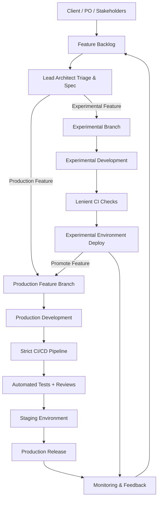

# Contributing to YelloStorm

## Development Pipeline

YelloStorm follows a **two-track development pipeline**: an **experimental track** for rapid iteration with lenient checks, and a **production track** for stable releases with strict CI/CD.



### How it works

- **Experimental track** — Use `exp/*` branches for prototyping, AI experiments, and features that need fast feedback. CI checks are lenient (linting only, no full test suite). Deploy to an isolated experimental environment.
- **Production track** — Use `feature/*` branches for production-ready work. Full CI/CD pipeline with automated tests, code reviews, and staging deployment before release.
- **Promotion** — When an experimental feature is validated, it merges into `develop` and follows the standard production release flow.

---

## Branch Strategy

| Branch | Purpose | Deploys to | Merges into |
|--------|---------|------------|-------------|
| `main` | Latest stable release | Production | — |
| `develop` | Integration / staging | Staging (rec) | `main` |
| `experimental` | Experimental integration | Experimental env | `develop` (on promotion) |
| `feature/<scope>-<desc>` | Production features | Dev | `develop` |
| `exp/<scope>-<desc>` | Experimental features | Experimental env | `experimental` |
| `hotfix/<scope>-<desc>` | Urgent prod fixes | Dev | `main` + `develop` |
| `bugfix/<scope>-<desc>` |  fixes | Dev | `develop` |


### Branch Naming Rules

- **Format:** lowercase, kebab-case
- **Include scope:** the module or area being changed
- **Max length:** ~50 characters

```
feature/auth-login-flow
feature/workspace-bulk-upload
exp/ai-search-beta
exp/stream-compression
hotfix/auth-token-refresh
```

---

## Commit Message Guidelines

YelloStorm uses [Conventional Commits](https://www.conventionalcommits.org/).

### Format

```
<type>(<scope>): <description> <taskId> 

[optional body]

[optional footer]
```

- **Subject line:** imperative mood, no period, max 72 characters
- **Scope:** module or area affected (e.g., `auth`, `workspace`, `stream`, `ci`)
- **Body:** explain *why*, not *what* (the diff shows *what*)

### Commit Types

| Type | Version Bump | Description |
|------|-------------|-------------|
| `feat` | Minor | New feature |
| `fix` | Patch | Bug fix |
| `perf` | Patch | Performance improvement |
| `refactor` | None | Code refactoring (no behavior change) |
| `docs` | None | Documentation only |
| `test` | None | Adding or updating tests |
| `chore` | None | Maintenance, dependencies |
| `style` | None | Formatting, whitespace (no logic change) |
| `ci` | None | CI/CD configuration |
| `build` | None | Build system or external dependencies |

A `!` after the type/scope denotes a **breaking change** (bumps major): `feat(api)!: restructure response format`

You can also use `BREAKING CHANGE:` in the commit footer.

### Examples

```bash
# Feature (bumps minor: 0.1.0 -> 0.2.0)
git commit -m "feat(workspace): add document sharing #9999"

# Bug fix (bumps patch: 0.1.0 -> 0.1.1)
git commit -m "fix(auth): resolve token refresh race condition #9999"

# Performance (bumps patch: 0.1.0 -> 0.1.1)
git commit -m "perf(stream): reduce SSE payload size by 40% #9999"

# Breaking change (bumps major: 0.1.0 -> 1.0.0)
git commit -m "feat(api)!: restructure response format #9999"

# No version bump
git commit -m "docs(workspace): add RAG integration guide #9999"
git commit -m "test(auth): add OAuth edge case coverag #9999e"
git commit -m "chore: update dependencies #9999"
git commit -m "refactor(conversation): simplify message parsing #9999"
git commit -m "style(components): fix indentation in sidebar #9999"
git commit -m "ci: add experimental pipeline stage #9999"
git commit -m "build: upgrade vite to v6 #9999"
```
!! Back and Front commits should be seperate, never commit front and back changes together !!
---

## Versioning

YelloStorm uses [commit-and-tag-version](https://github.com/absolute-version/commit-and-tag-version) for automated semver bumping.

### Version Tags

| Package | Tag Format | Example |
|---------|-----------|---------|
| Backend | `back-v*` | `back-v1.0.0` |
| Frontend | `front-v*` | `front-v1.0.0` |

### Production Releases

Run from `back/` or `front/`:

```bash
npm run release          # Auto-determine bump from commits
npm run release:patch    # Force patch (0.0.1 -> 0.0.2)
```

### Promotion

When an experimental feature is ready for production:

1. Merge `experimental` -> `develop`
2. Run a standard `npm run release` on `develop`
3. The next release gets a proper semver version (e.g., `0.2.0-exp.3` becomes `0.2.0`)

### What each release does

1. Analyzes commits since the last tag
2. Bumps version in `package.json`
3. Generates/updates `CHANGELOG.md`
4. Creates a git commit and tag

After releasing, push with tags:

```bash
git push --follow-tags
```

---

## Pull Request Guidelines

### Title Format

PR titles follow the same commit convention:

```
type(scope): description
```

### Review Requirements

| Target branch | Source | Reviews required | Merge strategy |
|--------------|--------|-----------------|----------------|
| `develop` | `feature/*` | 1 approval | Squash merge |
| `develop` | `experimental` (promotion) | 1 approval | Squash merge |
| `main` | `develop` | 2 approvals | Merge commit |
| `main` | `hotfix/*` | 1 approval | Merge commit |

### Checklist

- [ ] PR title follows `type(scope): description` format
- [ ] Commits follow conventional commits
- [ ] Tests pass (production track)
- [ ] No unresolved review comments
- [ ] CHANGELOG will be auto-generated on release (do not edit manually)

---

## Release Workflow

### Production Release

```bash
# 1. Ensure you're on develop with all features merged
git checkout develop
git pull origin develop

# 2. Release backend (if changed)
cd back
npm run release
# -> Bumps version, updates CHANGELOG.md, creates back-v* tag

# 3. Release frontend (if changed)
cd ../front
npm run release
# -> Bumps version, updates CHANGELOG.md, creates front-v* tag

# 4. Push everything
git push --follow-tags

# 5. Create PR: develop -> main (requires 2 approvals)
```

### Release

```bash
# 2. Release backend (if changed)
cd back
npm run release

# 3. Release frontend (if changed)
cd ../front
npm run release

# 4. Push everything
git push --follow-tags
```

### Hotfix Release

```bash
# 1. Create hotfix branch from main
git checkout main
git checkout -b hotfix/auth-token-expiry

# 2. Fix the issue, commit
git commit -m "fix(auth): handle expired refresh tokens"

# 3. Release
cd back
npm run release:patch

# 4. Push and create PRs to both main and develop
git push --follow-tags
# PR -> main (1 approval)
# PR -> develop (1 approval, or cherry-pick)
```
