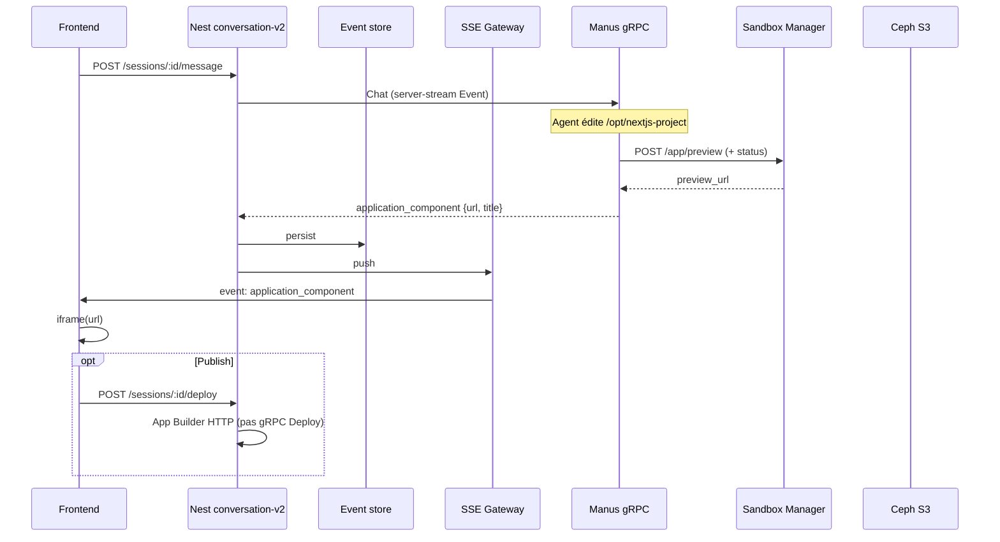

# Intégration Nodepod — Conversation V2 / App Builder

> **Status (2026-08):** Implemented end-to-end.  
> Canonical docs:
> - Backend: [`README.md`](README.md)
> - Frontend: `YellowStorm/front/src/modules/conversation-v2/README.md`
>
> This file keeps the original design notes / trade-offs. Prefer the READMEs
> for current contracts, endpoints, and UI behaviour.

---

---

## Verdict

Conversation V2 = **YellowStorm ↔ Manus (APImanus)** via gRPC `yellostorm.manus.v1`, pas yellowstorm-adk.

Aujourd’hui le frontend ne reçoit que `{ url, title }` et iframe la preview distante. **Aucun bundle source** n’est exposé.

Pour Nodepod, il faut un nouveau contrat d’export (ZIP/Ceph + API signed URL), pas seulement un élargissement cosmétique de l’événement SSE.

---

## Architecture actuelle

### Flux de bout en bout



### Identité des services

| Acteur | Rôle |
|---|---|
| Frontend (React) | Reçoit SSE, iframe preview, Publish |
| Nest `conversation-v2` | Client gRPC Manus, persist Mongo, fan-out SSE, deploy HTTP |
| Manus (APImanus) | Agent, sandbox `/opt/nextjs-project`, émet les events |
| Sandbox Manager | Preview publique (`/app/preview`) |
| App Builder HTTP | Deploy public (depuis Nest, pas Manus) |
| Ceph S3 | Attachments workspace (`/mnt/workspace`), **pas** le projet Next.js |

> **Note :** yellowstorm-adk n’implémente pas Conversation V2 / `ApplicationComponentEvent`.

---

## Contrats gRPC / proto

### Fichiers canoniques

Les deux copies doivent rester synchronisées :

- `YellowStorm/back/src/modules/conversation-v2/proto/conversation.proto`
- `APImanus/backend/app/interfaces/grpc/conversation.proto`

Package : `yellostorm.manus.v1`  
Service : `ConversationV2`

### RPCs principaux

| RPC | Shape | Rôle |
|---|---|---|
| `CreateSession` | unary | Crée la session Manus ; `workspace_paths` optionnels (préfixes Ceph) |
| `GetSession` | unary | Snapshot + historique d’événements |
| `StopSession` / `PauseSession` / `ResumeSession` | unary | Cycle de vie |
| `Chat` | **server-stream `Event`** | Tour de conversation live |
| `GetVncSignedUrl` | unary | Browser VM |
| `Deploy` | unary → `{url, deployed_at}` | Existe en proto ; **le controller Nest utilise plutôt l’HTTP App Builder** |

### Oneof `Event`

```protobuf
message Event {
  string event_id  = 1;
  int64  timestamp = 2;
  oneof payload {
    MessageEvent message = 10;
    ToolEvent    tool    = 11;
    StepEvent    step    = 12;
    PlanEvent    plan    = 13;
    TitleEvent   title   = 14;
    DoneEvent    done    = 15;
    WaitEvent    wait    = 16;
    ErrorEvent   error   = 17;
    ApplicationComponentEvent application_component = 18;
    HeartbeatEvent heartbeat = 19;
  }
}
```

### `ApplicationComponentEvent` (état actuel)

```protobuf
// Pushes a UI "application component" (an embeddable web app / preview) for the
// frontend to render in the conversation's side panel. Unlike a tool result,
// this is not tied to a tool_call — the agent asks the app to display `url`
// (shown in an <iframe>) directly. `title` labels the panel.
message ApplicationComponentEvent {
  string url = 1;
  string title = 2;
}
```

**Absent aujourd’hui :** ZIP, liste de fichiers, artifact ID, arbre source, clé Ceph du projet app, URL de download hors preview.

### Messages fichiers connexes (pas un bundle app)

| Message | Champs | Usage |
|---|---|---|
| `FileInfo` | `id, name, content_type, path` | Attachments message |
| `FileToolContent` | `path, content, language, operation` | Contenu outil **inline** (tronqué côté Manus ~8000 chars) |

---

## Côté Manus — génération d’app

### Pipeline

1. Les prompts (planner / execution / system) imposent d’éditer uniquement `/opt/nextjs-project`.
2. L’agent **ne** lance **pas** `create-next-app` ni `npm run dev` — la plateforme sert le port 3000.
3. Quand c’est prêt, l’agent appelle **`send_app_to_user(url, title?)`** (souvent `http://localhost:3000`).
4. `ExecutionAgent` émet `ApplicationComponentEvent` après le tool status `CALLED`.
5. `AgentTaskRunner._resolve_application_component_url` appelle Sandbox Manager :
   - `POST /app/preview`
   - poll `/app/preview/status`
   - remplace l’URL par `preview_url` (fallback : `https://{session_id}.{app_preview_base_domain}`).
6. L’event part vers YellowStorm via gRPC `Chat`.

### Fichiers Manus clés

| Path | Rôle |
|---|---|
| `APImanus/backend/app/domain/services/tools/message.py` | Tool `send_app_to_user` |
| `.../domain/services/agents/execution.py` | Émet `ApplicationComponentEvent` |
| `.../domain/models/event.py` | Modèle domaine |
| `.../domain/services/agent_task_runner.py` | Resolve preview + sync FILE→ARTIFACT (workspace only) |
| `.../infrastructure/external/sandbox/app_preview.py` | Client preview Sandbox Manager |
| `.../core/public_app_url.py` | Rewrite localhost → URL publique |
| `.../domain/services/prompts/{system,execution,planner}.py` | Instructions `/opt/nextjs-project` |
| `.../interfaces/schemas/event.py` | SSE Manus |
| `.../interfaces/grpc/conversation.proto` | Contrat proto |
| `.../interfaces/grpc/event_proto_mapper.py` | SSE → protobuf |
| `.../interfaces/grpc/conversation_servicer.py` | Servicer gRPC Chat |

### Artifacts disponibles aujourd’hui

| Artifact | Disponible ? | Où |
|---|---|---|
| Preview URL | Oui | `ApplicationComponentEvent.url` |
| Title | Optionnel | `ApplicationComponentEvent.title` |
| Deployed public URL | Oui (côté YellowStorm) | `POST .../deploy` → App Builder |
| Source projet / files map | **Non** | Seulement live dans le sandbox `/opt/nextjs-project` |
| ZIP / tar / bundle | **Non** | Aucun dans APImanus |
| Attachments par fichier | Partiel | `/mnt/workspace/...` → Ceph ; **pas** l’arbre Next.js |
| Snippets fichier dans tools | Oui | `FileToolContent` tronqué |

**Important :** `_sync_file_to_storage` n’upload que les chemins sous `/mnt/workspace/`. Les écritures sous `/opt/nextjs-project` ne deviennent pas des artifacts Ceph durables.

---

## Côté Nest — gRPC → SSE

### Couches

| Couche | Path | Rôle |
|---|---|---|
| Client gRPC | `services/conversation-v2.grpc-client.service.ts` | Dial `CONVERSATION_V2_GRPC_URL`, `chat()`, `normaliseEvent` |
| Stream background | `services/conversation-v2-stream.service.ts` | Persist + push ; heartbeats gRPC discardés |
| Event store | `services/conversation-v2-event-store.service.ts` | Mongo `conversation_v2_events` |
| Gateway | `services/conversation-v2-stream-gateway.service.ts` | Fan-out SSE par user |
| Controller SSE | `conversation-v2-stream.controller.ts` | `GET /conversation-v2/stream` |
| Deploy | `services/conversation-v2-deploy.service.ts` | HTTP App Builder `app/deploy` + `app/status` |

### Mapping `application_component`

```ts
case 'application_component':
  return {
    type: 'application_component',
    payload: {
      ...base,
      url: raw.application_component!.url,
      title: raw.application_component!.title,
    },
  };
```

### Forme SSE actuelle

```
event: application_component
data: {
  "sessionId": "...",
  "event_id": "...",
  "timestamp": ...,
  "url": "https://....",
  "title": "...",
  "sequence": N
}
```

Les heartbeats gRPC ne sont **pas** relayés en SSE ; le gateway envoie ses propres `event: heartbeat`.

### Storage existant (hors app source)

| Mécanisme | Ce qu’il livre | Path |
|---|---|---|
| Ceph S3 (AWS SDK) | Docs workspace + clés attachments AI | `back/src/config/storage.config.ts` |
| `POST /conversation-v2/files/signed-url` | Presign lecture d’**une** clé Ceph | controller |
| Message attachments → system workspace | Métadonnées docs | `createFromAiArtifact` |
| Files sheet | Liste docs ; open via signed URL | frontend `FilesSheet` |
| Workspace ZIP export | Export **workspace**, pas app-builder | front workspace |

---

## Côté Frontend — preview actuelle

| Fichier | Rôle |
|---|---|
| `front/.../RightPanel/ApplicationComponentView.tsx` | iframe via `WebPreview` |
| `front/.../RightPanel/RightPanel.tsx` | Tabs Code/Preview ; DeployControls |
| `front/.../store.ts` | `applicationComponent`, `handleEvent`, `deriveApplicationComponent` |
| `front/.../types.ts` | `{ type: 'application_component', url, title? }` |
| `front/.../conversationV2Stream.ts` | Listen SSE |
| `front/.../useStream.ts` | Connexion app-shell → `handleStreamEvent` |
| `front/src/components/ai-elements/web-preview.tsx` | Composant iframe partagé |

### Usage de `url` / `title`

- **Live :** store pose `applicationComponent: { url, title }`, `rightPanelMode: 'app'`.
- **Replay :** `deriveApplicationComponent` prend le **dernier** `application_component` de l’historique.
- **Panel :** titre ou fallback i18n ; URL en lecture seule ; “Open in new tab”.
- **Après deploy :** `setDeployState` **écrase** l’URL preview avec `deployedUrl`.

Pas de bouton download source / ZIP sur le panneau preview.

---

## Ce que Nodepod attend

Package : `@scelar/nodepod`  
Alternative open-source légère à WebContainers : Node.js dans le navigateur (VFS, shell, npm, HTTP servers).

### Boot minimal

```ts
import { Nodepod } from '@scelar/nodepod';

const nodepod = await Nodepod.boot({
  files: {
    '/index.js': 'console.log("Hello from the browser!")',
  },
});

const proc = await nodepod.spawn('node', ['index.js']);
proc.on('output', (text) => console.log(text));
await proc.completion;
```

### Prérequis Service Worker

Nodepod route les previews via un service worker servi depuis **votre origine** à `/__sw__.js` (pas depuis `node_modules`).

Pour Vite :

```ts
// vite.config.ts
import { defineConfig } from 'vite';
import nodepod from '@scelar/nodepod/vite';

export default defineConfig({
  plugins: [nodepod()],
});
```

### Preview HTTP

```ts
const nodepod = await Nodepod.boot({
  files: { /* Record<path, string | Uint8Array> */ },
  onServerReady: (port, url) => { /* ... */ },
});

await nodepod.packages.install('express'); // lazy par défaut
await nodepod.spawn('node', ['server.js']);

previewIframe.src = nodepod.port(3000)!;
```

### Points d’API utiles

| API | Usage |
|---|---|
| `Nodepod.boot({ files })` | Initialise le VFS |
| `packages.install` | Installe les deps npm |
| `spawn` | Lance le serveur / script |
| `port(n)` | URL preview pour iframe |
| `snapshot` / `restore` | Checkpoint FS |
| `teardown()` | Cleanup (un pod par preview active) |
| `inspect` | DOM / console / a11y / screenshot best-effort |

### Risque majeur : Next.js

Manus génère des apps **Next.js** dans `/opt/nextjs-project`.  
Nodepod documente Express / Hono / Vite / `listen()`.  
Next.js complet (deps natives, bundler) est **incertain** dans le browser.

→ Un **POC Nodepod sur un vrai projet Manus** est obligatoire avant de figer le runtime.

---

## Gaps pour livrer le source au navigateur

1. **Proto** — seulement `url` + `title` ; pas d’archive / manifest / download URL source.
2. **SSE / UI** — iframe + open tab seulement ; pas de download UX.
3. **Deploy** — App Builder renvoie une URL live ; pas de contrat source dans YellowStorm.
4. **Fichiers partiels** — attachments / `FileToolContent` / FilesSheet + Ceph ; pas un ZIP projet.
5. **ADK** — hors scope ; le changement est Manus + Nest + Front (+ éventuellement Sandbox Manager / App Builder).
6. **gRPC Deploy vs HTTP** — deux histoires de deploy ; le controller Nest utilise HTTP uniquement.

---

## Plan d’intégration recommandé

### Principe

Ne **pas** pousser le ZIP dans le stream gRPC/SSE (trop gros).

- **SSE** = signal léger (métadonnées)
- **Téléchargement** = API REST + Ceph (même pattern que les attachments)

### Option retenue : hybrid pull

1. Manus archive `/opt/nextjs-project` (sans `node_modules` / `.next`) → Ceph  
2. Étend `ApplicationComponentEvent` avec métadonnées d’archive  
3. FE télécharge via signed URL → unzip → `Nodepod.boot({ files })`  
4. Conserve `url` comme **fallback** preview distante  

---

### Step 1 — Manus : export source

**Où :** `APImanus/backend/app/domain/services/agent_task_runner.py` (+ APIs fichiers sandbox)

**Quoi :** après (ou en parallèle de) `_resolve_application_component_url` :

1. tar/zip de `/opt/nextjs-project`
2. Exclure `node_modules`, `.next`, caches
3. Upload Ceph sous une clé stable, ex. `{user_id}/{session_id}/app-source.zip`
4. Renseigner les champs proto

**Edge cases :**

- Projet vide
- Archive trop grosse
- Sandbox down → event sans `source_*`, FE garde l’iframe distante

---

### Step 2 — Contrat gRPC (Manus + YellowStorm, sync)

**Où :**

- `APImanus/.../interfaces/grpc/conversation.proto`
- `YellowStorm/back/.../conversation.proto`
- Domain model Manus + mapper proto
- Types Nest + mapping gRPC client

**Extension proposée :**

```protobuf
message ApplicationComponentEvent {
  string url = 1;
  string title = 2;
  // NEW — optional source for in-browser runtime
  string source_archive_key = 3;   // Ceph object key
  string source_archive_sha256 = 4;
  int64  source_size_bytes = 5;
  string entrypoint = 6;           // e.g. "npm run dev" / "node server.js"
  string runtime_hint = 7;         // "next" | "vite" | "node"
}
```

**Alternative :** nouvel event `application_source` (oneof field 20) séparé de la preview — utile si l’export est asynchrone et ne doit pas bloquer l’affichage de l’URL.

---

### Step 3 — Nest : mapping + API download

**Où :**

- `conversation-v2.grpc-client.service.ts` — normaliser les nouveaux champs
- `types/conversation-v2.types.ts` — types TS
- `conversation-v2-stream.service.ts` — forward SSE (métadonnées seulement)
- `conversation-v2.controller.ts` — endpoint download

**API proposée :**

```http
GET /api/v1/conversation-v2/sessions/:id/app-source
→ 302 / signed URL Ceph
```

Réutilise le pattern existant `POST /files/signed-url`.

**Auth :** même owner guard que la session.  
Vérifier que `source_archive_key` appartient bien à la session.

---

### Step 4 — Frontend : Nodepod preview

**Où :**

- `vite.config.ts` — plugin `nodepod()` pour `/__sw__.js`
- Nouveau : `useNodepodPreview.ts` (boot / teardown / reload)
- Nouveau : `NodepodPreviewView.tsx` (iframe via `nodepod.port`)
- Adapter : `ApplicationComponentView.tsx` / `RightPanel.tsx`
- `store.ts` — stocker `sourceArchiveKey`, mode `remote | nodepod`
- i18n pour les états UI

**Flux FE :**

1. SSE `application_component` avec `source_archive_key`
2. `GET .../app-source` → ZIP
3. Unzip (`fflate` / `jszip`) → `Record<path, Uint8Array>`
4. `Nodepod.boot({ files, onServerReady })`
5. Install deps + spawn selon `runtime_hint` / `entrypoint`
6. Afficher `nodepod.port(3000)` dans l’iframe
7. Sur nouvel event (modif agent) : update VFS ou teardown + reboot
8. Si pas de source / échec Nodepod → fallback `url` distant

**UX :**

- États : loading / installing / ready / error
- Option “Preview distante”
- Conservations Deploy / Share inchangés

---

### Step 5 — POC Next.js vs runtime

Avant de brancher tout le pipeline :

| Hypothèse | Action |
|---|---|
| Next.js tourne dans Nodepod | OK, garder le template Manus |
| Next.js trop lourd / native | Changer le seed Manus vers Vite/Express **ou** limiter Nodepod aux apps simples + garder preview sandbox pour Next |

Sans ce POC, le reste du contrat peut être livré, mais le preview local restera fragile.

---

## Fichiers impactés (synthèse)

| Zone | Fichiers |
|---|---|
| Manus | `agent_task_runner.py`, `event.py`, `event_proto_mapper.py`, `conversation.proto`, helper export sandbox |
| Nest | `conversation.proto`, `grpc-client`, `types`, stream service, controller, tests |
| Front | `vite.config`, `ApplicationComponentView`, `RightPanel`, `store`, hooks/composants Nodepod, i18n |
| Infra | Politique Ceph (TTL, taille max archive), CORS signed URL si besoin |

---

## Edge cases

| Cas | Comportement attendu |
|---|---|
| Archive absente / corrompue / hash mismatch | Fallback iframe distante |
| Session rechargée | Rejouer dernier `application_component` + re-download |
| Multiples `send_app_to_user` | Dernière archive gagne ; teardown de l’ancien pod |
| Mémoire browser (budget soft Nodepod ~400 MB) | Gros projets → preview distante |
| Service Worker non enregistré (`NodepodSWSetupError`) | Fallback distante |
| Deploy App Builder | Inchangé (HTTP séparé) ; Nodepod = preview locale seulement |

---

## Résultat attendu

L’utilisateur voit toujours un panneau Preview :

- Si une archive est disponible → le FE boot Nodepod en local
- Sinon (ou en échec) → l’iframe pointe vers la preview Sandbox Manager
- Deploy / share restent sur le flux App Builder existant

---

## Choix à trancher avant implémentation

1. **Contrat :** champs sur `ApplicationComponentEvent` vs nouvel event `application_source` asynchrone ?
2. **Runtime :** POC Nodepod sur un vrai `/opt/nextjs-project` Manus — go / no-go Next.js ?
3. **Mode de travail :** intégration de bout en bout, ou étape par étape (Manus export → Nest → Front) ?

---

## Index des fichiers YellowStorm

### Proto / types

- `YellowStorm/back/src/modules/conversation-v2/proto/conversation.proto`
- `YellowStorm/back/src/modules/conversation-v2/types/conversation-v2.types.ts`
- `YellowStorm/front/src/modules/conversation-v2/types.ts`

### Backend stream / deploy / storage

- `.../services/conversation-v2.grpc-client.service.ts`
- `.../services/conversation-v2-stream.service.ts`
- `.../services/conversation-v2-stream-gateway.service.ts`
- `.../conversation-v2-stream.controller.ts`
- `.../conversation-v2.controller.ts`
- `.../services/conversation-v2-deploy.service.ts`
- `.../config/conversation-v2.config.ts`
- `YellowStorm/back/src/config/storage.config.ts`
- `YellowStorm/back/src/modules/document/document.service.ts`
- `YellowStorm/back/src/modules/workspace/workspace-document.service.ts`

### Frontend preview

- `.../components/RightPanel/ApplicationComponentView.tsx`
- `.../components/RightPanel/RightPanel.tsx`
- `.../components/RightPanel/DeployControls.tsx`
- `.../store.ts`
- `.../conversationV2Stream.ts`
- `.../useStream.ts`
- `YellowStorm/front/src/components/ai-elements/web-preview.tsx`
