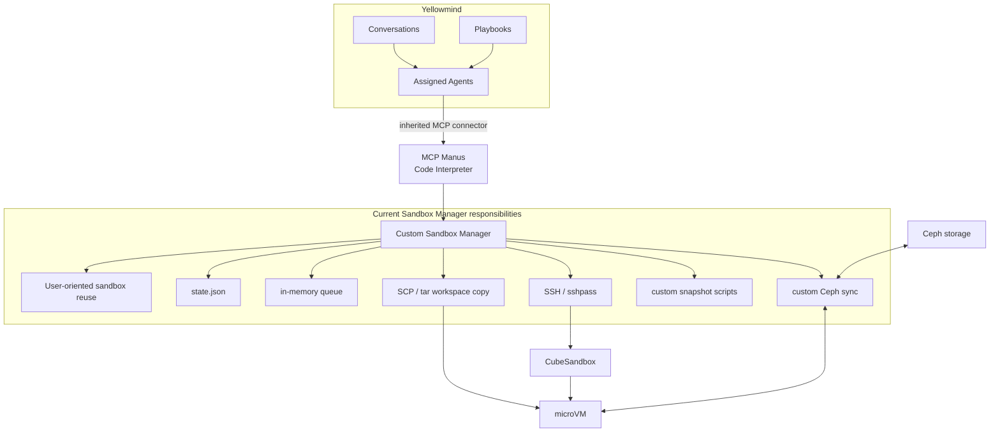
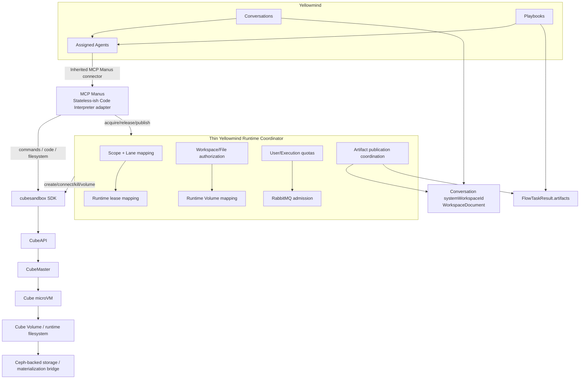

# Yellowmind Code Interpreter Runtime — Remediation Plan
## Target architecture: MCP Manus + Thin Runtime Coordinator + CubeSandbox SDK/Volumes

**Date:** 2026-08-17  
**Status:** Consolidated remediation plan after review of current Conversation and Playbook implementations  
**Scope:** Conversations, Playbooks, MCP Manus Code Interpreter, Sandbox Manager, CubeSandbox, Ceph, RabbitMQ

---

# 1. Executive summary

Yellowmind already has the correct product-level integration pattern:

```text
Conversation / Playbook
        ↓
Assigned Agent
        ↓
Inherited Agent Connectors
        ↓
MCP Manus
        ↓
Code Interpreter tools
        ↓
Sandbox runtime
```

This must be preserved.

The remediation therefore **does not move Code Interpreter logic into Playbook or Conversation directly**.

The target is to modernize the layer **below MCP Manus**:

```text
CURRENT

Conversation / Playbook
        ↓
Agent connector
        ↓
MCP Manus
        ↓
custom Sandbox Manager
        ↓
SSH / SCP / state.json / custom queue / custom snapshots
        ↓
CubeSandbox
        ↓
microVM
```

into:

```text
TARGET

Conversation / Playbook
        ↓
Agent connector
        ↓
MCP Manus
        ├───────────────→ Cube SDK → CubeSandbox → microVM
        │
        └───────────────→ Thin Runtime Coordinator
                            ├─ scope / lease
                            ├─ quotas
                            ├─ RabbitMQ admission
                            ├─ Volume mapping
                            ├─ authorization
                            └─ artifact publication coordination
```

The core architectural principle is:

> **MCP Manus remains the single agent-facing Code Interpreter/file-management interface for Conversations and Playbooks. CubeSandbox owns sandbox infrastructure. The Runtime Coordinator only owns Yellowmind-specific execution semantics.**

---

# 2. Important corrections incorporated in this plan

This plan supersedes previous versions in the following ways.

## 2.1 Playbook already uses MCP Manus

For the intended Yellowmind usage, a Playbook node invokes Code Interpreter by assigning an agent that has the MCP Manus connector attached.

The node inherits:

- the assigned agent;
- connector bindings;
- skills;
- workspace/document context;
- file context.

Therefore the official runtime path is:

```text
Playbook Step
    ↓
Assigned Agent
    ↓
Inherited MCP Manus connector
    ↓
MCP Manus Code Interpreter
```

The separate native/builtin Code Interpreter path present in the ADK codebase must be treated as:

```text
legacy / fallback / explicit alternative
```

and **not** as the target Playbook architecture.

---

## 2.2 Conversation and Playbook should not share the same application file catalogue

Conversation already has a dedicated application-level system workspace:

```text
ConversationV2Session.systemWorkspaceId
```

used for:

- files uploaded into the Conversation scope;
- AI-generated files;
- Files panel listing/download.

Playbook instead already has:

```text
FlowExecution
FlowTaskResult.artifacts
typed output ports
artifact routing
```

That is a valid product-level difference.

Therefore:

```text
DO NOT:
force Playbook outputs into Conversation WorkspaceDocument semantics

DO:
unify only the runtime below MCP Manus
```

---

## 2.3 Shared runtime abstraction

The common abstraction becomes:

```text
RuntimeScope
├── userId
├── scopeType
├── scopeId
├── laneId
├── input context
└── runtime storage scope
```

For Conversation:

```text
scopeType = conversation
scopeId   = conversation:<session-id>
laneId    = main
```

For Playbook:

```text
scopeType = playbook
scopeId   = playbook:<execution-id>
laneId    = main | node/child lane
```

---

# 3. Current architecture



Main issues:

- Sandbox ownership is not sufficiently execution-scoped end to end.
- User-only reuse can break concurrent Conversations/Playbooks.
- MCP state and Sandbox Manager state duplicate ownership/lifecycle.
- SSH/SCP reimplement Cube functionality.
- `state.json` and in-memory queue do not fit horizontal scale.
- artifact/file routing can be ambiguous when the same user has multiple active runtimes.
- Playbook parallel execution requires explicit compute isolation policy.
- Ceph/file synchronization logic is too coupled to VM lifecycle.

---

# 4. Target architecture



---

# 5. Responsibility boundaries

## 5.1 YellowStorm

Owns:

- Conversation lifecycle;
- Playbook lifecycle;
- user identity;
- access control;
- agent selection;
- connector inheritance;
- workspace/document selection;
- Playbook graph dependencies;
- Conversation system workspace;
- Playbook task artifact model;
- user-facing download endpoints.

Does **not** own microVM mechanics.

---

## 5.2 MCP Manus

Owns agent-facing runtime tools:

```text
execute code
execute shell
list files
read file
write file
rename/copy/delete file
upload/materialize selected files when needed
publish generated files
```

MCP Manus is responsible for translating agent actions into:

```text
Runtime Coordinator control calls
+
Cube SDK execution/file calls
```

MCP Manus is **not** the source of truth for sandbox ownership.

---

## 5.3 Runtime Coordinator

Owns only Yellowmind-specific runtime semantics:

```text
user → runtime scope
scope → lane
scope/lane → Cube sandbox
scope → runtime Volume
authorized workspace/file set
per-user quotas
per-execution quotas
RabbitMQ admission
artifact publication validation
runtime reconciliation
```

It should not become another microVM platform.

---

## 5.4 CubeSandbox

Owns:

- physical sandbox creation;
- microVM lifecycle;
- scheduling;
- command execution plumbing;
- filesystem APIs;
- pause/resume;
- Cube networking/security;
- Volume attachment;
- hardware isolation.

---

## 5.5 RabbitMQ

Owns:

```text
waiting / admission
```

when Yellowmind capacity policy says a new runtime or overflow microVM cannot start immediately.

Do not retain a second in-memory create queue in Sandbox Manager.

---

# 6. Runtime identity

## P0 invariant

Never reuse or reassign a sandbox because:

```text
same user_id
```

alone.

Use:

```text
scopeId + laneId
```

---

## 6.1 Conversation

```text
scopeType = conversation
scopeId   = conversation:<YellowStorm-session-id>
laneId    = main
```

Use the YellowStorm Conversation session identifier, not an internal AI-service identifier, as the product runtime scope.

---

## 6.2 Playbook

```text
scopeType = playbook
scopeId   = playbook:<execution-id>
laneId    = main
```

Parallel Code Interpreter execution may use:

```text
laneId = node:<node-id>:iter:<iteration>:attempt:<attempt>
```

Temporary child agents:

```text
laneId = node:<node-id>:iter:<iteration>:child:<child-id>
```

---

# 7. Canonical runtime context contract

Introduce one explicit runtime context across:

```text
YellowStorm → ADK → MCP connector → MCP Manus
```

Recommended conceptual object:

```json
{
  "userId": "user-1",

  "scopeType": "playbook",
  "scopeId": "playbook:execution-42",
  "laneId": "main",

  "conversationId": null,
  "executionId": "execution-42",
  "nodeId": "node-A",
  "iteration": 0,
  "agentId": "agent-10",

  "workspaceIds": ["ws-1", "ws-2"],
  "fileRefs": []
}
```

During migration keep current headers, but add:

```text
x-sandbox-scope-type
x-sandbox-scope-id
x-sandbox-lane-id
x-node-id
x-node-iteration
```

Do not use implicit precedence such as:

```text
conversation-id if present else execution-id
```

for sandbox ownership.

---

# 8. Conversation file model — preserve current behavior

Conversation already has a first-class system workspace.

Current conceptual model:

```text
Conversation session
    │
    ├── attached workspaceIds
    │
    └── systemWorkspaceId
             │
             ├── user-uploaded files
             └── AI-generated files
```

This should remain.

---

## 8.1 User uploads during a Conversation

Keep the current YellowStorm storage path:

```text
Browser
    ↓
YellowStorm Workspace API
    ↓
Ceph S3 object
    ↓
WorkspaceDocument
```

MCP Manus should not replace the frontend upload API.

When the runtime needs the file:

```text
WorkspaceDocument
    ↓
authorized runtime projection
    ↓
Cube filesystem
```

---

## 8.2 User attaches a workspace during a Conversation

YellowStorm remains responsible for authorization.

MCP Manus receives only authorized workspace/file context.

Runtime projection should expose:

```text
/mnt/yellowmind/inputs/workspaces/<workspace-id>/
```

read-only where possible.

---

## 8.3 AI-generated Conversation file

Target flow:

```text
MCP Manus generates file
        ↓
publish_artifact()
        ↓
persist/commit to Conversation runtime storage
        ↓
register as WorkspaceDocument in systemWorkspaceId
        ↓
assistant attachment references generated file
        ↓
Conversation Files panel refreshes
```

Preserve current UI behavior.

---

# 9. Playbook file model — preserve current artifact semantics

Playbook currently has:

- file/document/workspace resource references;
- input ports;
- `documents_by_port`;
- `binding_workspace_ids`;
- workspace/file context;
- `FlowTaskResult.artifacts`;
- typed artifact kinds;
- artifact-to-output-port routing.

Keep this.

---

## 9.1 Playbook runtime storage

The current execution-wide shared runtime folder remains conceptually:

```text
system_<execution-id>
```

Every MCP Manus Code Interpreter invocation belonging to the same execution must be able to access committed execution files.

This is a runtime storage namespace, not a Conversation `systemWorkspaceId`.

---

## 9.2 Playbook inputs

The node runtime already resolves:

```text
document refs
folder refs
workspace refs
workspace IDs
file names
file paths
documents by port
```

Preserve this logical model.

Change only the final transport:

```text
CURRENT:
logical ref → raw path → custom sandbox staging

TARGET:
logical ref → Runtime Input Manifest → authorized runtime projection
```

---

# 10. Input Manifest

Replace increasing dependence on raw physical path headers with a logical manifest.

Example:

```json
{
  "manifestId": "manifest-123",
  "scopeId": "playbook:E42",
  "entries": [
    {
      "type": "document",
      "workspaceId": "ws-A",
      "documentId": "doc-1",
      "displayName": "sales.xlsx",
      "access": "read"
    },
    {
      "type": "workspace",
      "workspaceId": "ws-B",
      "access": "read"
    }
  ]
}
```

The Runtime Coordinator resolves storage paths only after authorization.

Long term, prefer:

```text
x-sandbox-input-manifest-id
```

instead of large physical path headers.

---

# 11. Execution filesystem contract

Standardize paths inside the Cube runtime.

```text
/mnt/yellowmind/
├── inputs/       # authorized external sources, read-only
├── run/          # scope-owned writable runtime storage
└── scratch/      # private temporary lane state
```

---

## 11.1 Inputs

```text
/mnt/yellowmind/inputs/documents/<document-id>/<filename>
/mnt/yellowmind/inputs/workspaces/<workspace-id>/...
```

Prefer read-only exposure.

---

## 11.2 Run directory

Conversation:

```text
/mnt/yellowmind/run
→ Conversation scope storage
```

Playbook:

```text
/mnt/yellowmind/run
→ system_<execution-id>
```

---

## 11.3 Scratch

```text
/mnt/yellowmind/scratch/<lane-id>
```

Never treat scratch files as durable artifacts.

---

# 12. Cube SDK decision

Use:

```text
cubesandbox >= 0.6
```

as the main Python runtime client.

Reason:

- E2B-compatible execution model;
- Cube-native Volume support;
- direct command/code/filesystem operations;
- simpler than mixing official E2B SDK + raw Cube Volume REST.

Target MCP operations:

```python
sandbox.commands.run(...)
sandbox.run_code(...)
sandbox.files.read(...)
sandbox.files.write(...)
sandbox.files.list(...)
sandbox.files.stat(...)
sandbox.files.rename(...)
sandbox.files.remove(...)
```

Normal runtime execution must no longer depend on root SSH.

---

# 13. Shared storage / Cube Volume strategy

## Architecture gate

Before implementing the full Volume migration, verify how current Yellowmind Ceph storage is exposed.

YellowStorm application storage currently uses Ceph through S3-compatible object APIs.

Existing runtime infrastructure also refers to Ceph workspace paths.

Determine whether the deployed environment provides:

```text
Ceph S3 namespace
        ↕
coherent CephFS/FUSE/shared filesystem projection
```

for the same objects.

---

# 14. Storage strategy A — preferred zero/low-copy projection

If a shared filesystem projection over the same logical workspace storage is available:

```text
Ceph
  ↓
Cube Volume plugin
  ↓
Cube Volume
  ↓
microVM
```

Then runtime files can be directly visible.

Target:

```text
Conversation runtime
→ scope storage Volume

Playbook runtime
→ system_<execution-id> Volume

Source workspaces
→ read-only Volume mounts
```

---

# 15. Storage strategy B — thin materialization bridge

If Ceph S3 cannot safely be mounted/projected as POSIX runtime storage:

```text
Ceph S3
   │
   │ selected authorized inputs only
   ▼
Cube Runtime Volume
   │
   │ generated/committed outputs only
   ▼
Ceph S3
```

Still remove broad whole-workspace SCP logic.

Materialize only:

```text
document selected by user
workspace files explicitly needed
newly uploaded runtime files
```

Commit only:

```text
generated artifacts
files intended for downstream Playbook nodes
```

---

# 16. Playbook shared runtime workspace

For Playbook execution E42:

```text
/mnt/yellowmind/run/
│
├── shared/
│
├── artifacts/
│   ├── node-A/
│   └── node-B/
│
├── .lanes/
│   ├── main/
│   ├── node-A/
│   └── node-B/
│
└── .yellowmind/
```

The durable logical execution namespace remains:

```text
system_E42
```

or the existing equivalent configured by the platform.

Do not expose this naming convention as the external ownership API.

Ownership is always:

```text
scopeId = playbook:E42
```

---

# 17. Playbook parallelism policy

The runtime must distinguish workflow parallelism from Code Interpreter isolation.

Three levels are recommended.

---

# 18. Mode A — `shared_serialized`

Default.

```text
Playbook E42
    ↓
one Cube microVM
    ↓
lane main
    ↓
Code Interpreter operations serialized
```

Other work remains parallel:

- LLM calls;
- RAG;
- connectors;
- non-Code-Interpreter graph nodes.

Advantages:

- lowest VM usage;
- runtime continuity;
- safest first migration mode.

---

# 19. Mode B — `isolated_parallel_same_vm`

Preferred parallel Code Interpreter mode.

```text
Playbook E42
        │
        ▼
one Cube microVM
        │
   ┌────┴────┐
   │         │
lane A     lane B
   │         │
   └────┬────┘
        ▼
shared execution run storage
```

Dedicated lane paths:

```text
run/.lanes/node-A/
run/.lanes/node-B/
```

Subfolders alone are not sufficient isolation.

Implement a lane executor using lightweight Linux namespaces / bubblewrap or equivalent.

Each lane should have:

```text
private cwd
private HOME
private TMPDIR
private process namespace
private IPC namespace
unprivileged user
lane-local Python environment when needed
```

---

# 20. Mode C — `isolated_parallel_multi_vm`

Escalation mode.

```text
Playbook E42
    │
    ├── microVM A / lane A
    └── microVM B / lane B
             │
             ▼
      same execution runtime storage
```

Use when:

- strong isolation required;
- CPU/RAM pressure;
- dependency conflicts;
- system-level mutation;
- Mode B lane limit reached.

---

# 21. Parallelism escalation

```text
Code Interpreter needed
        ↓
Mode A
        │
        ├── parallel compute not needed → stay A
        │
        └── parallel needed
                ↓
              Mode B
                │
                ├── lane capacity sufficient → stay B
                │
                └── overflow / strong isolation
                            ↓
                          Mode C
```

Recommended initial settings:

```text
MAX_PARALLEL_LANES_PER_SANDBOX = 2
MAX_MICROVMS_PER_PLAYBOOK_EXECUTION = 2
```

Make configurable.

---

# 22. Shared-file rules for Playbook parallelism

Cross-node dependencies may rely on:

```text
committed files
artifact metadata
structured outputs
```

They must not rely on:

```text
another lane's active working directory
another process
Python interpreter memory
temporary files
lane HOME
runtime environment variables
```

---

# 23. Artifact commit protocol

Parallel nodes must not write directly into a shared final filename.

Node A writes:

```text
run/.lanes/node-A/outputs/report.xlsx
```

On success:

```text
atomic rename/copy commit
        ↓
run/artifacts/node-A/report.xlsx
```

Only after commit is the artifact available to downstream tasks.

Node B may independently produce:

```text
run/artifacts/node-B/report.xlsx
```

No basename collision.

---

# 24. Playbook downstream dependency flow

```text
Node A
  ↓
MCP Manus generates file
  ↓
commit artifact into execution run storage
  ↓
FlowTaskResult.artifacts updated
  ↓
Node A considered artifact-complete
  ↓
Node B starts
  ↓
same execution runtime storage exposes Node A artifact
```

For Mode C, both microVMs attach/use the same execution storage projection.

---

# 25. Conversation file publication

Conversation generated-file publication remains aligned with its system workspace.

Target MCP operation:

```text
publish_artifact(path)
```

Coordinator/application integration:

```text
runtime file
   ↓
Conversation system storage
   ↓
WorkspaceDocument row
   ↓
assistant attachment
```

Return logical metadata, not only a Ceph path.

Example:

```json
{
  "filename": "report.xlsx",
  "mimeType": "application/vnd.openxmlformats-officedocument.spreadsheetml.sheet",
  "documentId": "doc-123",
  "workspaceId": "system-workspace-id",
  "published": true
}
```

---

# 26. Playbook artifact publication

Do not force Playbook artifacts into Conversation workspace semantics.

Return:

```json
{
  "artifactId": "art-123",
  "filename": "report.xlsx",
  "relativePath": "artifacts/node-A/report.xlsx",
  "artifactKind": "data",
  "outputPortId": "result"
}
```

The Playbook runtime persists this into:

```text
FlowTaskResult.artifacts
```

The existing typed artifact routing remains.

---

# 27. Universal MCP Manus publication primitive

MCP Manus may expose one conceptual tool:

```text
publish_artifact(path)
```

but publication adapter differs by scope:

```text
scopeType = conversation
→ WorkspaceDocument / systemWorkspace

scopeType = playbook
→ FlowTaskResult artifact / execution artifact registry
```

The Runtime Coordinator should return enough scope metadata for the caller to invoke the correct application adapter.

---

# 28. Download architecture

Never make raw object paths the long-term user-facing security contract.

Target:

```text
Conversation:
documentId → YellowStorm authorization → signed URL

Playbook:
artifactId/executionId → YellowStorm authorization → signed URL
```

The frontend should not need permanent raw Ceph object keys.

---

# 29. Files pushed during an active Conversation

A user may upload a new document while a microVM already exists.

Target:

```text
upload
  ↓
WorkspaceDocument + Ceph object
  ↓
runtime input update
  ↓
MCP/Coordinator exposes file
  ↓
existing microVM can read it
```

Do not recreate the sandbox.

If storage projection is live:

```text
file becomes visible automatically
```

Otherwise:

```text
materialize only new object into runtime input path
```

---

# 30. Files/workspaces pushed during an active Playbook

The same principle applies.

If a Playbook interaction/HITL attaches another document or workspace:

```text
YellowStorm authorizes
    ↓
InputManifest changes
    ↓
Runtime Coordinator updates projection/materialization
    ↓
subsequent MCP Manus call sees it
```

Do not rely on a sandbox created at execution start having a frozen file set.

---

# 31. MCP Manus remediation

## P0.1 Canonical runtime context

Add explicit:

```text
scopeType
scopeId
laneId
```

to request-local context.

Keep:

```text
userId
conversationId
executionId
workspace paths
file paths
```

only for compatibility/tracing.

---

## P0.2 Remove ownership authority from MCP local memory

Current local manager/cache may remain as an optimization.

It must not decide physical ownership.

Target:

```text
MCP → Coordinator.acquire(scopeId, laneId)
```

The Coordinator returns the active lease/sandbox.

---

## P0.3 Direct Cube SDK execution

Replace normal:

```text
MCP → custom /sandbox/execute → SSH
```

with:

```text
MCP → Cube SDK
```

for:

```text
commands
run_code
filesystem
```

---

## P0.4 File operations

Migrate:

```text
read
write
list
stat
copy
rename
delete
binary upload/download
```

to Cube SDK.

Remove shell/base64 emulation where SDK support exists.

---

## P0.5 Publication

Refactor `send_file_to_user` into scope-aware publication.

Do not identify the target sandbox using:

```text
user_id + path
```

Use:

```text
leaseId
sandboxId
scopeId
laneId
```

---

## P0.6 Logging

Redact:

```text
Authorization
API keys
cookies
service credentials
```

Do not log full inbound auth headers.

---

## P0.7 MCP shutdown

Do not destroy remote sandboxes when MCP shuts down.

MCP process lifecycle is independent from runtime lease lifecycle.

---

# 32. Runtime Coordinator remediation

## P0.8 Replace user-only sandbox reuse

Remove user-only selection/rebinding behavior.

New key:

```text
(scopeId, laneId)
```

---

## P0.9 Minimal RuntimeLease

Example:

```ts
interface RuntimeLease {
  leaseId: string;
  userId: string;

  scopeType: 'conversation' | 'playbook';
  scopeId: string;
  laneId: string;

  cubeSandboxId: string;
  runtimeVolumeId?: string;

  status: 'pending' | 'ready' | 'busy' | 'released' | 'failed';

  createdAt: string;
  lastActivityAt: string;
}
```

Do not duplicate Cube's complete VM state.

---

## P0.10 Lease API

```text
POST /runtime/leases/acquire
GET  /runtime/leases/{leaseId}
POST /runtime/leases/{leaseId}/release
POST /runtime/leases/{leaseId}/heartbeat
POST /runtime/artifacts/publish
```

Keep old Sandbox Manager endpoints only as migration adapters.

---

## P0.11 Persistent mapping

Replace `state.json`.

Persist only Yellowmind mappings:

```text
runtime_lease
runtime_volume
admission_request
artifact publication metadata if needed
```

Use Yellowmind's durable DB.

Cube remains authoritative for actual sandbox status.

---

## P0.12 Reconciliation

Coordinator startup:

```text
load active leases
    ↓
query Cube
    ↓
reconnect existing sandbox
or
mark missing runtime failed
```

Use Cube metadata to detect orphans.

---

# 33. RabbitMQ admission

## P1

RabbitMQ already exists in Yellowmind.

Use it for waiting/admission instead of:

```text
_create_queue
_queue_status
poll every few seconds
```

Responsibilities:

```text
Yellowmind Coordinator
→ fairness/quotas/priorities

RabbitMQ
→ durable waiting

CubeMaster
→ actual physical placement
```

---

# 34. Suggested admission priorities

Initial values:

```text
interactive Conversation    high
foreground Playbook         normal
background/batch            low
```

Also enforce:

```text
MAX_ACTIVE_SCOPES_PER_USER
MAX_RUNNING_MICROVMS
MAX_PARALLEL_LANES_PER_SANDBOX
MAX_MICROVMS_PER_PLAYBOOK_EXECUTION
```

---

# 35. Do not burn Playbook workers waiting

Target long-term state:

```text
Playbook node requires sandbox
    ↓
capacity unavailable
    ↓
WAITING_FOR_RESOURCE
    ↓
RabbitMQ lease-ready event
    ↓
resume node
```

Avoid running an expensive agent worker that only polls for a microVM.

---

# 36. Cube lifecycle

Use Cube-native pause/resume.

Conversation:

```text
active
 ↓
idle
 ↓
Cube pause
 ↓
next tool call
 ↓
auto-resume
```

Playbook:

```text
execution active
 ↓
keep main scope runtime as required
 ↓
execution terminal
 ↓
release / kill
```

Mode C temporary lane VMs:

```text
node complete
 ↓
commit outputs
 ↓
release quickly
```

---

# 37. Remove custom snapshot system

After Cube lifecycle is validated:

Delete:

```text
custom snapshot creation scripts
custom restore scripts
user snapshot retention logic
```

If future runtime cloning is needed, evaluate Cube snapshots/clones natively.

---

# 38. Security remediation

## P0

- rotate hardcoded Sandbox Manager token;
- authenticate every legacy route while migration is ongoing;
- stop exposing unauthenticated shell/file endpoints;
- validate scope/lease ownership;
- canonicalize paths;
- prevent path traversal;
- move model-generated execution away from unrestricted root SSH;
- use Cube networking/egress policy;
- do not inject broad backend secrets into the sandbox.

---

# 39. Legacy native/builtin Code Interpreter path

The codebase contains a native Code Interpreter integration separate from MCP Manus.

Given the platform direction:

> **MCP Manus is the official Code Interpreter runtime interface.**

Therefore choose one explicit policy.

Recommended:

```text
CODE_INTERPRETER_NATIVE_ENABLED=false
```

by default.

Options:

1. remove native path after migration;
2. keep behind a feature flag as an emergency fallback;
3. clearly label it unsupported for Playbook production execution.

Do not allow two undocumented runtime semantics.

---

# 40. Repository-by-repository implementation plan

# Repository A — `sandbox-manager`

Target role:

```text
Yellowmind Runtime Coordinator
```

## P0

- introduce scope/lane identity;
- remove user-only sandbox rebinding;
- add Cube SDK adapter;
- add lease API;
- replace state.json;
- fix authorization;
- implement scope-bound artifact publication validation.

## P1

- RabbitMQ admission;
- runtime reconciliation;
- Cube lifecycle policies;
- Volume mapping;
- quotas.

## P2

Delete:

```text
SSH helpers
SCP helpers
snapshot scripts
state.json
in-memory queue
sync workers
shell-based file APIs
cubemastercli IP lookup
manual idle lifecycle
```

---

# 41. Repository B — `mcp-manus`

## P0

- add `cubesandbox>=0.6`;
- introduce canonical runtime scope/lane context;
- acquire leases from Coordinator;
- use Cube SDK for command/filesystem operations;
- refactor `send_file_to_user`;
- ensure all file tools are scope-bound;
- redact auth logs;
- stop `destroy_all()` on process shutdown.

## P1

- add lane-aware execution;
- add publication metadata;
- improve structured errors;
- support runtime input update notifications.

---

# 42. Repository C — `YellowStorm-poc` Conversation

Preserve current Conversation model.

## P0

- send explicit `scopeType=conversation`;
- send explicit `scopeId=conversation:<sessionId>`;
- maintain systemWorkspaceId;
- adapt MCP artifact publication to WorkspaceDocument registration;
- make generated-file download authorization ID/scope based.

## P1

- emit runtime input update when a file/workspace is added during an active session;
- migrate raw path references toward document/workspace IDs.

Do not redesign Conversation Files UI.

---

# 43. Repository D — `YellowStorm-poc` Playbook

Preserve inherited connector model.

## P0

- send `scopeType=playbook`;
- send `scopeId=playbook:<executionId>`;
- derive lane ID from node/iteration/child context;
- keep MCP Manus connector inherited from assigned agent;
- migrate physical path propagation gradually toward InputManifest;
- ensure generated MCP Manus files are emitted as `FlowTaskResult.artifacts`;
- enforce artifact commit before dependent node consumption.

## P1

- add Code Interpreter concurrency mode;
- implement Mode A serialization;
- implement Mode B lane identity;
- support runtime input updates after HITL/new file selection;
- use artifact IDs/relative runtime paths in downstream bindings.

No mandatory Playbook `systemWorkspaceId` is required.

---

# 44. CubeSandbox deployment

## P0 architecture gate

Verify:

```text
CubeAPI >= 0.6
CubeMaster >= 0.6
Cubelet >= 0.6
cubesandbox Python SDK >= 0.6
```

Spike:

```text
create
connect
commands
run_code
files
pause/resume
kill
Volume create/attach
```

---

# 45. Cube Volume / Ceph spike

This must happen before deleting legacy synchronization.

Test:

```text
sandbox A
sandbox B

same runtime Volume
```

A writes:

```text
tmp → fsync → atomic rename
```

B must see:

```text
complete final file
```

Test on different Cube compute nodes.

Also validate how the current Ceph S3 workspace namespace maps to any POSIX/Volume backend.

---

# 46. Mode B lane executor spike

Inside one Cube microVM:

```text
lane A
lane B
```

Run concurrently.

Validate:

- different working directories;
- different HOME;
- different TMP;
- process isolation;
- one lane cannot kill another's process;
- package/runtime policy;
- shared committed artifacts still accessible.

---

# 47. Phased implementation sequence

## Phase 0 — regression tests

Add tests reproducing:

1. one user, two simultaneous Conversations;
2. Conversation + Playbook simultaneously;
3. two simultaneous Playbooks for same user;
4. one Playbook with parallel MCP Manus Code Interpreter calls;
5. upstream artifact consumed downstream;
6. new document uploaded during active Conversation;
7. new document/workspace introduced during active Playbook;
8. generated file download;
9. MCP restart;
10. Coordinator restart;
11. capacity saturation.

---

## Phase 1 — identity + isolation P0

Implement:

```text
scopeType
scopeId
laneId
```

end to end.

Remove user-only VM reassignment.

Exit:

> Same-user activities can no longer reset or steal each other's sandbox.

---

## Phase 2 — Cube SDK P0

Migrate MCP Manus normal runtime operations away from SSH/SCP.

Exit:

> Code execution and file operations work through Cube SDK.

---

## Phase 3 — runtime storage P0

Implement:

- runtime Volume/projection;
- Conversation runtime storage mapping;
- Playbook execution storage mapping;
- storage strategy A or B based on Ceph spike.

Exit:

> Runtime files survive sandbox replacement and are visible to correct scope.

---

## Phase 4 — artifact publication P0

Conversation:

```text
MCP file → WorkspaceDocument
```

Playbook:

```text
MCP file → FlowTaskResult.artifacts
```

Exit:

> Every generated downloadable file is attributable to the correct runtime scope.

---

## Phase 5 — Mode A P0/P1

Enable:

```text
shared_serialized
```

as default Playbook Code Interpreter policy.

Exit:

> Parallel graph execution cannot corrupt shared Code Interpreter state.

---

## Phase 6 — RabbitMQ P1

Replace local sandbox queue.

Exit:

> Capacity waiting is durable and restart-safe.

---

## Phase 7 — Mode B P1

Implement same-VM isolated lanes.

Exit:

> Two Code Interpreter tasks execute concurrently in one microVM without interfering.

---

## Phase 8 — Mode C P1

Multi-VM overflow sharing the same execution storage.

Exit:

> Stronger isolation available without losing shared Playbook files.

---

## Phase 9 — lifecycle optimization P1

Cube pause/resume for Conversations.

Tune retention/quota settings.

---

## Phase 10 — delete legacy runtime P2

Delete:

```text
SSH/SCP
snapshot scripts
state.json
local queue
manual sync workers
legacy unauthenticated file/shell endpoints
```

---

# 48. Test matrix

## Conversation

### C1 — two simultaneous conversations

Same user:

```text
Conversation A
Conversation B
```

Both invoke MCP Manus.

No VM/file contamination.

### C2 — upload after sandbox creation

Upload `budget.xlsx` after first Code Interpreter call.

Next Code Interpreter call must access the file without VM recreation.

### C3 — generated file

Generate `report.docx`.

Expected:

```text
WorkspaceDocument appears in Conversation system workspace
Files panel shows it
download works
```

---

## Playbook

### P1 — sequential artifacts

Node A generates `clean.csv`.

Node B depends on A.

B can access A's committed file.

### P2 — parallel same VM

Node A and B invoke MCP Manus concurrently.

Each writes `result.csv`.

Expected:

```text
artifacts/node-A/result.csv
artifacts/node-B/result.csv
```

### P3 — temporary child agents

Parallel temporary children inherit MCP Manus connector.

Each receives a distinct lane.

### P4 — multi-VM

Two lanes escalate to separate microVMs.

Both access the same execution-wide committed artifacts.

### P5 — new file during HITL

Execution pauses.

User provides/adds document.

Resume.

Downstream MCP Manus invocation sees new file.

---

## Mixed load

### M1 — 25 users

At least:

```text
Conversations
+
Playbooks
+
parallel Playbook tasks
```

Validate:

- capacity ceiling;
- queue fairness;
- per-user quotas;
- no runtime cross-talk;
- artifact correctness;
- no request loss after restart.

---

# 49. Observability

Every runtime event should carry where available:

```text
user_id
scope_type
scope_id
lane_id
lease_id
cube_sandbox_id
conversation_id
execution_id
node_id
iteration
agent_id
runtime_volume_id
artifact_id
document_id
```

Metrics:

```text
runtime_active_scopes
runtime_active_sandboxes
runtime_active_lanes
runtime_admission_wait_seconds
runtime_cube_create_seconds
runtime_cube_resume_seconds
runtime_command_errors_total
runtime_file_errors_total
runtime_artifact_publish_seconds
runtime_volume_errors_total
```

---

# 50. Feature flags

Recommended migration flags:

```text
CODE_INTERPRETER_RUNTIME=legacy|cube_sdk
CODE_INTERPRETER_STORAGE=legacy_sync|cube_volume
CODE_INTERPRETER_PARALLELISM=serialized|same_vm_lanes|multi_vm
CODE_INTERPRETER_NATIVE_ENABLED=false
```

Rollout:

```text
developer
→ staging single-user
→ staging Conversation
→ staging Playbook
→ staging mixed load
→ selected users
→ production
```

---

# 51. Priority backlog

| Priority | Change | Repository |
|---|---|---|
| **P0** | Canonical runtime `scopeId + laneId` | YellowStorm + MCP + Coordinator |
| **P0** | Remove user-only VM rebinding | sandbox-manager |
| **P0** | Cube SDK direct execution/files | mcp-manus |
| **P0** | Cube 0.6 + Volume + Ceph architecture spike | Cube deployment |
| **P0** | Scope-bound file publication | mcp-manus + YellowStorm |
| **P0** | Conversation publication → WorkspaceDocument | YellowStorm |
| **P0** | Playbook publication → FlowTaskResult.artifacts | YellowStorm/ADK |
| **P0** | Secure legacy Sandbox Manager routes | sandbox-manager |
| **P0** | Stop MCP auth-header logging | mcp-manus |
| **P0/P1** | Playbook Mode A serialization | Coordinator |
| **P1** | Replace state.json with durable lease mapping | Coordinator |
| **P1** | RabbitMQ admission | Coordinator |
| **P1** | Mode B isolated same-VM lanes | Cube template + MCP/Coordinator |
| **P1** | Mode C multi-VM overflow | Coordinator |
| **P1** | Runtime input updates for active scopes | YellowStorm + Coordinator |
| **P1** | Cube auto-pause/resume | Coordinator/Cube |
| **P2** | Delete SSH/SCP/snapshot/sync legacy code | sandbox-manager |
| **P2** | Remove or fully feature-flag native builtin Code Interpreter | ADK |

---

# 52. Definition of done

The migration is complete when:

## Shared MCP runtime

- Conversation and Playbook both invoke Code Interpreter through MCP Manus.
- MCP Manus is the documented official Code Interpreter interface.
- the native/builtin alternative is disabled or explicitly feature-flagged.

## Isolation

- sandbox ownership is never determined by user ID alone;
- simultaneous Conversations for the same user are safe;
- Conversation + Playbook for same user are safe;
- simultaneous Playbooks for same user are safe;
- Playbook parallel lanes are deterministic.

## File behavior

- users can attach/upload files after a runtime has already been created;
- users can attach workspaces without recreating the whole runtime;
- MCP Manus can read authorized inputs;
- MCP Manus can create/edit/delete files inside the runtime scope;
- Playbook downstream nodes can consume committed upstream files;
- generated files are attributed to the correct Conversation or Playbook;
- downloads are authorized through application IDs/scopes rather than trusting raw paths.

## Infrastructure

- normal runtime operations do not depend on root SSH;
- normal file operations do not depend on SCP;
- state.json is no longer authoritative;
- the Sandbox Manager's in-memory queue is removed;
- RabbitMQ handles admission waiting;
- Cube handles microVM lifecycle/scheduling;
- Cube pause/resume is used where appropriate.

## Recovery

- MCP restart does not destroy runtimes;
- Coordinator restart can reconcile leases;
- committed files survive microVM replacement;
- Cube failure does not destroy persisted Conversation/Playbook artifacts.

## Scale

- mixed load with >20 simultaneous users is validated;
- configured microVM limits are never exceeded;
- Playbook parallelism is bounded;
- RabbitMQ waiting is durable and fair.

---

# 53. Final reference architecture

```text
                         YELLOWMIND
                            │
          ┌─────────────────┴─────────────────┐
          │                                   │
    Conversations                         Playbooks
          │                                   │
    Assigned Agent                      Assigned Agent
          │                                   │
          │                          inherited connectors
          │                                   │
          └─────────────────┬─────────────────┘
                            │
                            ▼
                       MCP Manus
                    Code Interpreter
                   /                \
                  /                  \
          Runtime control       commands/files
                │                    │
                ▼                    ▼
      Thin Runtime Coordinator    Cube SDK
          │      │      │             │
          │      │      │             │
       leases  quota  artifacts       │
          │      │      │             │
          └──────┼──────┘             │
                 │                    │
              RabbitMQ                │
                 │                    │
                 └──────────┬─────────┘
                            ▼
                       CubeSandbox
                            │
                    hardware microVM
                            │
                runtime filesystem / Volume
                            │
                            ▼
                           Ceph

Application-level file models remain:

Conversation → systemWorkspaceId / WorkspaceDocument
Playbook     → FlowTaskResult.artifacts
```

---

# 54. Architectural rule

All implementation decisions should preserve these boundaries:

> **Conversation and Playbook own product semantics.**

> **Assigned agents inherit MCP Manus as the Code Interpreter connector.**

> **MCP Manus owns agent-facing code and filesystem tools.**

> **Runtime Coordinator owns Yellowmind execution scope, lane, quota, admission and runtime mapping.**

> **CubeSandbox owns sandbox infrastructure.**

> **RabbitMQ owns waiting.**

> **Ceph owns durable file storage.**

> **Conversation and Playbook keep their own application-level artifact catalogues.**

This is the target state.
