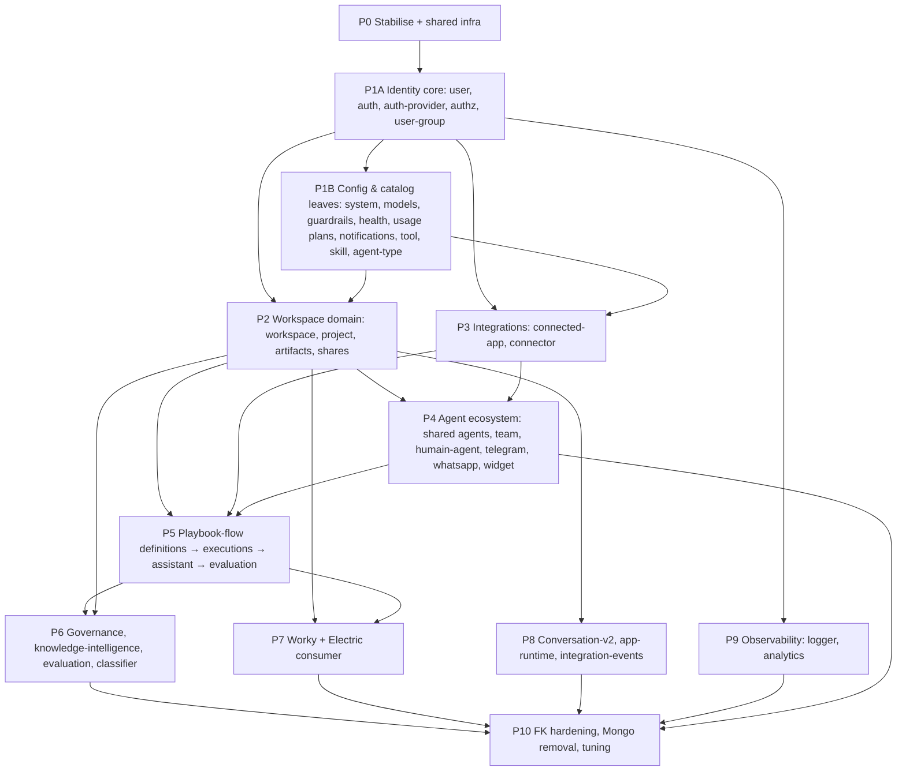

# MongoDB → PostgreSQL — Remaining Migration Plan (Phases 0–10)

> **Status:** Draft of 2026-09-18; §1.2 / §1.3 refreshed 2026-09-21 after P1A, P1B, P3 and P4 landed and were remediated (`2026-09-21-postgres-migration-remediation.md`). The phase plan itself (P5–P10) is unchanged.
> **Builds on:** `specs/2026-08-03-mongodb-to-postgresql-migration-feasibility.md`, the five `2026-08-05-agent-postgres-*` plans, and `plans/2026-08-29-conversation-postgres-migration.md`.
> **Evidence base:** repo inspection of `back/` on branch `agara-worky-006` (working tree dirty) and a read-only inspection of the target DB `agentstore` (PostgreSQL 17.6).

---

## 1. Where we are (verified)

### 1.1 Target DB (`agentstore`)

| Item | Finding |
|---|---|
| Extensions | `vector 0.8`, `pg_trgm`, `pg_search 0.18` (ParadeDB BM25), `pg_ivm`, `fuzzystrmatch`, PostGIS. **`pg_cron` is NOT installed** → TTL must be app-level (`@nestjs/schedule`). |
| App schemas | `public` (agents), `app_data`, `conversation`. Nothing else is app-owned yet. |
| `public` | `agents` (743 rows) + 6 junctions (`agent_tools` 1596, `agent_connectors` 648, `agent_skills` 40, `agent_knowledge_bases` 18, `agent_connector_actions` 5, `agent_disabled_skills` 0). Also **unmanaged** tables not in the Drizzle schema: `agencies`, `assumptions`, `scenarios`, `scenario_actions`, `simulation_runs`, `datasets`, `historical_metrics`, `import_logs`, `app_settings`, `logical_documents`, `logical_search_evaluations` (58 rows) — belong to other tools; keep out of scope. |
| `app_data` | 10 tables (`apps` 125, `environments` 250, `policies` 338, `migrations`/`schema_versions` 154, `audit_events` 808, `end_users` 35, …). |
| `conversation` | 18 tables — `conversations` 746, `messages` 3 077, `conversation_executions` 406, `conversation_usage_events` 1 124, `usage_logs` 1 992, `usage_windows` 1 902, `shared_conversations` 4, `reports` 0, `conversation_playbook_handoffs` 0, group/mention/tag/workspace junctions. Live data is still being written (latest message ≈ today). |
| Migration state | `drizzle.__drizzle_migrations` has 22 rows; repo has 19 SQL files / 19 journal entries. Object check: every table/column from `0000–0015` exists. |

**Drift to fix in Phase 0** (found while diffing files vs. live DB):
1. `conversation.app_builder_ai_usage_windows` and `app_data.access_grants` exist in the DB but in **no** migration file (created from another branch/manual). `__drizzle_migrations` ids skip 14–17 — same cause.
2. 14 indexes declared in `0005_conversation.sql` are not present under those names (e.g. `idx_messages_conversation_created`, `idx_conversations_owner_last_message`); very likely renamed/replaced by `0006_conversation_scalability.sql` — must be confirmed, not assumed.
3. `drizzle/meta` only holds snapshots `0000` and `0005`; the next `drizzle-kit generate` will diff against a stale baseline.

### 1.2 Code (refreshed 2026-09-21)

| Domain | State |
|---|---|
| **Agents** | ✅ On Postgres (`AgentRepository`, junction tables; FKs to `catalog.agent_types/tools/skills` and `integrations.connectors`). `agent/schemas/*.schema.ts` are gone; `shared_agents`, `teams`, `shared_teams`, `auto_builder_config` are on Postgres with FKs. |
| **App-data** | ✅ Own `app_data` schema. One Mongo coupling: `app-data-owner.controller.ts` (+ remote variant) injects `ConversationV2Session`. |
| **Conversation v1** | ✅ PG-only. `usage.service.ts` now reads plans from `catalog.plans`; users resolve through `USER_LOOKUP_PORT` (Postgres). |
| **Identity, catalog, integrations, agent ecosystem** | ✅ On Postgres (P1A, P1B, P3, P4). All cross-schema FKs are validated and generated from `scripts/migrate/fk-specs.ts` into `drizzle/0025`; `npm run db:verify` and `reconcile-ids.ts --strict` are the health checks. |
| **Conversation v2, app-runtime, app-builder AI offers** | ✅ On Postgres (P8, migrations 0026–0028). Backfilled and content-verified; see the remediation plan, Appendix C. Cross-schema foreign keys (12) follow in migration 0037, safe on dirty data; three of them still have orphans to clear at the deploy (remediation plan, Appendix D). |
| **Agent evaluation** | ✅ On Postgres (P6, migration 0031, schema `agent_evaluation`). `evaluation.*` in the shared DB belongs to a different feature. |
| **Knowledge intelligence** | ✅ On Postgres (P6, migration 0033, six `governance.knowledge_*` tables with FKs). The job queue claims with `FOR UPDATE SKIP LOCKED`; governance now reads plain records instead of Mongoose documents. |
| **Classifier** | ✅ On Postgres (P6, migration 0034, schema `classifier`: folders, file assignments, rules, runs). The folder tree is a self-referencing table (`ON DELETE CASCADE`, `NULLS NOT DISTINCT` name uniqueness); deleting a folder unassigns its files atomically. `playbook_id` has no FK until the flow store leaves Mongo (P5). |
| **Integration events** | ✅ On Postgres (P6, migration 0035, `ops.integration_events` + `ops.integration_event_deliveries`). A real transactional outbox: `record()` joins the caller's transaction, the dispatcher claims with `FOR UPDATE SKIP LOCKED` and fences every write on its lock owner, and a claim left by a dead dispatcher is taken over after two minutes. |
| **Logger** | ✅ On Postgres (P6, migration 0036, `ops.logs`). Written through the shared pool but never inside a caller's transaction, swept by the TTL sweeper after `LOGGING_RETENTION_DAYS` (default 30). The pool depends on `LoggerService`, so the buffer resolves it lazily instead of injecting it. |
| **WhatsApp** | ✂️ Removed from back, front and ADK (PR #317). The empty `channels.whatsapp_*` tables are dropped by migration 0032. |
| **Everything else** | ❌ Still Mongoose — see §1.3 (playbook-flow, worky). |

Not affected: **`yellowstorm-adk`, `mcp-*`, `yellowstorm-code-runtime` have no Mongo access** (only comments mention ObjectIds) — they reach data through Nest over gRPC/REST. **Front** has no datastore coupling; it only assumes 24-hex IDs (`isObjectIdLike` in `PlaybookExecutionComparePage.tsx`).

### 1.3 Remaining Mongo surface (updated 2026-09-25, after conversation-v2, app-runtime, agent-evaluation, knowledge-intelligence, classifier, integration-events and logger)

Done and verified on Postgres: `agents`, `app-data`, conversation v1, `project`, `workspace`, `workspace-artifact`, `governance`, identity (`user`, `auth`, `auth-provider`, `authorization`, `user-group`), config/catalog (`system`, `models`, `guardrails`, `health` history, `usage` plans, `notifications`, `tool`, `skill`, `agent-type`, `humain-agent`), integrations (`connected-app`, `connector`) the agent ecosystem (shared agents, `team`, `telegram`, `widget-chat`), `conversation-v2`, `app-runtime` (with the app-builder AI offers), `evaluation`, `knowledge-intelligence`, `classifier`, `integration-events` and `logger`. The remaining Mongo modules — enforced by `src/common/testing/no-mongoose-in-migrated-modules.spec.ts`, whose allowlist is exactly this table — are:

| Module | Mongo collections | Non-spec files with `@InjectModel` | Notes |
|---|---|---|---|
| `playbook-flow` | 24 models (+3 subdocument helper files) | 47 | Largest. `$lookup` aggregations in `playbook-flow-artifact.service.ts` and `playbook-flow.service.ts`, a replay-report aggregation, 2 `bulkWrite` (node/prompt templates), leases + idempotency with TTL and duplicate-key semantics, 5 assistant collections (4 with TTL), event appends with `$inc`/`$push`, runtime index management, `FLOW_READ_PORT` (Mongo adapter used by `workspace` and `classifier`) |
| `worky` | 23 schema files | 22 | 619-line Electric consumer writing 7 collections + cursors; aggregations in budget / report / stream services; atomic budget `$inc`; cascade delete over 16 collections (`worky-stream.service.ts`) |
| `connector` (bridge) | — | 1 raw `connection.collection('flows')` | `connector-playbook-binding-sync.service.ts`; replaced in P5 |
| `database` / `health` | — | — | `DatabaseModule` (`MongooseModule.forRoot`) and the Mongo ping in `health.service.ts`; removed in P10 |

Live TTL indexes still in Mongo: 6 (4 playbook-assistant collections, execution leases, idempotency records). Mongo transactions in wired code: none. `.aggregate()` files: 6 (3 in playbook-flow, 3 in worky). `bulkWrite`: 2.

---

## 2. Target decisions (recommended defaults — confirm in §7)

Consistent with the agent and conversation migrations, and now backed by evidence:

1. **IDs stay 24-hex `text`/`char(24)`; never regenerate as UUID.** Beyond consistency, IDs are baked into Ceph S3 object paths (`yellowstorm-adk/src/flow_engine/nodes/step_tool_scope.py:514`), Qdrant/Neo4j/Redis indexes, front URLs and already-migrated PG rows. Regeneration would orphan all of it.
2. **One `pgSchema` per bounded domain** (`identity`, `authz`, `catalog`, `workspace`, `integrations`, `teams`, `playbook`, `governance`, `worky`, `runtime`, `ops`); keep `public` (agents) as is.
3. **Cross-domain refs are opaque IDs without FKs until Phase 10.** Same-domain refs get FKs immediately. Phase 10 audits orphans and adds the cross-schema FKs.
4. **Document-shaped data → `jsonb` + promoted query columns** (playbook executions, governance snapshots, worky traces); embedded arrays with query/mutation needs → child/junction tables.
5. **Cutover style per module = PG-only build, no dual-write, no driver selector** (as Conversation). Data handling is chosen per domain (§7-Q1): *backfill* for durable config/identity/definitions, *fresh* for ephemeral/runtime data.
6. **TTL → one generic `PgTtlSweeper`** (registry of `{schema.table, column, ttl, batch}`) on `@nestjs/schedule` (no `pg_cron`). Generalise `postgres-conversation-expiry.service.ts`.
7. **Transactions → `AsyncLocalStorage`-scoped Drizzle tx** replacing `ClientSession` threading; delete `isTransactionUnavailable()` fallbacks.
8. **Search:** keep semantics as today (literal, case-insensitive) using `ILIKE` + `pg_trgm` GIN; BM25 (`pg_search`) and pgvector for new capability are a **separate, later track**, not migration parity.

---

## 3. Dependency graph

**Why this order**
- **User is the hub** (24 modules import its schema; 52 `.populate()` calls mostly resolve users). Until it moves, every migrated module keeps a Mongo lookup for emails/names. → P1A first.
- **Notifications is imported by `workspace`, `project`, `indexing`** → must land before P2 (P1B).
- **`tool`/`skill`/`agent-type` are already referenced by migrated `agents` junction rows** → moving them (P1B) allows real FKs and removes the "hydrate agentType from Mongo" hop.
- **`workspace.service.ts` and `classifier` import the `Flow` model** → break with a `FlowReadPort` in P0/P2 so workspace does not wait for P5.
- **`connector-playbook-binding-sync.service.ts` rewrites `flows[].nodes[].toolBindings` via raw Mongo** → keep as a bridge through P3–P4, rewrite (hard #2) inside P5.
- **P5 before P6**: governance, classifier and evaluation reference flow/playbook IDs and executions (all three are done; their `playbook_id` columns take a foreign key once the flow store leaves Mongo).
- **P7 (worky) does not wait for P5** (checked 2026-09-25): nothing outside `worky/` imports it, and it imports only one class from playbook-flow (`PlaybookFlowMailGraphClientService`, a Graph mail client with no data of its own). It never reads flows or executions, so its migration can run first or in parallel; the only later link is an id reference for the P10 foreign keys.
- **P8, P9 are nearly leaf** → schedule as parallel lanes once P2 (P8) / P1A (P9) land.

**Critical path:** P0 → P1A → P1B → P2 → P3 → P4 → P5 → P6/P7 → P10.
**Parallel lanes** (2 engineers): after P1B, lane A = P2→P4→P5→P6; lane B = P3→P8→P9→P7 (P7 is independent of P5, see above).

---

## 4. Phases

Every module migration follows the same **Definition of Done** (referred to as *DoD*):
1. Drizzle schema + generated migration applied to `agentstore`; indexes/unique/partial indexes ported 1:1 with the Mongoose declarations.
2. Repository (port + PG adapter) with a mapper returning the exact response shape the service uses today (external REST/SSE/gRPC contracts unchanged).
3. Services rewritten off `@InjectModel`; `MongooseModule.forFeature` entries and schema files deleted.
4. Backfill/verify script (if the domain is *backfill*): idempotent, id-preserving, `--dry-run`, orphan report, per-collection count + checksum reconciliation.
5. TTL entries registered in `PgTtlSweeper` for every removed TTL index.
6. Unit tests + PG integration tests (real `agentstore`-style DB, unique-id fixtures, self-cleaning); `npm run build` + module graph bootcheck (`scripts/bootcheck-module-graph.ts`) green.
7. Live smoke on the app + front/QA scenario for the domain (`qa-artifacts/`).

### Phase 0 — Stabilise & shared infrastructure  *(S–M)*
Blocks everything else.

| # | Task |
|---|---|
| 0.1 | Land the Conversation WIP (back, front, ADK proto) in reviewed commits; run the conversation PG suites. Nothing below should start on a dirty base. |
| 0.2 | **Reconcile migration history:** author migration(s) for `app_builder_ai_usage_windows` and `app_data.access_grants` from the live DDL; confirm the 14 missing `0005` indexes are superseded by `0006`; regenerate the drizzle snapshot baseline; make `scripts/migrate-postgres.ts` idempotent against the 22-row history. Add a CI check "drizzle-kit generate produces no diff". |
| 0.3 | **Finish Agent Plan 5:** delete `agent/schemas/agent.schema.ts`, replace `AgentDocument` in `governance-scope-overview.service.ts`, drop `User`/`Agent` `forFeature` leftovers in telegram/whatsapp modules as they are touched later. |
| 0.4 | **Shared PG toolkit** (`common/postgres/`): `newObjectId()` (promote `conversation/persistence/owned-id.ts`), typed `objectId` column helper, `jsonb<T>` helper, `escapeLike`, keyset/offset pagination helper, `withTransaction()` on `AsyncLocalStorage`, `upsertMany()` helper (replaces the 3 `bulkWrite` sites and 282 upsert patterns). |
| 0.5 | **`PgTtlSweeper`**: generic registry + metrics; migrate the conversation expiry service onto it; unit-test batching/locking (`pg_try_advisory_lock` so multiple replicas don't double-sweep). |
| 0.6 | **Migration harness** `scripts/migrate/`: generic `mongoCursor → transform → upsert` runner with `--dry-run`, resume, orphan report (needs the Mongo reference map from schemas' `ref:`), reconciliation report. Refactor `backfill-agents-to-postgres.ts` as first consumer. |
| 0.7 | **Ports for known cycles:** `FlowReadPort` (used by `workspace.service`, `classifier-run.service`), `UserLookupPort` (replaces direct `User` model use in `conversation.service`, `agent-permission.guard`, analytics). Initially Mongo-backed; swapped in P1A / P5. |
| 0.8 | Decide + record: schema-per-domain layout, `logging` connection (§7-Q3), backfill-vs-fresh per domain (§7-Q1). Inventory Mongo document counts per collection (needed for sizing backfills — not done yet: no Mongo access was used for this plan). |

**Exit:** clean tree, `drizzle-kit generate` no-diff, toolkit + sweeper merged with tests.

### Phase 1A — Identity core  *(L)*
`users`, `sessions`, `auth_providers`, `oauth_states`, `provider_link_tokens`, `user_provider_links`, `roles`, `audit_logs`, `user_groups` (+ members as junction).
- Schemas `identity.*` / `authz.*`. `users.roles` and group members → junction tables; keep email/username unique indexes (case-insensitive → `citext`/lower() unique index — verify how Mongo collation is used today).
- `auth.service.ts` transaction → real `db.transaction`. Sessions/oauth/link tokens/audit-log (730 d) → `PgTtlSweeper`.
- Replace all `populate()` on users (share services, `admin-user.controller.ts`, `user-group.service.ts`) with `JOIN`s via repository methods — the 24 modules that import `UserSchema` keep working through `UserLookupPort` (now PG-backed) so the remaining Mongo modules do not have to change at once.
- **Data:** backfill (users/roles/providers/groups/audit). Sessions & oauth states: fresh (forces one re-login).
- **Risks:** password/credential fields and token hashing must copy byte-exact; role/permission cache invalidation; JWT claims must keep the same `sub` (24-hex).
- **Exit:** login, refresh, provider link, RBAC guards, admin user CRUD, group CRUD green against PG; no `UserSchema.forFeature` outside modules explicitly listed as pending.

### Phase 1B — Config & catalog leaves  *(M)*
`system_settings`, `appearance_logos`, `models`, `guardrails_settings`, `health_history`, `plans` (usage), `notifications` (TTL via `metadata.expiresAt`), `tool_categories`, `tools`, `skill_categories`, `skills`, `agent_type_prompts`, `agent_types`.
- Small, flat, mostly singleton/config tables → ideal for proving the toolkit. Do notifications first (P2 dependency).
- After this phase add **FKs** `agents.agent_type_id → agent_types`, `agent_tools/agent_skills → tools/skills` (same DB now; agents' `created_by → users`), and delete the "agentType hydration from Mongo" code in `AgentService`.
- `usage.service.ts` stops reading Mongo `plans`; `backfill-usage-to-postgres.ts` retired.
- Seed scripts in `scripts/migrations/2026-*-seed-*.ts` (tools, starter data) must be ported to PG-idempotent seeds.
- **Data:** backfill all except `health_history` (fresh).

### Phase 2 — Workspace domain  *(L)*
`workspaces`, `workspace_documents`, `workspace_settings`, `workspace-shares`, `upload_sessions` (TTL), `projects`, `project-shares`, `workspace_artifacts`.
- `workspace_documents`: `parentId` self-FK, materialised path/ordering and per-workspace unique-name partial index (see `dedupe-document-original-names.ts` — run it first to avoid unique violations on backfill).
- Replace `connection.collection('workspace_artifacts')` raw calls in `workspace-artifact-cleanup.service.ts`.
- Share collections → `*_shares` tables with recipient columns (mirrors `conversation_direct_share_recipients`); drop `populate` in `workspace-share.service.ts`, `project-share.service.ts`, `workspace.service.ts`.
- Cross-service effects to re-test: Ceph object paths (IDs preserved), indexing pipeline (`indexing.service.ts` reads workspace + notifications), ADK internal endpoint that resolves workspace names, conversation `conversation_workspaces` junction (add FK → `workspace.workspaces` here, since both are in PG).
- `workspace.service.ts` `Flow` dependency served by `FlowReadPort` (Mongo-backed until P5).
- **Data:** backfill workspaces/docs/settings/shares/projects/artifacts; `upload_sessions` fresh.
- **Risk:** highest data volume in this stage (documents). Backfill in id-ordered batches, verify per-workspace counts.

### Phase 3 — Integrations  *(M)*
`connected_app_definitions`, `user_app_connections`, `connected_app_oauth_states` (TTL), `connectors`, `connector_credentials`, `connector_categories`, `admin_connector_auth_tokens`, `admin_connector_oauth_states` (TTL).
- Connector documents contain JSON-Schema/`Mixed` config → `jsonb`; promote `type`, `ownerId`, `categoryId`, `isActive`, `workspaceId`.
- **Credentials/secret fields:** copy encrypted blobs unchanged; do not decrypt/re-encrypt in the backfill.
- `catalog-transfer.service.ts` transaction → PG tx.
- `connector-playbook-binding-sync.service.ts` **stays as a Mongo bridge** on `flows` until P5.
- Unblocks agent junction FKs (`agent_connectors → connectors`).
- **Data:** backfill definitions/connectors/credentials/connections; oauth states fresh.

### Phase 4 — Agent ecosystem  *(M–L)*
`shared_agents`, `teams` (members → `team_members` table incl. `parentAgentId` self relation), `shared_teams`, `team_auto_builder_config`, `telegram_*` (3), `whatsapp_*` (3, including encrypted Baileys auth), `widget_*` (3), `humain-agent` remaining Mongo use.
- `agent-share.service.ts` (4 populates) and `team-share.service.ts` (4) become joins; `agent-permission.guard.ts` drops `SharedAgent` model.
- Add FKs to `agents` now that `agent_types/tools/skills/connectors/users` are in PG.
- WhatsApp auth-session store is a hot write path — keep the encrypted string in a `text` column, single-row upserts, and test reconnect flow.
- Telegram/WhatsApp link codes → sweeper.
- **Data:** backfill shared_*/teams/integrations/bindings; widget sessions/messages fresh.

### Phase 5 — Playbook-flow  *(XL — biggest single phase)*
29 schema files, 47 coupled files. Split into 4 sub-phases, each independently deployable:
- **5A Definitions:** `flows` (jsonb `nodes/edges/settings` + promoted `ownerId, workspaceId, name, status, version, updatedAt`), `shared_playbooks`, `node_templates`, `prompt_templates`, `output_formats`. Rewrite `playbook.service`-style paginated list (correlated `$lookup` + `$facet`) as window/`COUNT(*) OVER()` (**hard #3**). Rewrite `connector-playbook-binding-sync` (**hard #2**) — either `jsonb_set` update over `flows` or a normalised `flow_node_tool_bindings(flow_id,node_id,connector_id,…)` table (recommended: normalised, gives the `connectorId` index the Mongo migration script `2026-07-09-create-flow-toolbindings-connectorid-index.ts` was emulating). Replace `FlowReadPort` adapter; drop Mongo bridge from P3.
- **5B Executions:** `flow_executions` (promoted: `flowId, status, executedBy, startedAt, finishedAt`, `replay_source` cols) with `task_results` — **recommended:** separate `flow_task_results` table (`execution_id, node_id, status, usage…`) with `jsonb` for `toolTrace / llmPromptTrace / judgeHistory / components`; HITL tables; router decisions; `execution_leases` and `idempotency_records` (TTL, `INSERT … ON CONFLICT DO NOTHING` for lease acquisition — replaces the unique-index-race pattern; **must be race-tested**).
- **5C Assistant/design:** assistant messages/requests/operations/revisions/attachments (all TTL), design snapshots/operations, mail-event ledgers.
- **5D Evaluation & replay:** evaluation baselines/executions, validated replays, `replay_run_reports` (hard aggregation in `playbook-flow-replay-report.service.ts`), dynamic-reasoning attempts. Governed by the load gate `scripts/playbook-flow-load-gate.mjs` — rerun it against PG.
- gRPC contracts with ADK stay identical; **run a real ADK execution end-to-end** at the end of 5B.
- **Data:** backfill 5A (definitions); 5B–5D historical executions: decide per §7-Q1 (recommend backfill last 90 days + fresh for ephemeral 5C/leases).
- **Risk:** deep nested execution docs, replay report aggregation, lease/idempotency semantics, `bulkWrite` in `playbook-flow-artifact.service.ts`.

### Phase 6 — Governance, knowledge-intelligence, evaluation, classifier  *(L)*
- **Governance (12 collections):** promoted columns + `jsonb` snapshots for `deployment_revisions`; partial unique index for event dedup key (`governance-source-event.schema.ts:36`) and membership uniqueness. Rewrite the two 8-stage review-scheduler pipelines (**hard #1**) as one shared CTE query with two anti-joins — implement once, parametrise both callers. Convert the 5 `withTransaction` flows, then **delete** the `isTransactionUnavailable()` / `transitionWithoutTransaction()` fallback paths.
- `governance-membership.service.ts` (4 populates) → joins. `migrate-governance-sources-to-documents.ts` / `verify-document-governance-migration.ts` become PG-only.
- **Knowledge-intelligence (6):** 5 Mongoose-backed repositories already exist → swap implementation, keep interface; replace optional `ClientSession` param with the ALS transaction.
- **Evaluation (4) / classifier (4):** classifier moves off `Flow` model via the P5 port.
- Add FKs to `workspace_documents`, `flows`, `agents` (all in PG by now).
- **Data:** backfill governance programs/scopes/documents/revisions/memberships; runs/attempts/metrics per §7-Q1.

### Phase 7 — Worky  *(L)*
25 collections; audit events, cost events, budget reservations, plan versions/deltas/projections, task results, streams, interactions, mail ledger, WhatsApp delivery, ephemeral workers, Electric cursors.
- **Electric consumer (`worky-electric-consumer.service.ts`, 619 lines):** today mirrors an external Worky-manager PG into Mongo. Re-point the sink to the app PG (`worky.*` tables); keep the Electric shape/cursor protocol unchanged. Cursor table becomes trivial `INSERT … ON CONFLICT`. Decide if the two PGs can eventually be merged (§7-Q4) — not required for this phase.
- Replace 3 aggregations (`worky-budget.service.ts`, `worky-report.service.ts`, `worky-stream.service.ts`) with SQL (`date_trunc`, `GROUP BY`). Budget **reservations** must be an atomic `UPDATE … WHERE remaining >= $x RETURNING` (replaces `findOneAndUpdate`+`$inc`).
- High-write event tables: index for `(stream_id, created_at)` and evaluate monthly partitioning for `cost_events` / `audit_events`.
- Existing helper `scripts/create-worky-component-tables.cjs` shows an earlier ad-hoc PG path — fold into drizzle migrations.
- **Data:** mostly *fresh* for traces/deltas; backfill policies, budgets, subscriptions, memory proposals.

### Phase 8 — Conversation v2, app-runtime, integration-events  *(M)*
`conversation_v2_sessions/events/app_shares`, `app_runtime_bindings/tickets(TTL)/tool_calls/source_revisions/finalized_revisions`, `integration_events`.
- Removes the last Mongo dependency of `app-data` (`ConversationV2Session` in the owner controllers) and lets `app_data` FK to `runtime`.
- Follow `specs/2026-05-25-conversation-v2-state-ownership-design.md` for state-ownership invariants; events table is append-only, keep `(session_id, seq)` unique.
- **Data:** fresh for tickets/tool calls/events; backfill sessions/app shares/revisions that are user-visible.

### Phase 9 — Observability & analytics  *(S–M)*
`logs` (isolated `logging` connection, TTL 30 d), `audit`-adjacent counters, `analytics/user-analytics.service.ts` aggregation, `log-buffer.service.ts` aggregation.
- Logging: recommended default = **`ops.logs` table in the same DB, partitioned by day, dropped by the sweeper**; alternative is leaving logging disabled/external (§7-Q3). Removes the second Mongoose connection.
- Analytics: rewrite on PG (`date_trunc`, `GROUP BY`), reuse `conversation-analytics-store`. Can run any time after P1A — schedule as filler work.
- **Data:** fresh.

### Phase 10 — Integrity hardening, Mongo removal, tuning  *(M–L)*
1. **Orphan audit** across all `ref:` edges (324 declarations, never FK-enforced) using the harness reference map; repair or null out; then add cross-schema FKs (`NOT VALID` → `VALIDATE CONSTRAINT`) — agents↔users/agent-types, conversations↔workspaces/projects/users, messages↔agents, flows↔workspaces, governance↔documents, worky↔flows, etc.
2. Audit **IDs hidden inside `jsonb`/`Mixed`** (e.g. conversation `runtimeDefinition.{primaryAgentId,allowedAgentIds,workspaceIds}`): promote to columns/junctions or explicitly accept as opaque.
3. **Remove Mongo:** `DatabaseModule`/`MongooseModule.forRoot`, logger connection, `mongoose`/`@nestjs/mongoose`/`mongodb` deps, `MONGODB_*` in `config.schema.ts` + `database.config.ts`, `scripts/init-mongodb.js`, `scripts/init-db.sh`, docker/deployment docs (`docs/deployment/docker-deployment-guide.md`), README/CHANGELOG, health-check indicator (swap to PG), Mongo-only one-off scripts under `back/scripts/migrations`.
4. **Performance:** `EXPLAIN` the top ~30 queries (conversation list, workspace tree, flow list, executions by flow, governance scheduler, worky streams); GIN on `jsonb` only where queried; `pg_trgm` GIN for ILIKE searches; autovacuum/fillfactor on hot tables; statement timeouts already configured in `PostgresModule`.
5. Full regression: back unit + integration, front tests, ADK e2e, QA scenarios, `playbook-flow-load-gate`.
6. Optional follow-ups (separate approval): BM25 via `pg_search`, pgvector for content/embedding search, dropping Redis BM25 index if PG covers it.

---

## 5. Sizing & sequencing (order of magnitude)

Assumes two engineers, POC environment (downtime acceptable, no zero-downtime cutover). Estimates are **not commitments**.

| Phase | Size | ~Engineer-weeks | Can run in parallel with |
|---|---|---|---|
| P0 | S–M | 2 | — |
| P1A | L | 3–4 | — |
| P1B | M | 2 | (starts once P1A user tables exist) |
| P2 | L | 3–4 | P3, P8, P9 |
| P3 | M | 2 | P2, P8, P9 |
| P4 | M–L | 3 | P8, P9 |
| P5 | XL | 6–8 | P8, P9 |
| P6 | L | 4 | P7 |
| P7 | L | 3–4 | P6 |
| P8 | M | 2 | anything after P2 |
| P9 | S–M | 1–2 | anything after P1A |
| P10 | M–L | 3 | — |
| **Total** | | **≈ 34–40 eng-weeks** → **≈ 4.5–5.5 calendar months with 2 engineers** | |

Rough volume drivers: ≈120 collections, ≈200 coupled service files, 17 TTL rules, 2 transaction sites + 10 governance/KI sessions, 7 aggregation files, 4 hard queries.

---

## 6. Risk register (updated)

| # | Risk | Sev. | Mitigation |
|---|---|---|---|
| R1 | Dirty working tree + migration history drift (2 undocumented tables, missing snapshots) corrupts the baseline | **High** | P0.1–0.2 before anything else; CI no-diff check |
| R2 | User hub — a partial move leaves 24 modules resolving users from Mongo | **High** | `UserLookupPort` in P0, PG adapter in P1A, all other modules unchanged |
| R3 | Orphaned references break FKs (324 never-enforced refs) | **High** | Orphan report in harness from P1 onward; FKs deferred to P10 (`NOT VALID` first) |
| R4 | Playbook-flow scale/complexity (29 schemas, replay/lease semantics) | **High** | 4 sub-phases, load gate, real ADK end-to-end at each |
| R5 | Secrets/encrypted fields (connector credentials, WhatsApp auth, provider tokens) corrupted by transform | **High** | Byte-exact copy, checksum reconcile, no decrypt in backfill |
| R6 | ID hidden in `Mixed` fields escapes tooling | Med | P10.2 manual audit; grep-driven checklist per module |
| R7 | TTL semantics lost (17 rules) | Med | Sweeper registry is a hard DoD item per module; test each |
| R8 | Lease/idempotency/budget races (`findOneAndUpdate` → SQL) | Med | `INSERT … ON CONFLICT` / conditional `UPDATE … RETURNING` + concurrency tests |
| R9 | Two PGs + Electric mirror confusion in Worky | Med | Keep protocol unchanged, only swap sink |
| R10 | Cross-branch schema changes keep landing (drift like `access_grants`) | Med | Single migration owner + CI no-diff |

---

## 7. Open questions (answers change the plan)

1. **Data policy per domain** — is *all* remaining Mongo data disposable like Conversation was, or must users/roles/workspaces/connectors/flows/governance be backfilled? *Recommendation:* backfill durable config/identity/definitions; fresh for sessions, tokens, leases, traces, logs. If everything is disposable, P1–P9 shrink by roughly a third (no harness, no reconciliation) but every user/seed must be recreated.
2. **Is there a production Mongo that must eventually be migrated**, or only POC/dev? The Conversation plan states a production migration needs a new approved plan; the harness in P0.6 is what would make that possible.
3. **Logging connection:** in-DB partitioned table (recommended), external sink, or disabled?
4. **Worky:** may the external Worky-manager PG and `agentstore` eventually merge (removes Electric mirroring), or is Electric permanent?
5. **Scope of hosted schemas:** should the unmanaged `public.*` tables (`assumptions`, `scenarios`, `logical_*`, …) be adopted into Drizzle or fenced off?
6. **Search/vector work** (`pg_search`, pgvector): explicitly out of scope for parity — confirm.

---

## 8. Immediate next steps (first two weeks)

1. Review/commit the Conversation WIP; run conversation PG suites.
2. Write the reconciling migration for `app_builder_ai_usage_windows` + `app_data.access_grants`; confirm the 14 `0005` indexes; regenerate snapshot; add the CI no-diff check.
3. Land Agent Plan 5 leftovers (`agent.schema.ts`, `governance-scope-overview` type).
4. Build `common/postgres` toolkit, `PgTtlSweeper`, migration harness; port ports (`UserLookupPort`, `FlowReadPort`).
5. Pull Mongo collection counts (read-only) to finalise backfill sizing and answer Q1/Q2.
6. Write the detailed task-level plan for **P1A** (use the same format as the `agent-postgres-0N` plans) and start it.
