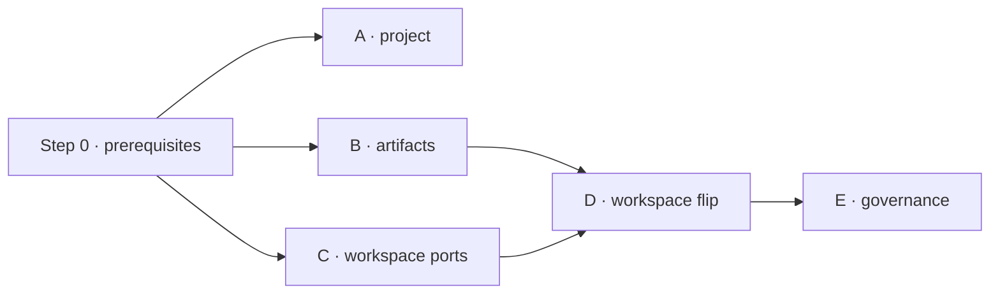

# Project · Artifacts · Workspace · Governance → PostgreSQL — Implementation Plan

> **For agentic workers:** REQUIRED SUB-SKILL: `superpowers:executing-plans` (or `superpowers:subagent-driven-development`). Steps use checkbox (`- [ ]`) syntax. Execute steps **in order**; each step is independently mergeable and revertable.

**Goal:** move four bounded domains off MongoDB/Mongoose onto the app-owned PostgreSQL (`agentstore`) + Drizzle datastore, continuing after `agents` (`public`), `app_data`, and Conversation v1 (`conversation`).

**Scope:** 20 collections across `project`, `workspace-artifact`, `workspace`, `governance`.

**Locked decisions (confirmed 2026-09-18):**
1. **Backfill all five domains.** Only `upload_sessions` is treated as disposable (ephemeral, cut over when idle).
2. **`workspace-document.service.ts` (2 634 lines) is split into collaborators as part of Step D** — priced in, not deferred.
3. **Governance (Step E) runs after Step D**, so its heavy `WorkspaceDoc` reads become same-database joins.

---

## Global Constraints

- **IDs are `char(24)`, application-generated.** Verified convention: `public.agents.id`, `conversation.conversations.id` are `character(24)` with **no DB default**. Use `newObjectId()`. **Never** UUIDs, never DB-generated.
- **Timestamps are `timestamptz`**, default `now()`.
- **Migrations are hand-written SQL**, continuing the `0006`–`0015` convention. `drizzle/meta` holds only snapshots `0000`/`0005`, so **do not run `drizzle-kit generate`** — it would diff against a stale baseline. Drizzle schema files are the typed access layer only.
- **Every migration is additive and idempotent** (`CREATE … IF NOT EXISTS`). Apply to a scratch database first, then `agentstore`. `agentstore` is shared and takes live Conversation writes.
- **Never delete Mongo data or collections in these steps.** Dropping Mongoose is a separate, later step after all domains migrate. Every rollback here is a code revert.
- **Same-schema FKs are added immediately. Cross-schema FKs are added `NOT VALID`, then `VALIDATE CONSTRAINT`** only after the orphan report is clean.
- **Stored counters are copied, never recomputed** (`shareCount`, `documentCount`, `usedStorage`). Drift is a separate report. Same decision as Conversation's `messageCount`.
- **Response contracts are unchanged.** Mappers reproduce the current `toJSON` shape (`id`, no `_id`, no `__v`). Record current REST responses as contract-test fixtures **before** changing a service.
- **Integration tests run against a real PostgreSQL**, create rows with unique IDs, and delete exactly those IDs in `afterEach`. **No `TRUNCATE`** on shared tables.
- **Credentials from env only** (`POSTGRES_*`, `MONGODB_URI` via `back/.env`). Integration suites **skip**, not fail, when `POSTGRES_HOST` is unset.
- Path aliases: `@modules/*`, `@common/*`, `@config/*`.

---

## Verified Current State

**Target DB** — PostgreSQL 17.6. Extensions: `vector 0.8`, `pg_trgm`, `pg_search 0.18`, `pg_ivm`, PostGIS. **`pg_cron` is NOT installed** → every TTL becomes an app-level sweep. App schemas today: `public` (agents + 6 junctions), `app_data` (10 tables), `conversation` (18 tables). `drizzle.__drizzle_migrations` has 22 rows.

**FK targets already waiting** (all `char(24)`): `conversation.conversations.project_id`, `conversation.conversations.system_workspace_id`, `conversation.conversation_workspaces.workspace_id`.

**Coupling measured:**

| Module | Own model injections | External importers |
|---|---|---|
| `project` | 3 | **none** |
| `workspace-artifact` | 2 | `workspace/services/workspace-artifact-cleanup.service.ts` (raw `connection.collection`) |
| `workspace` | 13 + `Flow` ×1 | **15 files / 5 modules**: `governance` (8), `classifier` (4), `indexing` (1), `playbook-flow` (1), `worky` (1) |
| `governance` | 12 collections / 22 files | `conversation` (`governed-*`), `authorization` constants |

**Governance is simpler than the August feasibility study claimed** — verified by inspection:
- **No transactions.** No `withTransaction`/`startSession`. Only an unused optional `session?: ClientSession` parameter at `governance-document-event.service.ts:22`.
- **No aggregation pipelines.** No `.aggregate(`, `$lookup`, `$facet`. `governance-document-review-scheduler.service.ts` is **33 lines** — a `find` plus an optimistic `updateOne` loop. The study's "hard #1 — two 8-stage correlated pipelines" referred to the since-refactored `governance-source-*` services and **no longer exists**.

---

## Sequencing



| Step | Domain | Collections | Size | ~Eng-weeks | Depends on |
|---|---|---|---|---|---|
| 0 | Toolkit, sweeper, harness, `UserLookupPort` | — | S–M | 1.5 | — |
| A | project | 2 | S–M | 1 | 0 |
| B | workspace-artifact | 1 | S–M | 1 | 0 |
| C | workspace ports (refactor only) | 0 | M | 1.5 | 0 |
| D | workspace | 5 | L | 3–4 | B, C |
| E | governance | 12 | L | 3–4 | D |
| | **Total** | **20** | | **≈ 11–13** | |

**Two engineers:** lane 1 = A → C → D → E; lane 2 = B, then joins D. Calendar ≈ 6–7 weeks.

---

# Step 0 — Prerequisites

Nothing below starts until these land. **Deliberately excluded:** the `app_builder_ai_usage_windows` / `app_data.access_grants` migration-history reconciliation (deferred by decision).

### Files

- `back/src/common/postgres/` — **Create.** `object-id.ts`, `columns.ts`, `json.ts`, `like.ts`, `pagination.ts`, `transaction.ts`, `upsert.ts`, `index.ts`
- `back/src/common/ports/user-lookup.port.ts` — **Create.**
- `back/src/modules/user/adapters/mongo-user-lookup.adapter.ts` — **Create.**
- `back/src/modules/postgres/ttl/pg-ttl-sweeper.service.ts` — **Create.**
- `back/scripts/migrate/` — **Create.** `harness.ts`, `reconcile.ts`, `orphans.ts`

### Tasks

- [ ] **0.1** Commit the in-flight Conversation work (~20 back files, ~25 front files, ADK `chatbot.proto` + servicer) in reviewed commits. Conversation PG suites green. **The tree must be clean.**
- [ ] **0.2** `common/postgres/object-id.ts` — promote `conversation/persistence/owned-id.ts` to a shared `newObjectId()` / `isObjectId()`. Re-export from the conversation module so existing imports keep working.
- [ ] **0.3** `common/postgres/columns.ts` — `objectId(name)` → `char(24)` Drizzle column helper; `objectIdArray(name)`; `timestamps()` returning `{ createdAt, updatedAt }`.
- [ ] **0.4** `common/postgres/json.ts` — `jsonbTyped<T>(name)` typed `jsonb` helper with a default.
- [ ] **0.5** `common/postgres/like.ts` — `escapeLike(input)` escaping `%`, `_`, `\` for `ILIKE`.
- [ ] **0.6** `common/postgres/pagination.ts` — offset + keyset helpers returning `{ rows, total }` via `COUNT(*) OVER()` (single round trip, replaces `$facet`).
- [ ] **0.7** `common/postgres/transaction.ts` — `withTransaction(fn)` over `AsyncLocalStorage`; nested calls join the outer transaction. Repositories resolve the ambient tx or the pool.
- [ ] **0.8** `common/postgres/upsert.ts` — `upsertMany(table, rows, conflictTarget, updateCols)` batching `INSERT … ON CONFLICT DO UPDATE`.
- [ ] **0.9** `PgTtlSweeper` — registry of `{ schema, table, column, batchSize }`; `@nestjs/schedule` cron; wraps each sweep in `pg_try_advisory_lock(hashtext('ttl:<table>'))` so replicas don't double-sweep; emits deleted-row counts. Migrate `postgres-conversation-expiry.service.ts` onto it as the first consumer.
- [ ] **0.10** `UserLookupPort` — `byId(id): Promise<UserSummary | null>`, `byIds(ids: string[]): Promise<Map<string, UserSummary>>`, `UserSummary = { id, email, firstName, lastName }`. **Mongo-backed adapter** in the user module. This replaces every `.populate('…UserId', 'email profile.firstName profile.lastName')` in Steps A/D/E; it is swapped to PG when identity migrates, with **no caller changes**.
- [ ] **0.11** `scripts/migrate/harness.ts` — generic `mongoCursor → transform → upsert` runner: `--dry-run`, `--resume-from <id>`, batch size, progress logging, per-collection count + checksum reconciliation, orphan report driven by a declared reference map. Refactor `backfill-agents-to-postgres.ts` onto it as the first consumer.
- [ ] **0.12** Read-only Mongo inventory: document counts for the 20 in-scope collections + orphan counts per `ref:` edge. Record in this file's appendix. **Sizes Step D's backfill.**

### Definition of Done

Clean tree; `npm run build` green; toolkit unit-tested; sweeper deletes expired conversation rows on schedule; harness re-runs the agent backfill idempotently; inventory recorded.

---

# Step A — Project domain

**Why first:** the only domain with **zero external schema importers**. Exercises the full pattern at minimum blast radius.

**Collections:** `projects`, `project-shares` → PG schema **`project`**.

### Files

- `back/src/modules/postgres/schema/project.schema.ts` — **Create.**
- `back/drizzle/0016_project.sql` — **Create.**
- `back/src/modules/project/persistence/project-store.ts` — **Create** (port).
- `back/src/modules/project/persistence/project-share-store.ts` — **Create** (port).
- `back/src/modules/project/persistence/postgres/postgres-project-store.ts` — **Create.**
- `back/src/modules/project/persistence/postgres/postgres-project-share-store.ts` — **Create.**
- `back/src/modules/project/persistence/project-record.mapper.ts` — **Create.**
- `back/src/modules/project/project.service.ts` — **Modify.**
- `back/src/modules/project/project-share.service.ts` — **Modify** (467 lines, 2 populates).
- `back/src/modules/project/project.module.ts` — **Modify.**
- `back/src/modules/project/schemas/` — **Delete** at the end.
- `back/scripts/migrate/2026-09-project.ts` — **Create.**

### A.1 DDL — `drizzle/0016_project.sql`

```sql
CREATE SCHEMA IF NOT EXISTS project;

CREATE TABLE IF NOT EXISTS project.projects (
  id          char(24) PRIMARY KEY,
  name        varchar(100) NOT NULL,
  created_by  char(24)     NOT NULL,
  is_public   boolean      NOT NULL DEFAULT false,
  share_count integer      NOT NULL DEFAULT 0,
  created_at  timestamptz  NOT NULL DEFAULT now(),
  updated_at  timestamptz  NOT NULL DEFAULT now()
);
CREATE UNIQUE INDEX IF NOT EXISTS uq_projects_owner_name ON project.projects (created_by, name);
CREATE INDEX IF NOT EXISTS idx_projects_owner_created   ON project.projects (created_by, created_at DESC);

CREATE TABLE IF NOT EXISTS project.project_shares (
  id                  char(24) PRIMARY KEY,
  project_id          char(24)    NOT NULL REFERENCES project.projects(id) ON DELETE CASCADE,
  owner_id            char(24)    NOT NULL,
  shared_with_user_id char(24)    NOT NULL,
  permission          varchar(16) NOT NULL CHECK (permission IN ('read','readwrite')),
  shared_by           char(24)    NOT NULL,
  created_at          timestamptz NOT NULL DEFAULT now(),
  updated_at          timestamptz NOT NULL DEFAULT now()
);
CREATE UNIQUE INDEX IF NOT EXISTS uq_project_shares_project_user ON project.project_shares (project_id, shared_with_user_id);
CREATE INDEX IF NOT EXISTS idx_project_shares_user_created    ON project.project_shares (shared_with_user_id, created_at DESC);
CREATE INDEX IF NOT EXISTS idx_project_shares_project_created ON project.project_shares (project_id, created_at DESC);
CREATE INDEX IF NOT EXISTS idx_project_shares_owner           ON project.project_shares (owner_id);
```

Index set is 1:1 with `project.schema.ts` / `project-share.schema.ts`. `permission` uses `CHECK` rather than `pgEnum` so adding a level later is a one-line migration.

### A.2 Tasks

- [ ] **A.1** Drizzle table definitions in `postgres/schema/project.schema.ts` using `pgSchema('project')` + the Step 0 helpers; export from `postgres/schema/index.ts`.
- [ ] **A.2** Write `0016_project.sql`; add the `drizzle/meta/_journal.json` entry; apply to scratch DB, then `agentstore` via `scripts/migrate-postgres.ts`.
- [ ] **A.3** Capture contract fixtures: record current JSON for project list, project detail, share list, share create/update responses.
- [ ] **A.4** `project-record.mapper.ts` — pure `rowToRecord` / `recordToRow`, emitting the current `toJSON` shape.
- [ ] **A.5** `project-store.ts` + PG adapter. Method set mirrors `project.service.ts`'s current `projectModel` calls exactly (`findById`, `findOne`, `find` with owner filter + sort, `create`, `updateById`, `deleteById`, `countDocuments`, `exists`).
- [ ] **A.6** `project-share-store.ts` + PG adapter. **`shareCount` stays a stored counter** maintained by the share service — do not recompute from rows. Counter updates and share writes run inside `withTransaction`.
- [ ] **A.7** `project-share.service.ts:211` and `:309` — replace both `.populate(...)` calls with `UserLookupPort.byIds()` + in-memory join. Assert against the A.3 fixtures.
- [ ] **A.8** `project.module.ts` — bind the stores to the PG adapters; drop `MongooseModule.forFeature([Project, ProjectShare])`. `NotificationsService` is a service-level dependency and is unaffected.
- [ ] **A.9** `git rm -r back/src/modules/project/schemas/`; verify `grep -rn "project/schemas" back/src` returns nothing.
- [ ] **A.10** `scripts/migrate/2026-09-project.ts` on the Step 0 harness: preserve `_id` → `id`; report shares whose `project_id` has no project (these would violate the new FK); `--fix-orphans` drops them.
- [ ] **A.11** Run backfill `--dry-run`, review the orphan report, then run for real and reconcile counts.
- [ ] **A.12** After reconciliation:
  ```sql
  ALTER TABLE conversation.conversations
    ADD CONSTRAINT fk_conversations_project
    FOREIGN KEY (project_id) REFERENCES project.projects(id) NOT VALID;
  ```
  Then `VALIDATE CONSTRAINT` **only** once conversations referencing deleted projects are resolved. Do not validate blind.

### A.3 Verification / DoD

- Unit tests (mapper) + PG integration tests (unique-ID fixtures, self-cleaning).
- Contract tests pass against the A.3 fixtures.
- Live smoke: create → rename → share (read, readwrite) → unshare → delete; `shareCount` correct; duplicate `(created_by, name)` rejected; conversations still resolve their project.
- `npm run build` + `scripts/bootcheck-module-graph.ts` green.
- **Rollback:** revert the module-binding commit **and** run `scripts/migrate/2026-09-project-fk.ts --drop` — reverting the code alone leaves `fk_conversations_project` in place, and conversations for projects created in PG during the window would violate it. Rollback also loses projects/shares written only to PG and leaves Mongo `shareCount` stale for share ops that happened on PG (stored counter — reconcile from Mongo shares before re-flipping).

---

# Step B — Workspace artifacts

**Why:** small (1 collection, 2 files) but exercises three patterns Step D needs — `jsonb` with promoted query columns, a **worker lease**, and a cross-module cleanup port. **Runs in parallel with Step C.**

**Collection:** `workspace_artifacts` → PG schema **`workspace`** (created here; the rest lands in Step D).

### Files

- `back/src/modules/postgres/schema/workspace-artifact.schema.ts` — **Create.**
- `back/drizzle/0017_workspace_artifacts.sql` — **Create.**
- `back/src/modules/workspace-artifact/persistence/` — **Create** (port, PG adapter, mapper).
- `back/src/modules/workspace-artifact/ports/workspace-artifact-cleanup.port.ts` — **Create.**
- `back/src/modules/workspace-artifact/services/decision-flow-generation-worker.service.ts` — **Modify** (lease paths).
- `back/src/modules/workspace/services/workspace-artifact-cleanup.service.ts` — **Modify** (drop raw `connection.collection`).
- `back/src/modules/workspace-artifact/schemas/` — **Delete** at the end.
- `back/scripts/migrate/2026-09-workspace-artifacts.ts` — **Create.**

### B.1 DDL — `drizzle/0017_workspace_artifacts.sql`

Promoted columns are **mandatory** wherever Mongo indexes a dotted path:

| Mongo | PostgreSQL |
|---|---|
| `primarySource` (Object) | `primary_source jsonb` **+ `primary_source_document_id char(24)`** (indexed path) |
| `generation` (Object) | `generation_agent_id`, `generation_requested_by`, `generation_attempts`, `generation_started_at`, `generation_completed_at`, `generation_error`, `lease_token`, `lease_expires_at`, `next_attempt_at`, `generation_usage jsonb` |
| `generationOptions`, `payload` | `jsonb` |

```sql
CREATE SCHEMA IF NOT EXISTS workspace;

CREATE TABLE IF NOT EXISTS workspace.workspace_artifacts (
  id             char(24) PRIMARY KEY,
  workspace_id   char(24)     NOT NULL,
  type           varchar(64)  NOT NULL,
  name           varchar(150) NOT NULL,
  description    varchar(1000),
  status         varchar(32)  NOT NULL DEFAULT 'queued',
  schema_version integer      NOT NULL DEFAULT 1 CHECK (schema_version >= 1),
  revision       integer      NOT NULL DEFAULT 0 CHECK (revision >= 0),

  primary_source             jsonb    NOT NULL,
  primary_source_document_id char(24) NOT NULL,

  generation_options jsonb NOT NULL,
  payload            jsonb,

  generation_agent_id     char(24) NOT NULL,
  generation_requested_by char(24) NOT NULL,
  generation_attempts     integer  NOT NULL DEFAULT 0,
  generation_started_at   timestamptz,
  generation_completed_at timestamptz,
  generation_error        text,
  lease_token             text,
  lease_expires_at        timestamptz,
  next_attempt_at         timestamptz,
  generation_usage        jsonb,

  cloned_from_artifact_id char(24) REFERENCES workspace.workspace_artifacts(id) ON DELETE SET NULL,
  created_by char(24)    NOT NULL,
  updated_by char(24)    NOT NULL,
  created_at timestamptz NOT NULL DEFAULT now(),
  updated_at timestamptz NOT NULL DEFAULT now()
);
CREATE INDEX IF NOT EXISTS idx_artifacts_ws_type_updated ON workspace.workspace_artifacts (workspace_id, type, updated_at DESC);
CREATE INDEX IF NOT EXISTS idx_artifacts_ws_doc_updated  ON workspace.workspace_artifacts (workspace_id, primary_source_document_id, updated_at DESC);
CREATE INDEX IF NOT EXISTS idx_artifacts_status_next     ON workspace.workspace_artifacts (status, next_attempt_at, created_at);
CREATE INDEX IF NOT EXISTS idx_artifacts_status_lease    ON workspace.workspace_artifacts (status, lease_expires_at);
CREATE INDEX IF NOT EXISTS idx_artifacts_created_by      ON workspace.workspace_artifacts (created_by);
```

### B.2 Lease rewrite

`findOneAndUpdate` + `leaseToken`/`leaseExpiresAt` becomes race-free by construction:

```sql
-- claim
UPDATE workspace.workspace_artifacts a
   SET status = 'generating', lease_token = $1, lease_expires_at = now() + $2::interval,
       generation_attempts = a.generation_attempts + 1,
       generation_started_at = now(), updated_at = now()
 WHERE a.id = (
   SELECT id FROM workspace.workspace_artifacts
    WHERE status = 'queued'
      AND (next_attempt_at IS NULL OR next_attempt_at <= now())
    ORDER BY created_at
    FOR UPDATE SKIP LOCKED
    LIMIT 1)
RETURNING *;

-- reclaim expired: same statement, WHERE status = 'generating' AND lease_expires_at < now()
```

### B.3 Tasks

- [ ] **B.1** Drizzle schema + `0017` migration (scratch DB first, then `agentstore`).
- [ ] **B.2** Contract fixtures for artifact list/detail responses.
- [ ] **B.3** Mapper reconstructing nested `primarySource` / `generation` / `generationOptions` objects so artifact DTOs are unchanged.
- [ ] **B.4** Port + PG adapter for the artifact store.
- [ ] **B.5** Rewrite the worker's claim / reclaim / complete / fail paths onto B.2's SQL. **Concurrency test:** N parallel claimers, assert each artifact is claimed exactly once and `generation_attempts` increments once per claim.
- [ ] **B.6** `workspace/services/workspace-artifact-cleanup.service.ts` — delete the raw `connection.collection('workspace_artifacts')` access (3 call sites: `countDocuments`, 2× `deleteMany`). Replace with `WorkspaceArtifactCleanupPort` (`countByWorkspace`, `deleteByWorkspace`) implemented by the artifact module. **This removes the last `InjectConnection` in the workspace module.**
- [ ] **B.7** Module wiring; `git rm -r workspace-artifact/schemas/`.
- [ ] **B.8** Backfill script. `primary_source_document_id` derived from `primarySource.documentId` — **fail loudly** if absent rather than defaulting.
- [ ] **B.9** Dry-run, orphan report (artifacts whose workspace no longer exists), real run, reconcile counts.

### B.4 Verification / DoD

Generate a decision-flow artifact end-to-end; kill the worker mid-generation and confirm lease reclaim; delete a workspace and confirm artifact cleanup runs through the new port; `payload` round-trips byte-identical through `jsonb`; build + module graph green.

---

# Step C — Workspace repository ports (refactor only)

**This step is what makes Step D safe.** Five modules inject workspace models directly. Migrating them at the moment the datastore changes would be a big-bang change across `governance`, `classifier`, `indexing`, `playbook-flow`, `worky`. Here the seam is inserted **while everything is still on Mongo**, so every PR is behaviour-neutral and independently revertable. **No data moves in this step.**

### Files

- `back/src/modules/workspace/ports/` — **Create.** `workspace-read.port.ts`, `workspace-document-read.port.ts`, `workspace-document-write.port.ts`, `workspace-share-read.port.ts`, `workspace-setting-read.port.ts`, `document-filter.ts`, `index.ts`
- `back/src/modules/workspace/persistence/mongo/` — **Create.** Mongo adapters for the five ports.
- `back/src/modules/playbook-flow/ports/flow-read.port.ts` — **Create.**
- `back/src/modules/workspace/interfaces/document-status.enum.ts` — **Create** (enum moved out of the schema file).
- Consumers — **Modify:** `indexing/indexing.service.ts` + module; `playbook-flow/services/playbook-flow-context.service.ts` + module; `worky/services/worky-stream.service.ts` + `worky.module.ts:146`; `classifier/services/{classifier-access,classifier-file,classifier-run,classifier-sync}.service.ts` + module; `governance/` 8 services + `governance.module.ts:54-56`; `workspace/workspace.service.ts:45`; `conversation/services/stream.service.ts:26`.

### C.1 Port surface

Derived from the **measured** consumer call sites (`findById`, `findOne`, `find`, `countDocuments`, `exists`, `updateMany` — nothing else):

```ts
// workspace-read.port.ts
findById(id: string): Promise<WorkspaceSummary | null>;
findByIds(ids: string[]): Promise<Map<string, WorkspaceSummary>>;
exists(id: string): Promise<boolean>;

// workspace-document-read.port.ts
findById(id: string): Promise<WorkspaceDocumentRecord | null>;
findOne(filter: DocumentFilter): Promise<WorkspaceDocumentRecord | null>;
find(filter: DocumentFilter, opts?: { sort?: DocumentSort; limit?: number; skip?: number }): Promise<WorkspaceDocumentRecord[]>;
countDocuments(filter: DocumentFilter): Promise<number>;
exists(filter: DocumentFilter): Promise<boolean>;

// workspace-document-write.port.ts   (indexing only)
updateIndexingState(id: string, patch: IndexingStatePatch): Promise<void>;
updateManyIndexingState(filter: DocumentFilter, patch: IndexingStatePatch): Promise<number>;

// workspace-share-read.port.ts
findForUser(userId: string): Promise<WorkspaceShareRecord[]>;
findForWorkspace(workspaceId: string): Promise<WorkspaceShareRecord[]>;
permissionFor(workspaceId: string, userId: string): Promise<'read' | 'readwrite' | null>;

// workspace-setting-read.port.ts
findById(id: string): Promise<WorkspaceSettingRecord | null>;
findByIds(ids: string[]): Promise<Map<string, WorkspaceSettingRecord>>;
```

**`DocumentFilter` is an explicit typed object** — `{ workspaceId?, workspaceIds?, ids?, status?, indexingStatus?, parentId?, isFolder?, type?, originalName? }` — **not** a passthrough Mongo query. This is what lets Step D's PG adapter be a straight translation instead of a query-language port.

### C.2 Tasks — one PR each

- [ ] **C.1** Define the ports, `DocumentFilter`, and the Mongo adapters; register and export from `WorkspaceModule`. No consumer changes yet.
- [ ] **C.2** `indexing` — 3 models (`Workspace`, `WorkspaceDoc`, `WorkspaceSetting`), including `updateMany` on indexing status → read + write ports. Drop its `forFeature`.
- [ ] **C.3** `playbook-flow-context.service.ts` + module — `Workspace`, `WorkspaceSetting`. Drop `forFeature`.
- [ ] **C.4** `worky-stream.service.ts` + `worky.module.ts:146` — `Workspace`. Drop `forFeature`.
- [ ] **C.5** `classifier` — 4 services + module. `classifier-run.service.ts` also injects `Flow` → `FlowReadPort`. Drop both `forFeature` groups.
- [ ] **C.6** `governance` — 8 services (`governance-document`, `-document-transition`, `-knowledge-assessment`, `-scope-overview`, `-temporal-candidate`, `-temporal-intelligence-worker`, `-workspace-binding`, `-workspace-reconciliation`) + `governance.module.ts:54-56`. Largest consumer; do it last, once the port surface has settled.
- [ ] **C.7** `workspace.service.ts:45` — inject `FlowReadPort` instead of the `Flow` model; remove the `playbook-flow/schemas` import at `workspace.module.ts:7`.
- [ ] **C.8** `conversation/services/stream.service.ts:26` imports only the `DocumentStatus` **enum** — move it to `workspace/interfaces/document-status.enum.ts` and re-export from the schema file so nothing imports a `.schema.ts` for types.
- [ ] **C.9** Gate: `grep -rn "workspace/schemas" back/src --include=*.ts | grep -v "^back/src/modules/workspace/"` → **no matches**.

### C.3 Verification / DoD

Every existing suite unchanged and green (behaviour is identical by construction); `scripts/bootcheck-module-graph.ts` green after each PR. Add a port-level unit test where filter translation is non-trivial (`indexing`, `classifier-sync`). **Rollback:** revert the individual consumer PR.

---

# Step D — Workspace datastore flip

With Step C merged, this touches **only the workspace module**: implement the PG adapters and swap the bindings.

**Collections:** `workspaces`, `workspace_settings`, `workspace_documents`, `workspace-shares`, `upload_sessions` → schema `workspace`.

### Files

- `back/src/modules/postgres/schema/workspace.schema.ts` — **Create.**
- `back/drizzle/0018_workspace.sql` — **Create.**
- `back/src/modules/workspace/persistence/postgres/` — **Create.** Adapters for the five Step C ports + internal write stores.
- `back/src/modules/workspace/workspace.service.ts` (823) — **Modify.**
- `back/src/modules/workspace/workspace-document.service.ts` (2 634) — **Split** (decision 2), see D.3.
- `back/src/modules/workspace/workspace-share.service.ts` (616) — **Modify.**
- `back/src/modules/workspace/workspace-setting.service.ts` (325) — **Modify.**
- `back/src/modules/workspace/workspace.module.ts` — **Modify.**
- `back/src/modules/workspace/schemas/` — **Delete** at the end.
- `back/scripts/migrate/2026-09-workspace.ts` — **Create.**

### D.1 DDL — `drizzle/0018_workspace.sql`

```sql
-- schema `workspace` already exists from step 0017

CREATE TABLE IF NOT EXISTS workspace.workspace_settings (
  id            char(24) PRIMARY KEY,
  name          varchar(100) NOT NULL,
  description   varchar(500),
  tag           varchar(50),
  llm_model     varchar(100),                      -- deprecated, kept for back-compat
  is_template   boolean NOT NULL DEFAULT false,
  is_predefined boolean NOT NULL DEFAULT false,
  created_by    char(24) NOT NULL,
  instruction   varchar(10000),
  chunks        integer NOT NULL DEFAULT 5    CHECK (chunks    BETWEEN 1 AND 100),
  hybrid_search boolean NOT NULL DEFAULT false,
  rag_type      varchar(20) NOT NULL DEFAULT 'standard'
                CHECK (rag_type IN ('standard','advancedRag','smartRag')),
  max_token     integer NOT NULL DEFAULT 4096 CHECK (max_token BETWEEN 100 AND 128000),
  top_k         integer NOT NULL DEFAULT 10   CHECK (top_k     BETWEEN 1 AND 100),
  created_at    timestamptz NOT NULL DEFAULT now(),
  updated_at    timestamptz NOT NULL DEFAULT now()
);
CREATE INDEX IF NOT EXISTS idx_ws_settings_owner_created ON workspace.workspace_settings (created_by, created_at DESC);
CREATE INDEX IF NOT EXISTS idx_ws_settings_template      ON workspace.workspace_settings (is_template, created_at DESC);
CREATE INDEX IF NOT EXISTS idx_ws_settings_tag_template  ON workspace.workspace_settings (tag, is_template);

CREATE TABLE IF NOT EXISTS workspace.workspaces (
  id                char(24) PRIMARY KEY,
  name              varchar(100) NOT NULL,
  alias             varchar(100) NOT NULL,
  storage_prefix    varchar(100) NOT NULL,          -- immutable: Ceph object-key segment
  description       varchar(500),
  created_by        char(24) NOT NULL,
  settings_id       char(24) REFERENCES workspace.workspace_settings(id) ON DELETE SET NULL,
  document_count    integer NOT NULL DEFAULT 0 CHECK (document_count >= 0),
  used_storage      bigint  NOT NULL DEFAULT 0 CHECK (used_storage  >= 0),
  allocated_storage bigint  NOT NULL          CHECK (allocated_storage >= 0),
  is_system         boolean NOT NULL DEFAULT false,
  is_personal       boolean NOT NULL DEFAULT false,
  share_count       integer NOT NULL DEFAULT 0 CHECK (share_count >= 0),
  is_public         boolean NOT NULL DEFAULT false,
  conversation_id   char(24),
  created_at        timestamptz NOT NULL DEFAULT now(),
  updated_at        timestamptz NOT NULL DEFAULT now()
);
CREATE UNIQUE INDEX IF NOT EXISTS uq_workspaces_owner_name    ON workspace.workspaces (created_by, name);
CREATE UNIQUE INDEX IF NOT EXISTS uq_workspaces_owner_alias   ON workspace.workspaces (created_by, alias);
CREATE UNIQUE INDEX IF NOT EXISTS uq_workspaces_owner_prefix  ON workspace.workspaces (created_by, storage_prefix);
CREATE INDEX        IF NOT EXISTS idx_workspaces_owner_created ON workspace.workspaces (created_by, created_at DESC);
CREATE INDEX        IF NOT EXISTS idx_workspaces_alias         ON workspace.workspaces (alias);
CREATE INDEX        IF NOT EXISTS idx_workspaces_flags         ON workspace.workspaces (is_system, is_personal, is_public);

-- storage_prefix is immutable in Mongo; Ceph keys depend on it. Safety net:
CREATE OR REPLACE FUNCTION workspace.forbid_storage_prefix_change() RETURNS trigger AS $$
BEGIN
  IF NEW.storage_prefix IS DISTINCT FROM OLD.storage_prefix THEN
    RAISE EXCEPTION 'storage_prefix is immutable (workspace %)', OLD.id;
  END IF;
  RETURN NEW;
END $$ LANGUAGE plpgsql;
DROP TRIGGER IF EXISTS trg_workspaces_prefix_immutable ON workspace.workspaces;
CREATE TRIGGER trg_workspaces_prefix_immutable BEFORE UPDATE ON workspace.workspaces
  FOR EACH ROW EXECUTE FUNCTION workspace.forbid_storage_prefix_change();

CREATE TABLE IF NOT EXISTS workspace.workspace_documents (
  id            char(24) PRIMARY KEY,
  filename      varchar(255),
  original_name varchar(255) NOT NULL,
  mime_type     varchar(100) NOT NULL,
  size          bigint       NOT NULL CHECK (size >= 0),
  path          varchar(500),
  url           varchar(1000),
  content_hash  varchar(64),
  workspace_id  char(24) NOT NULL REFERENCES workspace.workspaces(id) ON DELETE CASCADE,
  created_by    char(24) NOT NULL,
  status        varchar(20) NOT NULL DEFAULT 'pending'
                CHECK (status IN ('pending','uploading','processing','completed','failed')),
  uploaded_at   timestamptz,
  error_message varchar(500),
  metadata      jsonb,
  indexing_status varchar(20) NOT NULL DEFAULT 'none'
                CHECK (indexing_status IN ('none','pending','processing','ready','failed')),
  indexing_error                text,
  indexing_task_name            text,
  indexing_task_id              text,
  indexing_attempt_id           text,
  indexing_attempt_started_at   timestamptz,
  indexing_attempt_completed_at timestamptz,
  last_indexed_at               timestamptz,
  indexing_started_at           timestamptz,
  detected_language text,
  chunk_size        integer DEFAULT 1200,
  parent_id   char(24) REFERENCES workspace.workspace_documents(id) ON DELETE CASCADE,
  is_folder   boolean NOT NULL DEFAULT false,
  folder_name varchar(255),
  type        varchar(10) NOT NULL DEFAULT 'doc' CHECK (type IN ('doc','url')),
  source_url  varchar(2000),
  created_at  timestamptz NOT NULL DEFAULT now(),
  updated_at  timestamptz NOT NULL DEFAULT now()
);
CREATE INDEX IF NOT EXISTS idx_documents_ws_created  ON workspace.workspace_documents (workspace_id, created_at DESC);
CREATE INDEX IF NOT EXISTS idx_documents_ws_status   ON workspace.workspace_documents (workspace_id, status);
CREATE INDEX IF NOT EXISTS idx_documents_ws_parent   ON workspace.workspace_documents (workspace_id, parent_id);
CREATE INDEX IF NOT EXISTS idx_documents_ws_folder   ON workspace.workspace_documents (workspace_id, is_folder);
CREATE INDEX IF NOT EXISTS idx_documents_path        ON workspace.workspace_documents (path);
CREATE INDEX IF NOT EXISTS idx_documents_indexing    ON workspace.workspace_documents (indexing_status);
CREATE INDEX IF NOT EXISTS idx_documents_attempt     ON workspace.workspace_documents (indexing_attempt_id);
CREATE INDEX IF NOT EXISTS idx_documents_type        ON workspace.workspace_documents (type);
-- Mongo: { workspaceId:1, originalName:1 } unique, partialFilterExpression { isFolder: false }
CREATE UNIQUE INDEX IF NOT EXISTS uq_documents_ws_name_files
  ON workspace.workspace_documents (workspace_id, original_name) WHERE is_folder = false;

CREATE TABLE IF NOT EXISTS workspace.workspace_shares (
  id                  char(24) PRIMARY KEY,
  workspace_id        char(24) NOT NULL REFERENCES workspace.workspaces(id) ON DELETE CASCADE,
  owner_id            char(24) NOT NULL,
  shared_with_user_id char(24) NOT NULL,
  permission          varchar(16) NOT NULL CHECK (permission IN ('read','readwrite')),
  shared_by           char(24) NOT NULL,
  created_at          timestamptz NOT NULL DEFAULT now(),
  updated_at          timestamptz NOT NULL DEFAULT now()
);
CREATE UNIQUE INDEX IF NOT EXISTS uq_ws_shares_ws_user     ON workspace.workspace_shares (workspace_id, shared_with_user_id);
CREATE INDEX        IF NOT EXISTS idx_ws_shares_user_created ON workspace.workspace_shares (shared_with_user_id, created_at DESC);
CREATE INDEX        IF NOT EXISTS idx_ws_shares_ws_created   ON workspace.workspace_shares (workspace_id, created_at DESC);
CREATE INDEX        IF NOT EXISTS idx_ws_shares_owner        ON workspace.workspace_shares (owner_id);

CREATE TABLE IF NOT EXISTS workspace.upload_sessions (
  id              char(24) PRIMARY KEY,
  workspace_id    char(24) NOT NULL REFERENCES workspace.workspaces(id) ON DELETE CASCADE,
  user_id         char(24) NOT NULL,
  status          varchar(20) NOT NULL DEFAULT 'pending'
                  CHECK (status IN ('pending','in_progress','completed','expired','failed')),
  total_files     integer NOT NULL,
  total_size      bigint  NOT NULL,
  completed_files integer NOT NULL DEFAULT 0,
  failed_files    integer NOT NULL DEFAULT 0,
  expires_at      timestamptz NOT NULL,
  created_at      timestamptz NOT NULL DEFAULT now(),
  updated_at      timestamptz NOT NULL DEFAULT now()
);
CREATE INDEX IF NOT EXISTS idx_upload_sessions_ws_status  ON workspace.upload_sessions (workspace_id, status);
CREATE INDEX IF NOT EXISTS idx_upload_sessions_user       ON workspace.upload_sessions (user_id, created_at DESC);
CREATE INDEX IF NOT EXISTS idx_upload_sessions_expires    ON workspace.upload_sessions (expires_at);

-- files[] is mutated positionally (files.$.status / files.$.progress) → child table, not jsonb
CREATE TABLE IF NOT EXISTS workspace.upload_session_files (
  session_id  char(24) NOT NULL REFERENCES workspace.upload_sessions(id) ON DELETE CASCADE,
  file_index  integer  NOT NULL,
  filename    varchar(255) NOT NULL,
  mime_type   varchar(100) NOT NULL,
  size        bigint       NOT NULL,
  document_id char(24),
  upload_url  varchar(2000),
  status      varchar(20) NOT NULL DEFAULT 'pending'
              CHECK (status IN ('pending','uploading','completed','failed')),
  progress    smallint NOT NULL DEFAULT 0 CHECK (progress BETWEEN 0 AND 100),
  error       varchar(500),
  PRIMARY KEY (session_id, file_index)
);
```

### D.2 Why `upload_session_files` is a table, not `jsonb`

Per-file progress is updated on every chunk (`files.$.progress`). As `jsonb` each update rewrites the whole document; as a child table it is a single-row `UPDATE`. `expires_at` TTL → **`PgTtlSweeper`**, children removed by `ON DELETE CASCADE`.

### D.3 Splitting `workspace-document.service.ts` (2 634 lines)

Split **before** repointing the datastore, as a pure refactor with tests green at each move:

| New collaborator | Responsibility |
|---|---|
| `workspace-document-read.service.ts` | lookups, listing, filters, tree reads |
| `workspace-document-write.service.ts` | create/update/delete, status transitions, counters |
| `workspace-document-tree.service.ts` | folders, `parentId` moves, path maintenance, name collision + auto-rename loop |
| `workspace-document-storage.service.ts` | Ceph interaction, presigned URLs, content hash |
| `workspace-document-indexing.service.ts` | indexing state machine, attempt bookkeeping |
| `workspace-document.service.ts` | thin façade preserving the current public surface |

The façade keeps every existing caller and test import valid.

### D.4 Backfill order and hazards

1. **Run `scripts/dedupe-document-original-names.ts` first** and confirm it reports zero. The partial unique index rejects duplicates Mongo may currently tolerate.
2. Order: `workspace_settings` → `workspaces` → `workspace_documents` → `workspace_shares`. **`upload_sessions` are not backfilled** — cut over when idle; in-flight uploads fail once.
3. **Folder tree:** two passes — insert every document with `parent_id = NULL`, then `UPDATE … SET parent_id = …`. Report rows whose `parentId` points at a missing document.
4. **Counters copied as-is** (`documentCount`, `usedStorage`, `shareCount`), then a drift report (stored vs. computed). Do not silently recompute.
5. **ID preservation is load-bearing:** Ceph object keys are `{ownerUserId}/{storagePrefix}/…`; the indexing pipeline and Qdrant key on document IDs; the ADK resolves workspace names by ID. Preserve `_id` **and** `storagePrefix` byte-exact.

### D.5 Tasks

- [ ] **D.1** Drizzle schema + `0018` migration (scratch DB, then `agentstore`).
- [ ] **D.2** Contract fixtures: workspace list/detail, document list/tree, share list, settings list, upload-session status.
- [ ] **D.3** Split `workspace-document.service.ts` per D.3 — **pure refactor, still Mongo, suites green**. Merge before touching persistence.
- [ ] **D.4** PG adapters for the five Step C ports.
- [ ] **D.5** PG stores for the module's internal write paths (workspace, document, share, setting, upload session + files).
- [ ] **D.6** Replace the 3 remaining `.populate(...)` — `workspace-share.service.ts:313,440`, `workspace.service.ts:361` — with `UserLookupPort.byIds()`.
- [ ] **D.7** Register `workspace.upload_sessions.expires_at` in `PgTtlSweeper`.
- [ ] **D.8** Backfill + verification scripts per D.4: per-workspace document counts, counter-drift report, orphan report.
- [ ] **D.9** Dry-run → review → real run → reconcile.
- [ ] **D.10** Flip bindings in `workspace.module.ts`; remove `MongooseModule.forFeature`; `git rm -r workspace/schemas/`.
- [ ] **D.11** Cross-schema FKs (`NOT VALID`, then `VALIDATE` after orphan checks):
  ```sql
  ALTER TABLE workspace.workspace_artifacts ADD CONSTRAINT fk_artifacts_workspace
    FOREIGN KEY (workspace_id) REFERENCES workspace.workspaces(id) ON DELETE CASCADE NOT VALID;
  ALTER TABLE conversation.conversation_workspaces ADD CONSTRAINT fk_conv_ws_workspace
    FOREIGN KEY (workspace_id) REFERENCES workspace.workspaces(id) NOT VALID;
  ALTER TABLE conversation.conversations ADD CONSTRAINT fk_conversations_system_workspace
    FOREIGN KEY (system_workspace_id) REFERENCES workspace.workspaces(id) NOT VALID;
  ```

### D.6 Verification / DoD

- Full document lifecycle: multi-file upload session → folder create / move / rename → **duplicate-name auto-rename under concurrency** (the partial unique index is the safety net) → delete → workspace delete cascade.
- Indexing pipeline end-to-end (document → status transitions → Qdrant).
- Share matrix (read / readwrite), public, personal, and system workspaces.
- Ceph: upload to a migrated workspace, confirm the object key is unchanged.
- Step C consumers still green: governance document reads, classifier sync, playbook-flow context, worky stream.
- `npm run build`, full `workspace` suites, module-graph bootcheck.
- **Rollback:** revert the binding commit — Mongo data is still intact.

---

# Step E — Governance

**12 collections, 22 files, no transactions, no aggregation pipelines.** Runs after Step D so `WorkspaceDoc` reads become same-database joins.

### Files

- `back/src/modules/postgres/schema/governance.schema.ts` — **Create.**
- `back/drizzle/0019_governance.sql` — **Create.**
- `back/src/modules/governance/persistence/` — **Create.** Ports + PG adapters + mappers, grouped by aggregate.
- `back/src/modules/governance/services/*.ts` — **Modify** (22 files).
- `back/src/modules/governance/governance.module.ts` — **Modify.**
- `back/src/modules/governance/schemas/` — **Delete** at the end.
- `back/scripts/migrate/2026-09-governance.ts` — **Create.**

### E.1 DDL — `drizzle/0019_governance.sql`

```sql
CREATE SCHEMA IF NOT EXISTS governance;

CREATE TABLE IF NOT EXISTS governance.governance_programs (
  id               char(24) PRIMARY KEY,
  name             varchar(160) NOT NULL,
  description      varchar(2000),
  domain           varchar(100),
  default_language varchar(10) NOT NULL DEFAULT 'fr',
  status           varchar(16) NOT NULL DEFAULT 'draft'
                   CHECK (status IN ('draft','published','archived')),
  owner_user_id    char(24) NOT NULL,
  metadata         jsonb NOT NULL DEFAULT '{}'::jsonb,
  created_at       timestamptz NOT NULL DEFAULT now(),
  updated_at       timestamptz NOT NULL DEFAULT now()
);
CREATE INDEX IF NOT EXISTS idx_gov_programs_owner  ON governance.governance_programs (owner_user_id, created_at DESC);
CREATE INDEX IF NOT EXISTS idx_gov_programs_status ON governance.governance_programs (status, updated_at DESC);

CREATE TABLE IF NOT EXISTS governance.governance_scopes (
  id              char(24) PRIMARY KEY,
  program_id      char(24) NOT NULL REFERENCES governance.governance_programs(id) ON DELETE CASCADE,
  parent_scope_id char(24) REFERENCES governance.governance_scopes(id) ON DELETE SET NULL,
  name            varchar(160) NOT NULL,
  type            varchar(24) NOT NULL DEFAULT 'custom'
                  CHECK (type IN ('organization','municipality','department','business_unit','country','team','custom')),
  status          varchar(16) NOT NULL DEFAULT 'active' CHECK (status IN ('active','inactive')),
  audience_mode   varchar(24) NOT NULL DEFAULT 'restricted'
                  CHECK (audience_mode IN ('all_authenticated','restricted')),
  knowledge_source_mode        varchar(20) NOT NULL DEFAULT 'llm_only'
                               CHECK (knowledge_source_mode IN ('llm_only','workspaces_only')),
  knowledge_web_sources_enabled boolean NOT NULL DEFAULT false,
  knowledge_web_allowed_domains text[] NOT NULL DEFAULT '{}',
  knowledge_web_blocked_domains text[] NOT NULL DEFAULT '{}',
  metadata        jsonb NOT NULL DEFAULT '{}'::jsonb,
  created_at      timestamptz NOT NULL DEFAULT now(),
  updated_at      timestamptz NOT NULL DEFAULT now()
);
CREATE UNIQUE INDEX IF NOT EXISTS uq_gov_scopes_program_name ON governance.governance_scopes (program_id, name);
CREATE INDEX IF NOT EXISTS idx_gov_scopes_program_type  ON governance.governance_scopes (program_id, type);
CREATE INDEX IF NOT EXISTS idx_gov_scopes_status_mode   ON governance.governance_scopes (status, audience_mode);
CREATE INDEX IF NOT EXISTS idx_gov_scopes_parent        ON governance.governance_scopes (parent_scope_id);

-- indexed ObjectId arrays → child tables
CREATE TABLE IF NOT EXISTS governance.governance_scope_agents (
  scope_id char(24) NOT NULL REFERENCES governance.governance_scopes(id) ON DELETE CASCADE,
  agent_id char(24) NOT NULL,
  PRIMARY KEY (scope_id, agent_id));
CREATE INDEX IF NOT EXISTS idx_gov_scope_agents_agent ON governance.governance_scope_agents (agent_id);

CREATE TABLE IF NOT EXISTS governance.governance_scope_audience_users (
  scope_id char(24) NOT NULL REFERENCES governance.governance_scopes(id) ON DELETE CASCADE,
  user_id  char(24) NOT NULL,
  PRIMARY KEY (scope_id, user_id));
CREATE INDEX IF NOT EXISTS idx_gov_scope_aud_users_user ON governance.governance_scope_audience_users (user_id);

CREATE TABLE IF NOT EXISTS governance.governance_scope_audience_groups (
  scope_id char(24) NOT NULL REFERENCES governance.governance_scopes(id) ON DELETE CASCADE,
  group_id char(24) NOT NULL,
  PRIMARY KEY (scope_id, group_id));
CREATE INDEX IF NOT EXISTS idx_gov_scope_aud_groups_group ON governance.governance_scope_audience_groups (group_id);

CREATE TABLE IF NOT EXISTS governance.governance_documents (
  id           char(24) PRIMARY KEY,
  program_id   char(24) NOT NULL REFERENCES governance.governance_programs(id) ON DELETE CASCADE,
  document_id  char(24) NOT NULL,
  workspace_id char(24) NOT NULL,
  status       varchar(16) NOT NULL DEFAULT 'captured'
               CHECK (status IN ('captured','to_review','approved','published','rejected','archived')),
  validity                 jsonb NOT NULL,
  validity_next_review_at  timestamptz,      -- promoted from validity.nextReviewAt (indexed in Mongo)
  validity_business_status varchar(32),      -- promoted from validity.businessStatus
  tags         text[] NOT NULL DEFAULT '{}',
  metadata     jsonb  NOT NULL DEFAULT '{}'::jsonb,
  owner_user_id  char(24),
  owner_scope_id char(24) REFERENCES governance.governance_scopes(id) ON DELETE SET NULL,
  governance_revision        integer NOT NULL DEFAULT 0 CHECK (governance_revision >= 0),
  temporal_decision_revision integer NOT NULL DEFAULT 0 CHECK (temporal_decision_revision >= 0),
  submitted_for_review_by char(24), submitted_for_review_at timestamptz,
  reviewed_by char(24),  reviewed_at  timestamptz,
  approved_by char(24),  approved_at  timestamptz,
  published_by char(24), published_at timestamptz,
  review_comment varchar(2000),
  archived_at timestamptz, archived_by char(24), archive_reason varchar(2000),
  last_integration_event_id varchar(200), last_integration_event_at timestamptz,
  created_at timestamptz NOT NULL DEFAULT now(),
  updated_at timestamptz NOT NULL DEFAULT now()
);
CREATE UNIQUE INDEX IF NOT EXISTS uq_gov_docs_program_document ON governance.governance_documents (program_id, document_id);
CREATE INDEX IF NOT EXISTS idx_gov_docs_program_ws_status ON governance.governance_documents (program_id, workspace_id, status);
CREATE INDEX IF NOT EXISTS idx_gov_docs_program_review    ON governance.governance_documents (program_id, validity_next_review_at);
CREATE INDEX IF NOT EXISTS idx_gov_docs_document_updated  ON governance.governance_documents (document_id, updated_at DESC);
CREATE INDEX IF NOT EXISTS idx_gov_docs_tags              ON governance.governance_documents USING gin (tags);
CREATE INDEX IF NOT EXISTS idx_gov_docs_owner_user        ON governance.governance_documents (owner_user_id);
CREATE INDEX IF NOT EXISTS idx_gov_docs_owner_scope       ON governance.governance_documents (owner_scope_id);
CREATE INDEX IF NOT EXISTS idx_gov_docs_status            ON governance.governance_documents (status);

CREATE TABLE IF NOT EXISTS governance.governance_document_events (
  id                     char(24) PRIMARY KEY,
  program_id             char(24) NOT NULL REFERENCES governance.governance_programs(id) ON DELETE CASCADE,
  governance_document_id char(24) NOT NULL REFERENCES governance.governance_documents(id) ON DELETE CASCADE,
  document_id            char(24) NOT NULL,
  event_type             varchar(64) NOT NULL,
  actor_id               char(24),
  actor_type             varchar(16) NOT NULL DEFAULT 'system'
                         CHECK (actor_type IN ('user','system','integration')),
  actor_email            varchar(320),
  occurred_at            timestamptz NOT NULL,
  reason                 varchar(2000),
  before                 jsonb,
  after                  jsonb,
  metadata               jsonb NOT NULL DEFAULT '{}'::jsonb,
  correlation_id         text,
  causation_id           text,
  deduplication_key      varchar(300),
  created_at timestamptz NOT NULL DEFAULT now(),
  updated_at timestamptz NOT NULL DEFAULT now()
);
CREATE INDEX IF NOT EXISTS idx_gov_events_govdoc     ON governance.governance_document_events (governance_document_id, occurred_at DESC);
CREATE INDEX IF NOT EXISTS idx_gov_events_document   ON governance.governance_document_events (document_id, occurred_at DESC);
CREATE INDEX IF NOT EXISTS idx_gov_events_prog_type  ON governance.governance_document_events (program_id, event_type, occurred_at DESC);
CREATE INDEX IF NOT EXISTS idx_gov_events_correlation ON governance.governance_document_events (correlation_id);
-- Mongo: unique { governanceDocumentId, deduplicationKey } partial on $type:'string'
CREATE UNIQUE INDEX IF NOT EXISTS uq_gov_events_dedup
  ON governance.governance_document_events (governance_document_id, deduplication_key)
  WHERE deduplication_key IS NOT NULL;

CREATE TABLE IF NOT EXISTS governance.governance_workspace_bindings (
  id            char(24) PRIMARY KEY,
  program_id    char(24) NOT NULL REFERENCES governance.governance_programs(id) ON DELETE CASCADE,
  workspace_id  char(24) NOT NULL,
  visibility    varchar(20) NOT NULL
                CHECK (visibility IN ('program_shared','scope_specific','multi_scope')),
  enabled       boolean NOT NULL DEFAULT true,
  ingestion_mode varchar(16) NOT NULL DEFAULT 'assisted'
                CHECK (ingestion_mode IN ('manual','assisted','automatic')),
  defaults      jsonb NOT NULL DEFAULT '{}'::jsonb,
  created_by    char(24) NOT NULL,
  created_at    timestamptz NOT NULL DEFAULT now(),
  updated_at    timestamptz NOT NULL DEFAULT now()
);
CREATE UNIQUE INDEX IF NOT EXISTS uq_gov_bindings_program_ws ON governance.governance_workspace_bindings (program_id, workspace_id);
CREATE INDEX IF NOT EXISTS idx_gov_bindings_ws_enabled ON governance.governance_workspace_bindings (workspace_id, enabled);
CREATE INDEX IF NOT EXISTS idx_gov_bindings_visibility  ON governance.governance_workspace_bindings (visibility);

CREATE TABLE IF NOT EXISTS governance.governance_binding_scopes (
  binding_id char(24) NOT NULL REFERENCES governance.governance_workspace_bindings(id) ON DELETE CASCADE,
  scope_id   char(24) NOT NULL REFERENCES governance.governance_scopes(id) ON DELETE CASCADE,
  PRIMARY KEY (binding_id, scope_id));
CREATE INDEX IF NOT EXISTS idx_gov_binding_scopes_scope ON governance.governance_binding_scopes (scope_id);

CREATE TABLE IF NOT EXISTS governance.governance_reconciliation_runs (
  id          char(24) PRIMARY KEY,
  binding_id  char(24) NOT NULL REFERENCES governance.governance_workspace_bindings(id) ON DELETE CASCADE,
  status      varchar(16) NOT NULL DEFAULT 'pending'
              CHECK (status IN ('pending','running','completed','failed')),
  dry_run     boolean NOT NULL DEFAULT true,
  "cursor"    text,
  stats       jsonb NOT NULL DEFAULT '{}'::jsonb,
  errors      jsonb NOT NULL DEFAULT '[]'::jsonb,
  started_at  timestamptz,
  completed_at timestamptz,
  lease_token text,
  lease_expires_at timestamptz,
  created_at  timestamptz NOT NULL DEFAULT now(),
  updated_at  timestamptz NOT NULL DEFAULT now()
);
CREATE INDEX IF NOT EXISTS idx_gov_recon_binding ON governance.governance_reconciliation_runs (binding_id, created_at DESC);
CREATE INDEX IF NOT EXISTS idx_gov_recon_lease   ON governance.governance_reconciliation_runs (status, lease_expires_at);

CREATE TABLE IF NOT EXISTS governance.governance_memberships (
  id         char(24) PRIMARY KEY,
  program_id char(24) NOT NULL REFERENCES governance.governance_programs(id) ON DELETE CASCADE,
  scope_id   char(24) REFERENCES governance.governance_scopes(id) ON DELETE CASCADE,
  user_id    char(24),
  group_id   char(24),
  invited_by char(24) NOT NULL,
  role       varchar(20) NOT NULL
             CHECK (role IN ('program_owner','program_admin','scope_admin','scope_approver','scope_editor','scope_reviewer','scope_viewer')),
  status     varchar(12) NOT NULL DEFAULT 'active'
             CHECK (status IN ('invited','active','disabled')),
  permissions text[] NOT NULL DEFAULT '{}',
  created_at timestamptz NOT NULL DEFAULT now(),
  updated_at timestamptz NOT NULL DEFAULT now(),
  CHECK (user_id IS NOT NULL OR group_id IS NOT NULL)
);
-- NULLS NOT DISTINCT is required: Mongo enforces uniqueness across docs with a missing scopeId,
-- whereas PG's default NULL semantics would let duplicates through.
CREATE UNIQUE INDEX IF NOT EXISTS uq_gov_memberships_user
  ON governance.governance_memberships (program_id, scope_id, user_id)
  NULLS NOT DISTINCT WHERE user_id IS NOT NULL;
CREATE UNIQUE INDEX IF NOT EXISTS uq_gov_memberships_group
  ON governance.governance_memberships (program_id, scope_id, group_id)
  NULLS NOT DISTINCT WHERE group_id IS NOT NULL;
CREATE INDEX IF NOT EXISTS idx_gov_memberships_user  ON governance.governance_memberships (user_id, status);
CREATE INDEX IF NOT EXISTS idx_gov_memberships_group ON governance.governance_memberships (group_id, status);
CREATE INDEX IF NOT EXISTS idx_gov_memberships_role  ON governance.governance_memberships (role);

CREATE TABLE IF NOT EXISTS governance.governance_deployments (
  id         char(24) PRIMARY KEY,
  program_id char(24) NOT NULL REFERENCES governance.governance_programs(id) ON DELETE CASCADE,
  scope_id   char(24) NOT NULL REFERENCES governance.governance_scopes(id)   ON DELETE CASCADE,
  name       varchar(160) NOT NULL,
  status     varchar(20) NOT NULL DEFAULT 'draft'
             CHECK (status IN ('draft','dry_run','ready_for_review','published','suspended','archived')),
  -- no FK: deployments ↔ revisions is circular; the app maintains this invariant
  current_draft_revision_id     char(24),
  current_published_revision_id char(24),
  revision_sequence integer NOT NULL DEFAULT 0,
  channels   jsonb NOT NULL DEFAULT '{}'::jsonb,
  created_at timestamptz NOT NULL DEFAULT now(),
  updated_at timestamptz NOT NULL DEFAULT now()
);
CREATE UNIQUE INDEX IF NOT EXISTS uq_gov_deployments_program_scope ON governance.governance_deployments (program_id, scope_id);
CREATE INDEX IF NOT EXISTS idx_gov_deployments_status ON governance.governance_deployments (status, updated_at DESC);

CREATE TABLE IF NOT EXISTS governance.governance_deployment_revisions (
  id              char(24) PRIMARY KEY,
  deployment_id   char(24) NOT NULL REFERENCES governance.governance_deployments(id) ON DELETE CASCADE,
  revision_number integer NOT NULL CHECK (revision_number >= 1),
  status          varchar(16) NOT NULL DEFAULT 'draft'
                  CHECK (status IN ('draft','dry_run','approved','published','rejected')),
  agent_id        char(24),
  -- immutable snapshot arrays: kept as arrays, not junctions (no churn, atomic with the row)
  allowed_agent_ids char(24)[] NOT NULL DEFAULT '{}',
  workspace_ids     char(24)[] NOT NULL DEFAULT '{}',
  agent_snapshot              jsonb NOT NULL DEFAULT '{}'::jsonb,
  workspace_binding_snapshot  jsonb NOT NULL DEFAULT '{}'::jsonb,
  channel_snapshot            jsonb NOT NULL DEFAULT '{}'::jsonb,
  scope_snapshot              jsonb NOT NULL DEFAULT '{}'::jsonb,
  audience_snapshot           jsonb NOT NULL DEFAULT '{}'::jsonb,
  previous_audience_snapshot  jsonb NOT NULL DEFAULT '{}'::jsonb,
  configuration_fingerprint   text,
  created_by  char(24) NOT NULL,
  approved_by char(24),
  published_by char(24),
  published_at timestamptz,
  created_at  timestamptz NOT NULL DEFAULT now(),
  updated_at  timestamptz NOT NULL DEFAULT now()
);
CREATE UNIQUE INDEX IF NOT EXISTS uq_gov_revisions_deployment_number ON governance.governance_deployment_revisions (deployment_id, revision_number);
CREATE INDEX IF NOT EXISTS idx_gov_revisions_deployment_status ON governance.governance_deployment_revisions (deployment_id, status);
CREATE INDEX IF NOT EXISTS idx_gov_revisions_fingerprint       ON governance.governance_deployment_revisions (configuration_fingerprint);

CREATE TABLE IF NOT EXISTS governance.governance_dry_runs (
  id            char(24) PRIMARY KEY,
  program_id    char(24) NOT NULL REFERENCES governance.governance_programs(id) ON DELETE CASCADE,
  scope_id      char(24) NOT NULL REFERENCES governance.governance_scopes(id)   ON DELETE CASCADE,
  deployment_id char(24) NOT NULL REFERENCES governance.governance_deployments(id) ON DELETE CASCADE,
  revision_id   char(24) NOT NULL REFERENCES governance.governance_deployment_revisions(id) ON DELETE CASCADE,
  conversation_id char(24),
  tester_id     char(24) NOT NULL,
  status        varchar(16) NOT NULL DEFAULT 'running'
                CHECK (status IN ('running','passed','failed','needs_review')),
  execution_mode varchar(16) NOT NULL DEFAULT 'conversation'
                CHECK (execution_mode IN ('conversation','manual')),
  test_cases    jsonb NOT NULL DEFAULT '[]'::jsonb,
  checks        jsonb NOT NULL DEFAULT '{}'::jsonb,
  created_at    timestamptz NOT NULL DEFAULT now(),
  updated_at    timestamptz NOT NULL DEFAULT now()
);
CREATE INDEX IF NOT EXISTS idx_gov_dryruns_deployment ON governance.governance_dry_runs (deployment_id, created_at DESC);
CREATE INDEX IF NOT EXISTS idx_gov_dryruns_tester     ON governance.governance_dry_runs (tester_id);
CREATE INDEX IF NOT EXISTS idx_gov_dryruns_status     ON governance.governance_dry_runs (status);

CREATE TABLE IF NOT EXISTS governance.governance_metrics (
  id            char(24) PRIMARY KEY,
  program_id    char(24) NOT NULL REFERENCES governance.governance_programs(id) ON DELETE CASCADE,
  scope_id      char(24) REFERENCES governance.governance_scopes(id) ON DELETE CASCADE,
  deployment_id char(24) REFERENCES governance.governance_deployments(id) ON DELETE CASCADE,
  agent_id      char(24),
  channel       varchar(16) CHECK (channel IN ('widget','whatsapp','telegram','api')),
  type          varchar(120) NOT NULL,
  "value"       double precision NOT NULL,
  dimensions    jsonb NOT NULL DEFAULT '{}'::jsonb,
  period_start  timestamptz NOT NULL,
  period_end    timestamptz NOT NULL,
  created_at    timestamptz NOT NULL DEFAULT now(),
  updated_at    timestamptz NOT NULL DEFAULT now()
);
CREATE INDEX IF NOT EXISTS idx_gov_metrics_program_period ON governance.governance_metrics (program_id, period_start DESC);
CREATE INDEX IF NOT EXISTS idx_gov_metrics_type           ON governance.governance_metrics (type);
CREATE INDEX IF NOT EXISTS idx_gov_metrics_period         ON governance.governance_metrics (period_start, period_end);

CREATE TABLE IF NOT EXISTS governance.governance_publication_attempts (
  id            char(24) PRIMARY KEY,
  program_id    char(24) NOT NULL REFERENCES governance.governance_programs(id) ON DELETE CASCADE,
  scope_id      char(24) NOT NULL REFERENCES governance.governance_scopes(id)   ON DELETE CASCADE,
  deployment_id char(24) NOT NULL REFERENCES governance.governance_deployments(id) ON DELETE CASCADE,
  revision_id   char(24) REFERENCES governance.governance_deployment_revisions(id) ON DELETE SET NULL,
  triggered_by_user_id char(24) NOT NULL,
  triggered_by_email   text NOT NULL,
  requested_channels   text[] NOT NULL DEFAULT '{}',
  allow_partial boolean NOT NULL DEFAULT false,
  "comment"     varchar(1000),
  status        varchar(12) NOT NULL CHECK (status IN ('success','blocked','failed','partial')),
  readiness_snapshot jsonb NOT NULL DEFAULT '{}'::jsonb,
  error_code    text,
  error_message varchar(1000),
  created_at    timestamptz NOT NULL DEFAULT now(),
  updated_at    timestamptz NOT NULL DEFAULT now()
);
CREATE INDEX IF NOT EXISTS idx_gov_pub_deployment ON governance.governance_publication_attempts (deployment_id, created_at DESC);
CREATE INDEX IF NOT EXISTS idx_gov_pub_program    ON governance.governance_publication_attempts (program_id, status, created_at DESC);
```

**Promoted columns are app-maintained, not `GENERATED`.** `(validity->>'nextReviewAt')::timestamptz` is not immutable (depends on `DateStyle`), so PostgreSQL rejects it in a generated column. The repository writes `validity`, `validity_next_review_at`, and `validity_business_status` in the same statement; a test asserts they never diverge.

### E.2 Behaviours that need care

**Review scheduler** (`governance-document-review-scheduler.service.ts`, 33 lines) — a `find` of due documents followed by an **optimistic** `updateOne` guarded on the unchanged `validity.businessStatus` + `validity.nextReviewAt`, skipping when `modifiedCount !== 1`. Preserve exactly:

```sql
UPDATE governance.governance_documents
   SET validity = $newValidity, validity_business_status = $newStatus,
       validity_next_review_at = $newDue, updated_at = now()
 WHERE id = $1
   AND validity_business_status = $prevStatus
   AND validity_next_review_at IS NOT DISTINCT FROM $prevDue;
-- skip this document when rowCount <> 1
```

Selection (`status NOT IN ('rejected','archived')` + `nextReviewAt <= now`) becomes a plain indexed `WHERE`. Keep `BATCH_SIZE = 100`, the per-document event append, and the `dataRoomValidityIntelligence` feature gate.

**Reconciliation lease** — same `FOR UPDATE SKIP LOCKED` pattern as Step B.2.

**Membership populate** — `MEMBERSHIP_POPULATE` at `governance-membership.service.ts:65,97,124,130` resolves users and groups → `UserLookupPort.byIds()` + a group lookup; assert against contract fixtures.

### E.3 Tasks

- [ ] **E.1** Drizzle schema + `0019_governance.sql` (12 tables + 4 child tables); scratch DB, then `agentstore`.
- [ ] **E.2** Contract fixtures for the governance REST surface: program, scope, document list/detail, membership, binding, deployment, revision, dry-run, publication, metrics, scope overview.
- [ ] **E.3** Repositories per aggregate: program/scope (+ 3 child tables), document/event, binding/reconciliation (+ binding scopes), membership, deployment/revision/dry-run/publication, metric.
- [ ] **E.4** Port the 22 service files off `@InjectModel`, **leaf-first**: metrics → publication attempts → dry runs → deployments/revisions → documents/events → scopes/programs → memberships → bindings/reconciliation → `governance-scope-overview` (reads several) last.
- [ ] **E.5** Rewrite the review scheduler per E.2. **Test the optimistic-skip path explicitly:** two concurrent runners, exactly one wins per document.
- [ ] **E.6** Rewrite the reconciliation worker lease; concurrency test.
- [ ] **E.7** Replace the 4 membership populates.
- [ ] **E.8** **Delete** the unused `session?: ClientSession` parameter in `governance-document-event.service.ts:22` rather than porting it — no caller supplies it.
- [ ] **E.9** Leave the `knowledge-*` engines' dependency on `knowledge-intelligence` repositories as-is; those are already behind repository interfaces and stay Mongo-backed until their own phase.
- [ ] **E.10** `governance.module.ts` — remove all 12 governance `forFeature` entries plus `User` (the `WorkspaceDoc`/`Workspace`/`WorkspaceShare` entries were already neutralised in C.6). `git rm -r governance/schemas/`.
- [ ] **E.11** Backfill all 12 collections (durable governance state). Order: programs → scopes (+ children) → workspace bindings (+ binding scopes) → documents → document events → memberships → deployments → revisions → dry runs → publication attempts → metrics → reconciliation runs. Orphan report against `workspace.workspace_documents`, `workspace.workspaces`, `public.agents`, and users.
- [ ] **E.12** Dry-run → review orphans → real run → reconcile counts.
- [ ] **E.13** Cross-schema FKs (`NOT VALID` → `VALIDATE`):
  ```sql
  ALTER TABLE governance.governance_documents ADD CONSTRAINT fk_gov_docs_document
    FOREIGN KEY (document_id) REFERENCES workspace.workspace_documents(id) ON DELETE CASCADE NOT VALID;
  ALTER TABLE governance.governance_documents ADD CONSTRAINT fk_gov_docs_workspace
    FOREIGN KEY (workspace_id) REFERENCES workspace.workspaces(id) NOT VALID;
  ALTER TABLE governance.governance_workspace_bindings ADD CONSTRAINT fk_gov_bindings_workspace
    FOREIGN KEY (workspace_id) REFERENCES workspace.workspaces(id) ON DELETE CASCADE NOT VALID;
  ```
- [ ] **E.14** Port `scripts/migrate-governance-sources-to-documents.ts` and `verify-document-governance-migration.ts` to PostgreSQL, or retire them if already applied everywhere.

### E.4 Verification / DoD

- End-to-end: program → scope → membership → workspace binding → document onboarding → review due → deployment → revision → dry run → publication.
- Reconciliation worker under concurrency; review scheduler optimistic-skip test.
- `governed-conversation` boundary in the conversation module still resolves governance context.
- Feature flag `dataRoomValidityIntelligence` both on and off.
- Contract tests green; `npm run build`; governance suites; module-graph bootcheck.
- **Rollback:** revert the module-binding commit.

---

## Appendix A — TTL registry (this scope)

| Table | Column | Source | Registered in |
|---|---|---|---|
| `workspace.upload_sessions` | `expires_at` | `upload-session.schema.ts` `expireAfterSeconds: 0` | Step D.7 |

No other in-scope collection carries a TTL index. Children are removed via `ON DELETE CASCADE`.

## Appendix B — Foreign keys added

| Step | Constraint | Mode |
|---|---|---|
| A | `project_shares.project_id → projects.id` | immediate |
| A | `conversation.conversations.project_id → project.projects.id` | `NOT VALID` → validate |
| B | `workspace_artifacts.cloned_from_artifact_id` (self) | immediate |
| D | all `workspace.*` intra-schema FKs | immediate |
| D | `workspace_artifacts.workspace_id → workspaces.id` | `NOT VALID` → validate |
| D | `conversation.conversation_workspaces.workspace_id → workspace.workspaces.id` | `NOT VALID` → validate |
| D | `conversation.conversations.system_workspace_id → workspace.workspaces.id` | `NOT VALID` → validate |
| E | all `governance.*` intra-schema FKs | immediate |
| E | `governance_documents.document_id → workspace.workspace_documents.id` | `NOT VALID` → validate |
| E | `governance_documents.workspace_id`, `governance_workspace_bindings.workspace_id` | `NOT VALID` → validate |

## Appendix C — Non-obvious index translations

| Mongo | PostgreSQL | Why |
|---|---|---|
| `{workspaceId,originalName}` unique, partial `{isFolder:false}` | `CREATE UNIQUE INDEX … WHERE is_folder = false` | direct equivalent |
| `{governanceDocumentId,deduplicationKey}` unique, partial `$type:'string'` | `… WHERE deduplication_key IS NOT NULL` | direct equivalent |
| `{programId,scopeId,userId}` unique, partial `userId:{$exists:true}` | `… NULLS NOT DISTINCT WHERE user_id IS NOT NULL` | **PG's default NULL semantics would allow duplicate program-level memberships; Mongo does not** |
| `{'audience.userIds':1}`, `{'audience.groupIds':1}`, `agentIds` | child tables with PK + reverse index | indexed ObjectId arrays |
| `{'primarySource.documentId'}`, `{'validity.nextReviewAt'}` | promoted columns + b-tree | dotted paths are not indexable as `jsonb` b-tree without promotion |
| `tags: [String]` indexed | `text[]` + `GIN` | array containment queries |

## Appendix D — Mongo inventory (recorded 2026-09-18 via `scripts/migrate/inventory.ts`)

| Collection | Docs | Orphan refs | Backfill | Notes |
|---|---|---|---|---|
| `projects` | 12 | — | yes | |
| `project-shares` | 4 | 0 (projectId→projects) | yes | |
| `workspace_artifacts` | 3 | 0 (workspaceId, primarySource.documentId) | yes | |
| `workspaces` | 2 604 | — | yes | |
| `workspace_settings` | 15 | — | yes | |
| `workspace_documents` | 4 218 | **3** (parentId→missing document) | yes | largest table in scope; the 3 orphaned folders must be reported (and null-parented) by the Step D.4 folder pass |
| `workspace-shares` | 87 | 0 (workspaceId→workspaces) | yes | |
| `upload_sessions` | 0 | — | **no** | ephemeral; cut over when idle |
| `governance_programs` | 3 | — | yes | |
| `governance_scopes` | 4 | — | yes | |
| `governance_documents` | 0 | 0 (workspaceId, documentId) | yes | |
| `governance_document_events` | 0 | — | yes | |
| `governance_workspace_bindings` | 1 | — | yes | |
| `governance_reconciliation_runs` | 11 | — | yes | |
| `governance_memberships` | 5 | — | yes | |
| `governance_deployments` | 3 | — | yes | |
| `governance_deployment_revisions` | 12 | — | yes | |
| `governance_dry_runs` | 9 | — | yes | |
| `governance_metrics` | 0 | — | yes | |
| `governance_publication_attempts` | 5 | — | yes | |

Additional Step 0.11 finding: the existing agents backfill has drifted — Mongo 813 vs PG 743 (173 Mongo agents missing in PG, 103 PG rows without a Mongo counterpart). Surfaced by the harness reconcile report; remediation is a re-run of `backfill-agents-to-postgres.ts` (without --dry-run) plus a decision on the 103 stale PG rows.
