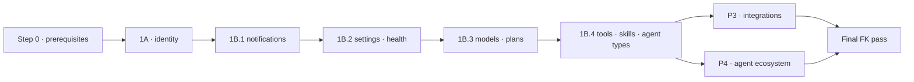

# Identity · Config & Catalog · Integrations · Agent Ecosystem → PostgreSQL — Implementation Plan

> **For agentic workers:** REQUIRED SUB-SKILL: `superpowers:executing-plans` (or `superpowers:subagent-driven-development`). Steps use checkbox (`- [ ]`) syntax. Execute steps **in order**. Each sub-step is independently mergeable and revertable unless it is marked **cutover**.

**Goal:** move roadmap phases **P1A** (identity core), **P1B** (config and catalog leaves), **P3** (integrations) and **P4** (agent ecosystem) off MongoDB/Mongoose and onto the app-owned PostgreSQL (`agentstore`) with Drizzle. This continues after `agents`, `app_data`, `conversation`, `project`, `workspace` and `governance`, which are already live on PG with migrations `0000`–`0020`.

**Roadmap:** `2026-09-18-mongodb-to-postgres-remaining-migration.md` §4 (P1A, P1B, P3, P4).
**Pattern reference:** `2026-09-18-workspace-project-governance-postgres-migration.md`. Same toolkit, same conventions, same Definition of Done (DoD).

**Scope:** 44 collections across 20 modules, plus the removal of every remaining Mongo `User` access.

| Phase | Collections | New PG schema(s) |
|---|---|---|
| P1A | `users`, `sessions`, `auth_providers`, `oauth_states`, `provider_link_tokens`, `user_provider_links`, `roles`, `audit_logs`, `user_groups` (9) | `identity`, `authz` |
| P1B | `notifications`, `health_history`, `system_settings`, `appearance_logos`, `models`, `guardrails_settings`, `plans`, `tools`, `tool_categories`, `skills`, `skill_categories`, `agent_types`, `agent_type_prompts` (13) | `catalog`, `ops` |
| P3 | `connected_app_definitions`, `user_app_connections`, `connected_app_oauth_states`, `connectors`, `connector_categories`, `connector_credentials`, `admin_connector_auth_tokens`, `admin_connector_oauth_states` (8) | `integrations` |
| P4 | `shared_agents`, `teams`, `shared_teams`, `team_auto_builder_config`, `agent_telegram_integrations`, `telegram_chat_bindings`, `telegram_link_codes`, `agent_whatsapp_integrations`, `whatsapp_auth_sessions`, `whatsapp_chat_bindings`, `widget_tokens`, `widget_sessions`, `widget_messages` (13) | `public` (shares), `teams`, `channels` |

---

## Global Constraints

These are inherited unchanged from the previous plan. Everything that was verified during the governance/workspace execution still holds.

- **IDs:** `char(24)`, generated by the application with `newObjectId()` from `@common/postgres`. The DB never generates them and there are no UUIDs.
  - Backfills **preserve** Mongo `_id`s, which are baked into JWT `sub`, Ceph paths, ADK gRPC payloads and already-migrated PG rows.
  - Ids read from requests are validated with `isObjectId` (case-insensitive) and stored via `normalizeObjectId`.
- **Timestamps:** `timestamptz`, default `now()`. Every UPDATE sets `updated_at = now()` explicitly; there are no triggers.
- **Migrations:**
  - Hand-written SQL, continuing from `0021`. **No `drizzle-kit generate`**, because the snapshots are stale.
  - Every migration is additive and idempotent (`IF NOT EXISTS`) and starts with `SET LOCAL lock_timeout = '5s'`.
  - Each one gets an entry in `drizzle/meta/_journal.json`, whose `when` values keep increasing past `1789871000000`.
  - Apply to a scratch DB first, then `agentstore` with `npx ts-node scripts/migrate-postgres.ts`.
- **Mongo data is never deleted.** Mongo collections are frozen at cutover (read-only by convention) and kept as the rollback source. Rollback means reverting the code and restoring the Mongo build. Any PG rows written after cutover are lost on rollback, which is acceptable for a POC.
- **Foreign keys:**
  - FKs inside a schema are created in the migration.
  - Cross-schema FKs go through `scripts/migrate/<phase>-fk.ts` wrappers over `runFkSpecs`. Each is added `NOT VALID` and then validated once its orphan query returns 0.
  - Every FK column gets an index; the `0020` check "FK without index" must stay empty.
  - **Users are never hard-deleted** (the admin controller has no delete route, verified). FKs → `identity.users` therefore use the default NO ACTION.
  - Tables whose `created_by` can hold the system sentinel `000000000000000000000000` (`RESERVED_SYSTEM_OWNER_ID`) get **no** user FK.
- **Transactions:** `withTransaction()` over `AsyncLocalStorage`, where nested calls use savepoints. Repositories resolve their queryable through `get q()`. Every `isUnsupportedTransactionError` / standalone fallback is **deleted**, not ported.
- **TTL:** every Mongo TTL index becomes a `PgTtlSweeper.register(...)` entry in the owning module's `onModuleInit`, and every sweeper column is indexed.
- **Search:** keep Mongo semantics (case-insensitive substring, input escaped) using `ILIKE` + `escapeLike`.
- **Empty arrays:** use drizzle `inArray` (compiles `[]` to `false`). Raw `IN ()` / `= ANY('{}')` must be guarded explicitly.
- **Unique violations:** map to `409` through `isUniqueViolation()` (`@common/postgres/errors`), with the same error codes the Mongo `E11000` handlers raise today.
- **Response contracts do not change.** Mappers reproduce today's `toJSON` output exactly: `id`, no `_id`/`__v`, masked or removed secrets, and `models` exposing `id = modelId`. **Before** touching a service, record its current REST responses as contract fixtures under `test/contracts/<module>/`.
- **Secrets are copied byte-for-byte.**
  - Encrypted strings (`CryptoService` AES-256-GCM `{iv,tag,data}` JSON, rotation-receipt `v1.keyId.iv.tag.ct`) are moved as opaque `text`. They are never decrypted, re-encrypted or trimmed during backfill.
  - The checksum step (`--checksum`) compares them exactly.
  - `ENCRYPTION_KEY` must be identical before and after cutover.
- **Integration tests** run against real PG and use unique ids plus self-cleanup (no `TRUNCATE`). They skip when `POSTGRES_HOST` is unset.
- **Credentials come from env only.** Never write DB credentials into files or plans.

---

## Verified Current State (2026-09-19)

**DB:** `agentstore` has 27 applied migrations (through `0020`) and the schemas `public`, `app_data`, `conversation`, `project`, `workspace`, `governance`. `pg_trgm` is installed; `pg_cron` and `citext` are **not** used.

**Toolkit available** (built in the previous plan, reuse it and do not re-create it):

| Asset | Path |
|---|---|
| `newObjectId`, `isObjectId`, `normalizeObjectId`, `objectId()` column, `jsonbTyped`, `escapeLike`, `pageOf`/`keysetAfter`, `withTransaction`/`resolveQueryable`, `upsertMany`, `isUniqueViolation` | `back/src/common/postgres/*` |
| `PgTtlSweeper` (`register({schema,table,column,batchSize})`) | `back/src/modules/postgres/ttl/pg-ttl-sweeper.service.ts` |
| `UserLookupPort` (`byId`, `byIds`) with a **Mongo** adapter | `back/src/common/ports/user-lookup.port.ts`, `back/src/modules/user/adapters/mongo-user-lookup.adapter.ts` |
| `GovernanceGroupLookupPort` with a **Mongo** adapter | `back/src/modules/governance/persistence/group-lookup.port.ts`, `…/mongo/mongo-group-lookup.adapter.ts` |
| Backfill harness (`runBackfill`, `--dry-run`, `--resume-from`, `--strict`, `--checksum`, orphan report), reconcile, inventory, `runFkSpecs` | `back/scripts/migrate/*` |
| Pool options, SSL, keepalive, checked-out client error handler | `back/src/modules/postgres/pg-pool-options.ts` |

**Coupling facts that shape this plan:**

1. **The user is the hub.**
   - 109 non-spec files import `UserDocument` from `user/schemas/user.schema` (mostly `@CurrentUser() user: UserDocument`).
   - `user.save()` appears **only** inside `user/` (13 sites), so no hydrated document escapes the module.
   - `User` is injected directly by **5** outside modules: `analytics`, `conversation`, `telegram`, `whatsapp`, `system`.
   - There are exactly **20** non-spec `.populate()` calls left, all resolving users or roles:

     | File | Populates |
     |---|---|
     | `admin-user.controller.ts` | roles ×3 |
     | `authorization.service.ts` | roles ×1 |
     | `user-group.service.ts` | members ×4 |
     | `agent-share.service.ts` | ×4 |
     | `team-share.service.ts` | ×4 |
     | `playbook-share.service.ts` | ×3 |

   - Once `users` leaves Mongo, **every one of these returns `null` silently**, so all of them must be replaced in the P1A cutover PR.
2. **Mongo transactions remaining in scope:** only `auth.service.ts:542` (refresh rotation) and `catalog-transfer.service.ts:104` (catalog import across skills + connectors + security).
3. **Aggregations in scope:** only `analytics/user-analytics.service.ts` (3) and `agent-type.service.ts:455` (prompt counts). No `bulkWrite`, no `$lookup`.
4. **Cross-module model injections:**
   - `skill` injects `AgentType`.
   - `humain-agent` injects `AgentType`.
   - `connector` injects `Skill`, `SkillCategory` and the three `connected-app` models.
   - `telegram`, `whatsapp` and `widget-chat` register `SharedAgent` because `AgentPermissionGuard` is instantiated in their scope.
   - `governance` registers `UserGroup`.
5. **Already-PG consumers still writing to Mongo:** `workspace`, `project`, `indexing` and `conversation-v2` call `NotificationsService.sendToUser` (Mongo). They also import `NotificationType` from the Mongoose schema file.
6. **`public.agents` references these domains without FKs:**
   - `agent_type_id` / `agent_type_slug` → `agent_types`
   - `agent_tools.tool_id`, `agent_skills.skill_id`, `agent_disabled_skills.skill_id`
   - `agent_connectors.connector_id`, `agent_connector_actions.connector_id`
   - The cascades are hand-written (`pullToolFromAll`, `pullSkillFromAll`). `pullConnectorFromAll` has **no caller**, so connector deletes leave junction orphans today.
7. **Bugs present today** that this plan fixes as part of the port (flagged ⚑ below):
   - Category deletes leave dangling `categoryId`s.
   - Connector delete does not cascade.
   - Agent delete does not tear down Telegram/WhatsApp/widget integrations.
   - `widget_sessions` uses find-then-create with no duplicate handling.
   - OAuth token refresh has no single-flight.
   - `user_groups.members` is queried with no index.

**Out of scope, flagged for separate decisions:**
- `connector_credentials.authPayload` is **stored in plaintext** today. It is copied as-is here (parity). Encrypting it is a separate, small security change touching `connector-credential.service.ts:31,102` and `connector-auth.service.ts:161`.
- `GET connected-apps/:appKey/callback` is declared by both `connected-app-callback.controller.ts` and `unified-oauth-callback.controller.ts`.
- `connector-playbook-binding-sync.service.ts` keeps writing Mongo `flows` until P5.

---

## Sequencing



| Step | Content | Collections | Size | ~Eng-weeks | Depends on |
|---|---|---|---|---|---|
| 0 | Contract fixtures, inventory, sweeper retention option, `AuthUser` type | — | S | 0.5 | — |
| 1A | Identity core | 9 | L | 3–4 | 0 |
| 1B | Config & catalog (4 sub-steps) | 13 | M | 2–2.5 | 1A |
| 3 | Integrations | 8 | M | 2 | 1B.4 |
| 4 | Agent ecosystem | 13 | M–L | 2.5–3 | 1A, 1B.4 (**not** P3) |
| | **Total** | **43 + `User` decoupling** | | **≈ 10.5–12** | |

**P3 and P4 are independent.** They share no collections, and P4's only link to connectors is through `agents`, which is already on PG. With two engineers, lane 1 = 1A → 1B.1–1B.2 → P4 and lane 2 = 1B.3–1B.4 → P3 (1B.3 can start once 1A lands). Calendar ≈ 6–7 weeks.

**Cutover procedure (identical for every cutover-marked sub-step):**
1. Apply the migration (if it has not been applied already; migrations are additive and safe to run ahead of time).
2. Run the backfill: `--dry-run` → review the reject/orphan report → real run → `--checksum`.
3. Run the FK script.
4. Deploy the new build and start the instances.
5. Run the smoke scenario for the domain (`qa-artifacts/`).

The rollback window is until the first PG write that matters; after that, rolling back loses PG-only writes.

---

# Step 0 — Prerequisites

### Files

- `back/test/contracts/{user,auth,auth-provider,authorization,user-group,notifications,system,models,guardrails,usage,tool,skill,agent-type,connected-app,connector,agent-share,team,telegram,whatsapp,widget-chat}/` — **Create.** Recorded JSON fixtures.
- `back/src/common/auth/auth-user.ts` — **Create.**
- `back/src/modules/postgres/ttl/pg-ttl-sweeper.service.ts` — **Modify.**
- `back/scripts/migrate/inventory.ts` — **Modify** (add collections).

### Tasks

- [x] **0.1** Clean tree on a fresh branch from `nexus-agent`. Full unit suite green (baseline: 442 suites / 3 473 tests).
- [~] **0.2 Contract fixtures.** *(Partially done 2026-09-20.)* Infrastructure committed: `test/contracts/expect-contract.ts` (`expectContract` deep-compares keys/value types; `UPDATE_FIXTURES=1 npm run test:contracts` re-records), npm script `test:contracts`, `test/jest-contracts.json`. Recorded: identity serializer fixtures (user, session, role, audit-log, user-group, auth-provider) and live HTTP envelopes (success, auth-providers, 401, 404) against the Mongo build on :3001. REMAINING: route-per-route recording for the 20 modules — blocked on a recorder account (no admin/seed credentials in back/.env; shared dev DB) — provide credentials or a dump before 1B starts; serializer fixtures for the remaining modules are recorded offline the same way right before each step.
- [x] **0.3 Inventory.** Extend `scripts/migrate/inventory.ts` with the 43 collections and these orphan edges:

  | Source | Target |
  |---|---|
  | `users.roles` | `roles` |
  | `users.planId` | `plans` |
  | `user_groups.members` | `users` |
  | `sessions.userId` | `users` |
  | `user_provider_links.userId` | `users` |
  | `agent_type_prompts.agentType` | `agent_types` |
  | `agent_types.skills` | `skills` |
  | `tools.categoryId` | `tool_categories` |
  | `skills.categoryId` | `skill_categories` |
  | `connectors.categoryId` | `connector_categories` |
  | `connectors.referencedSkillIds` | `skills` |
  | `connector_credentials.connectorId` | `connectors` |
  | `shared_agents.agentId` | PG `public.agents` |
  | `teams.members.agentId` | PG `public.agents` |
  | `teams.members.parentAgentId` | PG `public.agents` |
  | `shared_teams.teamId` | `teams` |
  | `*_integrations.agentId` | PG `public.agents` |
  | `widget_tokens.agentId` | PG `public.agents` |
  | `*_chat_bindings.integrationId` | integrations |
  | `*_chat_bindings.conversationId` | PG `conversation.conversations` |

  Also report:
  - duplicate `lower(email)` in `users`
  - duplicate `(name, createdBy)` in `user_groups`
  - more than one `isDefault:true` in `models`/`plans`
  - more than one `isConversationV2Default:true` in `models`
  - duplicate `members.agentId` within one team
  - duplicate `actions.key` within one connector
  - `skills` with `slug` missing

  Record the counts in the appendix. **They set the batch sizes and decide the three "if duplicates exist" branches below.**
- [x] **0.4 Sweeper retention mode.** Add an optional `olderThan?: string` (a PG interval literal) to `TtlSweepSpec`. When it is set, the predicate becomes `column < now() - $interval::interval` instead of `column <= now()`.
  - This is needed for `audit_logs` (730 days on `created_at`). A generated `expires_at` column is not possible because `timestamptz + interval` is not immutable.
  - Unit-test both predicates.
- [x] **0.5 `AuthUser` type.** Create `common/auth/auth-user.ts`:
  - `AuthUser` = the plain object `JwtStrategy.validate` will return: `_id: string`, `id: string`, `email`, `profile`, `appearance`, `status`, `registrationApproval`, `planId`, `planSlug`, `roles: string[]`, `permissions: string[]`, `roleNames: string[]`, `permissionsVersion`, `emailVerified`, `profileComplete`, `createdAt`.
  - `_id` stays as a **string**. `String(x)`, `x.toString()` and `new Types.ObjectId(x)` all keep working in the remaining Mongo modules.
  - Codemod the 109 `UserDocument` type imports to `AuthUser`. This is type-only, with no runtime change, and it lands **before** 1A so that 1A's diff stays reviewable.
  - Fix whatever `tsc` flags. Expect usages of `.equals()` and of Mongoose document methods; grep shows none outside `user/`.

### DoD
Fixtures are committed. The inventory appendix is filled in. The sweeper retention mode is tested. `tsc -p tsconfig.build.json` is green with `AuthUser`.

---

# Step 1A — Identity core  *(L, cutover)*

**Collections:** `users`, `sessions`, `auth_providers`, `oauth_states`, `provider_link_tokens`, `user_provider_links`, `user_groups` → schema **`identity`**; `roles`, `audit_logs` → schema **`authz`**.

**Data policy:**
- **Backfill:** users, roles, groups (+members), auth providers, provider links, audit logs.
- **Fresh:** sessions, oauth states and provider-link/temp-login tokens. This forces **one re-login for everybody** (announce it).

### Files

- `back/drizzle/0021_identity.sql` — **Create.**
- `back/src/modules/postgres/schema/identity.schema.ts`, `authz.schema.ts` — **Create**, and export them from `schema/index.ts`.
- `back/src/modules/user/persistence/{user.store.ts, pg-user.store.ts, user-record.mapper.ts}` — **Create.**
- `back/src/modules/user/adapters/pg-user-lookup.adapter.ts` — **Create.** Delete the Mongo adapter at cutover.
- `back/src/modules/auth/persistence/{session.store.ts, pg-session.store.ts}` — **Create.**
- `back/src/modules/auth-provider/persistence/{auth-provider.store.ts, pg-*.ts}` — **Create.** Covers 4 tables.
- `back/src/modules/authorization/persistence/{role.store.ts, audit-log.store.ts, pg-*.ts}` — **Create.**
- `back/src/modules/user-group/persistence/{user-group.store.ts, pg-user-group.store.ts}` — **Create.**
- `back/src/modules/governance/persistence/postgres/pg-group-lookup.adapter.ts` — **Create.** Delete `mongo/mongo-group-lookup.adapter.ts`.
- `back/scripts/migrate/2026-10-identity.ts`, `2026-10-identity-fk.ts` — **Create.**
- `back/scripts/create-admin.ts` — **Create.** It replaces the repo-root `create_admin.js`, which is deleted.
- **Modify:**
  - Services: `user.service.ts`, `registration-approval.service.ts`, `admin-user.controller.ts`, `auth.service.ts`, `jwt.strategy.ts`, `oauth-flow.service.ts`, `auth-provider.service.ts`, `provider-link.service.ts`, `auth-provider-health.service.ts`, `authorization.service.ts`, `audit-log.service.ts`, `user-group.service.ts`.
  - The 5 outside `User` injectors.
  - The 3 share services with user populates.

### DDL — `0021_identity.sql`

```sql
SET LOCAL lock_timeout = '5s';
CREATE SCHEMA IF NOT EXISTS identity;
CREATE SCHEMA IF NOT EXISTS authz;

CREATE TABLE IF NOT EXISTS identity.users (
  id                                char(24)     PRIMARY KEY,
  email                             varchar(320) NOT NULL CHECK (email = lower(btrim(email))),
  password_hash                     text         NOT NULL,
  email_verified                    boolean      NOT NULL DEFAULT false,
  email_verification_token          text,
  email_verification_expiry         timestamptz,
  password_reset_token              text,
  password_reset_expiry             timestamptz,
  first_name                        varchar(100),
  last_name                         varchar(100),
  company                           varchar(200),
  profile_role                      varchar(200) NOT NULL DEFAULT '',
  description                       varchar(1000) NOT NULL DEFAULT '',
  color_theme                       varchar(16)  NOT NULL DEFAULT 'default'
                                    CHECK (color_theme IN ('default','yellow','orange','blue')),
  language                          varchar(16)  NOT NULL DEFAULT 'en',
  consent_privacy_policy            boolean      NOT NULL DEFAULT false,
  consent_privacy_policy_accepted_at timestamptz,
  consent_data_sharing              boolean      NOT NULL DEFAULT false,
  consent_data_sharing_accepted_at  timestamptz,
  profile_complete                  boolean      NOT NULL DEFAULT false,
  microsoft_account_id              varchar(255),
  plan_id                           char(24),              -- FK → catalog.plans added in 1B.3
  plan_slug                         varchar(50),
  plan_started_at                   timestamptz,
  permissions_version               integer      NOT NULL DEFAULT 1,
  status                            varchar(16)  NOT NULL DEFAULT 'active'
                                    CHECK (status IN ('active','inactive','suspended')),
  registration_approval             varchar(16)  CHECK (registration_approval IN ('pending','approved','rejected')),
  last_login_at                     timestamptz,
  created_at                        timestamptz  NOT NULL DEFAULT now(),
  updated_at                        timestamptz  NOT NULL DEFAULT now()
);
CREATE UNIQUE INDEX IF NOT EXISTS uq_users_email              ON identity.users (email);
CREATE INDEX IF NOT EXISTS idx_users_microsoft_account        ON identity.users (microsoft_account_id) WHERE microsoft_account_id IS NOT NULL;
CREATE INDEX IF NOT EXISTS idx_users_plan                     ON identity.users (plan_id);
CREATE INDEX IF NOT EXISTS idx_users_status                   ON identity.users (status);
CREATE INDEX IF NOT EXISTS idx_users_created                  ON identity.users (created_at DESC);
CREATE INDEX IF NOT EXISTS idx_users_email_verification_token ON identity.users (email_verification_token) WHERE email_verification_token IS NOT NULL;
CREATE INDEX IF NOT EXISTS idx_users_password_reset_token     ON identity.users (password_reset_token)     WHERE password_reset_token IS NOT NULL;
CREATE INDEX IF NOT EXISTS idx_users_email_trgm               ON identity.users USING gin (email gin_trgm_ops);
CREATE INDEX IF NOT EXISTS idx_users_first_name_trgm          ON identity.users USING gin (first_name gin_trgm_ops);
CREATE INDEX IF NOT EXISTS idx_users_last_name_trgm           ON identity.users USING gin (last_name gin_trgm_ops);

CREATE TABLE IF NOT EXISTS authz.roles (
  id          char(24)     PRIMARY KEY,
  name        varchar(100) NOT NULL CHECK (name = lower(btrim(name))),
  description text         NOT NULL,
  permissions text[]       NOT NULL DEFAULT '{}',
  is_active   boolean      NOT NULL DEFAULT true,
  is_system   boolean      NOT NULL DEFAULT false,
  priority    integer      NOT NULL DEFAULT 0,
  created_at  timestamptz  NOT NULL DEFAULT now(),
  updated_at  timestamptz  NOT NULL DEFAULT now()
);
CREATE UNIQUE INDEX IF NOT EXISTS uq_roles_name     ON authz.roles (name);
CREATE INDEX IF NOT EXISTS idx_roles_active         ON authz.roles (is_active);
CREATE INDEX IF NOT EXISTS idx_roles_priority       ON authz.roles (priority DESC);

-- users.roles[] → junction; position keeps the array order (roleNames claim order).
CREATE TABLE IF NOT EXISTS identity.user_roles (
  user_id  char(24) NOT NULL REFERENCES identity.users(id) ON DELETE CASCADE,
  role_id  char(24) NOT NULL REFERENCES authz.roles(id)    ON DELETE CASCADE,
  position smallint NOT NULL DEFAULT 0,
  PRIMARY KEY (user_id, role_id)
);
CREATE INDEX IF NOT EXISTS idx_user_roles_role ON identity.user_roles (role_id);

CREATE TABLE IF NOT EXISTS identity.sessions (
  id                          char(24)    PRIMARY KEY,
  user_id                     char(24)    NOT NULL REFERENCES identity.users(id) ON DELETE CASCADE,
  refresh_token_hash          text        NOT NULL,
  device_info                 jsonb       NOT NULL,
  ip_address                  varchar(64) NOT NULL,
  is_valid                    boolean     NOT NULL DEFAULT true,
  expires_at                  timestamptz NOT NULL,
  last_activity_at            timestamptz,
  token_family                varchar(64) NOT NULL,
  rotated_from_session_id     char(24),
  rotated_to_session_id       char(24),
  rotation_attempt_id         varchar(128),
  rotated_at                  timestamptz,
  rotation_receipt_expires_at timestamptz,
  rotation_receipt_ciphertext text,
  rotation_receipt_key_id     varchar(64),
  created_at                  timestamptz NOT NULL DEFAULT now(),
  updated_at                  timestamptz NOT NULL DEFAULT now()
);
CREATE INDEX IF NOT EXISTS idx_sessions_user_valid        ON identity.sessions (user_id, is_valid);
CREATE INDEX IF NOT EXISTS idx_sessions_user_ip           ON identity.sessions (user_id, ip_address);
CREATE INDEX IF NOT EXISTS idx_sessions_expires           ON identity.sessions (expires_at);
CREATE INDEX IF NOT EXISTS idx_sessions_token_family      ON identity.sessions (token_family);
CREATE UNIQUE INDEX IF NOT EXISTS uq_sessions_rotated_from ON identity.sessions (rotated_from_session_id) WHERE rotated_from_session_id IS NOT NULL;

CREATE TABLE IF NOT EXISTS identity.auth_providers (
  id                char(24)     PRIMARY KEY,
  provider_key      varchar(50)  NOT NULL CHECK (provider_key = lower(btrim(provider_key))),
  display_name      varchar(100) NOT NULL,
  client_id         text         NOT NULL,   -- CryptoService ciphertext, opaque
  client_secret     text         NOT NULL,   -- CryptoService ciphertext, opaque
  tenant_id         text,                    -- CryptoService ciphertext, opaque
  authorization_url text         NOT NULL,
  token_url         text         NOT NULL,
  userinfo_url      text         NOT NULL,
  scopes            text[]       NOT NULL DEFAULT '{openid,email,profile}',
  icon_key          varchar(50),
  sort_order        integer      NOT NULL DEFAULT 0,
  pkce_enabled      boolean      NOT NULL DEFAULT true,
  enabled           boolean      NOT NULL DEFAULT true,
  created_at        timestamptz  NOT NULL DEFAULT now(),
  updated_at        timestamptz  NOT NULL DEFAULT now()
);
CREATE UNIQUE INDEX IF NOT EXISTS uq_auth_providers_key   ON identity.auth_providers (provider_key);
CREATE INDEX IF NOT EXISTS idx_auth_providers_enabled_sort ON identity.auth_providers (enabled, sort_order);

CREATE TABLE IF NOT EXISTS identity.oauth_states (
  id            char(24)    PRIMARY KEY,
  state         varchar(256) NOT NULL,
  provider_key  varchar(50) NOT NULL,
  code_verifier text,
  return_url    text,
  expires_at    timestamptz NOT NULL,
  created_at    timestamptz NOT NULL DEFAULT now(),
  updated_at    timestamptz NOT NULL DEFAULT now()
);
CREATE UNIQUE INDEX IF NOT EXISTS uq_oauth_states_state ON identity.oauth_states (state);
CREATE INDEX IF NOT EXISTS idx_oauth_states_expires     ON identity.oauth_states (expires_at);

-- Also holds temp-login tokens (sentinel provider_key '__temp_login__').
CREATE TABLE IF NOT EXISTS identity.provider_link_tokens (
  id               char(24)     PRIMARY KEY,
  token            varchar(256) NOT NULL,
  user_id          char(24)     NOT NULL REFERENCES identity.users(id) ON DELETE CASCADE,
  provider_key     varchar(50)  NOT NULL,
  provider_user_id varchar(255) NOT NULL,
  provider_email   varchar(320) NOT NULL,
  expires_at       timestamptz  NOT NULL,
  created_at       timestamptz  NOT NULL DEFAULT now(),
  updated_at       timestamptz  NOT NULL DEFAULT now()
);
CREATE UNIQUE INDEX IF NOT EXISTS uq_provider_link_tokens_token ON identity.provider_link_tokens (token);
CREATE INDEX IF NOT EXISTS idx_provider_link_tokens_user        ON identity.provider_link_tokens (user_id);
CREATE INDEX IF NOT EXISTS idx_provider_link_tokens_expires     ON identity.provider_link_tokens (expires_at);

CREATE TABLE IF NOT EXISTS identity.user_provider_links (
  id               char(24)     PRIMARY KEY,
  user_id          char(24)     NOT NULL REFERENCES identity.users(id) ON DELETE CASCADE,
  provider_key     varchar(50)  NOT NULL,
  provider_user_id varchar(255) NOT NULL,
  provider_email   varchar(320) NOT NULL,
  linked_at        timestamptz  NOT NULL DEFAULT now(),
  created_at       timestamptz  NOT NULL DEFAULT now(),
  updated_at       timestamptz  NOT NULL DEFAULT now()
);
CREATE UNIQUE INDEX IF NOT EXISTS uq_user_provider_links_provider ON identity.user_provider_links (provider_key, provider_user_id);
CREATE INDEX IF NOT EXISTS idx_user_provider_links_user           ON identity.user_provider_links (user_id);

-- Audit history: actor_id deliberately has NO FK (same rule as governance events).
CREATE TABLE IF NOT EXISTS authz.audit_logs (
  id             char(24)    PRIMARY KEY,
  actor_id       char(24)    NOT NULL,
  actor_email    varchar(320) NOT NULL,
  action         varchar(128) NOT NULL,
  target_id      char(24),
  target_type    varchar(64),
  metadata       jsonb,
  ip_address     varchar(64),
  user_agent     text,
  status         varchar(16) NOT NULL CHECK (status IN ('success','failure')),
  failure_reason text,
  created_at     timestamptz NOT NULL DEFAULT now()
);
CREATE INDEX IF NOT EXISTS idx_audit_logs_created       ON authz.audit_logs (created_at DESC);
CREATE INDEX IF NOT EXISTS idx_audit_logs_actor_created ON authz.audit_logs (actor_id, created_at DESC);
CREATE INDEX IF NOT EXISTS idx_audit_logs_action_created ON authz.audit_logs (action, created_at DESC);
CREATE INDEX IF NOT EXISTS idx_audit_logs_target        ON authz.audit_logs (target_type, target_id, created_at DESC);
CREATE INDEX IF NOT EXISTS idx_audit_logs_status        ON authz.audit_logs (status);
CREATE INDEX IF NOT EXISTS idx_audit_logs_actor_email_trgm ON authz.audit_logs USING gin (actor_email gin_trgm_ops);

CREATE TABLE IF NOT EXISTS identity.user_groups (
  id          char(24)      PRIMARY KEY,
  name        varchar(100)  NOT NULL CHECK (char_length(name) >= 2),
  description varchar(2000) NOT NULL DEFAULT '',
  created_by  char(24)      NOT NULL REFERENCES identity.users(id),
  created_at  timestamptz   NOT NULL DEFAULT now(),
  updated_at  timestamptz   NOT NULL DEFAULT now()
);
CREATE UNIQUE INDEX IF NOT EXISTS uq_user_groups_owner_name ON identity.user_groups (name, created_by);  -- case-sensitive, as Mongo
CREATE INDEX IF NOT EXISTS idx_user_groups_created_by       ON identity.user_groups (created_by);

CREATE TABLE IF NOT EXISTS identity.user_group_members (
  group_id char(24) NOT NULL REFERENCES identity.user_groups(id) ON DELETE CASCADE,
  user_id  char(24) NOT NULL REFERENCES identity.users(id)       ON DELETE CASCADE,
  position integer  NOT NULL DEFAULT 0,
  PRIMARY KEY (group_id, user_id)
);
CREATE INDEX IF NOT EXISTS idx_user_group_members_user ON identity.user_group_members (user_id);  -- ⚑ missing in Mongo
```

### Tasks

**Stores and persistence (refactor first: Mongo implementations behind ports, no behavior change)**

- [x] **1A.1**** Introduce the store ports listed below, each with Mongo and PG implementations (same pattern as workspace D.5/D.6):

  | Port | Methods |
  |---|---|
  | `UserStore` | `findById`, `findByIds`, `findByEmail`, `findByEmails`, `findByVerificationToken`, `findByResetTokenHash`, `findByMicrosoftAccountId`, `create`, `update(id, patch)`, `search(q, limit)`, `listAdmin(filter, page)`, `countByStatus`, `findActiveByRole(roleId)`, `setColorThemeForAll(theme)`, `addRole`, `removeRole`, `removeRoleFromAll`, `bumpPermissionsVersion` |
  | `SessionStore` | *(no methods listed)* |
  | `AuthProviderStore` | *(no methods listed)* |
  | `OAuthStateStore` | *(no methods listed)* |
  | `ProviderLinkTokenStore` | *(no methods listed)* |
  | `UserProviderLinkStore` | *(no methods listed)* |
  | `RoleStore` | *(no methods listed)* |
  | `AuditLogStore` | *(no methods listed)* |
  | `UserGroupStore` | *(no methods listed)* |

  - Services stop using `Model<…>` directly.
  - **`user.save()` (13 sites) becomes `userStore.update(id, patch)`**, with an explicit patch per call site. Do not port a generic "save whole doc".
- [x] **1A.2** Role mutations become atomic.**
  - `authorization.service.ts:134/180/189` (`$pull`/`$addToSet roles` + `$inc permissionsVersion`) become one `withTransaction`: an `INSERT … ON CONFLICT DO NOTHING` or `DELETE` on `user_roles`, then `UPDATE users SET permissions_version = permissions_version + 1, updated_at = now()`.
  - Role delete runs `DELETE roles` (the junction cascades) plus `UPDATE users SET permissions_version = permissions_version + 1 WHERE id IN (SELECT user_id … captured before delete)`, all in one transaction.
- [x] **1A.3** Refresh rotation** (`auth.service.ts:542-618`):
  - `performAtomicRotation` becomes `withTransaction` with a conditional claim: `UPDATE identity.sessions SET is_valid=false, rotated_to_session_id=$new, rotation_attempt_id=$a, rotated_at=now(), rotation_receipt_* = … WHERE id=$old AND is_valid RETURNING *`, followed by `INSERT` of the successor.
  - A unique violation on `uq_sessions_rotated_from` means a concurrent rotation won; take the existing receipt path.
  - **Delete** `performStandaloneRotation` and `isUnsupportedTransactionError` (`auth/utils/rotation-errors.ts`).
  - Keep `auth.service.rotation.spec.ts` green by retargeting its mocks to the `SessionStore`.
- [x] **1A.4** Session bulk invalidations:**
  - Family reuse, logout-all and max-sessions (`auth.service.ts:890/920/941`) become single `UPDATE … SET is_valid=false`.
  - The max-sessions cap uses `… WHERE id IN (SELECT id FROM identity.sessions WHERE user_id=$1 AND is_valid ORDER BY created_at DESC OFFSET $max FOR UPDATE SKIP LOCKED)`.
- [x] **1A.5** OAuth one-shot consumption.** `findOneAndDelete` at `oauth-flow.service.ts:118/173/216` becomes `DELETE … WHERE state=$1 RETURNING *` (and likewise for tokens). Also add `AND expires_at > now()`, which makes the Mongo TTL granularity (≤ 60 s) strict. The behavior change is safe.
- [x] **1A.6** Sweeper registrations:**
  - `identity.sessions.expires_at`, `identity.oauth_states.expires_at`, `identity.provider_link_tokens.expires_at`.
  - `authz.audit_logs.created_at` with `olderThan: '730 days'` (Step 0.4).
- [x] **1A.7** Search:**
  - `user.service.ts:506` and `admin-user.controller.ts:80` → `ILIKE '%'||escapeLike(q)||'%'` on `email`, `first_name`, `last_name`, preserving the `status='active'` filter in `searchUsers`.
  - `audit-log.service.ts:71/78` → `actor_email ILIKE`, and `action ILIKE 'feature.%'`.
  - `distinct(action)` → `SELECT DISTINCT action`.
- [x] **1A.8** Mapper** `user-record.mapper.ts`:
  - Rebuilds `profile`, `appearance` and `consents` as nested objects.
  - Rebuilds `fullName` exactly as the virtual does (`user.schema.ts:164`).
  - `roles` are ids ordered by `position`.
  - `toJSON` parity: `id` is present, and `passwordHash`/tokens are never emitted.
  - Separate `toAuthUser()` (Step 0.5) and `toSummary()` (`UserLookupPort`).
  - Contract test against the fixtures from 0.2.

**Replace every Mongo `User` access outside the module (all in the cutover PR)**

- [x] **1A.9**** Extend `UserLookupPort` with `byEmails(emails): Map<email, UserSummary>`. Add `PgUserLookupAdapter`, bound under `USER_LOOKUP_PORT` in `user.module.ts`.
- [x] **1A.10**** Rewrite the outside injectors:

  | File | Change |
  |---|---|
  | `conversation.service.ts:364,784` | `UserService.findById` |
  | `conversation.service.ts:646` | `byEmails` |
  | `conversation.service.ts:740` | `byIds` |
  | `telegram-webhook.service.ts:112` | `UserService.findById` (status/email) |
  | `whatsapp-message.service.ts:69` | `UserService.findById` (status/email) |
  | `system.service.ts:625` | `UserService.resetColorThemeForAll(theme)` |
  | `analytics/services/user-analytics.service.ts` | SQL: `count(*) FILTER (WHERE consent_data_sharing)`, `GROUP BY to_char(created_at,'YYYY-MM-DD')`, `GROUP BY email_verified`, `GROUP BY profile_complete` |

  - Then remove `User` from the `forFeature` lists of `analytics`, `telegram`, `whatsapp`, `system`, and from the `UserModule` export.
  - Update `whatsapp-message.service.spec.ts:98`.
- [x] **1A.11**** Replace the populates:

  | File | Populates | Replacement |
  |---|---|---|
  | `admin-user.controller.ts` | roles ×3 | `LEFT JOIN user_roles/roles` in `UserStore.listAdmin` / `findByIdWithRoles` |
  | `authorization.service.ts:200` | roles ×1 | join |
  | `user-group.service.ts` | members ×4 | join on `user_group_members` + `users`, producing `{_id,email,profile:{firstName,lastName}}` |
  | `agent-share.service.ts` | ×4 | `UserLookupPort.byIds` over `sharedWith`/`sharedBy`; the mapper produces `{ _id, email, profile }` exactly as populate did (the collections themselves stay Mongo until P4) |
  | `team-share.service.ts` | ×4 | same as `agent-share.service.ts` |
  | `playbook-share.service.ts` | ×3 | same as `agent-share.service.ts` |

  **Guard:** add a jest test (`test/guards/no-user-populate.spec.ts`) that greps `src/**/*.ts` and fails on `populate('sharedWith'|'sharedBy'|'members'|'roles'`, or on any `@InjectModel(User.name)`.
- [x] **1A.12** Groups.**
  - `GROUP_LOOKUP_PORT` → `PgGroupLookupAdapter` (join on members).
  - Remove the `UserGroup` `forFeature` from `pg-governance-persistence.module.ts:36`.
  - `UserGroupService.findGroupIdsForMember` / `findOwnedGroupsByIds` stay the public API (governance calls them), and become PG-backed.
  - `$addToSet`/`$pull members` become `INSERT … ON CONFLICT DO NOTHING` / `DELETE`.
  - `position` = `coalesce(max(position), -1) + 1` in the same statement.
- [x] **1A.13** JWT strategy.**
  - `jwt.strategy.ts` returns `toAuthUser(row)` merged with the claims (`permissions`, `roleNames`, `permissionsVersion`).
  - The per-request `isSessionValid` + `findById` become two PK lookups. Collapse them into one query: `SELECT u.*, s.is_valid FROM identity.sessions s JOIN identity.users u ON u.id = s.user_id WHERE s.id = $1`.
  - Transient PG errors still map to 503 (`transient-connection-error.ts` patterns).
- [x] **1A.14** Seeds.**
  - `seedDefaultRoles()` becomes `INSERT … ON CONFLICT (name) DO NOTHING`.
  - `create_admin.js` → `scripts/create-admin.ts`. It reads email, password and role from argv/env, hashes with bcrypt(12), and upserts the user plus the `super_admin` role link. **No hard-coded hash or ids.**
- [x] **1A.15** Role cache.** Keep the 5-minute in-process cache as it is. Note in `authorization/README.md` that cross-instance invalidation is still TTL-bound, which is unchanged from today.

**Backfill and cutover**

- [x] **1A.16**** Write `scripts/migrate/2026-10-identity.ts` on `runBackfill`, one unit per collection, ordered: roles → users (+`user_roles`) → user_groups (+members) → auth_providers → user_provider_links → audit_logs.
  - **Users:**
    - `email.trim().toLowerCase()`. A duplicate after lowercasing is a **reject** (reported, not merged); resolve it manually before `--strict`.
    - Copy `passwordHash`, `emailVerificationToken`, `passwordResetToken` byte-for-byte.
    - Missing `profile.role`/`description` → `''`.
    - `roles[]` → `user_roles` with `position` = array index. Drop unknown role ids and list them in the orphan report.
  - **Groups:** a `members` entry referencing a missing user is dropped and reported. Duplicate members are de-duplicated (first wins).
  - **auth_providers:** copy `clientId`/`clientSecret`/`tenantId` ciphertext unchanged; `--checksum` covers them.
  - **audit_logs:** skip rows older than 730 days (the TTL would have removed them). Batch size 5 000.
  - **Not copied:** sessions, oauth_states, provider_link_tokens.
- [x] **1A.17**** `2026-10-identity-fk.ts`: no cross-schema FKs are needed in this step (identity↔authz is created in the migration because both schemas land together). Include only the orphan report for `users.plan_id`, whose FK is added in 1B.3.
- [x] **1A.18 Cutover** (procedure above): *(completed 2026-09-20 on the dev stack: 0021 applied to agentstore; delta backfill re-run converged; bindings flipped to Pg\*; backend restarted on PG and live smoke passed — register(inactive/pending) → verify-email → admin approve → login → rotate → successor access → reuse detection (family invalidation; receipts disabled in this env, so replay dead-ends per policy) → admin users/roles list → group CRUD with PG member join → atomic role assignment (junction+version) → analytics SQL. Mongo collections frozen as rollback source; forced re-login is in effect since sessions start fresh on PG.)*
  - Announce the forced re-login.
  - Smoke test covers:
    - classic register → approval → login → refresh → rotation reuse detection
    - OAuth login and provider link
    - temp-login token
    - admin user list/search/role assign
    - group CRUD + governance audience resolution
    - analytics dashboard
    - Telegram/WhatsApp inbound (user status check)

### DoD
- The standard DoD (roadmap §4) is met.
- No `@InjectModel(User.name | Session.name | Role.name | AuditLog.name | UserGroup.name | AuthProvider.name | …)` remains in `src`.
- The `no-user-populate` guard is green.
- `auth.service.rotation.spec.ts` passes on the PG store.
- The identity integration suite covers the concurrent rotation race (two parallel refreshes → exactly one successor).

---

# Step 1B — Config & catalog leaves  *(M, 4 cutovers)*

**Schemas:**
- **`catalog`**: settings, models, guardrails, plans, tools, skills, agent types.
- **`ops`**: notifications, health history.

**Data policy:** backfill everything except `health_history` (fresh).

Each sub-step below is a separate cutover. They are ordered by what unblocks others.

### Files (all sub-steps)

- `back/drizzle/0022_catalog_ops.sql` — **Create.** All DDL for 1B, applied once, before 1B.1.
- `back/src/modules/postgres/schema/{catalog,ops}.schema.ts` — **Create.**
- Per module: `persistence/{*.store.ts, pg-*.store.ts, *.mapper.ts}` in `notifications`, `health`, `system`, `guardrails`, `models`, `usage`, `tool`, `skill`, `agent-type`.
- `back/src/modules/notifications/notification.types.ts` — **Create** (enums moved out of the Mongoose schema).
- `back/scripts/migrate/2026-10-catalog.ts` (units selectable with `--only=<unit>`) and `2026-10-catalog-fk.ts` — **Create.**
- `back/scripts/seed/catalog-tools.ts` — **Create.** It replaces the four `scripts/migrations/2026-0{7,8}-*-seed-*-tool.ts` scripts, which are then deleted.

### DDL — `0022_catalog_ops.sql`

```sql
SET LOCAL lock_timeout = '5s';
CREATE SCHEMA IF NOT EXISTS catalog;
CREATE SCHEMA IF NOT EXISTS ops;

-- ── ops ───────────────────────────────────────────────────────────────
CREATE TABLE IF NOT EXISTS ops.notifications (
  id            char(24)     PRIMARY KEY,
  user_id       char(24),
  type          varchar(16)  NOT NULL CHECK (type IN ('info','warning','error','success','system')),
  title         varchar(200) NOT NULL,
  message       varchar(2000) NOT NULL,
  data          jsonb,
  actions       jsonb        NOT NULL DEFAULT '[]',
  destination   varchar(64)  NOT NULL DEFAULT 'user',
  status        varchar(16)  NOT NULL DEFAULT 'pending' CHECK (status IN ('pending','sent','failed','read')),
  source_module varchar(100) NOT NULL,
  priority      varchar(16)  NOT NULL DEFAULT 'normal' CHECK (priority IN ('low','normal','high','urgent')),
  expires_at    timestamptz,
  metadata_extra jsonb,
  sent_at       timestamptz,
  read_at       timestamptz,
  retry_count   integer      NOT NULL DEFAULT 0,
  last_error    text,
  created_at    timestamptz  NOT NULL DEFAULT now(),
  updated_at    timestamptz  NOT NULL DEFAULT now()
);
CREATE INDEX IF NOT EXISTS idx_notifications_user_status_created ON ops.notifications (user_id, status, created_at DESC);
CREATE INDEX IF NOT EXISTS idx_notifications_destination_status  ON ops.notifications (destination, status);
CREATE INDEX IF NOT EXISTS idx_notifications_expires             ON ops.notifications (expires_at) WHERE expires_at IS NOT NULL;
CREATE INDEX IF NOT EXISTS idx_notifications_created             ON ops.notifications (created_at DESC);
CREATE INDEX IF NOT EXISTS idx_notifications_status_retry        ON ops.notifications (status, retry_count);

CREATE TABLE IF NOT EXISTS ops.health_history (
  id          char(24)    PRIMARY KEY,
  status      varchar(16) NOT NULL CHECK (status IN ('healthy','unhealthy','degraded')),
  timestamp   varchar(64) NOT NULL,
  version     varchar(64) NOT NULL,
  uptime      double precision NOT NULL,
  checks      jsonb       NOT NULL DEFAULT '{}',
  recorded_at timestamptz NOT NULL DEFAULT now(),
  expire_at   timestamptz NOT NULL
);
CREATE INDEX IF NOT EXISTS idx_health_history_recorded        ON ops.health_history (recorded_at DESC);
CREATE INDEX IF NOT EXISTS idx_health_history_status_recorded ON ops.health_history (status, recorded_at DESC);
CREATE INDEX IF NOT EXISTS idx_health_history_expire          ON ops.health_history (expire_at);

-- ── catalog: settings ─────────────────────────────────────────────────
CREATE TABLE IF NOT EXISTS catalog.system_settings (
  id         char(24)     PRIMARY KEY,
  key        varchar(100) NOT NULL,
  value      jsonb        NOT NULL,
  created_at timestamptz  NOT NULL DEFAULT now(),
  updated_at timestamptz  NOT NULL DEFAULT now()
);
CREATE UNIQUE INDEX IF NOT EXISTS uq_system_settings_key ON catalog.system_settings (key);

CREATE TABLE IF NOT EXISTS catalog.appearance_logos (
  id           char(24)    PRIMARY KEY,
  name         varchar(80) NOT NULL,
  content_type varchar(64) NOT NULL,
  width        integer     NOT NULL,
  height       integer     NOT NULL,
  data         bytea       NOT NULL,
  created_at   timestamptz NOT NULL DEFAULT now(),
  updated_at   timestamptz NOT NULL DEFAULT now()
);

CREATE TABLE IF NOT EXISTS catalog.guardrails_settings (
  id                 char(24)    PRIMARY KEY,
  singleton          boolean     NOT NULL DEFAULT true CHECK (singleton),
  force_activation   boolean     NOT NULL DEFAULT false,
  prompt_injection   jsonb       NOT NULL DEFAULT '{}',
  tool_action_review jsonb       NOT NULL DEFAULT '{}',
  created_at         timestamptz NOT NULL DEFAULT now(),
  updated_at         timestamptz NOT NULL DEFAULT now()
);
CREATE UNIQUE INDEX IF NOT EXISTS uq_guardrails_settings_singleton ON catalog.guardrails_settings (singleton);

-- ── catalog: models & plans ───────────────────────────────────────────
CREATE TABLE IF NOT EXISTS catalog.ai_models (
  id                           char(24)     PRIMARY KEY,
  model_id                     varchar(255) NOT NULL,
  name                         varchar(255) NOT NULL,
  chef                         varchar(255) NOT NULL,
  chef_slug                    varchar(255) NOT NULL,
  litellm_model                varchar(255) NOT NULL DEFAULT '',
  providers                    text[]       NOT NULL DEFAULT '{}',
  type                         varchar(64)  NOT NULL DEFAULT '',
  types                        text[]       NOT NULL DEFAULT '{}',
  is_active                    boolean      NOT NULL DEFAULT true,
  is_default                   boolean      NOT NULL DEFAULT false,
  is_conversation_v2_default   boolean      NOT NULL DEFAULT false,
  omit_temperature             boolean      NOT NULL DEFAULT false,
  input_modalities             text[]       NOT NULL DEFAULT '{text}',
  max_input_tokens             integer,
  max_output_tokens            integer,
  input_cost_per_token         double precision,
  output_cost_per_token        double precision,
  cached_input_cost_per_token  double precision,
  supports_reasoning           boolean,
  reasoning_efforts            jsonb        NOT NULL DEFAULT '[]',
  default_reasoning_effort     varchar(64),
  created_at                   timestamptz  NOT NULL DEFAULT now(),
  updated_at                   timestamptz  NOT NULL DEFAULT now()
);
CREATE UNIQUE INDEX IF NOT EXISTS uq_ai_models_model_id        ON catalog.ai_models (model_id);
CREATE INDEX IF NOT EXISTS idx_ai_models_chef_active           ON catalog.ai_models (chef_slug, is_active);
CREATE INDEX IF NOT EXISTS idx_ai_models_type_active           ON catalog.ai_models (type, is_active);
CREATE INDEX IF NOT EXISTS idx_ai_models_types                 ON catalog.ai_models USING gin (types);
CREATE UNIQUE INDEX IF NOT EXISTS uq_ai_models_single_default  ON catalog.ai_models (is_default) WHERE is_default;              -- ⚑ was app-enforced only
CREATE UNIQUE INDEX IF NOT EXISTS uq_ai_models_single_v2_default ON catalog.ai_models (is_conversation_v2_default) WHERE is_conversation_v2_default;

CREATE TABLE IF NOT EXISTS catalog.plans (
  id                      char(24)     PRIMARY KEY,
  name                    varchar(100) NOT NULL,
  slug                    varchar(50)  NOT NULL CHECK (slug = lower(btrim(slug))),
  description             varchar(500),
  token_limit             bigint       NOT NULL DEFAULT 0,        -- -1 = unlimited
  window_hours            integer      NOT NULL DEFAULT 24 CHECK (window_hours >= 1),
  requests_per_minute     integer      NOT NULL DEFAULT 60,
  max_tokens_per_request  bigint       NOT NULL DEFAULT -1,
  features                text[]       NOT NULL DEFAULT '{}',
  priority                integer      NOT NULL DEFAULT 0,
  price_monthly           numeric(12,2) NOT NULL DEFAULT 0,
  price_yearly            numeric(12,2) NOT NULL DEFAULT 0,
  currency                varchar(3)   NOT NULL DEFAULT 'USD',
  is_active               boolean      NOT NULL DEFAULT true,
  is_default              boolean      NOT NULL DEFAULT false,
  display_order           integer      NOT NULL DEFAULT 0,
  max_workspaces          integer      NOT NULL DEFAULT 3,
  workspace_storage_bytes bigint       NOT NULL DEFAULT 104857600,
  metadata                jsonb        NOT NULL DEFAULT '{}',
  created_at              timestamptz  NOT NULL DEFAULT now(),
  updated_at              timestamptz  NOT NULL DEFAULT now()
);
CREATE UNIQUE INDEX IF NOT EXISTS uq_plans_name           ON catalog.plans (name);
CREATE UNIQUE INDEX IF NOT EXISTS uq_plans_slug           ON catalog.plans (slug);
CREATE INDEX IF NOT EXISTS idx_plans_active_order         ON catalog.plans (is_active, display_order);
CREATE INDEX IF NOT EXISTS idx_plans_priority             ON catalog.plans (priority);
CREATE UNIQUE INDEX IF NOT EXISTS uq_plans_single_default ON catalog.plans (is_default) WHERE is_default;

-- ── catalog: tools / skills / agent types ─────────────────────────────
CREATE TABLE IF NOT EXISTS catalog.tool_categories (
  id          char(24)      PRIMARY KEY,
  name        varchar(128)  NOT NULL,
  description varchar(1024) NOT NULL DEFAULT '',
  created_at  timestamptz   NOT NULL DEFAULT now(),
  updated_at  timestamptz   NOT NULL DEFAULT now()
);
CREATE UNIQUE INDEX IF NOT EXISTS uq_tool_categories_name ON catalog.tool_categories (name);

CREATE TABLE IF NOT EXISTS catalog.tools (
  id                  char(24)     PRIMARY KEY,
  name                varchar(255) NOT NULL,
  description         text         NOT NULL DEFAULT '',
  icon                varchar(64)  NOT NULL DEFAULT '',
  color               varchar(64)  NOT NULL DEFAULT '',
  icon_color          varchar(8)   CHECK (icon_color IN ('light','dark')),
  category_id         char(24)     REFERENCES catalog.tool_categories(id) ON DELETE SET NULL,  -- ⚑ was left dangling
  default_agent_types text[]       NOT NULL DEFAULT '{}',
  attributes          jsonb        NOT NULL DEFAULT '[]',   -- subdoc _ids preserved inside
  required_app_key    varchar(64),
  is_active           boolean      NOT NULL DEFAULT true,
  created_at          timestamptz  NOT NULL DEFAULT now(),
  updated_at          timestamptz  NOT NULL DEFAULT now()
);
CREATE UNIQUE INDEX IF NOT EXISTS uq_tools_name            ON catalog.tools (name);
CREATE INDEX IF NOT EXISTS idx_tools_category              ON catalog.tools (category_id);
CREATE INDEX IF NOT EXISTS idx_tools_active                ON catalog.tools (is_active);
CREATE INDEX IF NOT EXISTS idx_tools_default_agent_types   ON catalog.tools USING gin (default_agent_types);

CREATE TABLE IF NOT EXISTS catalog.skill_categories (
  id          char(24)      PRIMARY KEY,
  name        varchar(128)  NOT NULL,
  description varchar(1024) NOT NULL DEFAULT '',
  is_system   boolean       NOT NULL DEFAULT false,
  created_at  timestamptz   NOT NULL DEFAULT now(),
  updated_at  timestamptz   NOT NULL DEFAULT now()
);
CREATE UNIQUE INDEX IF NOT EXISTS uq_skill_categories_name ON catalog.skill_categories (name);

CREATE TABLE IF NOT EXISTS catalog.skills (
  id            char(24)      PRIMARY KEY,
  slug          varchar(64),
  name          varchar(64)   NOT NULL,
  description   varchar(1024) NOT NULL,
  icon          varchar(64)   NOT NULL DEFAULT '',
  color         varchar(64)   NOT NULL DEFAULT '',
  icon_color    varchar(8),
  category_id   char(24)      REFERENCES catalog.skill_categories(id) ON DELETE SET NULL,  -- ⚑
  license       varchar(255),
  compatibility varchar(500),
  metadata      jsonb         NOT NULL DEFAULT '{}',
  allowed_tools text[]        NOT NULL DEFAULT '{}',
  instructions  varchar(50000),
  is_active     boolean       NOT NULL DEFAULT true,
  created_by    char(24)      NOT NULL,          -- may be the system sentinel → no user FK
  created_at    timestamptz   NOT NULL DEFAULT now(),
  updated_at    timestamptz   NOT NULL DEFAULT now()
);
CREATE UNIQUE INDEX IF NOT EXISTS uq_skills_owner_name ON catalog.skills (name, created_by);
CREATE UNIQUE INDEX IF NOT EXISTS uq_skills_owner_slug ON catalog.skills (slug, created_by) WHERE slug IS NOT NULL;
CREATE INDEX IF NOT EXISTS idx_skills_active_owner     ON catalog.skills (is_active, created_by);
CREATE INDEX IF NOT EXISTS idx_skills_category         ON catalog.skills (category_id);
CREATE INDEX IF NOT EXISTS idx_skills_created_by       ON catalog.skills (created_by);

-- skills.files[] (content up to 500 kB each) → child table, loaded only when requested.
CREATE TABLE IF NOT EXISTS catalog.skill_files (
  id        char(24)     PRIMARY KEY,          -- preserved subdoc _id
  skill_id  char(24)     NOT NULL REFERENCES catalog.skills(id) ON DELETE CASCADE,
  path      varchar(255) NOT NULL,
  kind      varchar(16)  NOT NULL CHECK (kind IN ('reference','asset')),
  mime_type varchar(128),
  content   text         NOT NULL,
  position  integer      NOT NULL DEFAULT 0
);
CREATE INDEX IF NOT EXISTS idx_skill_files_skill ON catalog.skill_files (skill_id, position);

CREATE TABLE IF NOT EXISTS catalog.agent_types (
  id             char(24)     PRIMARY KEY,
  name           varchar(100) NOT NULL,
  slug           varchar(100) NOT NULL,
  default_prompt varchar(50000),
  is_active      boolean      NOT NULL DEFAULT true,
  created_at     timestamptz  NOT NULL DEFAULT now(),
  updated_at     timestamptz  NOT NULL DEFAULT now()
);
CREATE UNIQUE INDEX IF NOT EXISTS uq_agent_types_name ON catalog.agent_types (name);
CREATE UNIQUE INDEX IF NOT EXISTS uq_agent_types_slug ON catalog.agent_types (slug);
CREATE INDEX IF NOT EXISTS idx_agent_types_active     ON catalog.agent_types (is_active);

-- agent_types.skills[] → junction (replaces the $pull in skill.service.ts:259).
CREATE TABLE IF NOT EXISTS catalog.agent_type_skills (
  agent_type_id char(24) NOT NULL REFERENCES catalog.agent_types(id) ON DELETE CASCADE,
  skill_id      char(24) NOT NULL REFERENCES catalog.skills(id)      ON DELETE CASCADE,
  position      integer  NOT NULL DEFAULT 0,
  PRIMARY KEY (agent_type_id, skill_id)
);
CREATE INDEX IF NOT EXISTS idx_agent_type_skills_skill ON catalog.agent_type_skills (skill_id);

CREATE TABLE IF NOT EXISTS catalog.agent_type_prompts (
  id            char(24)     PRIMARY KEY,
  agent_type_id char(24)     NOT NULL REFERENCES catalog.agent_types(id) ON DELETE CASCADE,
  model_id      varchar(255) NOT NULL,          -- ai_models.model_id, soft link (models are deactivated, not deleted)
  prompt        varchar(50000) NOT NULL,
  created_at    timestamptz  NOT NULL DEFAULT now(),
  updated_at    timestamptz  NOT NULL DEFAULT now()
);
CREATE UNIQUE INDEX IF NOT EXISTS uq_agent_type_prompts_type_model ON catalog.agent_type_prompts (agent_type_id, model_id);
```

If Step 0.3 finds more than one default model or plan, the backfill keeps the one the code actually selects today and reports the rest. For plans, `getDefaultPlan` prefers slug `unlimited` and then `isDefault`, and that rule decides which row keeps `is_default`.

### 1B.1 — Notifications  *(cutover; unblocks the already-migrated workspace/project/indexing)*

- [x] **1B.1.1**** Move `NotificationType`, `NotificationStatus` and `NotificationPriority` into `notifications/notification.types.ts`, re-exported from the schema file until the flip. Repoint the 5 external importers:
  - `project-share.service.ts:34`
  - `workspace-share.service.ts:21`
  - `document-support.ts:25`
  - `indexing.service.ts:20`
  - `conversation-v2-app-share.service.ts:10`
- [x] **1B.1.2**** Build `NotificationStore` + PG adapter.
  - `$inc retryCount` → `retry_count = retry_count + 1`.
  - The `$or` owner/broadcast `updateMany` (`notifications.service.ts:236-279`) → single `UPDATE … WHERE (user_id=$1 OR destination='broadcast') AND …`.
  - Default `expires_at` = now + `NOTIFICATION_TTL_DAYS`.
- [x] **1B.1.3**** The gateway serializes the mapper output instead of `notification.toJSON()` (`notifications.gateway.ts:167,209`). Verify it against the SSE fixture.
- [x] **1B.1.4**** Register the sweeper on `ops.notifications.expires_at`.
- [x] **1B.1.5**** Backfill (skip already-expired rows), cut over, then smoke: share a project → notification appears live over SSE → mark read → unread count.

### 1B.2 — Settings, appearance, guardrails, health  *(cutover)*

- [x] **1B.2.1** Build `SystemSettingStore`:
  - `get(key)`, `getMany(keys)`, `upsert(key, value)` (`INSERT … ON CONFLICT (key) DO UPDATE SET value=EXCLUDED.value, updated_at=now()`), `delete(key)`.
  - Repoint the 8 settings services: `system.service`, `workspace-upload-settings`, `workspace-transformation-settings`, `workspace-evidence-search-settings`, `conversation-settings`, `feature-visibility`, `navigation-settings`, `appearance-logo`.
  - **Keep the 5-second in-process caches and the refresh intervals unchanged.** They make PG round-trips negligible, and the synchronous `*Sync()`/`*Cached()` readers depend on them.
  - Values are stored exactly as today: `value` jsonb is the Mongo `value` object.
  - Done 2026-09-21: `system/persistence/{system-setting.store,pg-system-setting.store}.ts`; all 8 services repointed, caches untouched; schemas reduced to type-only files; specs retargeted to store fakes.
- [x] **1B.2.2** Appearance logos:
  - The default select excludes `data`; add an explicit `findWithData(id)`.
  - Enforce the logo cap with `SELECT count(*)` inside a `withTransaction`, holding `pg_advisory_xact_lock(hashtext('appearance_logos'))` to close today's race.
  - The theme rewrite on delete (`appearance-logo.service.ts:150-164`) runs in the same transaction.
  - Done 2026-09-21: `catalog.appearance_logos.data` is bytea (`bytea` customType added to columns.ts); `createWithinCap` holds the advisory xact lock; `remove()` runs delete+theme-rewrite in one `withTransaction`.
- [x] **1B.2.3** Guardrails: the singleton is read with `SELECT … LIMIT 1` and written with `INSERT … ON CONFLICT (singleton) DO UPDATE`. The mapper rebuilds `promptInjection`/`toolActionReview` with the schema defaults applied.
  - Done 2026-09-21: `guardrails/persistence/pg-guardrails-settings.store.ts`; existing `normalizeAdminGuardrailsSettings` applies defaults on read.
- [x] **1B.2.4** Health history:
  - Fresh start: no backfill.
  - The 60-second writer inserts into `ops.health_history`, with `expire_at = now() + retentionHours`.
  - Register the sweeper on `expire_at`.
  - The `recordedAt` alias is kept in the mapper.
  - Done 2026-09-21: `health/persistence/pg-health-history.store.ts`; sweep registered in `IdentityTtlRegistrationService`; rows keep `_id`/`recordedAt` API parity.
- [x] **1B.2.5** Backfill `system_settings`, `appearance_logos` (bytea copied from the Buffer; the checksum compares a sha256 of the bytes) and `guardrails_settings`. Cut over. Smoke:
  - maintenance toggle (takes effect within 5 s on both instances)
  - CORS, login expiry and appearance/logo upload
  - feature visibility
  - guardrails edit, followed by an agent stream
  - Done 2026-09-21: backfill via `scripts/migrate/2026-10-settings.ts` — system_settings 15/15 checksum-exact (idempotent rerun), appearance_logos 4/4 sha256 byte-exact, guardrails_settings 0 docs on both sides (feature only writes on first admin update; PG starts on defaults). Live smoke on localhost:3001: appearance/features/guardrails/cors/login-settings reads OK; guardrails PUT+read-back OK (restored); maintenance ON→OFF via PG OK (the 503 gating is skipped in development env by the guard — pre-existing); feature visibility PUT flip+restore OK; logo upload→fetch→delete round trip byte-exact. Agent-stream leg not run: no agents exist under the recorder on this dev DB; the guardrails service consumed by agent.service kept its interface. Full suite 456 suites / 3562 tests green.

### 1B.3 — Models & plans  *(cutover)*

- [x] **1B.3.1** Models:
  - Build `ModelStore`. `toJSON` parity: `id = modelId`, and `_id`/`modelId` are omitted.
  - LiteLLM sync (`models.service.ts:62-192`) → per-model `INSERT … ON CONFLICT (model_id) DO UPDATE` in one transaction.
  - Deactivation `$nin` → `UPDATE … SET is_active=false WHERE NOT (model_id = ANY($1))`. **Guard:** when LiteLLM returns 0 models, skip deactivation and log a warning. Today this deactivates everything, which counts as an outage vector (⚑).
  - "One default" (`models.service.ts:467,548`) → `withTransaction { clear; set }`. This ordering is now required by `uq_ai_models_single_default`.
  - `$pull types 'guardrails_classifier'` → `array_remove(types, 'guardrails_classifier')`.
  - Done 2026-09-21: `models/persistence/{model.store,pg-model.store}.ts`; the 0-models guard already existed pre-cutover and is kept; set-default runs clear+set in one transaction.
- [x] **1B.3.2** Plans:
  - Build `PlanStore`, plus a `PlanRecord` type that replaces `PlanDocument` in `usage-store.ts`, `postgres-usage-store.ts:257-271` and `usage-limit.guard.ts`. `plan._id.toString()` becomes `plan.id`.
  - `createPlan`/`updatePlan` clear the other defaults in the same transaction.
  - `recordUsage` calls `getDefaultPlan()` on every usage record: add a 30-second in-process cache, invalidated on plan writes, so the hot path does not gain a PG round-trip.
  - Done 2026-09-21: `usage/persistence/{plan.store,pg-plan.store}.ts`; PlanRecord replaces PlanDocument in the usage store port, postgres-usage-store and usage-limit.guard; `user.service.assignPlan` now takes a string plan id (3 call sites updated).
- [x] **1B.3.3** `seedDefaultPlans` → `INSERT … ON CONFLICT (slug) DO NOTHING`.
- [x] **1B.3.4** In `2026-10-catalog-fk.ts`: add `identity.users.plan_id → catalog.plans(id)` (`NOT VALID` → validate; orphan query `users.plan_id NOT IN plans`).
- [x] **1B.3.5** Backfill models and plans (ids preserved; `users.planId` references them). Cut over. Smoke:
  - admin model list, sync and default switch
  - chat on the default model
  - plan CRUD
  - usage limit hit (429)
  - workspace creation limit (`maxWorkspaces`)
  - Done 2026-09-21: backfill via `scripts/migrate/2026-10-models-plans.ts` — Mongo collection is `models` (not `ai_models`): 108/108 checksum-exact, plans 4/4 with `unlimited` flagged default; single-default counts 1/1/1. FK `fk_users_plan` added NOT VALID → validated (0 orphans). Live smoke on localhost:3001: startup LiteLLM sync wrote into PG (19 in sync, 0 changes); admin default switch+restore atomic (no double default); plan CRUD create→update→soft-delete OK; usage status reads unlimited plan through the 30s cache. Chat/429/maxWorkspaces legs not run live: recorder sits on the unlimited plan and no agents exist on this dev DB — limit paths remain unit-covered (usage.service spec). Full suite 456 suites / 3561 tests green.

### 1B.4 — Tools, skills, agent types  *(cutover)*

- [x] **1B.4.1** Build `ToolStore`/`ToolCategoryStore`. Search → `name ILIKE OR description ILIKE`. Deleting a tool keeps calling `agentRepository.pullToolFromAll` until the FK below is validated, then delete that call.
- [x] **1B.4.2** Build `SkillStore`/`SkillCategoryStore`:
  - `files` go to `skill_files`. List endpoints **do not** load file content; the detail endpoint and the gRPC build do.
  - Delete the `onModuleInit` slug backfill (`skill.service.ts:33-37`); the backfill script applies `slug = name` where it is missing.
  - The "System" category ensure (`skill-category.service.ts:22-40`) → `INSERT … ON CONFLICT (name) DO UPDATE SET is_system = true`.
  - Skill delete (`skill.service.ts:256-260`): the junction removal is done by the FK cascade on `agent_type_skills`. The PG agents cleanup (`pullSkillFromAll`, `pullDisabledSkillFromAll`) is kept until the FK below is validated.
- [x] **1B.4.3** Build `AgentTypeStore`:
  - `findOrCreateBySlug` → `INSERT … ON CONFLICT (slug) DO NOTHING RETURNING` + `SELECT`.
  - `upsertPrompt` → `ON CONFLICT (agent_type_id, model_id) DO UPDATE`.
  - Prompt-count aggregation → `SELECT agent_type_id, count(*) … GROUP BY`.
  - Type delete: type and prompts go in one statement (the FK cascades), replacing the `Promise.all`.
  - The mapper emits `skills: string[]` ordered by `position`.
- [x] **1B.4.4** Remove the cross-module model injections:
  - `skill` no longer registers or injects `AgentType`; the cascade handles it.
  - `humain-agent` → `AgentTypeService.findBySlug('humain')` instead of `@InjectModel(AgentType)`, and drop its `forFeature` (**this completes the humain-agent part of P4**).
  - `connector/catalog-transfer.service.ts` → `SkillService`/`SkillCategoryService` methods instead of models.
- [x] **1B.4.5 Interim catalog-transfer (1B.4 → P3 window).** The import transaction now spans PG (skill categories, skills) and Mongo (connectors, credentials, apps).
  - Run it as **two ordered transactions**: PG `withTransaction` for skills first, then the Mongo session for the rest.
  - Both halves are idempotent upserts keyed by `(slug, createdBy)`/`name`, so re-running a failed import converges. Document this in `connector/README.md`.
  - P3 collapses it back into one PG transaction.
- [x] **1B.4.6 Agent hydration.** `AgentTypeService.getManyForHydration`, `ToolService.findByIds` and `SkillService.findByIds` keep their signatures and become PG-backed. `agent.service.ts` does not change in this step. (Optional follow-up: fold the agent-type join into `AgentRepository`.)
- [x] **1B.4.7** Seeds: `scripts/seed/catalog-tools.ts` merges the four tool seed scripts using `ON CONFLICT (name) DO NOTHING`, with the category upserted by name. Delete the Mongo originals. Retire the Mongo `agent_types` read in `scripts/backfill-agents-to-postgres.ts` (the script is historical; mark it as retired in its header).
- [x] **1B.4.8** In `2026-10-catalog-fk.ts`, the FKs from `public.agents`:

  | FK | Action |
  |---|---|
  | `agents.agent_type_id → catalog.agent_types(id)` | NO ACTION (the admin controller already refuses to delete a type in use) |
  | `agent_tools.tool_id → catalog.tools(id)` | ON DELETE CASCADE |
  | `agent_skills.skill_id → catalog.skills(id)` | ON DELETE CASCADE |
  | `agent_disabled_skills.skill_id → catalog.skills(id)` | ON DELETE CASCADE |

  Once they are validated, delete `pullToolFromAll`, `pullSkillFromAll` and `pullDisabledSkillFromAll` and their calls.
- [x] **1B.4.9** Backfill order: tool_categories → tools → skill_categories → skills (+files) → agent_types (+agent_type_skills) → agent_type_prompts. Unknown `categoryId` → `NULL` + report; unknown skill in `agent_types.skills` → dropped + report. Cut over. Smoke:
  - admin tool/skill/type CRUD
  - skill with files
  - agent create with a type, tools and skills
  - agent stream (gRPC build pulls prompts/tools/skills)
  - humain agent ensure on login
  - catalog export/import round-trip
  - platform copilot bootstrap
  - Worky manager type bootstrap
  - Done 2026-09-21: stores in `tool/persistence`, `skill/persistence`, `agent-type/persistence` (ports + PG impls); catalog-transfer import split into PG-skills-then-Mongo transactions (README noted); humain-agent uses the agent-type store (no cross-module model injection); pull*FromAll deleted after FKs validated; `scripts/seed/catalog-tools.ts` merged the four Mongo seeds (originals deleted); backfill `2026-10-catalog.ts` reconciled 3 tool_categories / 11 tools / 4 skill_categories / 10 skills (+files, legacy kinds normalized to reference|asset) / 12 agent_types / 0 prompts — checksum-exact, zero dropped junctions. FKs fk_agents_agent_type, fk_agent_tools_tool, fk_agent_skills_skill, fk_agent_disabled_skills_skill validated on agentstore + agentstore_test (3 dead agent_tools rows and 1 dead agent_skills row cleaned first). Live smoke: tool/skill/type CRUD + ILIKE search, skill files on detail only, prompt upsert + cascade delete, catalog export→import round trip, humain-agent ensure on login (store path), platform copilot + worky type bootstrap at boot. Agent gRPC stream leg not run (no agents under the recorder on this dev DB). Full suite 456 suites green.

### DoD (1B)
- Standard DoD.
- No `@InjectModel` left in the 9 modules. ✅ verified 2026-09-21 (system, notifications, guardrails, health, models, usage, tool, skill, agent-type, humain-agent).
- `notifications` no longer imports Mongoose anywhere outside tests. ✅ the Mongoose schema file was deleted; enums live in `notification.types.ts`.
- The agents FK scripts report `validated`. ✅ `2026-10-catalog-fk.ts` — all five constraints validated on agentstore and agentstore_test.
- Missing specs are added for notifications, tool, tool-category, skill-category and health-history (the store level at minimum). ✅ pg-notification (1B.1), pg-tool (+tool-category), pg-skill (+skill-category), pg-health-history integration specs.

---

# Step 3 — Integrations  *(M, cutover)*

**Collections → schema `integrations`.**

**Data policy:**
- **Backfill:** definitions, user connections, connectors, categories, credentials, admin auth tokens.
- **Fresh:** both OAuth state collections (in-flight OAuth flows at cutover have to be restarted).

### Files

- `back/drizzle/0023_integrations.sql`, `back/src/modules/postgres/schema/integrations.schema.ts` — **Create.**
- `connected-app/persistence/*`, `connector/persistence/*` — **Create.** Stores for all 8 tables, plus `connector_skills`.
- **Modify:**
  - the 4 connected-app services
  - `connector.service.ts`, `connector-category.service.ts`, `connector-credential.service.ts`, `connector-admin-auth.service.ts`, `connector-auth.service.ts`, `connector-user.service.ts`, `catalog-transfer.service.ts`
  - `unified-oauth-callback.controller.ts`
- `back/scripts/migrate/2026-10-integrations.ts`, `2026-10-integrations-fk.ts` — **Create.**

### DDL — `0023_integrations.sql`

```sql
SET LOCAL lock_timeout = '5s';
CREATE SCHEMA IF NOT EXISTS integrations;

CREATE TABLE IF NOT EXISTS integrations.connected_app_definitions (
  id                char(24)     PRIMARY KEY,
  app_key           varchar(50)  NOT NULL CHECK (app_key = lower(btrim(app_key))),
  display_name      varchar(100) NOT NULL,
  description       varchar(500),
  icon_key          varchar(50),
  authorization_url text         NOT NULL,
  token_url         text         NOT NULL,
  revoke_url        text,
  client_id         text         NOT NULL,   -- ciphertext
  client_secret     text         NOT NULL,   -- ciphertext
  tenant_id         text,                    -- ciphertext
  scopes            text[]       NOT NULL,
  pkce_enabled      boolean      NOT NULL DEFAULT true,
  enabled           boolean      NOT NULL DEFAULT true,
  sort_order        integer      NOT NULL DEFAULT 0,
  created_at        timestamptz  NOT NULL DEFAULT now(),
  updated_at        timestamptz  NOT NULL DEFAULT now()
);
CREATE UNIQUE INDEX IF NOT EXISTS uq_connected_app_definitions_key ON integrations.connected_app_definitions (app_key);
CREATE INDEX IF NOT EXISTS idx_connected_app_definitions_enabled   ON integrations.connected_app_definitions (enabled, sort_order);

CREATE TABLE IF NOT EXISTS integrations.user_app_connections (
  id                  char(24)     PRIMARY KEY,
  user_id             char(24)     NOT NULL,
  app_key             varchar(50)  NOT NULL,     -- FK → definitions(app_key) ON DELETE CASCADE via fk script if 0 orphans
  access_token        text         NOT NULL,     -- ciphertext
  refresh_token       text,                      -- ciphertext
  token_expires_at    timestamptz,
  scopes              text[]       NOT NULL DEFAULT '{}',
  provider_account_id varchar(255),
  provider_email      varchar(320),
  status              varchar(16)  NOT NULL DEFAULT 'active' CHECK (status IN ('active','expired','revoked','error')),
  last_used_at        timestamptz,
  last_refreshed_at   timestamptz,
  error_message       text,
  created_at          timestamptz  NOT NULL DEFAULT now(),
  updated_at          timestamptz  NOT NULL DEFAULT now()
);
CREATE UNIQUE INDEX IF NOT EXISTS uq_user_app_connections_user_app ON integrations.user_app_connections (user_id, app_key);
CREATE INDEX IF NOT EXISTS idx_user_app_connections_app            ON integrations.user_app_connections (app_key);

CREATE TABLE IF NOT EXISTS integrations.connected_app_oauth_states (
  id            char(24)     PRIMARY KEY,
  state         varchar(256) NOT NULL,
  app_key       varchar(50)  NOT NULL,
  user_id       char(24)     NOT NULL,
  code_verifier text,
  expires_at    timestamptz  NOT NULL,
  created_at    timestamptz  NOT NULL DEFAULT now(),
  updated_at    timestamptz  NOT NULL DEFAULT now()
);
CREATE UNIQUE INDEX IF NOT EXISTS uq_connected_app_oauth_states_state ON integrations.connected_app_oauth_states (state);
CREATE INDEX IF NOT EXISTS idx_connected_app_oauth_states_expires     ON integrations.connected_app_oauth_states (expires_at);
CREATE INDEX IF NOT EXISTS idx_connected_app_oauth_states_user        ON integrations.connected_app_oauth_states (user_id);

CREATE TABLE IF NOT EXISTS integrations.connector_categories (
  id          char(24)      PRIMARY KEY,
  name        varchar(128)  NOT NULL,
  description varchar(1024) NOT NULL DEFAULT '',
  is_system   boolean       NOT NULL DEFAULT false,
  created_by  char(24)      NOT NULL,          -- system sentinel possible → no user FK
  created_at  timestamptz   NOT NULL DEFAULT now(),
  updated_at  timestamptz   NOT NULL DEFAULT now()
);
CREATE UNIQUE INDEX IF NOT EXISTS uq_connector_categories_owner_name ON integrations.connector_categories (name, created_by);
CREATE INDEX IF NOT EXISTS idx_connector_categories_created_by       ON integrations.connector_categories (created_by);

CREATE TABLE IF NOT EXISTS integrations.connectors (
  id                  char(24)      PRIMARY KEY,
  slug                varchar(64)   NOT NULL,
  name                varchar(128)  NOT NULL,
  description         varchar(1024) NOT NULL,
  icon                varchar(64)   NOT NULL DEFAULT '',
  color               varchar(64)   NOT NULL DEFAULT '',
  icon_color          varchar(8)    NOT NULL DEFAULT 'light',
  category_id         char(24)      REFERENCES integrations.connector_categories(id) ON DELETE SET NULL,  -- ⚑
  auth_type           varchar(16)   NOT NULL DEFAULT 'none',
  auth_config_schema  jsonb         NOT NULL DEFAULT '{}',
  auth_source_type    varchar(32)   NOT NULL DEFAULT 'credential',
  connected_app_key   varchar(64)   NOT NULL DEFAULT '',
  runtime_auth_config jsonb         NOT NULL DEFAULT '{}',   -- may hold static secrets (parity: plaintext)
  mcp_transport_type  varchar(32)   NOT NULL DEFAULT 'streamable_http',
  mcp_server_url      varchar(1024) NOT NULL,
  mcp_server_config   jsonb         NOT NULL DEFAULT '{}',   -- may hold headers/env secrets (parity)
  dynamic_headers     jsonb         NOT NULL DEFAULT '[]',
  actions             jsonb         NOT NULL DEFAULT '[]' CHECK (jsonb_typeof(actions) = 'array'),  -- subdoc _ids preserved
  is_active           boolean       NOT NULL DEFAULT true,
  is_system           boolean       NOT NULL DEFAULT false,
  is_hidden           boolean       NOT NULL DEFAULT false,
  created_by          char(24)      NOT NULL,                 -- system sentinel possible → no user FK
  created_at          timestamptz   NOT NULL DEFAULT now(),
  updated_at          timestamptz   NOT NULL DEFAULT now()
);
CREATE UNIQUE INDEX IF NOT EXISTS uq_connectors_owner_slug  ON integrations.connectors (slug, created_by);
CREATE UNIQUE INDEX IF NOT EXISTS uq_connectors_system_slug ON integrations.connectors (slug) WHERE is_system;
CREATE INDEX IF NOT EXISTS idx_connectors_active_owner      ON integrations.connectors (is_active, created_by);
CREATE INDEX IF NOT EXISTS idx_connectors_category          ON integrations.connectors (category_id);
CREATE INDEX IF NOT EXISTS idx_connectors_created_by        ON integrations.connectors (created_by);
CREATE INDEX IF NOT EXISTS idx_connectors_flags             ON integrations.connectors (is_system, is_hidden);

-- connectors.referencedSkillIds[] → junction.
CREATE TABLE IF NOT EXISTS integrations.connector_skills (
  connector_id char(24) NOT NULL REFERENCES integrations.connectors(id) ON DELETE CASCADE,
  skill_id     char(24) NOT NULL,              -- FK → catalog.skills via fk script
  position     integer  NOT NULL DEFAULT 0,
  PRIMARY KEY (connector_id, skill_id)
);
CREATE INDEX IF NOT EXISTS idx_connector_skills_skill ON integrations.connector_skills (skill_id);

CREATE TABLE IF NOT EXISTS integrations.connector_credentials (
  id                char(24)     PRIMARY KEY,
  connector_id      char(24)     NOT NULL REFERENCES integrations.connectors(id) ON DELETE CASCADE,  -- ⚑ no cascade today
  display_name      varchar(128) NOT NULL,
  auth_payload      jsonb        NOT NULL DEFAULT '{}',   -- plaintext today (see Out of scope)
  status            varchar(16)  NOT NULL DEFAULT 'active' CHECK (status IN ('active','invalid','expired')),
  last_validated_at timestamptz,
  expires_at        timestamptz,
  user_id           char(24)     NOT NULL,
  created_at        timestamptz  NOT NULL DEFAULT now(),
  updated_at        timestamptz  NOT NULL DEFAULT now()
);
CREATE INDEX IF NOT EXISTS idx_connector_credentials_connector_user ON integrations.connector_credentials (connector_id, user_id);
CREATE INDEX IF NOT EXISTS idx_connector_credentials_user_status    ON integrations.connector_credentials (user_id, status);

CREATE TABLE IF NOT EXISTS integrations.admin_connector_auth_tokens (
  id                  char(24)    PRIMARY KEY,
  user_id             char(24)    NOT NULL,
  app_key             varchar(64) NOT NULL,
  access_token        text,                  -- ciphertext
  refresh_token       text,                  -- ciphertext
  token_expires_at    timestamptz,
  scopes              text[]      NOT NULL DEFAULT '{}',
  provider_account_id varchar(255),
  provider_email      varchar(320),
  connected           boolean     NOT NULL DEFAULT true,
  status              varchar(16) NOT NULL DEFAULT 'active' CHECK (status IN ('active','expired','revoked','error')),
  disconnected_at     timestamptz,
  last_used_at        timestamptz,
  last_refreshed_at   timestamptz,
  error_message       text,
  created_at          timestamptz NOT NULL DEFAULT now(),
  updated_at          timestamptz NOT NULL DEFAULT now()
);
CREATE UNIQUE INDEX IF NOT EXISTS uq_admin_connector_auth_user_app ON integrations.admin_connector_auth_tokens (user_id, app_key);
CREATE INDEX IF NOT EXISTS idx_admin_connector_auth_app_connected  ON integrations.admin_connector_auth_tokens (app_key, connected);

CREATE TABLE IF NOT EXISTS integrations.admin_connector_oauth_states (
  id            char(24)     PRIMARY KEY,
  state         varchar(256) NOT NULL,
  app_key       varchar(64)  NOT NULL,
  user_id       char(24)     NOT NULL,
  code_verifier text,
  expires_at    timestamptz  NOT NULL,
  created_at    timestamptz  NOT NULL DEFAULT now(),
  updated_at    timestamptz  NOT NULL DEFAULT now()
);
CREATE UNIQUE INDEX IF NOT EXISTS uq_admin_connector_oauth_states_state ON integrations.admin_connector_oauth_states (state);
CREATE INDEX IF NOT EXISTS idx_admin_connector_oauth_states_expires     ON integrations.admin_connector_oauth_states (expires_at);
CREATE INDEX IF NOT EXISTS idx_admin_connector_oauth_states_user        ON integrations.admin_connector_oauth_states (user_id);
```

**Why `actions` is jsonb and not a child table:** actions are always read and written as a whole array (`dto.actions`). Agents reference them by `actionKey` inside `agent_connector_actions.action_keys`, not by row. The gRPC payload serializes the whole array. A child table would add a join to every agent stream build and gain nothing.

### Tasks

- [ ] **3.1 Connected apps.**
  - `ConnectedAppDefinitionStore`, `UserAppConnectionStore`, `ConnectedAppOAuthStateStore`.
  - Deleting a definition removes the connections by `app_key` (`connected-app-definition.service.ts:211`): one transaction, or the FK cascade once it is validated.
  - The `toJSON` masking (`'****'`) and token deletion are reproduced in the mappers. Contract-test them.
- [ ] **3.2 Token hot path** (`connected-app-token.service.ts`, `connector-admin-auth.service.ts`):
  - The `lastUsedAt` write on **every** `getValidToken` call becomes a throttled `UPDATE … SET last_used_at = now() WHERE id=$1 AND (last_used_at IS NULL OR last_used_at < now() - interval '60 seconds')`. The observable behavior is unchanged at minute granularity, and far fewer writes happen on the M365 mail path (`playbook-flow-mail-graph-client.service.ts`, 9 call sites).
  - **⚑ Single-flight refresh:** `refreshAccessToken` runs inside `withTransaction` with `SELECT … FOR UPDATE` on the connection row. After the lock is acquired, it re-checks `token_expires_at`: if another caller already refreshed, it returns the new token without calling the provider. Status transitions to `expired`/`error` stay conditional on `status='active'`.
  - Add an integration test: 5 concurrent `getValidToken` calls on an expired token → exactly 1 provider refresh call (mock provider).
- [ ] **3.3 OAuth state consumption:**
  - `findOneAndDelete({state})` → `DELETE … WHERE state=$1 AND expires_at > now() RETURNING *` (`connected-app-oauth.service.ts:104`, `connector-admin-auth.service.ts:86`).
  - `unified-oauth-callback.controller.ts:88-99` routes with `SELECT EXISTS` on both state tables, and no longer injects models.
  - Register the sweeper on both `expires_at` columns.
- [ ] **3.4 Connectors.**
  - `ConnectorStore` exposes the methods the external consumers use: `findByIds`, `findByIdsForGrpc`, `findBySlug`, `findAll`, `findAllActive`, `findIdsByCategoryName`. They keep their signatures.
  - Search `$or slug/name $regex i` → `ILIKE`.
  - Unique-slug-on-import `^slug(-N)?$` (`connector.service.ts:484`) → `SELECT slug … WHERE slug = $1 OR slug ~ ('^' || $1 || '-[0-9]+$')`, with the slug regex-escaped.
  - Category name lookup (`:205`) → `lower(name) = lower($1)`.
  - `referencedSkillIds` ↔ `connector_skills`.
  - `sanitizeMcpServerConfig` and the gRPC builder (`connector.service.ts:231-308`) are unchanged: they read the mapper output, which has the Mongo shape.
- [ ] **3.5 Connector delete ⚑.** One transaction that removes the credentials (cascade), the `connector_skills` (cascade) and the agent junction rows (the FK cascade below, and `pullConnectorFromAll` until then). The Mongo `flows` bindings are **not** touched, which matches today; the stale `connectorId` inside a flow is reported by P5.
- [ ] **3.6 Boot seeds:**
  - "System" connector category → `INSERT … ON CONFLICT (name, created_by) DO UPDATE SET is_system = true`.
  - `ensureSystemAgentMcpConnector` → `INSERT … ON CONFLICT (slug) WHERE is_system DO UPDATE SET actions = EXCLUDED.actions, updated_at = now()`, which is the `$setOnInsert` + `$set actions` parity.
  - `scripts/seed-github-connected-app.ts` → PG `INSERT … ON CONFLICT (app_key) DO NOTHING`. Reuse `CryptoService` instead of its private copy.
- [ ] **3.7 Catalog transfer back in one transaction.**
  - `importArchive` → a single `withTransaction` covering skill categories, connector categories, skills, connectors, and security (definitions, user connections, admin tokens, credentials).
  - Upserts: skills by `(slug, created_by)`, connectors by `(slug, created_by)`, user connections by `(user_id, app_key)`, credentials by `(connector_id, user_id, display_name)` (keep the existing lookup; there is no unique constraint today, so the upsert is SELECT-then-INSERT/UPDATE inside the transaction).
  - `restoreRedactedValues` and the export `redactSecrets` are unchanged.
  - Delete `@InjectConnection` and all model injections from this service.
  - `catalog-transfer.service.spec.ts` moves to store mocks.
- [ ] **3.8 Bridge left in place:** `connector-playbook-binding-sync.service.ts` keeps `@InjectConnection` + `flows.updateMany`. It runs **after** the PG connector update commits (it already runs after save and is best-effort). Add a comment pointing to P5, which must replace it.
- [ ] **3.9 Backfill** `2026-10-integrations.ts`, in this order: connector_categories → connectors (+`connector_skills`) → connector_credentials → connected_app_definitions → user_app_connections → admin_connector_auth_tokens.
  - Every ciphertext and every jsonb secret container is copied byte-exact, and `--checksum` includes them.
  - A duplicate `actions.key` within a connector (from 0.3) is copied as-is (parity) and reported.
  - `referencedSkillIds` pointing to missing skills are dropped and reported.
- [ ] **3.10 FKs** `2026-10-integrations-fk.ts`:

  | FK | Action |
  |---|---|
  | `public.agent_connectors.connector_id → integrations.connectors(id)` | CASCADE |
  | `public.agent_connector_actions.connector_id → integrations.connectors(id)` | CASCADE |
  | `integrations.connector_skills.skill_id → catalog.skills(id)` | CASCADE |
  | `integrations.user_app_connections.app_key → integrations.connected_app_definitions(app_key)` | CASCADE (only if the orphan count is 0; otherwise report and keep the app-level delete) |

  Once they are validated, delete `pullConnectorFromAll`/`pullConnectorFromAgentsExcept` (they have no callers).
- [ ] **3.11 Cutover.** Smoke:
  - user connected-app OAuth (Google/M365) → token refresh → revoke
  - admin connector OAuth
  - connector CRUD with credentials
  - agent stream with an MCP connector (gRPC `ToolBinding` payload identical to the fixture)
  - Worky turn with a connector slug lookup
  - playbook M365 mail step
  - catalog export → import in one transaction (inject a failure after the connectors step → nothing persisted)
  - governance logical-search evidence (`ConnectorMcpRuntimeService.callTool`)

### DoD (P3)
- Standard DoD.
- No `@InjectModel`/`@InjectConnection` in `connected-app` and `connector`, except the documented flows bridge.
- The single-flight refresh test is green.
- The gRPC `ToolBinding`/`ConnectorBinding` payloads are byte-identical to the fixtures for 3 representative agents.
- Specs are added for connector-category, connector-credential, connector-admin-auth and the unified callback.

---

# Step 4 — Agent ecosystem  *(M–L, 3 cutovers)*

**Collections:**
- `shared_agents` → `public`, next to `agents`, so the FK is same-schema.
- teams → schema `teams`.
- Telegram, WhatsApp and widget → schema `channels`.

**Data policy:**
- **Backfill:** shares, teams, auto-builder config, Telegram/WhatsApp integrations + bindings, **WhatsApp auth sessions** (avoids forcing every phone to re-pair), widget tokens.
- **Fresh:** Telegram link codes (15-minute TTL), widget sessions and messages. Messages are write-only today (nothing reads them back); returning visitors get a new session.

`humain-agent` is already finished by 1B.4.4, so nothing is left for it here.

### Files

- `back/drizzle/0024_agent_ecosystem.sql`, `back/src/modules/postgres/schema/{agent-shares,teams,channels}.schema.ts` — **Create.**
- `agent/persistence/{agent-share.store.ts, pg-agent-share.store.ts}` — **Create.**
- `team/persistence/*` — **Create.**
- `telegram/persistence/*` — **Create.**
- `whatsapp/persistence/*` — **Create.**
- `whatsapp/baileys/pg-auth-state.ts` — **Create.** Delete `mongo-auth-state.ts`.
- `widget-chat/persistence/*` — **Create.**
- `back/scripts/migrate/2026-10-agent-ecosystem.ts`, `2026-10-agent-ecosystem-fk.ts` — **Create.**
- `back/scripts/migrations/2026-07-09-backfill-widget-deployment-modes.ts` — **Delete.** It writes to the Mongo `agents` collection, which is dead.

### DDL — `0024_agent_ecosystem.sql`

```sql
SET LOCAL lock_timeout = '5s';
CREATE SCHEMA IF NOT EXISTS teams;
CREATE SCHEMA IF NOT EXISTS channels;

-- ── shares (same schema as agents) ────────────────────────────────────
CREATE TABLE IF NOT EXISTS public.shared_agents (
  id          char(24)    PRIMARY KEY,
  agent_id    char(24)    NOT NULL REFERENCES public.agents(id) ON DELETE CASCADE,  -- replaces removeAllSharesForAgent
  shared_by   char(24)    NOT NULL,
  shared_with char(24)    NOT NULL,
  permission  varchar(8)  NOT NULL DEFAULT 'read' CHECK (permission IN ('read','write')),
  created_at  timestamptz NOT NULL DEFAULT now(),
  updated_at  timestamptz NOT NULL DEFAULT now()
);
CREATE UNIQUE INDEX IF NOT EXISTS uq_shared_agents_agent_user   ON public.shared_agents (agent_id, shared_with);
CREATE INDEX IF NOT EXISTS idx_shared_agents_with_created       ON public.shared_agents (shared_with, created_at DESC);
CREATE INDEX IF NOT EXISTS idx_shared_agents_by                 ON public.shared_agents (shared_by);

-- ── teams ─────────────────────────────────────────────────────────────
CREATE TABLE IF NOT EXISTS teams.teams (
  id          char(24)      PRIMARY KEY,
  name        varchar(100)  NOT NULL CHECK (char_length(btrim(name)) >= 2),
  description varchar(2000) NOT NULL DEFAULT '',
  is_active   boolean       NOT NULL DEFAULT true,
  created_by  char(24)      NOT NULL,
  created_at  timestamptz   NOT NULL DEFAULT now(),
  updated_at  timestamptz   NOT NULL DEFAULT now()
);
CREATE UNIQUE INDEX IF NOT EXISTS uq_teams_owner_name  ON teams.teams (name, created_by);
CREATE INDEX IF NOT EXISTS idx_teams_owner_active      ON teams.teams (created_by, is_active);
CREATE INDEX IF NOT EXISTS idx_teams_name_trgm         ON teams.teams USING gin (name gin_trgm_ops);

-- teams.members[] → table; position = array index (the API returns members in array order).
CREATE TABLE IF NOT EXISTS teams.team_members (
  team_id         char(24)         NOT NULL REFERENCES teams.teams(id)    ON DELETE CASCADE,
  agent_id        char(24)         NOT NULL REFERENCES public.agents(id)  ON DELETE CASCADE,   -- replaces $pull members
  parent_agent_id char(24)         REFERENCES public.agents(id)           ON DELETE SET NULL,  -- replaces arrayFilters $set null
  "order"         integer          NOT NULL DEFAULT 0 CHECK ("order" >= 0),
  position_x      double precision NOT NULL DEFAULT 0,
  position_y      double precision NOT NULL DEFAULT 0,
  position        integer          NOT NULL,
  PRIMARY KEY (team_id, agent_id)
);
CREATE INDEX IF NOT EXISTS idx_team_members_agent  ON teams.team_members (agent_id);
CREATE INDEX IF NOT EXISTS idx_team_members_parent ON teams.team_members (parent_agent_id) WHERE parent_agent_id IS NOT NULL;

CREATE TABLE IF NOT EXISTS teams.shared_teams (
  id          char(24)    PRIMARY KEY,
  team_id     char(24)    NOT NULL REFERENCES teams.teams(id) ON DELETE CASCADE,
  shared_by   char(24)    NOT NULL,
  shared_with char(24)    NOT NULL,
  permission  varchar(8)  NOT NULL DEFAULT 'read' CHECK (permission IN ('read','write')),
  created_at  timestamptz NOT NULL DEFAULT now(),
  updated_at  timestamptz NOT NULL DEFAULT now()
);
CREATE UNIQUE INDEX IF NOT EXISTS uq_shared_teams_team_user ON teams.shared_teams (team_id, shared_with);
CREATE INDEX IF NOT EXISTS idx_shared_teams_with_created    ON teams.shared_teams (shared_with, created_at DESC);
CREATE INDEX IF NOT EXISTS idx_shared_teams_by              ON teams.shared_teams (shared_by);

CREATE TABLE IF NOT EXISTS teams.auto_builder_config (
  id            char(24)         PRIMARY KEY,
  singleton     boolean          NOT NULL DEFAULT true CHECK (singleton),
  model_id      varchar(255)     NOT NULL,
  system_prompt varchar(10000)   NOT NULL,
  temperature   double precision NOT NULL DEFAULT 0.7 CHECK (temperature BETWEEN 0 AND 2),
  is_enabled    boolean          NOT NULL DEFAULT false,
  created_at    timestamptz      NOT NULL DEFAULT now(),
  updated_at    timestamptz      NOT NULL DEFAULT now()
);
CREATE UNIQUE INDEX IF NOT EXISTS uq_team_auto_builder_singleton ON teams.auto_builder_config (singleton);

-- ── channels: telegram ────────────────────────────────────────────────
CREATE TABLE IF NOT EXISTS channels.telegram_integrations (
  id                  char(24)     PRIMARY KEY,
  user_id             char(24)     NOT NULL,
  agent_id            char(24)     NOT NULL REFERENCES public.agents(id) ON DELETE CASCADE,  -- ⚑ safety net, see 4.6
  encrypted_bot_token text         NOT NULL,                -- ciphertext
  bot_username        varchar(100),
  webhook_secret      varchar(128) NOT NULL,
  enabled             boolean      NOT NULL DEFAULT true,
  status              varchar(16)  NOT NULL DEFAULT 'pending' CHECK (status IN ('pending','active','error')),
  error_message       varchar(500),
  last_webhook_at     timestamptz,
  last_update_id      bigint,
  created_at          timestamptz  NOT NULL DEFAULT now(),
  updated_at          timestamptz  NOT NULL DEFAULT now()
);
CREATE UNIQUE INDEX IF NOT EXISTS uq_telegram_integrations_agent ON channels.telegram_integrations (agent_id);
CREATE INDEX IF NOT EXISTS idx_telegram_integrations_user_enabled ON channels.telegram_integrations (user_id, enabled);
CREATE INDEX IF NOT EXISTS idx_telegram_integrations_status       ON channels.telegram_integrations (status);

CREATE TABLE IF NOT EXISTS channels.telegram_chat_bindings (
  id               char(24)    PRIMARY KEY,
  integration_id   char(24)    NOT NULL REFERENCES channels.telegram_integrations(id) ON DELETE CASCADE,
  user_id          char(24)    NOT NULL,
  agent_id         char(24)    NOT NULL,
  telegram_chat_id varchar(64) NOT NULL,
  telegram_user_id varchar(64),
  conversation_id  char(24),                 -- FK → conversation.conversations ON DELETE SET NULL via fk script
  last_message_at  timestamptz,
  created_at       timestamptz NOT NULL DEFAULT now(),
  updated_at       timestamptz NOT NULL DEFAULT now()
);
CREATE UNIQUE INDEX IF NOT EXISTS uq_telegram_chat_bindings_chat ON channels.telegram_chat_bindings (integration_id, telegram_chat_id);
CREATE INDEX IF NOT EXISTS idx_telegram_chat_bindings_user       ON channels.telegram_chat_bindings (user_id);
CREATE INDEX IF NOT EXISTS idx_telegram_chat_bindings_agent      ON channels.telegram_chat_bindings (agent_id);
CREATE INDEX IF NOT EXISTS idx_telegram_chat_bindings_conv       ON channels.telegram_chat_bindings (conversation_id) WHERE conversation_id IS NOT NULL;

CREATE TABLE IF NOT EXISTS channels.telegram_link_codes (
  id             char(24)    PRIMARY KEY,
  integration_id char(24)    NOT NULL REFERENCES channels.telegram_integrations(id) ON DELETE CASCADE,
  user_id        char(24)    NOT NULL,
  agent_id       char(24)    NOT NULL,
  code_hash      char(64)    NOT NULL,
  expires_at     timestamptz NOT NULL,
  consumed       boolean     NOT NULL DEFAULT false,
  consumed_at    timestamptz,
  created_at     timestamptz NOT NULL DEFAULT now(),
  updated_at     timestamptz NOT NULL DEFAULT now()
);
CREATE UNIQUE INDEX IF NOT EXISTS uq_telegram_link_codes_hash      ON channels.telegram_link_codes (code_hash);
CREATE INDEX IF NOT EXISTS idx_telegram_link_codes_integration     ON channels.telegram_link_codes (integration_id, consumed);
CREATE INDEX IF NOT EXISTS idx_telegram_link_codes_expires         ON channels.telegram_link_codes (expires_at);

-- ── channels: whatsapp ────────────────────────────────────────────────
CREATE TABLE IF NOT EXISTS channels.whatsapp_integrations (
  id               char(24)     PRIMARY KEY,
  user_id          char(24)     NOT NULL,
  agent_id         char(24)     NOT NULL REFERENCES public.agents(id) ON DELETE CASCADE,  -- ⚑ safety net, see 4.6
  phone_number     varchar(32),
  display_name     varchar(200),
  status           varchar(16)  NOT NULL DEFAULT 'DISCONNECTED'
                   CHECK (status IN ('PAIRING','CONNECTED','DISCONNECTED','FAILED')),
  session_id       varchar(128),
  last_activity_at timestamptz,
  error_message    varchar(500),
  enabled          boolean      NOT NULL DEFAULT true,
  created_at       timestamptz  NOT NULL DEFAULT now(),
  updated_at       timestamptz  NOT NULL DEFAULT now()
);
CREATE UNIQUE INDEX IF NOT EXISTS uq_whatsapp_integrations_agent  ON channels.whatsapp_integrations (agent_id);
CREATE INDEX IF NOT EXISTS idx_whatsapp_integrations_user_status  ON channels.whatsapp_integrations (user_id, status);
CREATE INDEX IF NOT EXISTS idx_whatsapp_integrations_session      ON channels.whatsapp_integrations (session_id) WHERE session_id IS NOT NULL;
CREATE INDEX IF NOT EXISTS idx_whatsapp_integrations_connected    ON channels.whatsapp_integrations (status, enabled) WHERE status = 'CONNECTED';

-- integration_id is POLYMORPHIC (agent integration | worky stream integration | worky system bot):
-- no FK until worky moves (P7). owner_kind records which.
CREATE TABLE IF NOT EXISTS channels.whatsapp_auth_sessions (
  integration_id        char(24)    PRIMARY KEY,
  owner_kind            varchar(16) NOT NULL CHECK (owner_kind IN ('agent','worky_stream','worky_system_bot')),
  encrypted_credentials text,                   -- ciphertext; nullable: creds and keys are upserted separately
  encrypted_keys        text,                   -- ciphertext; whole signal-key map
  created_at            timestamptz NOT NULL DEFAULT now(),
  updated_at            timestamptz NOT NULL DEFAULT now()
) WITH (fillfactor = 70);                        -- hot single-row upserts
ALTER TABLE channels.whatsapp_auth_sessions SET (autovacuum_vacuum_scale_factor = 0.05, toast.autovacuum_vacuum_scale_factor = 0.05);

CREATE TABLE IF NOT EXISTS channels.whatsapp_chat_bindings (
  id                char(24)     PRIMARY KEY,
  integration_id    char(24)     NOT NULL,       -- polymorphic, see above
  owner_kind        varchar(16)  NOT NULL CHECK (owner_kind IN ('agent','worky_stream','worky_system_bot')),
  user_id           char(24)     NOT NULL,
  agent_id          char(24)     NOT NULL,
  remote_jid        varchar(128) NOT NULL,
  conversation_id   char(24),                     -- FK → conversation.conversations ON DELETE SET NULL via fk script
  worky_stream_id   char(24),
  last_message_at   timestamptz,
  last_inbound_text text,
  created_at        timestamptz  NOT NULL DEFAULT now(),
  updated_at        timestamptz  NOT NULL DEFAULT now()
);
CREATE UNIQUE INDEX IF NOT EXISTS uq_whatsapp_chat_bindings_jid   ON channels.whatsapp_chat_bindings (integration_id, remote_jid);
CREATE INDEX IF NOT EXISTS idx_whatsapp_chat_bindings_user        ON channels.whatsapp_chat_bindings (user_id);
CREATE INDEX IF NOT EXISTS idx_whatsapp_chat_bindings_agent_recent ON channels.whatsapp_chat_bindings (agent_id, last_message_at DESC NULLS LAST, created_at DESC);
CREATE INDEX IF NOT EXISTS idx_whatsapp_chat_bindings_conv        ON channels.whatsapp_chat_bindings (conversation_id) WHERE conversation_id IS NOT NULL;

-- ── channels: widget ──────────────────────────────────────────────────
CREATE TABLE IF NOT EXISTS channels.widget_tokens (
  id              char(24)     PRIMARY KEY,
  token_hash      char(64)     NOT NULL,
  agent_id        char(24)     NOT NULL REFERENCES public.agents(id) ON DELETE CASCADE,
  label           varchar(200),
  allowed_origins text[]       NOT NULL DEFAULT '{}',
  is_active       boolean      NOT NULL DEFAULT true,
  expires_at      timestamptz,                 -- NOT a TTL: checked in code
  last_used_at    timestamptz,
  created_by      char(24)     NOT NULL,
  created_at      timestamptz  NOT NULL DEFAULT now(),
  updated_at      timestamptz  NOT NULL DEFAULT now()
);
CREATE UNIQUE INDEX IF NOT EXISTS uq_widget_tokens_hash       ON channels.widget_tokens (token_hash);
CREATE INDEX IF NOT EXISTS idx_widget_tokens_agent_active     ON channels.widget_tokens (agent_id, is_active);

CREATE TABLE IF NOT EXISTS channels.widget_sessions (
  id             char(24)    PRIMARY KEY,
  token_hash     char(64)    NOT NULL,
  agent_id       char(24)    NOT NULL REFERENCES public.agents(id) ON DELETE CASCADE,
  visitor_id     varchar(128) NOT NULL,
  metadata       jsonb       NOT NULL DEFAULT '{}',
  client_context jsonb       NOT NULL DEFAULT '{}',
  app_source     jsonb       NOT NULL DEFAULT '{}',
  geo            jsonb       NOT NULL DEFAULT '{"status":"unavailable","reason":"provider_not_configured"}',
  status         varchar(8)  NOT NULL DEFAULT 'active' CHECK (status IN ('active','closed')),
  message_count  integer     NOT NULL DEFAULT 0,
  created_at     timestamptz NOT NULL DEFAULT now(),
  updated_at     timestamptz NOT NULL DEFAULT now()
);
CREATE UNIQUE INDEX IF NOT EXISTS uq_widget_sessions_active_visitor ON channels.widget_sessions (token_hash, visitor_id) WHERE status = 'active';
CREATE INDEX IF NOT EXISTS idx_widget_sessions_agent                ON channels.widget_sessions (agent_id);

CREATE TABLE IF NOT EXISTS channels.widget_messages (
  id            char(24)     PRIMARY KEY,
  session_id    char(24)     NOT NULL REFERENCES channels.widget_sessions(id) ON DELETE CASCADE,
  token_hash    char(64)     NOT NULL,
  agent_id      char(24)     NOT NULL,
  role          varchar(16)  NOT NULL CHECK (role IN ('user','assistant')),
  content       varchar(50000) NOT NULL,
  components    jsonb        NOT NULL DEFAULT '[]',
  interaction   jsonb,
  input_tokens  integer,
  output_tokens integer,
  duration_ms   integer,
  created_at    timestamptz  NOT NULL DEFAULT now(),
  updated_at    timestamptz  NOT NULL DEFAULT now()
);
CREATE INDEX IF NOT EXISTS idx_widget_messages_session_created ON channels.widget_messages (session_id, created_at);
```

### 4a — Shares & teams  *(cutover)*

- [ ] **4.1** `AgentShareStore`:
  - The share upsert loop (`agent-share.service.ts:67`) → a single `INSERT … ON CONFLICT (agent_id, shared_with) DO UPDATE SET permission=EXCLUDED.permission, updated_at=now()` for the whole batch (`upsertMany`).
  - Recipients are resolved in one call with `UserLookupPort.byEmails`, replacing N calls to `findByEmail`.
  - The mapper keeps the `sharedWith`/`sharedBy` populated shape introduced in 1A.11.
  - `removeAllSharesForAgent` is deleted (the FK cascade replaces it).
- [ ] **4.2** `AgentPermissionGuard`:
  - `SharedAgent` model → `AgentShareStore.find(agentId, userId)`.
  - `Types.ObjectId.isValid` → `isObjectId`.
  - `shareId` is still exposed.
  - Remove the `SharedAgent` `forFeature` from the `agent`, `telegram`, `whatsapp` and `widget-chat` modules. The guard now depends only on `AgentModule` exports, so export `AgentShareStore`.
  - Add a spec for the guard (owner / shared read / shared write / public / 404).
- [ ] **4.3** `TeamStore`:
  - `create`/`update`/`updateHierarchy` replace the members in one transaction: `DELETE team_members WHERE team_id` + `INSERT` with `position`.
  - Search `$regex` → `name ILIKE`; pagination → `pageOf` (`COUNT(*) OVER()`).
  - `removeAgentFromAllTeams` is deleted (FK `CASCADE` / `SET NULL`), and so is its call at `agent.service.ts:350`.
  - `delete` → a single `DELETE teams.teams` (shares cascade).
  - The mapper emits `members` in `position` order with `{agentId, parentAgentId, order, positionX, positionY}`.
  - `resolveExecutionDefinition` (used by `stream.service.ts:1038`) is contract-tested.
- [ ] **4.4** `TeamShareStore` gets the same pattern as 4.1. `TeamPermissionGuard` uses the stores. Specs are added for team-share and the guard.
- [ ] **4.5** Auto-builder config singleton → `ON CONFLICT (singleton) DO UPDATE`.

### 4b — Telegram & WhatsApp  *(cutover)*

- [x] **4.6 ⚑ Agent delete teardown.** Done 2026-09-21 — `CHANNEL_TEARDOWN` multi-provider token (`src/modules/channels-teardown/`); Telegram adapter (clear webhook + delete integration row) and widget adapter (revoke tokens) registered inside `AgentModule` to avoid the import cycle; `agent.service` delete paths run each best-effort before the row delete. Today an agent delete leaves channel integrations orphaned: the Telegram webhook stays registered and the WhatsApp socket stays open.
  - Add `AgentChannelTeardown` to `agent.service.ts` `delete`, **before** the row delete. It calls `telegramIntegrationService.deleteForAgent` (`clearWebhook` + rows), `whatsappConnectionService.disconnectForAgent` (close socket + delete auth state + rows) and `widgetChatService.revokeAllForAgent`. Each call is best-effort and logged.
  - The FK `ON DELETE CASCADE` remains a safety net for rows.
  - Avoid an import cycle: expose a `CHANNEL_TEARDOWN` multi-provider token that each channel module registers, and let the agent module inject the array.
- [ ] **4.7 Telegram:**
  - `markWebhookUpdate` → `UPDATE … SET last_update_id=$2, last_webhook_at=now() WHERE id=$1 AND (last_update_id IS NULL OR last_update_id < $2) RETURNING id`. Zero rows means a duplicate update, so skip it.
  - Link code generation → `withTransaction { DELETE unconsumed for integration; INSERT }`.
  - Link code consumption → `UPDATE … SET consumed=true, consumed_at=now() WHERE code_hash=$1 AND integration_id=$2 AND NOT consumed AND expires_at > now() RETURNING *`.
  - Register the sweeper on `telegram_link_codes.expires_at`.
  - Binding upsert → `ON CONFLICT (integration_id, telegram_chat_id)`.
  - Integration delete → one transaction (bindings and codes cascade), after `clearWebhook`.
  - Add a spec for `telegram-webhook.service`.
- [x] **4.8 WhatsApp auth state (hot path)** SKIPPED — Baileys WhatsApp channel deprecated by product decision (2026-09-21); whatsapp module stays Mongo and is expected to be removed with worky (P7). — `pg-auth-state.ts`, with the same `createAuthState(integrationId, ownerKind)` API:
  - Initial read: one `SELECT` by PK; decrypt; on failure, warn and start fresh (parity).
  - `persistKeys()` → `INSERT … ON CONFLICT (integration_id) DO UPDATE SET encrypted_keys = EXCLUDED.encrypted_keys, updated_at = now()`. `saveCreds` does the same for `encrypted_credentials`. The nullable columns fix the Mongo "required but half-upserted" quirk.
  - **Per-integration serialized write queue:** writes chain on a promise per `integrationId`, and a newer pending write for the same column supersedes an older one. This guarantees last-write-wins ordering, which Mongo did not guarantee either, and bounds concurrent PG connections per socket to 1. It stays write-through: nothing is buffered past the in-flight write, so a crash never loses an acknowledged key set.
  - `deleteAuthState` → `DELETE`, called from the 10 existing sites (`whatsapp-session.manager.ts`, `whatsapp-connection.service.ts`, `worky-whatsapp-*`).
  - `ownerKind` is passed by the session manager, which already routes by kind (`updateIntegrationStatus`, `whatsapp-session.manager.ts:662`).
  - Add a new spec: round-trip encrypt/decrypt, key-set ordering under 50 concurrent `keys.set`, delete.
- [x] **4.9 WhatsApp integrations and bindings:** SKIPPED — Baileys WhatsApp channel deprecated by product decision (2026-09-21); whatsapp module stays Mongo and is expected to be removed with worky (P7). Telegram unaffected (its cutover is 4.7).
  - `findConnectedIntegrations` uses `idx_whatsapp_integrations_connected`.
  - `ensureAgentBinding` and the self-chat capture → `ON CONFLICT (integration_id, remote_jid) DO UPDATE`.
  - Internal-send recipient resolution → `ORDER BY last_message_at DESC NULLS LAST, created_at DESC LIMIT 1`.
  - Worky services (`worky-whatsapp-connection.service.ts:154` etc.) delete bindings and auth by their integration id through the same stores, with `owner_kind` set.
  - The **Worky integration collections themselves stay Mongo until P7**. That is why these two tables carry no FK on `integration_id`.
- [x] **4.10 Reconnect test (manual, staging phone):** SKIPPED — Baileys WhatsApp channel deprecated by product decision (2026-09-21); whatsapp module stays Mongo and is expected to be removed with worky (P7).
  - After cutover, a CONNECTED integration must restore **without re-pairing**. This proves the auth-state backfill is byte-exact.
  - Also run: logged-out → auth deleted → re-pair; 10 rapid inbound messages → bindings updated, no duplicates.
- [x] **4.11** Backfill: telegram_integrations → telegram_chat_bindings → whatsapp_integrations → whatsapp_auth_sessions → whatsapp_chat_bindings. Done 2026-09-21 — `2026-10-agent-ecosystem.ts` ran against agentstore: telegram integrations 7/7 and chat bindings 7/7 reconciled with checksum match (`encrypted_bot_token` byte-exact); whatsapp part skipped (deprecated); widget backfill under 4.15. Note: the live Mongo collection is `agent_telegram_integrations`, not `telegram_integrations`.
  - `owner_kind` is inferred by looking the id up in, in order: PG `channels.whatsapp_integrations`, Mongo `worky_whatsapp_integrations`, Mongo `worky_whatsapp_system_bot`. A row with no match is a reject and is reported.
  - `encryptedBotToken`, `encryptedCredentials` and `encryptedKeys` are copied byte-exact and covered by `--checksum`.
  - Link codes are not copied.
  - **Stop both instances before the backfill.** A live Baileys socket keeps rewriting `encryptedKeys`, and any write after the copy would be lost.

### 4c — Widget  *(cutover)*

- [x] **4.12** Token guard: Done 2026-09-21 — `PgWidgetTokenStore.findActiveByHash` (active only, expiry in code), 60 s throttled `touchLastUsedThrottled`; guard and service rewired, Mongoose schemas deleted. `SELECT … WHERE token_hash=$1 AND is_active`, with expiry checked in code (parity). `lastUsedAt` is throttled at 60 s, as in 3.2.
- [x] **4.13 ⚑ Session race.** Done 2026-09-21 — `createOrGetSession` uses INSERT … ON CONFLICT (token_hash, visitor_id) WHERE status='active' DO NOTHING RETURNING * with the follow-up SELECT; `resetVisitorSession` is one transaction (close + insert) returning closed ids for SSE cleanup. `createOrGetSession` → `INSERT … ON CONFLICT (token_hash, visitor_id) WHERE status='active' DO NOTHING RETURNING *`, followed by a `SELECT` of the active row when nothing is returned. `resetVisitorSession` → one transaction (close + insert).
- [x] **4.14** Messages: Done 2026-09-21 — `PgWidgetMessageStore.insert` writes the message and bumps `message_count` in the same transaction (all 4 call sites); SSE auth via `findByIdWithAgent` (id + token_hash + agent_id + status='active'). `INSERT` plus `UPDATE widget_sessions SET message_count = message_count + 1` in the same transaction (4 sites: `widget-chat.service.ts:466/554/588/667`). SSE auth → `SELECT … WHERE id AND token_hash AND agent_id AND status='active'`.
- [x] **4.15** Backfill **tokens only**. Done 2026-09-21 — 255/262 tokens migrated with checksum match; 7 rejected: corrupt legacy `token_hash` values (72-char double-hex UUIDs, inactive leftovers) reported for P10. Sessions and messages start fresh (documented). Sessions and messages start fresh (documented). Retention for `widget_messages` stays unbounded (parity); decide a TTL separately.

### FKs `2026-10-agent-ecosystem-fk.ts`

- `channels.telegram_chat_bindings.conversation_id → conversation.conversations(id)` ON DELETE SET NULL.
- `channels.whatsapp_chat_bindings.conversation_id → conversation.conversations(id)` ON DELETE SET NULL.
- User FKs, NO ACTION, only where the orphan count is 0:
  - `shared_agents.shared_with`, `shared_agents.shared_by`
  - `shared_teams.shared_with`, `shared_teams.shared_by`
  - `teams.created_by`
  - `telegram_integrations.user_id`
  - `whatsapp_integrations.user_id`
  - `widget_tokens.created_by`

  Reported orphans stay FK-less and are listed for P10.

### DoD (P4)
- Standard DoD.
- No `@InjectModel` in `team`, `telegram`, `whatsapp`, `widget-chat`, or `agent` (outside the dead `agent.schema.ts`, which is deleted now together with its remaining type imports).
- The WhatsApp reconnect-without-re-pair check passes.
- Agent delete removes channels (integration test with a mocked Telegram API + WhatsApp socket).
- Specs added: agent-share, team-share, both guards, telegram-webhook, pg-auth-state.

---

## Final FK pass & verification (after P3 and P4)

- [ ] **F.1** Re-run all four FK scripts (`identity`, `catalog`, `integrations`, `agent-ecosystem`). They are idempotent through `runFkSpecs`, and every constraint must report `validated`.
- [ ] **F.2** Run the verification query set used for `0020`:
  - no invalid index
  - no FK without an index
  - every new table `ANALYZE`d
  - `drizzle.__drizzle_migrations` = 31 rows (`0021`–`0024`)
- [ ] **F.3** Grep gate: `@InjectModel(` / `MongooseModule.forFeature(` in the 20 modules → **0**, with one documented exception: `connector-playbook-binding-sync.service.ts` → P5.
- [ ] **F.4** Update the roadmap (`2026-09-18-mongodb-to-postgres-remaining-migration.md` §1.2/§1.3) with the new state and the list of remaining Mongo modules: playbook-flow, knowledge-intelligence, evaluation, classifier, worky, conversation-v2, app-runtime, integration-events, logger, and the P5 bridge.

---

## Risk register

| # | Risk | Sev. | Mitigation |
|---|---|---|---|
| R1 | A missed Mongo `User` read returns `null` silently after 1A (populate, direct model) | **High** | Exhaustive list (20 populates, 5 injectors); jest grep guard 1A.11; smoke list covers each consumer |
| R2 | 109 files type users as `UserDocument`; runtime reliance on Mongoose document methods | Med | Step 0.5 lands the `AuthUser` codemod before 1A with `tsc` green; `user.save()` is confined to `user/` (verified) |
| R3 | Secrets corrupted by transform (bcrypt hashes, AES-GCM ciphertext, rotation receipts, WhatsApp keys, bot tokens) | **High** | Byte-exact `text` copy, `--checksum` over secret columns, `ENCRYPTION_KEY` unchanged, WhatsApp reconnect-without-re-pair test |
| R4 | Forced re-login (sessions fresh) surprises users | Low | Announced; single event at 1A cutover |
| R5 | Email duplicates after lowercasing → unique violation | Med | Step 0.3 report; rejects resolved manually before `--strict` |
| R6 | New single-default unique indexes reject existing data | Med | Step 0.3 counts; backfill keeps the code-selected default |
| R7 | Catalog import non-atomic between 1B.4 and P3 | Low | Idempotent two-phase import documented; the window is short; P3 restores one transaction |
| R8 | WhatsApp auth writes race or lose keys during cutover | **High** | Instances stopped during backfill; serialized per-integration write queue; staging phone test |
| R9 | Hot paths gain PG round-trips (JWT per request, `getDefaultPlan`, token `lastUsedAt`, guardrails per stream) | Med | JWT: single joined PK query; plan: 30 s cache; `lastUsedAt` throttled; settings keep their 5 s caches |
| R10 | Polymorphic WhatsApp `integration_id` hides orphans until Worky moves | Low | `owner_kind` column; FK deferred to P7 with an explicit note |
| R11 | Behavior changes from ⚑ fixes (connector delete cascade, agent channel teardown, category SET NULL, LiteLLM empty-list guard) | Med | Each listed explicitly, each covered by a test and called out in the PR description |

---

## Appendix — Mongo inventory (fill in during Step 0.3)

Recorded 2026-09-20 against `poc` (read-only run of `scripts/migrate/inventory.ts`).

| Collection | Docs | Orphans / duplicates | Notes |
|---|---|---|---|
| users | 145 | dup lower(email): 0 | |
| sessions | 301 | 6 sessions.userId → missing users | fresh at cutover; orphans irrelevant |
| roles | 7 | | |
| user_provider_links | 21 | 1 dangling userId (`6a82f48fff32bc6311c9c799`) | backfill drops + reports |
| user_groups | 5 | dup (name,createdBy): 0 / dangling members: 0 | |
| audit_logs | 3 045 | older than 730 d: 0 | full copy |
| auth_providers | 1 | | |
| notifications | 4 848 | | skip already-expired at backfill |
| health_history | 7 371 | | fresh at cutover |
| system_settings | 15 | | |
| appearance_logos | 4 | | |
| models | 108 | isDefault>1: 0 / v2Default>1: 0 | |
| guardrails_settings | 0 | | singleton seeded by code |
| plans | 4 | isDefault>1: 0 | |
| tools | 11 | dangling categoryId: 0 | |
| tool_categories | 3 | | |
| skills | 10 | missing slug: 0 / dangling categoryId: 0 | |
| skill_categories | 4 | | |
| agent_types | 12 | dangling skills[]: 0 | |
| agent_type_prompts | 0 | | |
| connected_app_definitions | 8 | | |
| user_app_connections | 31 | | |
| connected_app_oauth_states | 0 | | fresh at cutover |
| connectors | 28 | dup actions.key: 0 / dangling referencedSkillIds: 2 (`6a451f04…`, `6a8ee76d…`) | backfill drops + reports |
| connector_categories | 5 | | |
| connector_credentials | 1 | 1 dangling connectorId (`69dbf890…`) | ⚑ missing cascade; drop + report |
| admin_connector_auth_tokens | 16 | | |
| admin_connector_oauth_states | 68 | | fresh at cutover |
| shared_agents | 63 | 2 agentId → missing PG agents (`69d4e270…`, `69d4e3dc…`) | drop + report |
| teams | 42 | dup members.agentId: 0 / 4 members.agentId → missing PG agents | drop + report |
| shared_teams | 3 | dangling teamId: 0 | |
| team_auto_builder_config | 1 | | |
| agent_telegram_integrations | 6 | dangling agentId: 0 | |
| telegram_chat_bindings | 6 | 6 conversationId → missing PG conversations | FK SET NULL handles |
| telegram_link_codes | 0 | | fresh at cutover |
| agent_whatsapp_integrations | 11 | dangling agentId: 0 | |
| whatsapp_auth_sessions | 17 | owner_kind unresolved: measured at backfill | stop instances first |
| whatsapp_chat_bindings | 44 | dangling integrationId: 0 (polymorphic union) / dangling conversationId: 0 | |
| widget_tokens | 262 | dangling agentId: 0 | |
| widget_sessions | 149 | | fresh at cutover |
| widget_messages | 947 | | fresh at cutover |
