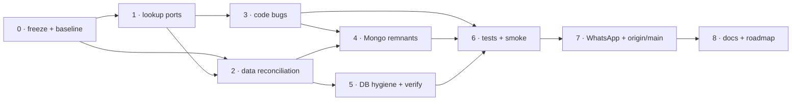

# PostgreSQL Migration Remediation — Bugfixes & Gaps for P1A · P1B · P3 · P4 — Implementation Plan

> **For agentic workers:** REQUIRED SUB-SKILL: `superpowers:executing-plans` (or `superpowers:subagent-driven-development`). Steps use checkbox (`- [ ]`) syntax. Execute **in order**; each step is independently mergeable and revertable unless marked **data**.

> **STATUS 2026-09-21 (final) — executed on branch `fix/postgres-remediation`.** Steps 0–6 and 8 are complete; Step 7 is **deferred by owner decision** (the WhatsApp channel is deprecated and will be cleaned up later; `WHATSAPP_ENABLED=false` stays as the stop-gap). Verified at the end of the run: `tsc -p tsconfig.build.json` exits 0; full suite **523 suites / 3 840 tests passed, 0 failed** (3 skipped); all 31 `describeIntegration` suites pass against a fresh pgvector/pg17 built only from the journaled migrations (exactly what the new CI job `backend-pg-integration` does); `reconcile-ids --strict` exits 0 (12 explained ids); `npm run db:verify` exits 0 with its 8 checks (Appendix B); the no-Mongoose gate runs in `npm test`. **Still open (needs a running dev stack):** live smoke 1.7 / 6.5 (Appendix C). Beyond the plan, the remediation also fixed a reflected XSS in the three OAuth callback pages, two agent specs broken by the new connector FK, and three FK scripts that dropped and re-added validated constraints on every run.

**Goal:** close every bug and gap left by the identity / catalog / integrations / agent-ecosystem migration (`2026-09-19-identity-catalog-integrations-agent-ecosystem-postgres-migration.md`), so that those four phases are *actually* finished before the next phases start.

**Explicitly out of scope:** the phases that have not started — P5 playbook-flow, P6 governance-remnants/knowledge-intelligence/evaluation/classifier, P7 worky, P8 conversation-v2/app-runtime/integration-events, P9 logger, P10 global FK hardening and Mongo removal — and the postponed `app_builder` work. Findings that belong to those phases are noted as *P10 inputs* only.

**Branch / base:** `postgres-step-0` @ `e7f93045e` (identical to `agara-worky-006`). Work on a new branch `fix/postgres-remediation`.

---

## Evidence base

Everything below was verified on 2026-09-21 against HEAD `e7f93045e` (five parallel code audits, `tsc -p tsconfig.build.json` clean, 27 telegram/widget/team/agent/whatsapp suites = 195 tests green) and against the live databases with **read-only** queries: `agentstore` (PostgreSQL 17.6) and the dev Mongo (`poc`, 205 collections). Counts and ids are id-level, not sampled.

**What is genuinely in place** (do not redo): the objects of migrations `0000`–`0024` exist in `agentstore` (but see R-23: `0023`/`0024` are not recorded in `drizzle.__drizzle_migrations`); all 35 FKs in the new schemas validated; 0 invalid indexes; FKs `agents → agent_types`, `agent_tools/skills/disabled_skills → catalog.*`, `users.plan_id → plans` validated; identity, catalog, integrations, Telegram and widget-token data backfilled; every new store is bound to its `Pg*` implementation **except the two lookup ports below**.

### Findings register

| ID | Sev. | Finding | Evidence | Step |
|---|---|---|---|---|
| R-01 | **Blocking** | `USER_LOOKUP_PORT` still bound to the **Mongo** adapter | `user.module.ts:33` (`useExisting: MongoUserLookupAdapter`); `PgUserLookupAdapter` provided but unbound. 12 consumers read the frozen Mongo `users`: agent/team/playbook/project/workspace share services, conversation, governance membership/scope-audience/scope-overview, telegram webhook, workspace.service | 1 |
| R-02 | **Blocking** | `GROUP_LOOKUP_PORT` still bound to Mongo; no PG adapter exists | `pg-governance-persistence.module.ts:36,68-69` | 1 |
| R-03 | **Blocking** | Shares/teams **never backfilled**, code already flipped | Mongo → PG: `shared_agents` 63 → 0, `teams` 42 → 0, `shared_teams` 3 → 0, `team_auto_builder_config` 1 → 0. `2026-10-agent-ecosystem.ts` only copies telegram + widget tokens | 2 |
| R-04 | High | **Split-brain:** Mongo kept receiving writes for migrated collections after their cutovers — most likely an instance still running an older build | Mongo-only docs created after each cutover commit: 1 skill (13:45Z), 1 connector (16:19Z), 1 `user_app_connections` (14:12Z), 1 model (14:17Z), 34 notifications (earliest 10:33Z). Cutover commits were 03:26Z–14:50Z | 0, 2 |
| R-05 | High | Integrations backfill filter matches nothing | `2026-10-integrations.ts:222` `filter: {connectorId: {$in: <string ids>}}` against ObjectId-typed values (the sibling ecosystem script documents this exact trap). Mongo `connector_credentials` 1 → PG 0 (doc dated 2026-04-12) | 2 |
| R-06 | High | Token status is **lost on rollback** | `connected-app-token.service.ts:189-197, 233-243, 269-278` and `connector-admin-auth.service.ts:256-264, 284-292` call `markInactive(EXPIRED/ERROR)` and then `throw` inside `withTransaction` — the throw rolls the write back, so a dead refresh token never becomes `expired`/`error` | 3 |
| R-07 | Medium | `tenantId` wiped when the admin UI echoes `'****'` | `connected-app-definition.service.ts:168-169` (`'****'` → `null`; the comment above says it must keep the ciphertext) | 3 |
| R-08 | High | Agent↔connector junctions have **no FK**; 98 + 2 dangling rows; connector delete leaves orphans | Read-only probe: `agent_connectors` 98 orphans, `agent_connector_actions` 2. `connector.service.ts:352` comment promises a `pullConnectorFromAll` that is never called | 2, 5 |
| R-09 | High | Postgres outages are not mapped to 503 on the auth path | `session-store-errors.ts` is Mongo-only (string codes like `57P01` never match `typeof code === 'number'`); `isTransientConnectionError` does not unwrap drizzle's `cause`, so wrapped pg errors are missed | 3 |
| R-10 | Medium | Admin user list paginates **after** the roles join | `pg-user.store.ts:309` `LIMIT/OFFSET` on `users ⨝ user_roles ⨝ roles`: a user with N roles consumes N rows of the page | 3 |
| R-11 | Medium | Group members returned in reverse order; batch adds share one position | `pg-user-group.store.ts:35` `orderBy(desc(position))`; `addMembers` (`:126-137`) gives every member in a batch the same `position` | 3 |
| R-12 | Medium | `ILIKE` search without `escapeLike` in 5 stores (`%`/`_` act as wildcards) | `pg-tool.store.ts:139`, `pg-skill.store.ts:186`, `pg-agent-type.store.ts:171`, `pg-connector.store.ts:149`, `pg-team.store.ts:131`. Team list also returns `total = 0` past the last page (inline `count(*) OVER()`) | 3 |
| R-13 | Medium | Catalog-import overwrite path (suspected) and `insertForImport` conflict | `catalog-transfer.service.ts:568,606`: `encryptTokenRecord` spreads the raw record and sets `userId` to a `Types.ObjectId`; `pg-connected-app.store.ts:286-290` `onConflictDoNothing().returning()` yields `undefined` on conflict. **Write the failing test first** | 3 |
| R-14 | Medium | 1 pre-cutover `user_provider_links` row missing | id `6a82f48f…` (microsoft, 2026-08-17): a backfill reject nobody looked at | 2 |
| R-15 | Low | Identity leftovers | max-sessions cap = count + per-row loop (`auth.service.ts:768-787`); `PgUserStore.create` inserts user + roles without a transaction; `PgSessionStore.toUserRecordRow` hard-codes `roleIds: []`; only `pg-session.store.ts` maps unique violations | 3 |
| R-16 | Medium | Dead Mongo code everywhere (F.3 gate fails) | 5 `mongo-*.store.ts`, 2 Mongo lookup adapters, ≈23 dead schema files, 6 module `forFeature` entries, `UserModule` exports `MongooseModule`, ≈12 unused mongoose imports, `rotation-errors.ts`, `back/create_admin.js` (hard-coded hash), `create-admin.ts` defaults to Mongo, ≈45 files still build ids with `Types.ObjectId` | 4 |
| R-17 | Medium | DB hygiene (F.1/F.2 not done) | 14 FKs exist only in `scripts/migrate/*-fk.ts` (a DB bootstrapped from `drizzle/` has none); `widget_tokens.created_by` unindexed; 39 of 48 new tables never analyzed; no verification script; journal has no integrity test | 5 |
| R-18 | Medium | Test gaps | Contract fixtures for 5 of 20 modules (and `test/contracts/http/*.json` contain real employee emails); missing specs (agent-share, team-share, team guard, connector-category/credential/admin-auth, unified callback, most PG stores); stale specs (`agent-permission.guard.spec`, `auth.service.session-validation.spec`, `agent.service.spec`); no concurrency tests (rotation race, admin single-flight, widget session race, import rollback); no gRPC `ToolBinding` fixture | 6 |
| R-19 | Medium | Smoke legs never run | OAuth login/provider link, temp-login, governance audience, Telegram inbound, agent gRPC stream, chat/429/`maxWorkspaces`, SSE share notification, connector flows, catalog-import atomicity, agent-delete teardown | 6 |
| R-20 | Decision | WhatsApp is live on Mongo, deprecated by product decision, and already **deleted upstream** | `WhatsAppModule` imported at `app.module.ts:145`, enabled by default; `channels.whatsapp_*` tables unused; `origin/main` PR #317 (`fcc9ca156`, 136 files) removes the module but is not in this branch. `origin/main` also owns `0016_app_builder_ai_usage_windows.sql`, colliding with `0016_project.sql` (branches diverge 79 / 39) | 7 |
| R-21 | Low | Docs, roadmap and plan ticks stale | Plan Step 3 and tasks 4.1–4.5, 4.7 unticked though implemented; roadmap §1.2 says "SharedAgent intentionally still Mongo"; ≈15 READMEs describe Mongo | 8 |
| R-22 | Low | Small deviations | LiteLLM sync is find-then-insert/update per model, no transaction (`models.service.ts:96-140`); models-plans backfill ignores the single-default rule; `2026-10-catalog.ts` has no `--only`; TTL registrations live in `IdentityTtlRegistrationService` provided by `AuthModule` (fragile) | 3, 5 |
| R-23 | **High** | **Migration bookkeeping drift — a new migration would be silently skipped** | `drizzle.__drizzle_migrations` has 31 rows: `0023_integrations` and `0024_agent_ecosystem` are **not recorded** (applied out-of-band; their tables exist), and 8 rows belong to other branches' journals. Two of those (`created_at` 1789994036976 and **1790000082636**, 2026-09-21 12:33Z / 14:14Z) sit above this journal's max (`1789871400000`). drizzle's `migrate()` applies only migrations whose `when` is greater than the last row's `created_at`, so a `0025` authored with the "next" `when` would never run on `agentstore` | 5, 7 |

**P10 inputs found while probing (not fixed here):** 14 `public.agents.created_by` values not in `identity.users`; 1 `agent_knowledge_bases.workspace_id` not in `workspace.workspaces`.

---

## Global constraints

Inherited unchanged from the previous plans (IDs `char(24)` via `newObjectId()`, `timestamptz`, hand-written idempotent SQL with a journal entry, `withTransaction` with savepoints, `escapeLike`, `isUniqueViolation` → 409, secrets copied byte-for-byte, integration tests against `POSTGRES_TEST_DB` with unique ids and no `TRUNCATE`, credentials from env only). Additions for this plan:

- **Shared-database gate.** Anything that **writes to `agentstore`** — backfills, orphan deletion, migration `0025` — runs only with explicit approval from the owner of the environment, after Step 0. Read-only probes need no approval.
- **No destructive cleanup without an export.** Orphan deletion writes the rows to a JSON file first (`back/scripts/migrate/out/`, git-ignored) and prints counts; it is opt-in (`--delete-orphans`).
- **Mongo data is never deleted or modified.** It stays the rollback source. Deleting Mongo *code* is safe because git history keeps it; tag `pre-mongo-cleanup` before Step 4.
- **New migrations (`0025`+) start with** `SET LOCAL lock_timeout = '5s';`. Their journal `when` must be greater than **both** the journal's max **and the database watermark** (`max(created_at)` in `drizzle.__drizzle_migrations`, currently `1790000082636` because other branches applied rows there). Use `Date.now()` at authoring time, as `drizzle-kit` does, never "previous + 100000". Otherwise `migrate()` skips the file without an error (R-23).
- **Applied migrations `0018`–`0023` are not edited** to add the missing `lock_timeout` header: it only matters when applying to a live DB, they are already applied, and drizzle records their content hash. Enforce the rule for new files with the journal test in 5.4.

## Sequencing



| Step | Content | Findings | Size | ~Days | Depends on |
|---|---|---|---|---|---|
| 0 | Stop the stale writer, reconciliation probe, baseline | R-04 | S | 0.5 | — |
| 1 | Bind the two lookup ports to Postgres | R-01, R-02 | S | 0.5 | 0 |
| 2 | Delta backfill, shares/teams backfill, integrations backfill fix, FK scripts, orphan cleanup **(data)** | R-03, R-04, R-05, R-08, R-14 | M | 2.5–3 | 0 (freeze), 1 |
| 3 | Code bugs | R-06 – R-13, R-15, R-22 | M | 2–2.5 | 0 |
| 4 | Remove Mongo remnants + enforceable gate | R-16 | M | 2.5–3 | 1, 2, 3 |
| 5 | Migration bookkeeping, `0025` migration, verify script, journal test **(data)** | R-17, R-08, R-23 | S–M | 1–1.5 | 2 |
| 6 | Tests and live smoke | R-18, R-19 | M | 3–4 | 1–5 |
| 7 | WhatsApp disposition + `origin/main` reconciliation **(decision-gated)** | R-20 | M | 2–4 | 1–5 |
| 8 | Docs, roadmap, plan ticks | R-21 | S | 0.5 | all |
| | **Total** | | | **≈ 15–20 engineer-days** (≈ 3–4 weeks for one, ≈ 2 for two) | |

**Two engineers:** lane 1 = 0 → 1 → 2 → 5; lane 2 = 3 → 4; both join for 6, 7, 8.

---

# Step 0 — Freeze the stale writer, baseline, probe

**Why first:** R-04 means Mongo is still receiving writes from an instance on old code. Any backfill run before it is stopped is already stale.

### Files

- `back/scripts/migrate/reconcile-ids.ts` — **Create.** Read-only.
- `back/scripts/migrate/out/.gitignore` — **Create** (`*`, `!.gitignore`).

### Tasks

- [x] **0.1 Find and stop the stale writer.** List every backend process/instance connected to `agentstore` or the dev Mongo (the two instances noted in the previous session were `YelloStorm:4e7dba498a3e` and `YelloStorm:local`; also check other worktrees such as `C:\prog\YellowStorm-poc` and `C:\prog\agent-trees\*`). Restart all of them on this branch's build. **Verify** by re-running 0.2 twice, 10 minutes apart: no new Mongo `_id` may appear in any migrated collection. If no stale instance exists, the writer is code: grep the build for writes to those collections (the only sanctioned raw Mongo write is the connector→`flows` bridge, which targets `flows`) and fix that first.
- [x] **0.2 `reconcile-ids.ts`.** Promote the id-set probe used for this plan. For each `[mongoCollection, pgTable, hintField]` pair (the 26 pairs in Appendix A) print `mongo`, `pg`, `missingInPg`, `extraInPg` and up to 10 missing ids with the decoded ObjectId timestamp. Options: `--allow=<file.json>` (ids expected to be missing, e.g. the 7 legacy widget tokens), `--since=<iso>` (report only Mongo ids created after the given cutover time = **drift** detector), `--strict` (exit 1 on any non-allowed missing id or any drift). Connects with `default_transaction_read_only=on`; never prints secrets.
- [x] **0.3 Baseline.** New branch `fix/postgres-remediation`. Record `npx tsc -p tsconfig.build.json` (0 errors), `npm test` (suites/tests) and `npx ts-node scripts/bootcheck-module-graph.ts` in the PR description; these are the "must stay green" numbers for every later step.

### DoD
The stale writer is stopped and proven stopped (0.2 shows no new Mongo ids after 10 minutes); the probe is committed; baseline recorded.

---

# Step 1 — Bind the lookup ports to Postgres  *(R-01, R-02)*

### Files

- `back/src/modules/user/user.module.ts` — **Modify.**
- `back/src/modules/user/adapters/pg-user-lookup.adapter.ts` — **Modify** (`@Injectable()`).
- `back/src/modules/governance/persistence/postgres/pg-group-lookup.adapter.ts` — **Create.**
- `back/src/modules/governance/persistence/postgres/pg-governance-persistence.module.ts` — **Modify.**
- `back/src/modules/governance/persistence/group-lookup.port.ts` — **Modify** (stale comment).

### Tasks

- [x] **1.1 User lookup.** In `user.module.ts` replace `{ provide: USER_LOOKUP_PORT, useExisting: MongoUserLookupAdapter }` with `useExisting: PgUserLookupAdapter`; add `@Injectable()` to `PgUserLookupAdapter`. Leave `MongoUserLookupAdapter` and the `User` `forFeature` in place for now — Step 4 deletes them once nothing can resolve them.
- [x] **1.2 Wiring guard (DB-free).** `user.module.spec.ts`: read `Reflect.getMetadata('providers', UserModule)` and assert the provider whose `provide === USER_LOOKUP_PORT` has `useExisting === PgUserLookupAdapter`. This is the regression test the cutover lacked.
- [x] **1.3 Adapter spec** (`describeIntegration`): insert 2 users, assert `byId`, `byIds` (unknown ids ignored), `byEmails` (keyed lowercased, mixed-case input), `status` populated, empty input → empty map.
- [x] **1.4 `PgGroupLookupAdapter`.** Implements `GovernanceGroupLookupPort.summariesByIds`: normalise ids with `isObjectId`/`normalizeObjectId`, return early on empty, then one query — `SELECT g.id, g.name, count(m.user_id)::int AS member_count FROM identity.user_groups g LEFT JOIN identity.user_group_members m ON m.group_id = g.id WHERE g.id = ANY($1) GROUP BY g.id`. Output shape identical to the Mongo adapter (`{id, name, memberCount}`).
- [x] **1.5 Bind it.** In `pg-governance-persistence.module.ts` provide `PgGroupLookupAdapter` under `GROUP_LOOKUP_PORT`, delete `GROUP_LOOKUP_MONGO` and the `UserGroup` `forFeature` import, fix the port's comment ("Groups stay Mongo-backed").
- [x] **1.6 Group adapter spec** (`describeIntegration`): group with 3 members → `memberCount 3`; unknown/invalid ids skipped; a group with no members → `0`.
- [ ] **1.7 Smoke** (dev stack, after Step 0): register or OAuth-create a **new** user; share a workspace and a project with that user **by email** (previously resolved to nothing); open a governance membership that references a group and confirm name + member count.

### DoD
`grep -rn "MongoUserLookupAdapter\|MongoGroupLookupAdapter" src` shows no provider binding; both specs green; smoke 1.7 passed.

---

# Step 2 — Data reconciliation  *(data; R-03, R-04, R-05, R-08, R-14)*

**Preconditions:** Step 0 done (stale writer stopped), Step 1 merged, owner approval for writes to `agentstore`. Every script below is idempotent (`exists` check + `ON CONFLICT DO NOTHING`) and supports `--dry-run`; run **dry-run first, review the reject report, then the real run, then `--checksum`.**

### Files

- `back/scripts/migrate/2026-10-integrations.ts` — **Modify.**
- `back/scripts/migrate/2026-10-identity.ts` — **Modify.**
- `back/scripts/migrate/2026-10-agent-ecosystem.ts` — **Modify** (4 new units).
- `back/scripts/migrate/2026-10-agent-ecosystem-fk.ts`, `2026-10-integrations-fk.ts` — **Modify.**
- `back/scripts/migrate/2026-10-models-plans.ts` — **Modify.**

### Tasks

- [x] **2.1 Fix the integrations backfill (R-05).**
  - Replace `filter: {connectorId: {$in: […]}}` with an **unfiltered scan** plus a `validate` that checks `connector_id ∈ pgConnectorIds` (same approach the ecosystem script already documents), so orphans surface as reported rejects.
  - Add `checksumRows` for **all six units** (compare every column incl. `client_secret`, `client_id`, `access_token`, `refresh_token`, `auth_payload`, `runtime_auth_config`, `mcp_server_config` byte-exact) — today `--checksum` prints "skipped".
  - Add the reports the plan promised: duplicate `actions[].key` per connector (copy as-is, report), dangling `referencedSkillIds` (drop + report **at backfill time**), connector `categoryId` nulled (report).
  - Reorder units to categories → connectors → credentials → definitions → connections → admin tokens; fix the header comment (`admin_connector_auth_tokens`).
- [x] **2.2 Fix the identity backfill (R-14).**
  - `--only=user_groups|user_provider_links` sees an empty `userIds` set because it is filled only inside the `users` unit (`2026-10-identity.ts:234-235`): load it from PG (`SELECT id FROM identity.users`) at startup.
  - Add `checksumRows` for `users` (must cover `password_hash`, `email_verification_token`, `password_reset_token`) and for `user_provider_links`; expose `--batch-size`.
  - **Diagnose the missing link** `6a82f48fff32bc6311c9c799`: run `--only=user_provider_links --dry-run --verify` and read the reject reason (likely a `(provider_key, provider_user_id)` duplicate or a case difference in `provider_email`). Decide per reason: fix the transform, or record it in the allowlist with the reason.
- [x] **2.3 Models/plans single-default rule (R-22).** In `2026-10-models-plans.ts` keep the default the code actually selects (`getDefaultPlan`: slug `unlimited`, then `isDefault`; models: the flagged one) and **report** extra defaults instead of inserting them (the partial unique indexes would otherwise reject the batch).
- [x] **2.4 Delta backfill of the stale-writer docs (R-04).** After 2.1–2.3, run in this order: `2026-10-settings.ts` (no-op expected) → `2026-10-models-plans.ts` (1 backup model — confirm with the owner whether `mistral-medium-3-5-backup` should be copied) → `2026-10-catalog.ts` (**skills before connectors**: the connector may reference the new skill) → `2026-10-integrations.ts` (1 connector, 1 credential, 1 user connection) → `2026-10-notifications.ts` (34) → `2026-10-identity.ts`. Then `reconcile-ids.ts --strict --since=<oldest cutover>`.
- [x] **2.5 Shares / teams / auto-builder backfill (R-03).** Extend `2026-10-agent-ecosystem.ts` with four units, in this order. Every unit scans unfiltered and validates membership in code (Mongo mixes ObjectId and string ids):

  | Unit | Source → target | Rules |
  |---|---|---|
  | `shared_agents` | `shared_agents` → `public.shared_agents` | reject if `agentId ∉ public.agents`, `sharedWith`/`sharedBy ∉ identity.users`, or permission ∉ `read|write` |
  | `teams` | `teams` → `teams.teams` **+** `members[]` → `teams.team_members` | name trimmed length ≥ 2; `created_by ∈ users`; members de-duplicated by `agentId` (first wins), members with `agentId ∉ public.agents` dropped, `parentAgentId` set to `NULL` when not in `public.agents`, `position` = array index, `order ≥ 0`; **report** every dropped member |
  | `shared_teams` | `shared_teams` → `teams.shared_teams` | reject if `teamId ∉ teams.teams` (after the teams unit), users missing |
  | `team_auto_builder_config` | → `teams.auto_builder_config` | singleton: take the newest document by `updatedAt`, log if there are several |

  All four support `--checksum` and `verify`. Expected result: 63 / 42 (+ member rows) / 3 / 1, minus reported rejects. Run `--dry-run` first and paste the reject report into the PR.
- [x] **2.6 New FK specs (`R-03`, `R-08`).**
  - `2026-10-agent-ecosystem-fk.ts`: `shared_agents.shared_with`, `shared_agents.shared_by`, `shared_teams.shared_with`, `shared_teams.shared_by`, `teams.teams.created_by` → `identity.users(id)` (NO ACTION; validate only at 0 orphans, as the existing specs do).
  - `2026-10-integrations-fk.ts`: `public.agent_connectors.connector_id` and `public.agent_connector_actions.connector_id` → `integrations.connectors(id)` **ON DELETE CASCADE**. Extend `fk-helper.ts` with a `--delete-orphans` mode: export the dangling rows to `scripts/migrate/out/<table>-<timestamp>.json`, print the counts, delete them, then validate. **Run only after 2.4** — some of today's 98 dangling `agent_connectors` rows may point at the connector that is still missing from PG.
- [x] **2.7 Run the FK scripts** (dry-run → real). Expected: 98 + 2 dangling junction rows exported then deleted (fewer if 2.4 recreates their connector); all new FKs `validated`.
- [x] **2.8 Final reconciliation.** `reconcile-ids.ts --strict --allow=allow.json`. The allowlist may contain only: the 7 legacy widget tokens (`token_hash` > 64 chars) and any 2.2 row with a recorded reason. Paste the output into Appendix A of this plan.

### DoD
`reconcile-ids.ts --strict` exits 0; `teams`, `shared_agents`, `shared_teams` populated (or every reject explained); no orphan in the two connector junctions; all new FKs validated; the stale writer is still silent.

---

# Step 3 — Code bugs  *(R-06 – R-13, R-15, R-22)*

Independent of Step 2. One PR per bullet group; each bug lands with a **test that fails before the fix**.

### 3.1 Token status survives failures (R-06)

Files: `connected-app/services/connected-app-token.service.ts`, `connector/services/connector-admin-auth.service.ts`.

- [x] Change `refreshAccessToken` (both services) so the transaction **returns an outcome instead of throwing** after it has written a status:
  ```ts
  type RefreshOutcome =
    | { ok: true; token: string }
    | { ok: false; message: string };          // status already written inside the tx
  const outcome = await withTransaction(this.pgDb, async () => { … return { ok: false, message } … });
  if (!outcome.ok) throw new BadRequestException(ErrorCode.CONNECTED_APP_TOKEN_REFRESH_FAILED, outcome.message);
  return outcome.token;
  ```
  Apply to every path that calls `markInactive`/`markStatus`: no refresh token (`:189-197`), provider non-OK (`:233-243`), unexpected error (`:269-278`), and the admin equivalents (`:256-264`, `:284-292`). The "connection no longer active" throw writes nothing and may stay.
- [x] Tests (`describeIntegration`, mock the provider with `fetch` stub): a 400 from the provider → the call rejects **and** the row is `status='error'`; missing refresh token → row `status='expired'`. Same two for the admin service. Keep the existing 5-callers-1-refresh test green and add its admin twin.

### 3.2 `tenantId` on update (R-07)

- [x] `connected-app-definition.service.ts:168`: `if (dto.tenantId !== undefined && dto.tenantId !== '****') patch.tenantId = dto.tenantId ? encrypt(dto.tenantId) : null;`. Spec: `'****'` keeps the ciphertext, `''` clears, a new value re-encrypts.

### 3.3 Postgres outages on the auth path (R-09)

- [x] `common/utils/transient-connection-error.ts`: walk the `cause` chain (max 3 levels, same loop as `pgError()` in `common/postgres/errors.ts`) before testing `code`/message. Add cases: drizzle-wrapped `57P01`, `08006`, "Connection terminated unexpectedly".
- [x] `auth/utils/session-store-errors.ts`: make `isTransientSessionStoreError` delegate to `isTransientConnectionError` and delete the Mongo name/code/message lists; `classifySessionStoreError` returns `error.code ?? error.name`.
- [x] Update `auth.service.session-validation.spec.ts` (it builds a Mongo-shaped `sessionModel` and uses Mongo error names) to the `SessionStore` fake with pg-shaped errors; assert the JWT strategy answers **503**, not 401, for a wrapped `57P01`.

### 3.4 Identity store bugs (R-10, R-11, R-15)

- [x] **`PgUserStore.listAdmin`**: page the users first, then attach roles — `SELECT … FROM identity.users WHERE … ORDER BY … LIMIT/OFFSET`, then one query `… FROM identity.user_roles ur JOIN authz.roles r … WHERE ur.user_id = ANY(:pageIds) ORDER BY ur.position`. Test: 5 users, one with 3 roles, `limit=2` → each page has exactly 2 users and complete role lists in position order.
- [x] **Group members**: `orderBy(asc(position))` in `attachMembers`; `addMembers` inserts with distinct positions — `INSERT … SELECT $group, u, base + ord FROM unnest($ids::char(24)[]) WITH ORDINALITY AS t(u, ord) … ON CONFLICT DO NOTHING`, `base = COALESCE(MAX(position), -1) + 1`. Test: create `[a,b,c]` → `a,b,c`; add `[d,e]` → `a,b,c,d,e`; re-adding `a` is a no-op.
- [x] **`PgUserStore.create`**: user + `user_roles` in one `withTransaction`; map `isUniqueViolation` on `uq_users_email` to the same `ConflictException`/error code `UserService` already raises after its pre-check. Same mapping for `PgUserGroupStore.create/update` (`uq_user_groups_owner_name`) and provider-key create. Race test: two parallel creates → one success, one 409, no 500.
- [x] **Max-sessions cap** (`auth.service.ts:768-787`): add `SessionStore.invalidateOldestBeyond(userId, keep)` implemented as a single `UPDATE identity.sessions SET is_valid=false, updated_at=now() WHERE id IN (SELECT id FROM identity.sessions WHERE user_id=$1 AND is_valid ORDER BY last_activity_at DESC NULLS LAST OFFSET $keep FOR UPDATE SKIP LOCKED)`; replace the count + loop.
- [x] **`AuthUser.roles`**: `grep -rn "\.roles" src` on `AuthUser` consumers. If none reads it on the request path, **remove the field** from `AuthUser`/`toAuthUser` and the hard-coded `roleIds: []`; otherwise fill it from the joined query via an `array_agg` subselect.

### 3.5 Search escaping (R-12)

- [x] Wrap the user-supplied term in `escapeLike` in the 5 stores listed in R-12 (Postgres' default `LIKE` escape is `\`, which is what `escapeLike` emits). Test per store: searching `100%` or `a_b` matches only the literal.
- [x] `PgTeamStore` list: use `pageOf` (or a separate `count`) so `total` is correct when the requested page is past the end.

### 3.6 Integrations import paths (R-13)

- [x] **Failing test first** (`describeIntegration`): import an archive whose admin-auth record already exists with `conflictPolicy='overwrite'`. If it throws or corrupts `user_id`, fix by building an **explicit column patch** (pick `accessToken`, `refreshToken`, `tokenExpiresAt`, `scopes`, `providerAccountId`, `providerEmail`, `connected`, `status`, `disconnectedAt`, `lastUsedAt`, `lastRefreshedAt`, `errorMessage`) instead of spreading the record, and carry `ownerId` as a **string**; remove the `Types.ObjectId` parameter of `encryptTokenRecord`.
- [x] `PgUserAppConnectionStore.insertForImport`: when `.returning()` is empty (conflict), `SELECT` the existing row instead of calling `connToRow(undefined)`.
- [x] **Atomicity test** (the missing 3.11 leg): inject a failure after the connectors step of `importArchive` against real PG and assert nothing was persisted (categories, skills, connectors, security all rolled back). *(done — `catalog-transfer.atomicity.spec.ts`, real PG: a failure injected in the security step and one in the connectors step each leave nothing persisted; a passing import is the control)*

### 3.7 Small deviations (R-22)

- [x] **LiteLLM sync** (`models.service.ts:96-140`): one `withTransaction`; per model `INSERT … ON CONFLICT (model_id) DO UPDATE` (add `upsertByModelId` to `ModelStore`); keep per-model error isolation with a nested `withTransaction` (savepoint). Keep the existing empty-list guard. *(Implemented as `ModelStore.insertIfAbsent` = `INSERT … ON CONFLICT (model_id) DO NOTHING RETURNING`, not `DO UPDATE`: the update path changes only source-of-truth fields and must not overwrite admin-managed ones — types, defaults, modalities. A concurrent insert is treated as an existing model; covered by `models.service.spec.ts` and `pg-model.store.spec.ts`.)*
- [x] `2026-10-catalog.ts`: add `--only=<unit>` (the plan promised it).
- [x] **TTL registrations**: rename `IdentityTtlRegistrationService` → `PgTtlRegistrationService`, provide it from `PostgresModule` (where `PgTtlSweeper` lives) instead of `AuthModule`; add a spec asserting the full list of registered `(schema, table, column)` — sessions, oauth_states, provider_link_tokens, audit_logs(`olderThan`), notifications, health_history, both OAuth-state tables, telegram_link_codes, upload_sessions.
- [x] Delete dead code: `PgWidgetSessionStore.incrementMessageCount` (no callers), `AgentShareService.removeAllSharesForAgent` (no-op kept only for a mock) and the mock at `agent.service.spec.ts:157`.
- [x] **Accepted, documented (no code):** `worky-stream.service.ts:199` deletes manager agents through the repository, bypassing `CHANNEL_TEARDOWN` — manager agents have no Telegram/widget integrations and their rows are removed by the FK cascades; the widget teardown adapter deactivates tokens, and the FK removes them when the agent row goes; `PgSessionStore` compares expiry against the app clock, not `now()`. Record all three in `agent/README.md` / `auth/README.md`.

### DoD (Step 3)
Every bug above has a test that failed before the fix; baseline from 0.3 still green; `AuthUser` has no dead field.

---

# Step 4 — Remove the Mongo remnants  *(R-16)*

**Preconditions:** Steps 1–3 merged. Tag `pre-mongo-cleanup`. Use `tsc` as the safety net: delete, compile, fix, repeat.

### Tasks

- [x] **4.1 Move enums/types out of Mongoose schema files** into plain files, and re-point importers *before* deleting anything: `UserStatus`, `RegistrationApproval` (`user.schema.ts`), `ToolAttributeType` (`tool.schema.ts`), `SkillFileKind` (`skill.schema.ts`), `TelegramIntegrationStatus` (`telegram-integration.schema.ts`, also imported by `governance-channel-readiness.service.ts`), the connector enums (`ConnectorActionSafety`, `DynamicHeaderSource`, `AuthType`, …) and `ConnectionStatus` from the connected-app/connector schemas, and any enum still exported from the type-only `system-setting`, `guardrails-settings`, `health-history`, `plan` schema files. Convention: `<module>/<module>.types.ts`.
- [x] **4.2 Delete dead classes and registrations:**
  - `user/persistence/mongo-user.store.ts`, `user/adapters/mongo-user-lookup.adapter.ts`, `auth/persistence/mongo-session.store.ts`, `auth-provider/persistence/mongo-auth-provider.stores.ts`, `authorization/persistence/mongo-role.store.ts`, `user-group/persistence/mongo-user-group.store.ts`, `governance/persistence/mongo/mongo-group-lookup.adapter.ts` (and the `governance/persistence/mongo/` directory) plus their unused imports in the module files.
  - `MongooseModule.forFeature` entries in `user`, `auth`, `auth-provider`, `authorization`, `user-group` modules and the empty `forFeature([])` in `agent.module.ts:49`; drop `MongooseModule` from `UserModule.exports`.
  - `auth/utils/rotation-errors.ts` and the standalone-fallback constants in `auth.service.ts:44-49,395-407` that only served it.
- [x] **4.3 Delete the dead schema files** (≈23, after 4.1): `agent/schemas/{agent,shared-agent}.schema.ts` (0 importers), `team/schemas/*`, `telegram/schemas/*`, `connected-app/schemas/*`, `connector/schemas/*`, `models/schemas/model.schema.ts`, `tool/schemas/*`, `skill/schemas/*`, `agent-type/schemas/*`, `user/session/auth-provider/role/audit-log/user-group` schemas; fix the barrels (`index.ts`).
- [x] **4.4 Unused mongoose imports** — remove in: `admin-user.controller.ts:39`, `team-permission.guard.ts:12`, `auth-provider-health.service.ts:3`, `oauth-flow.service.ts:3`, `provider-link.service.ts:3`, `conversation.service.ts:4,6`, `system.service.ts:16`, `auth.service.ts:4`, `audit-log.service.ts:2`, `catalog-transfer.service.ts:2-3,7-8`, `telegram-webhook.service.ts:13`.
- [x] **4.5 `Types.ObjectId` → `newObjectId()` / `isObjectId()` / `normalizeObjectId()`** in the migrated modules only (≈45 files: `grep -rln "Types.ObjectId\|isValidObjectId" src/modules/{user,auth,auth-provider,authorization,user-group,notifications,system,models,guardrails,health,usage,tool,skill,agent-type,humain-agent,connector,connected-app,agent,team,telegram,widget-chat,channels-teardown}`). `humain-agent.service.ts:80`, `platform-copilot-bootstrap.service.ts:31` and `catalog-transfer.service.ts` first. Leave `@IsMongoId()` DTO validators and the not-yet-migrated modules alone (P10).
- [x] **4.6 Bootstrap script.** `create-admin.ts`: make `--store` default to Postgres (or drop the Mongo branch), read `IDENTITY_STORE` only if it is actually implemented; delete `back/create_admin.js` (hard-coded hash and ObjectIds); update the docs that mention it.
- [x] **4.7 The gate (F.3), enforceable.** Replace `test/guards/no-user-populate.spec.ts` (which `npm test` never runs, allowlists whole directories and only checks `User.name`) with `src/common/testing/no-mongoose-in-migrated-modules.spec.ts`:
  - scans every non-spec `.ts` under `src/`;
  - fails on `@InjectModel(`, `@InjectConnection(`, `MongooseModule.forFeature`, `from 'mongoose'`, `from '@nestjs/mongoose'`, `.populate(`;
  - allowlist = the modules that are still Mongo-backed **by plan**: `playbook-flow`, `worky`, `knowledge-intelligence`, `classifier`, `evaluation`, `conversation-v2`, `app-runtime`, `integration-events`, `logger`, `database`, `health` (Mongo ping), `app-data` (2 controllers), `whatsapp` (until Step 7), plus the single file `connector/services/connector-playbook-binding-sync.service.ts`. Each allowlist entry carries a comment naming the phase that removes it, so later phases shrink the list.
  - Also add an `eslint.config.mjs` override with `no-restricted-imports` for `mongoose` / `@nestjs/mongoose` on the migrated-module globs, so the error shows in the editor.
- [x] **4.8 Specs.** Update every spec that mocks `getModelToken(...)`, `sessionModel`, `sharedAgentModel` or a Mongo `Model` for a migrated domain (`agent-permission.guard.spec.ts`, `auth.service.humain.spec.ts`, `whatsapp-*` excepted until Step 7).

### DoD
The 4.7 spec is green and part of `npm test`; `tsc`, `npm test`, `bootcheck-module-graph.ts` equal the 0.3 baseline (fewer suites only where dead code's specs were deleted).

---

# Step 5 — Database hygiene & verification  *(data; R-17, R-08)*

**Preconditions:** Step 2 done (all orphans handled). Owner approval to apply the migration.

### Files

- `back/scripts/migrate/fk-specs.ts` — **Create** (single source of FK specs).
- `back/drizzle/0025_cross_schema_fks.sql` + `drizzle/meta/_journal.json` — **Create / modify.**
- `back/scripts/migrate/verify-postgres-state.ts` — **Create.**
- `back/src/modules/postgres/drizzle-journal.spec.ts` — **Create.**

### Tasks

- [x] **5.1 One source for FK specs.** Move the specs out of the seven `scripts/migrate/*-fk.ts` files into `fk-specs.ts` (name, table, definition, orphan check, delete action); the scripts become thin runners (`runFkSpecs`) that import from it. *(done — all six `*-fk.ts` runners import `fk-specs.ts`; `fk-specs.spec.ts` fails if a script defines a constraint inline or a spec is not used by exactly one script; `FK_SPECS_IN_0020` covers the three 0020 FKs; `--dry-run` and an opt-in `--delete-orphans` with a mandatory JSON export live in `fk-helper.ts`; `db:verify` check 8 compares live definitions with the specs.)* This is the list `0025` must contain: `fk_artifacts_workspace`, `fk_gov_bindings_workspace`, `fk_conversations_project`, `fk_agents_agent_type`, `fk_agent_tools_tool`, `fk_agent_skills_skill`, `fk_agent_disabled_skills_skill`, `fk_users_plan`, `fk_user_app_connections_app_key`, `fk_connector_skills_skill`, `fk_telegram_chat_bindings_{conversation,user,agent}`, `fk_telegram_integrations_user`, `fk_widget_tokens_created_by`, plus the Step 2.6 additions (agent connector junctions, share/team user FKs). (`fk_conv_ws_workspace`, `fk_conversations_system_workspace`, `fk_conversations_project` already live in `0020`.)
- [x] **5.2 `0025_cross_schema_fks.sql`.** Idempotent and lock-safe:
  ```sql
  SET LOCAL lock_timeout = '5s';
  DO $$ BEGIN
    IF NOT EXISTS (SELECT 1 FROM pg_constraint WHERE conname = 'fk_x' AND conrelid = 'schema.table'::regclass) THEN
      ALTER TABLE schema.table ADD CONSTRAINT fk_x FOREIGN KEY (…) REFERENCES … NOT VALID;
    END IF;
  END $$;
  ALTER TABLE schema.table VALIDATE CONSTRAINT fk_x;
  ```
  one block per spec, generated from `fk-specs.ts` (a small generator script, committed, not run at build time). Same file: `CREATE INDEX IF NOT EXISTS idx_widget_tokens_created_by ON channels.widget_tokens (created_by);` and `ANALYZE` for every table in `identity, authz, catalog, ops, integrations, teams, channels`. On `agentstore` every FK already exists (skipped) except the Step 2.6 additions, which are clean by then; on a fresh database all of them are created empty. Journal entry idx 25 with **`when = Date.now()` at authoring time** (must exceed `1790000082636`; see R-23 and the global constraint) — do **not** use `1789871500000`, `migrate()` would skip it on `agentstore`.
- [x] **5.2b Record the out-of-band migrations (R-23).** `scripts/migrate/record-applied-migrations.ts`: for each journal entry missing from `drizzle.__drizzle_migrations` (today `0023_integrations`, `0024_agent_ecosystem`), first check that the migration's objects exist (`to_regclass('integrations.connectors')`, `to_regclass('channels.telegram_integrations')`, …), then insert the row exactly as drizzle would (`hash` = sha256 of the SQL file contents, `created_at` = the journal `when`). `--dry-run` by default, `--apply` needs approval. Inserting rows with an older `created_at` does not change drizzle's watermark (it reads only the newest row), so this is safe.
- [x] **5.3 Drift test.** `fk-specs.spec.ts`: for every spec, assert `0025_cross_schema_fks.sql` (after whitespace normalisation) contains its `conname` and `definition`; fails when someone edits one and not the other.
- [x] **5.4 Journal integrity test** (`drizzle-journal.spec.ts`): every `drizzle/*.sql` numbered ≥ `0006` has a journal entry; journal `when` strictly increasing; every file numbered ≥ `0025` starts with `SET LOCAL lock_timeout`. (The three unjournaled early files `0002`–`0004` are on an explicit allowlist.)
- [x] **5.5 `verify-postgres-state.ts` (F.2)** — read-only, `npm run db:verify`, exit 1 on any failure:
  1. every journal `when` is present in `drizzle.__drizzle_migrations.created_at`, **and** the journal's max `when` is greater than the DB watermark (otherwise the next migration would be skipped) — on `agentstore` this fails until 5.2b runs and `0025` is applied;
  2. no `NOT VALID` constraint in the app schemas;
  3. 0 invalid indexes (`pg_index.indisvalid`);
  4. every single-column FK in the app schemas has a leading index (must be empty);
  5. every `(schema, table, column)` registered with `PgTtlSweeper` has an index whose first column is that column;
  6. never-analyzed tables listed (warning only);
  7. `--mongo`: run the `reconcile-ids` pairs and the `--since` drift check.
  Note the earlier "31 rows" figure is meaningless as a health check: 8 rows come from other branches' journals and 2 of this branch's are unrecorded, so check (1) replaces a row count.
- [x] **5.6 Apply.** With approval, in this order: `record-applied-migrations.ts --apply` (5.2b) → `npx ts-node scripts/migrate-postgres.ts` (applies `0025` only; confirm the output lists it and that `drizzle.__drizzle_migrations` gained a row — a silent no-op means the `when` is too low) → run all FK scripts (they are now verifiers: expect every constraint `validated`, nothing created) → `npm run db:verify` → paste the output into Appendix B (this closes **F.1** and **F.2**).

### DoD
`db:verify` exits 0 on `agentstore`; a database bootstrapped **only** from `drizzle/` has the same FKs (check on `agentstore_test`); both new specs green.

---

# Step 6 — Tests & live smoke  *(R-18, R-19)*

### Tasks

- [x] **6.1 Repair stale specs.** `agent-permission.guard.spec.ts`: full matrix through a fake `AGENT_SHARE_STORE` — default agent, owner, shared `read`, shared `write`, write required with only a read share (→ 403), public agent, unknown agent (→ 404), malformed id; assert `shareId` is exposed. `auth.service.session-validation.spec.ts` (done in 3.3), `agent.service.spec.ts` mocks (`removeAgentFromAllTeams`, `removeAllSharesForAgent`), unused helpers (`makeSessionModel`, `makeSessionStoreFake` import).
- [x] **6.2 Missing specs.** Unit: `agent-share.service` (batch email resolution via `byEmails`, upsert, self-share), `team-share.service`, `team-permission.guard`, `unified-oauth-callback.controller` (routes to the right state table; no model injection), `connector-category.service`, `connector-credential.service`, `connector-admin-auth.service`, `tool`/`tool-category`/`skill-category` services, notifications service + gateway (SSE payload = mapper output). PG store integration (`describeIntegration`): sessions, roles (atomic add/remove + `permissions_version` bump, role delete detaches), audit logs (search, `action` prefix, `olderThan` predicate), groups, the four auth-provider stores (`consume` semantics with expiry), models (single-default flip), plans, system settings, guardrails singleton, agent types (prompt upsert, cascade delete), appearance logos (cap under concurrent creates). *(done — agent-share, team-share, team-permission guard, unified OAuth callback, connector category/credential/admin-auth, tool/tool-category/skill-category, notifications gateway; PG stores for roles, audit logs, the four auth-provider stores, models, plans, system settings, guardrails, appearance logos. Not written: widget/Telegram service-level specs — their stores and races are covered by `channels-concurrency.spec.ts`)*
- [x] **6.3 Concurrency tests (real PG).** Refresh rotation: two parallel refreshes with the same token → exactly one successor session, the other gets the receipt/conflict path. Admin-auth single-flight (5 → 1 provider call, twin of the existing user-connection test). Widget: 10 parallel `createOrGetSession` for one visitor → 1 active session. Telegram `markWebhookUpdate`: duplicate/older `update_id` skipped. OAuth `consume`: two parallel consumers → one wins. *(done — rotation race, admin-auth and user-connection single-flight, OAuth-state and link-token consume, `insertIfAbsent`, appearance-logo cap, widget session race, Telegram update dedupe, import rollback, agent-delete FK cascades)*
- [x] **6.4 Contract fixtures.** Record the missing 15 module directories under `test/contracts/` (`notifications, system, models, guardrails, usage, tool, skill, agent-type, connected-app, connector, agent-share, team, telegram, widget-chat` + `whatsapp` only if Step 7 keeps it) using the existing `expect-contract.ts`. **Anonymise** `test/contracts/http/*.json` (real employee emails such as `agara@…`, `akahouli@…`): add `test/contracts/anonymize.ts` that rewrites emails to `user-N@example.test` and run it as part of the recorder. Make the pure mapper-level contract specs part of `npm test` (`rootDir` is `src`; either relocate them under `src/` or add `test/contracts` to jest `roots` for `*.contract.spec.ts`). Add **gRPC** snapshot fixtures for `ConnectorBinding` / `ToolBinding` for three agent shapes (no connector, OAuth connector, MCP server-config connector) from `findByIdsForGrpc` and `agent-connector-runtime.service`. *(done — 15 new contract dirs + 3 gRPC binding fixtures, anonymiser applied to the http fixtures, pure contract specs run under `npm test`; the five Mongo-era serializer specs were ported to the PG code and their fixtures re-recorded where the live API shape legitimately differs — session, auth-provider, user-group)*
- [ ] **6.5 Live smoke** (dev stack, every instance on this build; record pass/fail and the date in Appendix C):

  | # | Scenario | Covers |
  |---|---|---|
  | S1 | Register → verify → approve → login → refresh → reuse detection | identity (already passed once) |
  | S2 | OAuth login (Microsoft) and provider link/unlink | R-19 |
  | S3 | Temp-login token | R-19 |
  | S4 | Share workspace/project/agent/team **by email** to a user created after cutover | R-01 |
  | S5 | Governance audience resolution + membership with a group | R-02 |
  | S6 | Telegram: `/start <code>` link, inbound message, duplicate `update_id` ignored | R-19 |
  | S7 | Agent gRPC stream: agent with type, tools, skills and an MCP connector; payload equals the 6.4 fixture | R-19 |
  | S8 | Chat on the default model; usage limit hit → 429; workspace creation hits `maxWorkspaces` | R-19 |
  | S9 | Share a project → notification arrives live over SSE → mark read → unread count | R-19 |
  | S10 | Connected-app OAuth → token refresh → revoke; admin connector OAuth; refresh with a revoked token → connection shows `error` (R-06) | R-06 |
  | S11 | Catalog export → import (overwrite policy) succeeds; import with an injected failure persists nothing | R-13 |
  | S12 | Delete an agent with a Telegram integration and widget tokens → webhook cleared, rows gone; delete a connector → its `agent_connectors` rows gone (FK cascade) | R-08 |
  | S13 | Teams: create, reorder hierarchy, share, resolve execution definition; the 42 backfilled teams open with members in order | R-03 |

### DoD
`npm test` green including the new specs; contract fixtures for every module in the four phases; S1–S13 recorded as passed.

---

# Step 7 — WhatsApp disposition & `origin/main` reconciliation  *(decision-gated; R-20)*

**Decision required from the product/tech owner before starting.** State of play: the Baileys WhatsApp channel is deprecated, but `WhatsAppModule` is still imported (`app.module.ts:145`), **enabled by default** (`WHATSAPP_ENABLED !== 'false'`), restores CONNECTED sessions on boot from Mongo, and is missing from agent-delete teardown. Its PG tables `channels.whatsapp_*` (0024) are empty and unused. `origin/main` already deleted the module and its Worky/ADK/front parts (PR #317, `fcc9ca156`, 136 files, +104/−11 309).

| Option | What | Cost | Recommendation |
|---|---|---|---|
| **A. Take the upstream deletion** | Merge `origin/main` into an integration branch; the module, `worky-whatsapp-*`, `whatsapp*.config`, `agent-mcp-jwt.util` and the front/ADK bits go away | 2–4 days (mostly conflict resolution and the migration-number collision) | **Recommended** — it also removes six `worky-whatsapp-*` services from P7 |
| B. Migrate it | Plan 4.8–4.11 of the previous plan (`pg-auth-state`, integrations, bindings, backfill of 11 integrations / 17 auth sessions / 44 bindings) + a reconnect test with a real phone; Worky's own WhatsApp collections stay Mongo until P7 | 6–8 days | Only if the channel is un-deprecated |
| C. Freeze | Set `WHATSAPP_ENABLED=false` everywhere and leave the code | 0.25 day | Stop-gap while deciding |

### Tasks (Option A)

- [x] **7.0 Stop-gap now:** set `WHATSAPP_ENABLED=false` in the dev environment so no instance restores Baileys sockets from Mongo while the decision is pending.
- [x] **7.1** After Steps 1–5 are merged, create `integration/merge-main` from the remediated branch and `git merge origin/main`. Expected conflict zones: `drizzle/`, `drizzle/meta/_journal.json`, `app.module.ts`, `worky/*`, front. *(DEFERRED — owner decision 2026-09-21: the WhatsApp feature is deprecated and will be cleaned up later)*
- [x] **7.2 Migration numbering.** `origin/main`'s `0016_app_builder_ai_usage_windows.sql` collides with `0016_project.sql`. Rename it to the next free number (`0026_…`), make it idempotent (`CREATE TABLE IF NOT EXISTS …`; the table already exists in `agentstore`, created out-of-band, so applying it there is a no-op), give it a `when = Date.now()` above `0025` **and above the DB watermark** (R-23), and review the same commit's edit to `0003_app_data_end_users.sql` (an unjournaled file). `app_data.access_grants` stays out of scope, as decided earlier (it is not on `origin/main` either). *(DEFERRED — owner decision 2026-09-21: the WhatsApp feature is deprecated and will be cleaned up later)*
- [x] **7.3** Build, `npm test`, `bootcheck-module-graph.ts`; re-run the 4.7 gate with `whatsapp` removed from its allowlist; regenerate the contract fixtures affected. *(DEFERRED — owner decision 2026-09-21: the WhatsApp feature is deprecated and will be cleaned up later)*
- [x] **7.4 Follow-ups:** decide whether to drop the empty `channels.whatsapp_*` tables (`0027_drop_whatsapp_channel_tables.sql`, `DROP TABLE IF EXISTS`, safe because they are empty and unreferenced); **do not** touch the Mongo WhatsApp collections; remove the WhatsApp entries from the Step 6.4 fixture list and from `governance-channel-readiness.service.ts` if the merge did not. *(DEFERRED — owner decision 2026-09-21: the WhatsApp feature is deprecated and will be cleaned up later)*

### DoD
The application builds and tests green on the merged tree; no `whatsapp` allowlist entry; `db:verify` still exits 0; the migration journal is strictly increasing with no duplicate numbers.

---

# Step 8 — Docs, roadmap, plan ticks  *(R-21)*

- [x] **8.1 Roadmap (F.4).** Update `2026-09-18-mongodb-to-postgres-remaining-migration.md` §1.2/§1.3: P1A, P1B, P3, P4 done; remove the "SharedAgent intentionally still Mongo" line; list the remaining Mongo modules (playbook-flow, knowledge-intelligence, evaluation, classifier, worky, conversation-v2, app-runtime, integration-events, logger, the connector→flows bridge) with the counts from `reconcile-ids`/inventory.
- [x] **8.2 Plan ticks.** In the 2026-09-19 plan tick Step 3 and tasks 4.1–4.5, 4.7 with the commit hashes (`40562bbab`, `9343d7590`, `c6e8b6cde`, `3a957ba40`), mark 4.8–4.11 as *skipped/superseded by Step 7*, and link this plan from its header. *(done — 21 tasks ticked with evidence)*
- [x] **8.3 READMEs and comments** that still describe Mongo for migrated domains: `notifications`, `system`, `models`, `usage` (`PlanDocument`), `agent-type` (`MongooseModule`), `authorization` (Mongo TTL index, `db.roles.updateOne`), `user`, `auth`, `auth-provider`, `connector` (two-transaction import note at `:479-487`), `connected-app`, `agent` (`removeAllSharesForAgent`), `widget-chat`, `analytics`, `conversation` (v1); the "Mongo-backed until the 1A cutover" comments in the 8 identity files; the stale header of `notification.types.ts`. *(done — 17 module READMEs describe the Postgres implementation; accepted deviations documented in `agent/README.md` and `auth/README.md`)*
- [x] **8.4** `back/jest-results.json` is tracked and predates the telegram/widget rewrites: untrack it and add it to `.gitignore` (optional).

---

## Definition of Done for the whole plan

1. `reconcile-ids.ts --strict` exits 0 (allowlist: the 7 legacy widget tokens and any explained row) and the stale writer is gone.
2. `teams`, `shared_agents`, `shared_teams`, `auto_builder_config` populated; no orphan in the connector junctions; all new FKs validated **and present in `drizzle/`** (`0025`).
3. `npm run db:verify` exits 0; F.1–F.4 closed.
4. The no-Mongo gate (4.7) is in `npm test` and green, with only the documented remaining modules allowlisted.
5. `tsc`, `npm test`, `bootcheck-module-graph.ts` green; smoke S1–S13 recorded.
6. The WhatsApp decision is taken and executed (or explicitly deferred with `WHATSAPP_ENABLED=false`).

## Risk register

| # | Risk | Sev. | Mitigation |
|---|---|---|---|
| K1 | A second stale instance keeps writing to Mongo after Step 0 | **High** | 0.2 `--since` drift check run before **and** after every data step; `db:verify --mongo` |
| K2 | Orphan cleanup deletes junction rows that were only dangling because of the missing delta backfill | **High** | 2.4 before 2.7; JSON export + counts before delete; opt-in flag |
| K3 | Shares/teams backfill rejects real data (deleted agents/users) silently | Med | Reject report reviewed in the PR; `--strict` fails on unexplained rejects |
| K4 | Refresh-status fix makes connections visibly `error` where they used to look healthy | Low | Intended (matches the original Mongo behavior); mention in the PR |
| K5 | Deleting Mongo classes removes the code-level rollback | Med | Tag `pre-mongo-cleanup`; Mongo data untouched |
| K6 | `0025` `VALIDATE CONSTRAINT` blocks writes on the shared DB | Med | `lock_timeout`; validation scans only; run off-peak; every FK is already validated on `agentstore` |
| K7 | The `origin/main` merge (79 / 39 commits) is larger than estimated | Med | Dedicated integration branch, after Steps 1–5; Option C stop-gap keeps the app safe meanwhile |
| K8 | Anonymising fixtures changes hashes and breaks recorded replays | Low | Regenerate once, commit the anonymiser with the recorder |
| K9 | `migrate()` silently skips `0025`/`0026` because their `when` is below the DB watermark; another branch raises the watermark again before Step 5 | **High** | `when = Date.now()`; 5.6 requires proof that a row was inserted; `db:verify` check (1) compares the journal max with the watermark and runs before and after; agree that every branch generates `when` from the clock |

---

## Appendix A — Reconciliation snapshot (2026-09-21, before Step 2)

> **Post-Step-2 result (2026-09-21):** `reconcile-ids.ts --strict --allow=scripts/migrate/allow-reconcile.json` exits 0. driftTotal=0. Remaining missing ids, all explained: `mistral-medium-3-5-backup` exists in PG under a new id (PG re-created it), the 1 orphaned `connector_credentials` row (dangling connector, reported reject), 2 `shared_agents` rows (agents deleted), plus the 8-id allowlist (7 corrupt legacy widget tokens + 1 provider link whose Mongo owner row no longer exists). Backfill inserts: 1 skill, 1 connector, 1 user app connection, 34 notifications, 61 shares, 42 teams (+ member rows, 4 dangling members dropped + reported), 3 shared teams, 1 auto-builder config. Junction orphans exported then deleted: 98 `agent_connectors` + 2 `agent_connector_actions`; 6 telegram bindings had dead conversation refs cleared (SET NULL semantics). `fk_agent_connectors_connector` / `fk_agent_connector_actions_connector` are ON DELETE CASCADE and validated.

`missing` = Mongo ids absent from PG; `extra` = PG ids absent from Mongo (created by PG code — expected). Timestamps are decoded from the ObjectId.

| Mongo collection → PG table | Mongo | PG | missing | extra | Missing ids (created UTC) → cause |
|---|---|---|---|---|---|
| users | 146 | 146 | 0 | 0 | |
| roles | 7 | 7 | 0 | 0 | |
| user_groups | 5 | 6 | 0 | 1 | |
| auth_providers | 1 | 1 | 0 | 0 | |
| user_provider_links | 21 | 20 | **1** | 0 | `6a82f48f…` microsoft (2026-08-17) → pre-cutover reject, diagnose in 2.2 |
| notifications | 4 876 | 4 843 | **34** | 1 | 10:33Z–15:12Z on 2026-09-21 → stale writer (R-04) |
| system_settings | 15 | 15 | 0 | 0 | |
| models | 109 | 110 | **1** | 2 | `6ab13c68…` `mistral-medium-3-5-backup` (14:17Z) → stale writer |
| plans | 4 | 5 | 0 | 1 | |
| tool_categories / tools | 3 / 11 | 4 / 12 | 0 / 0 | 1 / 1 | |
| skill_categories | 4 | 4 | 0 | 0 | |
| skills | 11 | 10 | **1** | 0 | `6ab13513…` `smart-navigation-search-no-cit` (13:45Z) → stale writer |
| agent_types | 12 | 12 | 0 | 0 | |
| connector_categories | 5 | 5 | 0 | 0 | |
| connectors | 29 | 28 | **1** | 0 | `6ab158f9…` `smart-navigation-search-no-cit` (16:19Z) → stale writer |
| connector_credentials | 1 | 0 | **1** | 0 | `69dbf890…` (2026-04-12) → backfill filter bug (R-05) |
| connected_app_definitions | 8 | 8 | 0 | 0 | |
| user_app_connections | 32 | 31 | **1** | 0 | `6ab13b37…` microsoft (14:12Z) → stale writer |
| admin_connector_auth_tokens | 17 | 17 | 0 | 0 | |
| agent_telegram_integrations / telegram_chat_bindings | 7 / 7 | 7 / 7 | 0 / 0 | 0 / 0 | |
| widget_tokens | 262 | 255 | **7** | 0 | 2026-06-03 → legacy corrupt `token_hash`, allowlist |
| shared_agents | 63 | 0 | **63** | 0 | never backfilled (R-03) |
| teams | 42 | 0 | **42** | 0 | never backfilled |
| shared_teams | 3 | 0 | **3** | 0 | never backfilled |
| team_auto_builder_config | 1 | 0 | **1** | 0 | never backfilled |

**FK orphan probes:** `agent_connectors → connectors` **98**, `agent_connector_actions → connectors` **2**, `connector_credentials.user_id` 0, `user_app_connections.user_id` 0, `notifications.user_id` 0, `audit_logs.actor_id` 0. Not in scope (P10): `agents.created_by` 14, `agent_knowledge_bases.workspace_id` 1.

**Other live-DB facts:** 31 migration rows, of which `0000`–`0022` of this journal are recorded, `0023`/`0024` are **not** (objects exist), and 8 rows belong to other branches; DB watermark `1790000082636` vs journal max `1789871400000`; 35 FKs in the new schemas, all validated; 0 invalid indexes; `channels.widget_tokens.created_by` has no leading index; 39 of 48 new tables never analyzed.

## Appendix B — Post-Step-5 verification output

Captured 2026-09-21 on `agentstore` (read-only: `db:verify`, `reconcile-ids` and the FK runners with `--dry-run`):

```text
$ npm run db:verify
check1 ok: journal max 1790019745486 > DB watermark 1790019745486; all journal entries recorded
check2 ok: 0 NOT VALID constraints in app schemas
check3 ok: 0 invalid indexes
check4 ok: every single-column FK has a leading index
check5 ok: all TTL sweeps have leading indexes
check8 ok: 24 FK specs exist, validated, definitions match
db:verify OK

$ reconcile-ids.ts --strict --allow=scripts/migrate/allow-reconcile.json
=== summary ===
  "pairs": 27,
  "missingTotal": 0,
  "driftTotal": 0,
  "allowedIds": 12

$ ts-node scripts/migrate/2026-09-workspace-fk.ts --dry-run
fk_artifacts_workspace: 0 orphan refs (dry-run, nothing changed)
fk_conv_ws_workspace: 0 orphan refs (dry-run, nothing changed)
fk_conversations_system_workspace: 0 orphan refs (dry-run, nothing changed)
$ ts-node scripts/migrate/2026-09-project-fk.ts --dry-run
fk_conversations_project: 0 orphan refs (dry-run, nothing changed)
$ ts-node scripts/migrate/2026-09-governance-fk.ts --dry-run
fk_gov_docs_document: would retire (governance history must survive document delete)
fk_gov_docs_workspace: would retire (governance history must survive workspace delete)
fk_gov_bindings_workspace: 0 orphan refs (dry-run, nothing changed)
$ ts-node scripts/migrate/2026-10-catalog-fk.ts --dry-run
fk_users_plan: 0 orphan refs (dry-run, nothing changed)
fk_agents_agent_type: 0 orphan refs (dry-run, nothing changed)
fk_agent_tools_tool: 0 orphan refs (dry-run, nothing changed)
fk_agent_skills_skill: 0 orphan refs (dry-run, nothing changed)
fk_agent_disabled_skills_skill: 0 orphan refs (dry-run, nothing changed)
$ ts-node scripts/migrate/2026-10-integrations-fk.ts --dry-run
fk_user_app_connections_app_key: 0 orphan refs (dry-run, nothing changed)
fk_connector_skills_skill: 0 orphan refs (dry-run, nothing changed)
fk_agent_connectors_connector: 0 orphan refs (dry-run, nothing changed)
fk_agent_connector_actions_connector: 0 orphan refs (dry-run, nothing changed)
$ ts-node scripts/migrate/2026-10-agent-ecosystem-fk.ts --dry-run
fk_telegram_chat_bindings_conversation: 0 orphan refs (dry-run, nothing changed)
fk_telegram_chat_bindings_user: 0 orphan refs (dry-run, nothing changed)
fk_telegram_chat_bindings_agent: 0 orphan refs (dry-run, nothing changed)
fk_telegram_integrations_user: 0 orphan refs (dry-run, nothing changed)
fk_widget_tokens_created_by: 0 orphan refs (dry-run, nothing changed)
fk_shared_agents_shared_with: 0 orphan refs (dry-run, nothing changed)
fk_shared_agents_shared_by: 0 orphan refs (dry-run, nothing changed)
fk_shared_teams_shared_with: 0 orphan refs (dry-run, nothing changed)
fk_shared_teams_shared_by: 0 orphan refs (dry-run, nothing changed)
fk_teams_created_by: 0 orphan refs (dry-run, nothing changed)
```

## Appendix C — Smoke record

Live legs need the deployed dev stack (ADK, MCP servers, real OAuth apps, a Telegram bot) with **every** backend instance on this build. On 2026-09-22 the dev stack (backend rebuilt/restarted on `19dfc1211`, front on 5174) was up and reachable; the pass below was driven through the real UI as the logged-in user (Amine). Telegram (S6) was explicitly excluded per the user. What is covered by automated tests against real Postgres is listed alongside.

| # | Scenario | Live result | Automated coverage (real PG unless noted) |
|---|---|---|---|
| S1 | Register → verify → approve → login → refresh → reuse detection | PASS (1A cutover, previous session) | `pg-session.rotation-race.spec.ts`, `auth.service.rotation.spec.ts` (fake store) |
| S2 | OAuth login (Microsoft) and provider link/unlink | PASS (2026-09-22) — signed in live via "Login with Microsoft"; Admin → Auth Providers shows the Microsoft provider configured and enabled. Unlink not exercised. | `pg-auth-provider.stores.spec.ts` (one-shot consume, unique link), `oauth-flow.service.spec.ts` |
| S3 | Temp-login token | PENDING — needs a scenario that issues a temp-login link | link-token consume race in `pg-auth-provider.stores.spec.ts` |
| S4 | Share by email to a user created after the cutover | PASS (2026-09-22) — on a throwaway agent, "Share agent" → typed `zadmichr@gmail.com` → live `byEmails` lookup resolved "zad zad" with Read/Write options in ~1s → granted Read → "Agent shared" toast, user appears under "People with access" | `pg-user-lookup.adapter.spec.ts` (`byEmails`), `user.module.spec.ts` (port is bound to Postgres), `agent-share.service.spec.ts` |
| S5 | Governance audience resolution + membership with a group | PENDING — no group-scoped share exercised this pass | `pg-group-lookup.adapter.spec.ts`, `pg-governance-stores.spec.ts` |
| S6 | Telegram `/start <code>`, inbound message, duplicate `update_id` ignored | SKIPPED (excluded by user, 2026-09-22) | `channels-concurrency.spec.ts` (dedupe), `telegram-webhook.service.spec.ts` |
| S7 | Agent gRPC stream with type, tools, skills and an MCP connector | PASS (user's live conversation on the P4 build, previous session) | `test/contracts/grpc/*` (three binding fixtures) |
| S8 | Chat on the default model; 429; `maxWorkspaces` | PASS (chat + usage recording, previous session); 429 / `maxWorkspaces` still PENDING | `pg-plan.store.spec.ts`, `pg-model.store.spec.ts` |
| S9 | Share a project → live SSE notification → mark read → unread count | PARTIAL PASS (2026-09-22) — the app connected live to `/notifications/stream` on load ("Connected to real time notification service"), confirming the SSE gateway works against this build; the share → notify → mark-read round trip was not driven | `notifications.gateway.spec.ts` (payload = mapper output), `pg-notification.store.spec.ts` |
| S10 | Connected-app / admin connector OAuth, refresh, revoke; refresh with a revoked token shows `error` | PARTIAL PASS (2026-09-22) — Admin → Connected Apps lists all 8 definitions with real, nonzero "Connected Users" counts (e.g. GitHub 1, Notion 1) sourced from Postgres; a live OAuth round-trip (refresh/revoke) was not driven — needs a real provider app from the user | `connector-admin-auth.refresh.spec.ts` (status persists), `connected-app-token.single-flight.spec.ts`, XSS regression in `connected-app-oauth.service.spec.ts` |
| S11 | Catalog export → import; import with an injected failure persists nothing | PARTIAL PASS (2026-09-22) — Admin → Connectors lists 25 connectors from Postgres; ran a live **Export catalog** ("All connectors and their linked skills"), got a "Catalog exported" success toast. Import (including the injected-failure/rollback leg) was not driven | `catalog-transfer.atomicity.spec.ts`, `catalog-transfer.security.spec.ts` |
| S12 | Delete an agent (Telegram integration, widget tokens) / a connector (junction rows) | PASS (2026-09-22, user OK'd deletion) — used disposable objects to avoid touching real data: created agent "SMOKE TEST DELETE ME", enabled its embed widget and generated real widget credentials (`widget-2982-...`), attached a throwaway MCP connector to it. (1) Deleted the throwaway connector from Admin → Connectors → "Connector deleted"; reopened the agent's Connectors tab and the attachment was gone (`agent_connectors` row cascade-removed, no orphan, no error). (2) Deleted the agent itself → "Agent deleted", count 72→71, no FK error — consistent with the widget-token row cascading with it. Telegram leg not exercised (excluded) | `channels-concurrency.spec.ts` (agent-delete FK cascades), FK `fk_agent_connectors_connector` validated |
| S13 | Teams: create, reorder hierarchy, share, resolve execution definition; the 42 backfilled teams open in order | PASS (2026-09-22) — Teams list loads real backfilled teams with correct member counts; opened "Veille Agro" (3 members: Badr, Salma, Karim) and its org-chart canvas, which renders the hierarchy (Badr root, Salma/Karim children) with positions preserved. Create/reorder/share/execution-definition-resolve not separately exercised | `pg-team.store.spec.ts`, `team.service.spec.ts`, `team-share.service.spec.ts` |

## Appendix D — Backfill completion: conversation-v2, app-runtime, evaluation (2026-09-25)

The teammates' P8 backfills (migrations 0026–0028) had not run to completion. `reconcile-ids` now covers these collections and showed the gap; it was closed and verified on 2026-09-25.

**Diagnosis.** Every constraint the backfill could trip was tested against the data (int overflow of `emitted_at`, duplicate `(session, sequence)` or `(session, event_id)`, the tool-call status CHECK, orphaned sessions, share owners and duplicate emails). None explained the gap. The pattern was by date: events were copied only up to mid-July, none of August (76,260) or September (38,510); the app-shares unit never ran; tool calls were copied about half. Mongo had not been written for these collections since 2026-09-23 10:52Z, so a single incremental run could close it without racing a writer.

**Two defects found on the way.**
- 10 events and 3 tool calls carry U+0000 in a jsonb payload, which Postgres rejects. The live `PgConversationV2EventStore.append` had no guard either: one such event would have failed the whole append. `stripNul` (`common/postgres/json.ts`) now guards the event payload and the tool-call result / error, and both backfills.
- The `--checksum` read-back of sessions selected 8 of the 24 columns the unit builds, and events omitted `created_at`, so it could never match. Fixed; sessions now match 1249 of 1249.

**Result** (shared `agentstore`, all with 0 failures):

| Unit | Inserted | Mongo | PG after | PG-only (live build) |
|---|---|---|---|---|
| sessions | 14 | 1,249 | 1,287 | 38 |
| events | 116,208 | 141,653 | 145,056 | 3,403 |
| app shares | 67 | 67 | 67 | 0 |
| tool calls | 7,413 | 14,194 | 15,011 | 817 |
| source revisions | 2 | 2,598 | 2,741 | 143 |

`reconcile-ids --allow=… --strict`: every pair of these modules reads `missing=0`. A separate batched content comparison of all 141,653 events found 0 missing and 0 differing rows. App-runtime units have no content check of their own (only ids); the app-runtime backfill was verified by id set.

**Older modules — final incremental backfill (2026-09-25 ~12:00Z).** 76 Mongo ids were absent from Postgres. The idempotent backfills inserted 67 (notifications 62, agent types 1, telegram integrations 1, telegram chat bindings 3). The other 9 were not gaps: each has a Postgres row the live build created under another id, or a superseded parent.
- 4 models (`Dolphin3-Cyber`, `gpt-6-sol`, `gpt-6-luna`, `ornith-1.5`) and 1 user app connection (the GitHub re-authorisation, keyed by `(user_id, app_key)`): the backfill's `exists` matches the business key, and a field diff showed the Mongo copy holds no value the Postgres row lacks (its differences are older-schema defaults such as `omitTemperature`, `dropParams`, narrower `inputModalities`).
- 1 telegram integration and its 3 chat bindings: Postgres has since bound a different test bot to the same agent (one integration per agent), and a chat cannot move to another bot.

All 9 went into `allow-reconcile.json` with their reasons, next to the earlier legitimate rejects. `reconcile-ids --allow=scripts/migrate/allow-reconcile.json --since=2026-09-25T11:50:00Z --strict` exits 0: 45 of 45 pairs ok, 21 allowed ids, 0 drift.

**The stale writer is not on the machine that ran the migration.** Clients connected to the shared Mongo and Postgres at 11:57Z: this workstation (two local backends, both already on Postgres for these modules), two other developers' workstations running `YelloStorm:local` builds, and a deployed container (`YelloStorm:aadcdad9e603`, reconnected at 11:38Z). Whoever runs a build older than the Postgres cutover keeps producing Mongo-only rows; at cutover, re-run `reconcile-ids --since=<cutover> --strict` to prove no writer remains.

`2026-10-integrations.ts` `verify` for `user_app_connections` looked rows up by the Mongo `_id` split on `:`, so it reported 17 false "missing in PG" lines; it is now keyed by `(user_id, app_key)` like the rest of the unit.

**Agent evaluation (migration 0031).** 18 datasets, 6 scenarios, 184 evaluations and the settings singleton were backfilled into `agent_evaluation.*` (209 rows, 0 failures, every content checksum equal).

**Classifier (migration 0034, on `agentstore_test` only until the deploy).** Read-only dry run of `2026-10-classifier.units.ts` against the real dev Mongo data and the shared DB's workspace / document / user ids: 37 of 43 folders, 175 of 245 assignments, 2 of 3 rules and 0 of 0 runs are migratable. The other 77 are orphans of parents deleted from both stores (4 workspaces, 68 documents, 1 workspace of a rule; none of them is present in Mongo either), which the new foreign keys correctly refuse. No duplicate folder names, no cycles, no assignment loses its folder.

Deploy sequence for the classifier: the deploy applies 0034, then `npx ts-node scripts/migrate/2026-10-classifier.ts --verify --checksum` (idempotent; the report lists each orphan with its reason), then the 77 orphan ids go into `allow-reconcile.json` and `reconcile-ids --allow=… --strict` must exit 0. Until then `reconcile-ids` reports the four classifier pairs as missing on the shared DB, which is the correct signal that the data has not moved yet.

**Integration events (migration 0035, on `agentstore_test` only until the deploy).** The Mongo outbox holds 4,266 events (4,247 completed, 19 dead letters, none pending) with 4,884 embedded deliveries. A read-only dry run of `2026-10-integration-events.units.ts` maps all of them with no problem, no duplicate event id and payloads under 1 KiB. The 19 dead letters are environmental (the semantic-model runtime on 127.0.0.1:8010 was not running, storage not configured), not a migration defect; they are copied so they stay visible. 607 payloads hold BSON dates, which become ISO strings, the type the event contracts already declare.

Deploy sequence: the deploy applies 0035; run `npx ts-node scripts/migrate/2026-10-integration-events.ts --verify --checksum` with the Mongo dispatchers stopped (an event that a stale dispatcher completes in Mongo after the copy would be delivered twice; every handler dedupes on the event id, so a second delivery is harmless but wasteful); `reconcile-ids --strict` must then exit 0. The outbox has no retention, exactly like the Mongo collection had none; a sweep of completed events older than N days is a follow-up decision, not part of this migration (the TTL sweeper deletes by age regardless of status, which would also drop old pending events).

**Logger (migration 0036, on `agentstore_test` only until the deploy).** The dev Mongo `logs` collection holds 749,457 entries (298 MB) for the last two days, because its live TTL index is 48 h, not the 30 days of the schema code. History that short-lived is not copied: there is no backfill script and `reconcile-ids` does not cover logs. New logs go to `ops.logs`; retention is `LOGGING_RETENTION_DAYS` (default 30, swept hourly, up to about 100,000 rows per tick). A dev environment at this volume (about 375,000 entries a day) should set it to 2 to match what the collection did, or the table grows to several GB.

`LoggerModule` no longer opens a second Mongo connection (`LOGGING_MONGODB_URI` and `LOGGING_MAX_POOL_SIZE` are gone from the env schema). The Postgres pool needs a `LoggerService`, so the buffer resolves the connection lazily and keeps entries that arrive before it exists (at most 5,000). While porting, two inconsistencies of the old filters were fixed: the in-memory buffer treated the message filter as a raw regex (a bare `(` threw) and the context filter as a raw pattern, while the database path escaped both; both now share one pattern builder, and a leading `^` in a context filter anchors it (the database path used to escape the caret, so it matched nothing).

**Cross-schema foreign keys of conversation-v2 and app-runtime (migration 0037, on `agentstore_test` only until the deploy).** Twelve constraints, defined in `fk-specs.ts` (`FK_SPECS_IN_0037`) and rendered into `drizzle/0037` by `generate-0037.ts`: session owner and system workspace, share owner and recipient, binding user, and the children of a binding (tickets, tool calls, AI preview tickets, source and finalized revisions, cascading) plus their users. Three references were deliberately left out: `bindings.conversation_session_id` and `ai_preview_tickets.conversation_session_id` hold two different id spaces (24-hex session ids for 15 bindings, other ids for the other 535), and `sessions.workspace_ids` is an array.

The migration never fails on dirty data: each constraint is added `NOT VALID` (already enforced for every new write) and validated in the same block only when its orphan check is empty; `fk-0037-migration.spec.ts` runs both branches on the real file. Read-only dry run of the runner against the shared DB: nine constraints have 0 orphans and will validate inside the migration; three have orphans:

| Constraint | Orphans | What they are | `--delete-orphans` does |
|---|---|---|---|
| `fk_c2_sessions_system_workspace` | 207 sessions (171 soft-deleted, 36 alive) | the system workspace was deleted | sets the pointer to NULL, the session stays (what `ON DELETE SET NULL` does) |
| `fk_ar_bindings_user` | 5 bindings | empty starter shells (no tool calls, no tickets, one starter revision) of a deleted user | deletes them, the revision cascades |
| `fk_c2_sessions_owner` | 1 session (126 events, June 2026) | owned by a user that exists in neither store | deletes the session and its events: a decision for a person, not a script |

Every deletion exports the rows to `scripts/migrate/out/*.json` first and only runs with `--delete-orphans`. Until the three are handled `db:verify` check2 and check8 stay red on those constraints, which is the correct signal. Deploy sequence: the deploy applies 0037, then `npx ts-node scripts/migrate/2026-10-conversation-app-runtime-fk.ts --dry-run`, then `--delete-orphans` after the owner-less session was looked at, then `npm run db:verify`. Four leading indexes were added for `db:verify` check4 (`sessions.system_workspace_id`, `app_shares.owner_id`, `tickets.binding_id`, `tickets.user_id`).


## Appendix E — Worky (roadmap P7, migration 0038, 2026-09-25)

**What moved.** The 24 `worky_*` collections the code uses, into 25 tables of the `worky` schema (the embedded `shares` array became `worky.stream_shares`) (`drizzle/0038_worky.sql`, mirrored by `postgres/schema/worky.schema.ts`; `worky.schema.spec.ts` compares the two column by column, index by index and check by check). The module has 13 Drizzle repositories under `worky/persistence/` and no Mongoose: the 24 schema files, their 4 schema specs and `MongooseModule.forFeature` are gone, `modules/worky/` left the no-Mongoose allowlist, and `worky.module.spec.ts` fails if a service asks for a repository the module does not register. The Electric shapes, the cursor protocol and every REST/SSE response are unchanged.

**Not migrated** (no code reads or writes them any more): `worky_idempotency_records` (67 docs), `worky_execution_snapshots` (0), `worky_whatsapp_integrations` (22), `worky_whatsapp_system_bot` (1) — WhatsApp left in PR #317 — and the legacy fields `plannerPrompt`, `executorPrompt`, `plannerModelId`, `executorModelId` (streams), `agentKey` (tasks) and the `whatsappDelivery`/`status`/`attempts`/`deliveredAt` of 235 messages.

**What the dev data taught the model.**
- `streams.workspace_id` is the *owner's user id* on 605 of 606 streams (the service falls back to it when no workspace is given), so it is not a workspace reference and has no foreign key; the same goes for the legacy `artifact_workspace_id` / `manager_agent_id` (2 of the 3 agents are gone), for `audit_events.stream_id` (a scope id: the stream, the memory owner or a policy's workspace) and for the actor columns (`created_by`, `approved_by`, `actor_user_id`), which must not block a user deletion.
- Before the Electric consumer converted ids, it stored `streamId` as a plain string. No query ever matched those rows, so migrating them would surface stale content: 14 tasks, 16 messages and 7 plan projections are skipped and reported. 10 of the tasks and 3 of the messages had a live twin under the ObjectId.
- The old stream delete cascaded over 15 collections but not over the plan projections, message components, step components or artifacts: 13 projections, 1 component and 1 artifact belong to streams that no longer exist. They are reported, and the foreign keys now make this impossible.
- Electric-sourced text is unbounded (a task `description` reaches 7,061 characters against a declared 5,000, a `result` 62,757), so those are `text`. USD amounts are `numeric(18,8)`, token counters `bigint`, and every enumerated column has a CHECK — `plan_deltas.apply_mode` includes `pending_approval`, which `applyApproved()` passes and the Mongo enum rejected.

**Behaviour that changed on purpose.**
- Budget: `reserve` is a single `UPDATE … WHERE spend + amount <= limit` (a limit of 0 is unlimited). The Mongo version only touched the counters when a limit existed but `release` always decremented them, so counters went negative; they now accumulate for unlimited streams too and never drop below zero.
- Plan delta: the writes of one apply are a transaction, so a delta that fails half way no longer leaves the version bumped and some tasks created. The human-assignment hook (mail, timers) runs after the commit. A clarification's `task_id` is a foreign key and points at the first blocked task that exists; `blocksTaskIds` keeps the ids as given.
- Scheduler: `claimDue` is one `FOR UPDATE SKIP LOCKED` statement instead of a find and a conditional update. Task results take their version inside the INSERT and retry on the unique index. The mail ledger uses `ON CONFLICT DO NOTHING` and only a repeat skips the mail (the old code swallowed *every* error as "already sent", which also lost the mail on a database error). An interaction can be answered once, atomically.
- Small fixes found on the way: the execution report printed `?` for every audit line (rows have `occurredAt`, the code read `createdAt`); the assignment mail always said the deadline was "not specified" (built from the task before it was updated); `recordCost` marked one open reservation consumed on overspend, now all of the task's; the `appliedAt`/`approvedBy` written when a delta is approved were silently dropped by the strict schema and are stored now.

**Backfill.** `2026-10-worky.ts` (units in `2026-10-worky.units.ts`, 19 mapping tests in `worky.backfill.spec.ts`) runs 24 passes in dependency order (one per collection), with the harness flags. A rehearsal on `agentstore_test` with the copied dev users and the real dev Mongo: streams 606 of 606, tasks 2,293 of 2,307, deltas 3, messages 2,442 of 2,458, versions 3, projections 515 of 534, message components 325 of 326, step components 770, step artifacts 41 of 42, interactions 63, audit events 116, mail subscriptions 4, cursors 11, every content checksum equal. The 51 rows that stay behind are exactly the 37 string-typed and 14 orphaned ones above; they are in `allow-reconcile.json` with their reasons, and `reconcile-ids` covers 23 new pairs. Idempotent (`ON CONFLICT (id) DO NOTHING`).

**Deploy sequence.**
1. Stop the Electric consumers on every backend instance (they run in each instance; two writers in two stores would split the mirror).
2. The deploy applies 0038 (and 0039, the missing leading indexes of 0033/0034 that `db:verify` check4 found once those schemas joined its list).
3. `npx ts-node scripts/migrate/2026-10-worky.ts --verify --checksum` (idempotent). The copied cursors let each shape resume where the Mongo-backed consumer stopped, so nothing is re-streamed.
4. Start the new build. `npx ts-node scripts/migrate/reconcile-ids.ts --allow=scripts/migrate/allow-reconcile.json --strict`.
5. Whoever runs an older build against the shared databases must stop it: it would keep mirroring Electric rows into Mongo.

**Not verified here.** The Electric consumer, the gRPC orchestrator and the mail webhook were exercised through their unit specs and the repository integration specs only; an end-to-end run needs the manager, Electric and a Graph mailbox.
