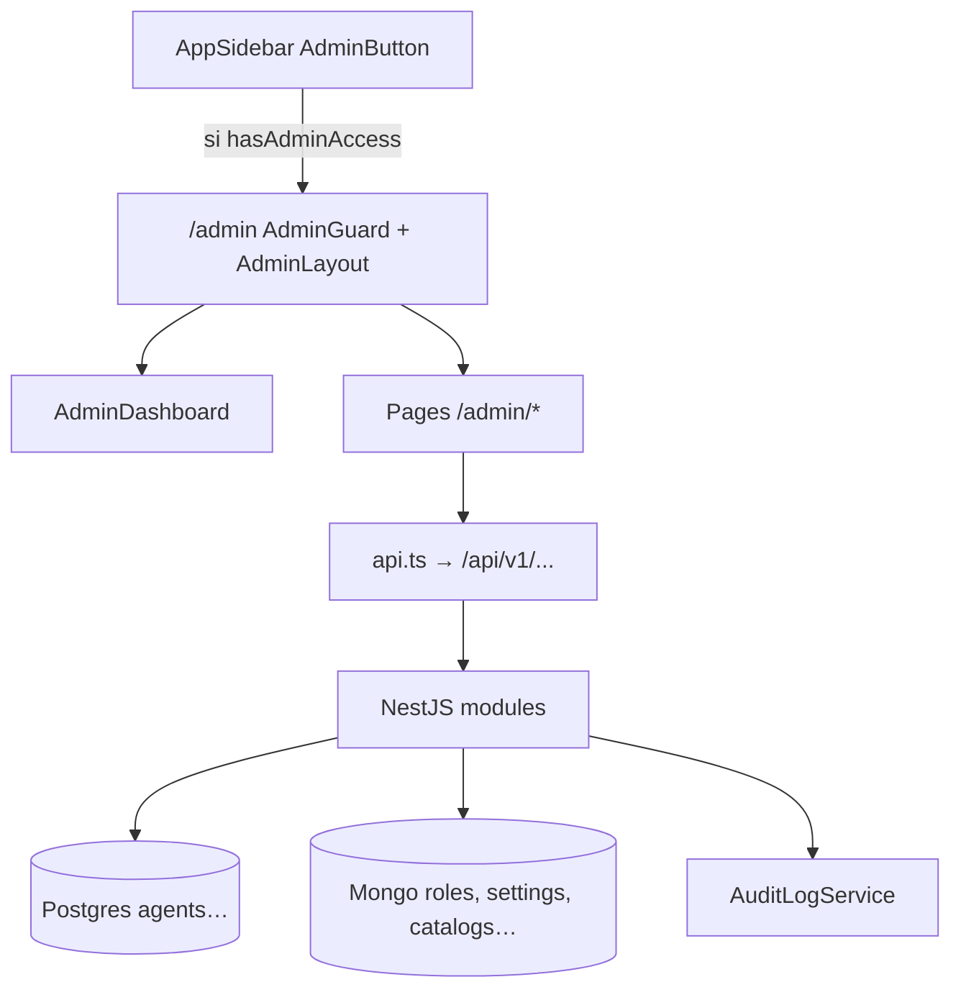

# Panel Admin — documentation technique de référence

> État vérifié dans le code le 25 août 2026.  
> Périmètre : **ensemble des fonctionnalités** du panel admin React (`/admin`) et des APIs NestJS qu’il consomme (`/admin/*`, `/experimental/system`, `/experimental/analytics`, `/usage/plans`, …).  
> Ce n’est **pas** un module NestJS unique : c’est une **coquille UI** (`front/src/modules/admin`) qui orchestre des contrôleurs admin dispersés dans de nombreux modules backend.

Cette note est le document à lire en premier pour un développeur junior. Le `README.md` du module front reste un index ; plusieurs sections y sont **incomplètes** par rapport au menu live (voir §20).

## Table des matières

1. [Objectif et vue d’ensemble](#1-objectif-et-vue-densemble)
2. [Glossaire](#2-glossaire)
3. [Emplacement du code](#3-emplacement-du-code)
4. [Architecture d’accès](#4-architecture-daccès)
5. [Permissions RBAC](#5-permissions-rbac)
6. [Catalogue des écrans (menu live)](#6-catalogue-des-écrans-menu-live)
7. [Détail par domaine](#7-détail-par-domaine)
8. [APIs hors préfixe `/admin`](#8-apis-hors-préfixe-admin)
9. [Routes React et guards](#9-routes-react-et-guards)
10. [Audit, logs, maintenance](#10-audit-logs-maintenance)
11. [Frontend — patterns](#11-frontend--patterns)
12. [Contrats à vérifier des deux côtés](#12-contrats-à-vérifier-des-deux-côtés)
13. [Tests](#13-tests)
14. [Pièges](#14-pièges)
15. [Parcours junior](#15-parcours-junior)
16. [Comment ajouter une page admin](#16-comment-ajouter-une-page-admin)
17. [Fichiers start here](#17-fichiers-start-here)
18. [Hors périmètre](#18-hors-périmètre)
19. [Cartographie contrôleurs backend](#19-cartographie-contrôleurs-backend)
20. [Écarts README vs code](#20-écarts-readme-vs-code)

## 1. Objectif et vue d’ensemble

Le **Panel Admin** permet aux utilisateurs munis de permissions RBAC de configurer la plateforme : comptes, rôles, catalogues (outils, skills, connecteurs, modèles, agents), apparence, maintenance, analytics, Worky, etc.



Trois couches de contrôle :

| Couche | Où | Effet |
|---|---|---|
| **Entrée panel** | `AdminGuard` + `useAdminAccess` | JWT + au moins une permission du menu → sinon redirect `/` |
| **Menu / dashboard** | `ADMIN_MENU_ITEMS` filtré | L’utilisateur ne voit que les cartes/liens autorisés |
| **Page** | `PermissionGuard` (souvent) + **backend** `PermissionsGuard` | Source de vérité = backend ; le front peut être incomplet (voir §14) |

## 2. Glossaire

| Terme | Sens |
|---|---|
| **Panel Admin** | UI `/admin` (shell + pages) |
| **Permission** | Chaîne `namespace.action` ou wildcard `namespace.*` ou `*` |
| **Rôle** | Document Mongo regroupant des permissions ; assigné aux users |
| **Feature visibility** | Interrupteurs sidebar produit (conversation, workspace, …) — **pas** le menu admin |
| **Connected Apps (admin)** | Définitions OAuth user — doc dédiée `connected-app/DOCUMENTATION_TECHNIQUE.md` |
| **Connectors (admin)** | Catalogue MCP — voisin, pas le même produit |
| **Default Agents** | Agents `isDefault` gérés sous `/admin/agents` |
| **`experimental/*`** | Préfixe API historique pour system + analytics (toujours live) |

## 3. Emplacement du code

### Frontend (coquille)

```text
YellowStorm/front/src/modules/admin/
├── constants.ts              # ADMIN_MENU_ITEMS, ADMIN_ACCESS_PERMISSIONS
├── api.ts                    # Tous les appels HTTP admin
├── types.ts                  # Types + catalogue UI des permissions (rôles)
├── hooks/
│   ├── useAdminAccess.ts
│   └── usePermissions.ts     # Miroir du matching wildcard backend
├── components/
│   ├── AdminGuard.tsx
│   ├── PermissionGuard.tsx
│   ├── AdminLayout.tsx
│   ├── AdminSidebar.tsx
│   ├── AdminDashboard.tsx
│   ├── AdminButton.tsx
│   ├── CorsSettingsCard.tsx
│   ├── FeatureVisibilityCard.tsx
│   └── CatalogTransferDialog.tsx
├── pages/                    # Une page (ou dossier) par domaine
└── locales/en.json, fr.json
```

Routing : `YellowStorm/front/src/Router.tsx` (bloc `path: '/admin'`).

### Backend (dispersé)

Pas de `AdminModule` unique. Chaque domaine expose un ou plusieurs `@Controller('admin/...')` (ou `experimental/...`). Liste en §19.

Permissions : `YellowStorm/back/src/modules/authorization/constants/permissions.ts`  
Guard : `PermissionsGuard` (lit `user.permissions` du JWT, **pas** de rechargement DB).

## 4. Architecture d’accès

### 4.1 Entrée

1. `AdminButton` dans la sidebar principale : visible si `hasAdminAccess`.  
2. `hasAdminAccess` = `hasAnyPermission(ADMIN_ACCESS_PERMISSIONS)` où  
   `ADMIN_ACCESS_PERMISSIONS = unique(flatMap(ADMIN_MENU_ITEMS.permissions))`.  
3. Navigation `/admin` → `AdminGuard` : non authentifié **ou** sans accès → `Navigate` vers `/`.  
4. `AdminLayout` : sidebar admin + `<Outlet />`.  
5. Index `/admin` : `AdminDashboard` = grille des `accessibleMenuItems` uniquement.

### 4.2 Matching des permissions (front = back)

Logique commune (`usePermissions` / `hasPermission`) :

1. `*` → tout.  
2. Match exact.  
3. Wildcards parents : pour `admin.roles.read`, accepter `admin.*` (et éventuellement `admin.roles.*` si présent).

Le menu passe une **liste** avec `*` en dernier : `hasAnyPermission(['users.read', 'users.*', '*'])`.

### 4.3 Backend

`@UseGuards(PermissionsGuard)` + `@RequirePermissions(...)`  
Mode défaut = **`all`** (toutes les permissions listées).  
Beaucoup d’admin connected-apps / lists utilisent le mode **`any`** explicitement.

Permissions **figées dans le JWT** à la connexion / refresh. Changer le rôle d’un user **n’actualise pas** immédiatement le token déjà émis.

## 5. Permissions RBAC

### 5.1 Namespaces utilisés par le panel

| Namespace | Exemples | Écrans typiques |
|---|---|---|
| `users.*` | read, suspend, activate, assign_plan, assign_role | Utilisateurs |
| `admin.roles.*` / `admin.audit` / `admin.logs` / `admin.*` | | Rôles, audit, logs, guardrails, evaluation, playbook prompts (menu) |
| `auth_providers.*` | | Auth Providers |
| `connected_apps.*` | | Applications connectées |
| `plans.*` | read_all, create, update, delete | Formules |
| `reports.*` | | Signalements |
| `models.*` | | Modèles |
| `agent_types.*` | | Types d’agents |
| `agents.*` | | Agents par défaut |
| `tools.*` / `skills.*` / `connectors.*` | | Catalogues agent |
| `analytics.*` | | Analytics |
| `system.*` | maintenance, registration, skip_maintenance | System, Appearance, Playbook settings |
| `workspaces.*` | | Workspace settings |
| `conversations.settings.manage` / `conversations.*` | | Conversation settings |
| `team_auto_builder.*` | | Team Auto-Builder |
| `worky.admin.governance` / `worky.admin.*` | | Worky WhatsApp system (+ gouvernance URL) |
| `playbook.*` | | Certaines APIs playbook-flow prompts |
| `*` | Super admin | Tout |

Constantes TypeScript : objet `Permissions` + set `ALL_PERMISSIONS` (validation à l’assignation de rôle).

### 5.2 Permissions absentes / incohérentes

| Cas | Détail |
|---|---|
| `system.cors` | Utilisé par `POST /experimental/system/cors` via `@RequirePermissions('system.cors')` — **absent** de `Permissions` et de `ALL_PERMISSIONS`. Un rôle ne peut pas se voir assigner littéralement `system.cors` via validation. En pratique : `system.*` ou `*` matche via wildcard parent. |
| `connectors.transfer_security` | Déclaré dans l’objet `Permissions`, **absent** du set `ALL_PERMISSIONS` (vérifier avant d’assigner). |
| Menu `admin.*` pour playbook prompts / guardrails / evaluation | Backend playbook-flow prompts exige parfois `playbook.read` (autre contrôleur, voir §14). |

## 6. Catalogue des écrans (menu live)

Source de vérité UI : `ADMIN_MENU_ITEMS` dans `constants.ts`.  
Libellés FR : namespace i18n `admin` (`locales/fr.json`).

| id | Route | Permissions menu (any) | Page |
|---|---|---|---|
| appearance | `/admin/appearance` | `system.maintenance`, `system.registration`, `system.*`, `*` | AppearancePage |
| users | `/admin/users` | `users.read`, `users.*`, `*` | UsersPage |
| roles | `/admin/roles` | `admin.roles.read`, `admin.*`, `*` | RolesPage |
| auth-providers | `/admin/auth-providers` | `auth_providers.read`, … | AuthProvidersPage |
| connected-apps | `/admin/connected-apps` | `connected_apps.read`, … | ConnectedAppsAdminPage |
| audit | `/admin/audit` | `admin.audit.read`, `admin.*`, `*` | AuditLogsPage |
| logs | `/admin/logs` | `admin.logs.read`, `admin.*`, `*` | LogsPage |
| plans | `/admin/plans` | `plans.read_all`, `plans.*`, `*` | PlansPage |
| reports | `/admin/reports` | `reports.read`, … | ReportsPage |
| models | `/admin/models` | `models.read_all`, … | ModelsPage |
| guardrails | `/admin/guardrails` | `admin.*`, `*` | GuardrailsPage |
| evaluation-settings | `/admin/evaluation-settings` | `admin.*`, `*` | EvaluationSettingsPage |
| agent-types | `/admin/agent-types` | `agent_types.read`, … | AgentTypesPage |
| agents | `/admin/agents` | `agents.read`, … | DefaultAgentsPage |
| playbook-prompts | `/admin/playbook-prompts` | `admin.*`, `*` | PlaybookPromptsPage |
| playbook-settings | `/admin/playbook-settings` | `system.maintenance`, `system.*`, `*` | PlaybookSettingsPage |
| workspace-settings | `/admin/workspace-settings` | `workspaces.*`, `*` | WorkspaceSettingsPage |
| conversation-settings | `/admin/conversation-settings` | `conversations.settings.manage`, `conversations.*`, `*` | ConversationSettingsPage |
| worky-whatsapp-system | `/admin/worky-whatsapp-system` | `worky.admin.governance`, `worky.admin.*`, `*` | WorkyWhatsAppSystemBotPage |
| tools | `/admin/tools` | `tools.read`, … | ToolsPage |
| skills | `/admin/skills` | `skills.read`, … | SkillsPage |
| connectors | `/admin/connectors` | `connectors.read`, … | ConnectorsPage |
| analytics | `/admin/analytics` | `analytics.read`, … | AnalyticsPage |
| team-auto-builder | `/admin/team-auto-builder` | `team_auto_builder.read`, … | TeamAutoBuilderPage |
| system | `/admin/system` | `system.maintenance`, `system.registration`, `system.*`, `*` | SystemPage |

### Route présente mais **hors menu**

| Route | PermissionGuard | Note |
|---|---|---|
| `/admin/worky-governance` | `worky.admin.governance`, `worky.admin.*`, `*` | `WorkyGovernanceAdminPage` — lien depuis la page WhatsApp system ; **pas** dans `ADMIN_MENU_ITEMS` → invisible dashboard/sidebar |

## 7. Détail par domaine

### 7.1 Appearance

- **UI** : thèmes couleurs, logos.  
- **API** : `GET/POST /experimental/system/appearance` (GET public ; POST `system.maintenance`).  
- Effet collatéral write : `applyAppearanceToAllUsers(defaultColorTheme)`.

### 7.2 System

Page unique regroupant :

| Carte | API | Permission write |
|---|---|---|
| Maintenance | `GET/POST …/maintenance` | GET **public** ; POST `system.maintenance` |
| Registration | `GET/POST …/registration` | GET public ; POST `system.registration` |
| Feature visibility | `GET/PUT …/features` | GET authentifié ; PUT `system.maintenance` |
| CORS | `GET/POST …/cors` | GET public ; POST `system.cors` (voir §5.2) |

Feature visibility (sidebar **produit**, pas admin) :

```ts
{ conversation, workspace, playbook, governance, appMarketplace, worky, agents }
```

Défauts : tous `true` (`DEFAULT_FEATURE_VISIBILITY`).

Maintenance : `MaintenanceGuard` global côté Nest ; endpoints system marquées `@SkipMaintenance()`. Permission `system.skip_maintenance` pour contourner.

### 7.3 Utilisateurs

- **API** : `/admin/users` — list (search, status, pagination), suspend, activate, assign-plan.  
- Assign rôle : via `/admin/roles/assign` (pas uniquement users).  
- Permissions fines : `users.suspend`, `users.activate`, `users.assign_plan`, `users.assign_role`.

### 7.4 Rôles

- **API** : `/admin/roles` CRUD, assign/unassign, `user/:userId`.  
- Lecture : `admin.roles.read` ; mutation : `admin.roles.manage`.  
- UI catalogue des permissions : `types.ts` (labels i18n) — doit rester aligné avec `ALL_PERMISSIONS`.

### 7.5 Auth Providers

- SSO login YellowStorm (Microsoft, …) — **pas** connected-apps.  
- **API** : `/admin/auth-providers`.  
- Doc séparée éventuelle côté `auth-provider`.

### 7.6 Applications connectées

- Définitions OAuth user.  
- **API** : `/admin/connected-apps`.  
- **Doc** : `YellowStorm/back/src/modules/connected-app/DOCUMENTATION_TECHNIQUE.md`.

### 7.7 Audit Logs

- **API** : `/admin/audit-logs` (+ `/actions`, `/features`).  
- Trace les actions admin (`AuditLogService.logSuccess` / échecs).  
- Permission : `admin.audit.read`.

### 7.8 System Logs

- **API** : `/admin/logs` (+ levels, contexts, counts).  
- Logs applicatifs (Pino / storage), distincts de l’audit.  
- Permission : `admin.logs.read`.

### 7.9 Formules (Plans)

- **API** : `/usage/plans` et `/usage/plans/all` (module `usage`, **pas** `/admin/plans`).  
- Permission list all : `plans.read_all`.

### 7.10 Signalements (Reports)

- Messages signalés par les users.  
- **API** : endpoints `reports` (voir `API_ENDPOINTS.reports`).  
- Permissions : `reports.read` / `reports.update`.

### 7.11 Modèles

- Catalogue modèles IA (sync, défaut, update).  
- **API** : `/admin/models`.  
- Permissions : `models.read_all`, `models.update`, `models.set_default`.

### 7.12 Guardrails

- Garde-fous globaux agents.  
- **API** : `GET/PUT /admin/guardrails`.  
- Backend exige `admin.*` (`Permissions.ADMIN_ALL`) — pas seulement une sous-permission `admin.roles.read`.

### 7.13 Evaluation settings

- Fiabilité des réponses runtime.  
- **API** : `/admin/evaluation-settings`.  
- Backend : `admin.*`.

### 7.14 Types d’agents & Agents par défaut

- Types : `/admin/agent-types` (+ prompts).  
- Agents default : `/admin/agents` ; widget tokens : `/admin/agents/:agentId/widget-tokens`.  
- Doc agents : `YellowStorm/back/src/modules/agent/DOCUMENTATION_TECHNIQUE.md`.

### 7.15 Playbook prompts & node templates

- **UI** : `/admin/playbook-prompts` (prompts + templates de nœuds).  
- **APIs** :  
  - `/admin/playbook-prompts`  
  - `/admin/playbook-node-templates`  
- **Attention** : deux contrôleurs Nest déclarent `@Controller('admin/playbook-prompts')` :  
  - `playbook` → `@RequirePermissions(ADMIN_ALL)`  
  - `playbook-flow` → `playbook.read` / `playbook.create` / …  
  Lequel gagne dépend de l’ordre d’enregistrement des modules. Traiter comme **conflit de routes** jusqu’à clarification produit.

### 7.16 Playbook settings

- Inférence / agents planner & suggestor.  
- **API** : `/admin/playbook-settings` (+ listes d’agents).  
- Menu : `system.maintenance` (pas `playbook.*`).

### 7.17 Workspace settings

Trois sous-domaines sur une page :

| Sous-domaine | API |
|---|---|
| Uploads (extensions) | `/admin/workspace-settings/uploads` |
| Evidence search (connecteur) | `/admin/workspace-settings/evidence-search` |
| Transformations (agent decision flow) | `/admin/workspace-settings/transformations` |

Permission menu : `workspaces.*`. Doc workspace utilisateur : `workspace/DOCUMENTATION_TECHNIQUE.md`.

### 7.18 Conversation settings

- Suggestions composer (agent, debounce, rate limit, tokens).  
- **API** : `/admin/conversation-settings` (+ `/agents`).  
- Permission : `conversations.settings.manage`.

### 7.19 Worky

| Écran | Route | API typique |
|---|---|---|
| WhatsApp system bot | `/admin/worky-whatsapp-system` | `/admin/worky/whatsapp-system-bot` (+ Socket.IO pairing) |
| Gouvernance Worky | `/admin/worky-governance` | `worky/admin/governance-policy` (**préfixe hors `/admin` Nest classique**) |

Permissions : `worky.admin.governance`.

### 7.20 Tools / Skills / Connectors

| Catalogue | Admin API | Extras |
|---|---|---|
| Tools | `/admin/tools`, `/admin/tool-categories` | `requiredAppKey` → connected apps |
| Skills | `/admin/skills`, `/admin/skill-categories` | import / export |
| Connectors | `/admin/connectors`, categories, OAuth admin, inspect, import MCP | Catalog transfer `/admin/catalog-transfer` |

Connectors ≠ Connected Apps. OAuth admin connecteur ≠ callback `/connected-apps/.../callback`.

### 7.21 Analytics

- **API** : `/experimental/analytics/{users,usage,conversations,quality,summary}`.  
- Permission contrôleur : `analytics.read` (class-level).

### 7.22 Team Auto-Builder

- Config génération d’équipes par LLM.  
- **API** : `/admin/teams/auto-builder-config`.  
- Permissions : `team_auto_builder.read` / `update`.

### 7.23 Chat completion (API admin sans page menu dédiée)

- **API** : `/admin/chat-completion`.  
- Permissions : `chat_completion.read` / `update`.  
- Pas d’entrée dans `ADMIN_MENU_ITEMS` (consommé indirectement / outils internes).

## 8. APIs hors préfixe `/admin`

Le panel n’appelle pas que `/admin/*` :

| Préfixe | Usage panel |
|---|---|
| `/experimental/system/*` | System, Appearance, CORS, features |
| `/experimental/analytics/*` | Analytics |
| `/usage/plans*` | Plans |
| `/worky/admin/governance-policy` | Worky governance |
| `/connected-apps` (user) | Non — l’admin connected-apps utilise `/admin/connected-apps` |

Toujours préfixe global `/api/v1` (ou `API_PREFIX`).

## 9. Routes React et guards

Structure dans `Router.tsx` :

```text
/admin → AdminGuard
  └─ AdminLayout
       ├─ index → AdminDashboard
       ├─ nombreuses routes (certaines avec PermissionGuard)
       └─ DOUBLONS : users, roles, audit, logs, plans, reports, models,
          guardrails, tools, auth-providers, connected-apps, agent-types,
          agents, analytics, system
```

### Comportement React Router v6

Les chemins frères en double : **la première déclaration gagne**.  
Or la **première** série pour `users`, `roles`, `audit`, `logs`, `plans`, `reports`, `models`, `guardrails`, `tools`, `agent-types`, `agents`, `analytics`, `system`, `appearance`, `skills`, `connectors`, `playbook-prompts` est **sans** `PermissionGuard`.

Conséquences :

1. Les secondes déclarations **avec** `PermissionGuard` sont mortes pour ces paths.  
2. La protection page repose alors sur : menu filtré + **API backend**.  
3. Un user qui connaît l’URL `/admin/users` **peut charger la page** s’il a **n’importe quelle** permission d’entrée admin (ex. `analytics.read`) — les appels API échoueront en 403 s’il n’a pas `users.read`.  
4. Pages **uniquement** dans la première série non gardée : `appearance`, `skills`, `connectors`, `playbook-prompts`, `analytics` (analytics n’a pas de 2ᵉ entrée non plus dans le premier bloc… en fait analytics est dans le premier bloc sans guard, et aussi dans le second **avec** guard — le premier gagne).

Pages correctement gardées dès la première (et seule) déclaration utile :

- `evaluation-settings`, `playbook-settings`, `workspace-settings`, `conversation-settings`, `worky-governance`, `worky-whatsapp-system`, `team-auto-builder`, `auth-providers` / `connected-apps` (2ᵉ enregistrement mort si 1ᵉ sans guard… auth-providers et connected-apps n’apparaissent **que** dans le bloc gardé).

Vérification live `Router.tsx` : `appearance`, `users`, … `system` apparaissent d’abord **sans** guard ; `auth-providers` / `connected-apps` seulement **avec** guard.

## 10. Audit, logs, maintenance

| Mécanisme | Rôle |
|---|---|
| `AuditLogService` | Persiste qui a fait quoi (maintenance, CORS, users, roles, …) |
| `/admin/logs` | Logs techniques applicatifs |
| `MaintenanceGuard` | Bloque l’API quand maintenance ON (sauf `@SkipMaintenance`, `@Public` listés) |
| Feature visibility | Masque des entrées sidebar **user**, pas l’admin |

Ne pas confondre audit (compliance admin) et system logs (debug).

## 11. Frontend — patterns

- **i18n** : namespace `admin` obligatoire pour labels UI.  
- **API** : centraliser dans `api.ts` + `API_ENDPOINTS`.  
- **Permissions boutons** : `usePermissions().hasPermission('users.suspend')` en plus du guard de route.  
- **Pas de Zustand dédié admin** : state local React Query / `useState` par page.  
- **Catalog transfer** : dialog partagé tools/skills/connectors.  
- **Worky pairing** : `useWorkySystemBotPairingSocket` (Socket.IO).

## 12. Contrats à vérifier des deux côtés

1. Permission menu ⊆ permissions réellement exigées par l’API (sinon page vide / 403).  
2. JWT permissions à jour après changement de rôle (re-login / refresh token).  
3. `ADMIN_MENU_ITEMS` ↔ routes `Router.tsx` ↔ i18n `labelKey`.  
4. Catalogue permissions UI (`types.ts`) ↔ `ALL_PERMISSIONS` backend.  
5. Feature visibility keys ↔ consommation sidebar produit.  
6. Appearance write → impact tous les users (`defaultColorTheme`).  
7. Connected app `appKey` ↔ tools `requiredAppKey` ↔ connectors `connectedAppKey`.  
8. Playbook prompts : clarifier quel contrôleur répond réellement.  
9. CORS origins : ne pas se lock-out (origin front absente).  
10. Maintenance : garder un compte avec `system.maintenance` + `system.skip_maintenance`.

## 13. Tests

Frontend (échantillon) :

- `AdminGuard.test.tsx`, `PermissionGuard.test.tsx`, `AdminLayout.test.tsx`, `AdminSidebar.test.tsx`  
- `useAdminAccess.test.tsx`, `constants.test.ts`, `api.test.ts`  
- Pages : Models, Conversation/Workspace/Playbook settings, Evaluation, …

Backend : specs colocated sur chaque `admin-*.controller.ts` / service.

```bash
cd YellowStorm/front
npx vitest run src/modules/admin

cd YellowStorm/back
npx jest src/modules/authorization --no-coverage
# + modules concernés (user, system, tool, …)
```

## 14. Pièges

1. **Pas un seul module backend** — chercher le contrôleur du domaine.  
2. **Permissions dans le JWT** — stale après edit rôle.  
3. **Routes React en double** — `PermissionGuard` souvent contourné (1ʳᵉ route sans guard).  
4. **URL deep-link** : entrée panel avec une permission A, ouvrir page B → UI charge, API 403.  
5. **`worky-governance` hors menu**.  
6. **`system.cors` hors registry** `ALL_PERMISSIONS`.  
7. **Deux contrôleurs `admin/playbook-prompts`**.  
8. **Guardrails / evaluation / playbook prompts menu** : `admin.*` strict côté plusieurs APIs (`ADMIN_ALL`), pas `admin.roles.read`.  
9. **Feature visibility ≠ menu admin**.  
10. **`experimental/system` et `experimental/analytics`** : nom « experimental » mais **production**.  
11. **Plans sous `/usage`**, pas `/admin/plans`.  
12. **Connected apps ≠ connectors ≠ auth providers**.  
13. **Default agents admin ≠ agents personnels user** (`/agents`).  
14. **Super admin `*`** vs rôle « admin » partiel — tester avec un rôle minimal.  
15. **Audit** : certaines actions doivent appeler `AuditLogService` ; une nouvelle page sans audit = trou compliance.  
16. **Appearance POST** propage le thème à **tous** les users.  
17. **Chat-completion admin** sans entrée menu.  
18. **Connectors OAuth admin** distinct du OAuth user connected-app.

## 15. Parcours junior

1. Se connecter avec un compte `*` ou rôle admin. Vérifier bouton **Admin** sidebar.  
2. Ouvrir `/admin` : seules les cartes de vos permissions.  
3. **System** : lire maintenance (ne pas activer en prod sans plan).  
4. **Roles** : créer un rôle `users.read` seul → se connecter avec → vérifier menu réduit + 403 sur `/admin/models` API.  
5. **Tools** : créer un outil avec `requiredAppKey`, lier une connected app.  
6. **Connectors** : inspect MCP (auth connected_app ou credential).  
7. **Workspace settings** : ajouter une extension upload, vérifier côté user.  
8. Lire l’audit après une action (suspend user, toggle maintenance).

## 16. Comment ajouter une page admin

1. Backend : contrôleur `@Controller('admin/...')` + `@RequirePermissions` + tests + éventuellement audit.  
2. Ajouter permission dans `Permissions` **et** `ALL_PERMISSIONS` (+ i18n rôles front si exposée).  
3. Front : page sous `pages/`, fonctions dans `api.ts`, endpoints dans `config.ts`.  
4. Entrée dans `ADMIN_MENU_ITEMS` (permissions d’entrée).  
5. Route dans `Router.tsx` avec **`PermissionGuard` dès la première (et unique) déclaration**.  
6. Clés i18n `admin` en / fr.  
7. Ne pas oublier : boutons d’action avec permissions fines ; pas seulement le menu.

## 17. Fichiers start here

| Besoin | Fichier |
|---|---|
| Menu + accès panel | `front/.../admin/constants.ts` |
| Matching permissions UI | `front/.../admin/hooks/usePermissions.ts` |
| Routes | `front/src/Router.tsx` |
| API client | `front/.../admin/api.ts` |
| Registry permissions | `back/.../authorization/constants/permissions.ts` |
| Guard API | `back/.../authorization/guards/permissions.guard.ts` |
| System / appearance / CORS | `back/.../system/system.controller.ts` |
| Users admin | `back/.../user/admin-user.controller.ts` |

## 18. Hors périmètre

- UI produit conversation / workspace / playbook (hors réglages admin).  
- Gouvernance documentaire entreprise (`governance.*`) — permissions existent, **pas** d’entrée `ADMIN_MENU_ITEMS` dans ce panel.  
- App Market user.  
- Détail runtime ADK / gRPC.  
- Docs dédiées déjà écrites : conversation, workspace, agent/team, connected-app.

## 19. Cartographie contrôleurs backend

| Contrôleur (préfixe) | Module |
|---|---|
| `admin/users` | user |
| `admin/roles` | authorization |
| `admin/audit-logs` | authorization |
| `admin/logs` | authorization |
| `admin/auth-providers` | auth-provider |
| `admin/connected-apps` | connected-app |
| `admin/models` | models |
| `admin/tools`, `admin/tool-categories` | tool |
| `admin/skills`, `admin/skill-categories` | skill |
| `admin/connectors`, oauth, categories, catalog-transfer | connector |
| `admin/agent-types` | agent-type |
| `admin/agents`, widget-tokens | agent / widget-chat |
| `admin/guardrails` | guardrails |
| `admin/evaluation-settings` | evaluation |
| `admin/playbook-prompts` | playbook **et** playbook-flow |
| `admin/playbook-node-templates` | playbook |
| `admin/playbook-settings` | playbook-flow |
| `admin/conversation-settings` | system |
| `admin/workspace-settings/*` | system |
| `admin/teams/auto-builder-config` | team |
| `admin/worky/whatsapp-system-bot` | worky |
| `worky/admin/governance-policy` | worky |
| `admin/chat-completion` | chat-completion |
| `experimental/system` | system |
| `experimental/analytics` | analytics |
| `usage` (plans) | usage |

## 20. Écarts README vs code

| README front admin | Code |
|---|---|
| Liste partielle des features | Menu live beaucoup plus large (appearance, connected-apps, guardrails, evaluation, workspace/conversation/playbook settings, Worky, team auto-builder, …) |
| Sous-entend une protection page uniforme | Routes dupliquées ; plusieurs pages sans `PermissionGuard` effectif |
| Omet `experimental/*` | System + analytics y sont |
| Omet conflit playbook-prompts | Deux contrôleurs même path |
| Omet `worky-governance` hors menu | Route live |

---

**Documents voisins utiles**

- Agents / équipes : `YellowStorm/back/src/modules/agent/DOCUMENTATION_TECHNIQUE.md`  
- Applications connectées : `YellowStorm/back/src/modules/connected-app/DOCUMENTATION_TECHNIQUE.md`  
- Workspace : `YellowStorm/back/src/modules/workspace/DOCUMENTATION_TECHNIQUE.md`  
- Conversation : `YellowStorm/back/src/modules/conversation/DOCUMENTATION_TECHNIQUE.md`
