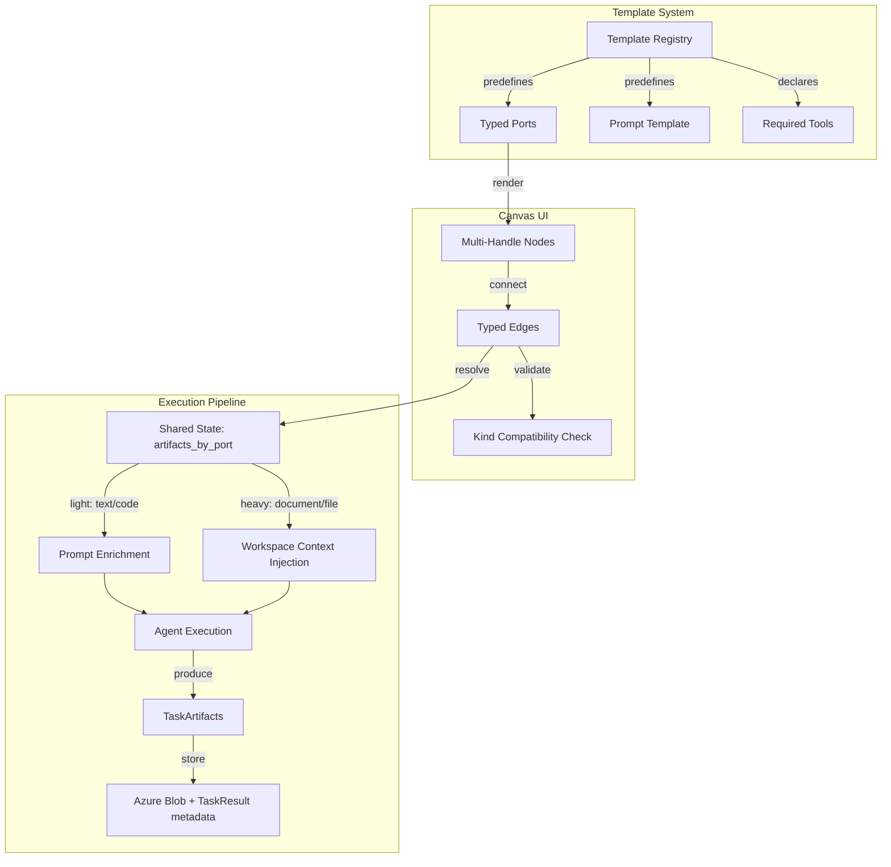

# Playbook Task Toolbar — Implementation Plan

> **Status:** Planning | **Created:** 2026-03-30 | **Last Updated:** 2026-03-30

## Purpose

Introduce a template-driven toolbar in the Playbook canvas that lets users create pre-configured task nodes (Summarizer, SlideGen, DocxGen, CodeTask, etc.) instead of blank steps. This requires evolving the inter-task data flow from text-only prompt injection to a **typed port / artifact model**, so that generated artifacts (documents, dashboards, code, text) are first-class objects that can be visually inspected, downloaded, and linked as inputs to downstream tasks.

## Problem Statement

### Current Inter-Task Data Flow (Text-Only)

```
Task A completes
  -> state["task_outputs"]["summary"] = "raw text string"
  -> state["results"]["task_A"] = { output: "text", components: [...artifacts...] }

Task B starts
  -> _build_structured_context() reads task_outputs by key name
  -> Injects into prompt: "Context from previous tasks: <raw text>"
```

### Identified Gaps

| Gap | Current State | Required State |
|-----|---------------|----------------|
| **Output declaration** | `outputKey: string` (single name, no type) | Typed output ports per task (a Summarizer produces `text`, a DocxGen produces `document`) |
| **Input declaration** | `inputKeys: string[]` (just key names, no type) | Typed input ports with expected artifact kinds |
| **Edge data flow** | `{ sourceId, targetId }` (execution ordering only) | Port-to-port connections with type awareness |
| **Artifact passing** | Only `output: string` flows between tasks | Structured artifacts (files, URLs, code) must be routable to downstream agents |
| **Artifact visibility** | `ArtifactComponent` exists but is display-only | Users must see, download, and link artifacts from node to node |
| **Execution engine** | `_build_structured_context()` concatenates text | Must resolve artifact references and pass structured data to agents |
| **Node handles** | One target (left), one source (right) — no IDs, no types | Multiple typed handles per side, one per port |
| **Port editing** | `inputKeys`/`outputKey` exist in type but have **no UI** | Port management section in node editor |
| **Templates** | None — every task starts blank | Registry of predefined templates with pre-wired ports and prompt templates |
| **Tool validation** | Tools bound to agents, no link to tasks | Templates declare required tools; UI warns on mismatch |

---

## Proposed Architecture

### High-Level Data Flow



### Design Decisions

| Decision | Rationale | Alternatives Considered |
|----------|-----------|------------------------|
| Typed port model on PlaybookTask | Enables type-safe artifact routing, visual port rendering, and template pre-configuration | Keep `inputKeys`/`outputKey` only — insufficient for artifact-first workflows |
| `ArtifactKind` enum instead of open schema | Prevents invalid connections, enables color-coding, simplifies validation | Open schema — too permissive, no visual consistency |
| Hybrid artifact consumption (prompt + workspace) | Text/code injected into prompt for immediate context; documents/files injected into workspace for agent tool access | Prompt-only — loses file access for documents. Workspace-only — loses inline context for text |
| Hybrid artifact storage (TaskResult metadata + Azure Blob) | Metadata stays with execution for fast queries; actual files in Blob for size/efficiency | Inline in MongoDB — bloats large executions. Separate collection — unnecessary complexity |
| Build ports + templates together in one pass | No intermediate migration needed, no throwaway code, templates fully leverage typed ports from day one | Ports first — delays user-visible value. Toolbar first — creates migration debt |
| Port-to-port edges with sourceOutputPortId/targetInputPortId | Explicit wiring, supports multiple outputs per task, enables per-connection type checking | Keep sourceId/targetId only — can't distinguish which output feeds which input |
| Built-in template registry on frontend | Version-controlled with app, zero backend dependency for Phase 1, instant access | Backend-only templates — unnecessary roundtrip, harder to ship defaults |
| Backward-compatible migration via lazy auto-fill | Existing playbooks get default ports on first PATCH — no bulk migration script, no downtime | Bulk migration — risky, requires downtime |

---

## Data Model Changes

### 1. Frontend Types (`YellowStorm/front/src/modules/playbook/types.ts`)

#### New Types

```typescript
export type ArtifactKind = 'text' | 'document' | 'code' | 'image' | 'data' | 'slide_deck' | 'dashboard';

export interface TaskOutputPort {
  id: string;
  name: string;
  artifactKind: ArtifactKind;
  description?: string;
}

export interface TaskInputPort {
  id: string;
  name: string;
  artifactKind: ArtifactKind;
  required: boolean;
  description?: string;
}

export interface TaskArtifact {
  portId: string;
  artifactKind: ArtifactKind;
  content?: string;
  url?: string;
  filename?: string;
  mimeType?: string;
  size?: number;
  metadata?: Record<string, unknown>;
}

export interface TaskTemplate {
  id: string;
  type: string;
  title: string;
  description: string;
  icon: string;
  color: string;
  category: 'content' | 'generation' | 'analysis' | 'code';
  inputPorts: TaskInputPort[];
  outputPorts: TaskOutputPort[];
  promptTemplate: string;
  recommendedAgentTypeSlug: string | null;
  requiredToolNames: string[];
}
```

#### Extend `PlaybookTask`

```typescript
export interface PlaybookTask {
  // ... all existing fields ...

  // NEW:
  taskType: string;            // 'generic' | 'summarizer' | 'docxgen' | etc.
  inputPorts: TaskInputPort[];
  outputPorts: TaskOutputPort[];

  // DEPRECATED (kept for backward compatibility, auto-migrated):
  inputKeys?: string[];
  outputKey?: string;
}
```

#### Extend `PlaybookEdge`

```typescript
export interface PlaybookEdge {
  id: string;
  sourceId: string;
  sourceOutputPortId: string;   // NEW
  targetId: string;
  targetInputPortId: string;    // NEW
}
```

#### Extend `TaskResult`

```typescript
export interface TaskResult {
  // ... all existing fields ...

  // NEW:
  artifacts?: TaskArtifact[];
}
```

---

### 2. Backend Schemas

#### `playbook.schema.ts` — PlaybookTask

Add sub-schemas and fields:

```typescript
@Schema({ _id: false, strict: false })
export class TaskInputPortSchema {
  @Prop({ type: String, required: true })
  id!: string;

  @Prop({ type: String, required: true })
  name!: string;

  @Prop({ type: String, enum: ['text','document','code','image','data','slide_deck','dashboard'], required: true })
  artifactKind!: string;

  @Prop({ type: Boolean, default: false })
  required!: boolean;

  @Prop({ type: String })
  description?: string;
}

@Schema({ _id: false, strict: false })
export class TaskOutputPortSchema {
  @Prop({ type: String, required: true })
  id!: string;

  @Prop({ type: String, required: true })
  name!: string;

  @Prop({ type: String, enum: ['text','document','code','image','data','slide_deck','dashboard'], required: true })
  artifactKind!: string;

  @Prop({ type: String })
  description?: string;
}

// On PlaybookTask class:
@Prop({ type: String, enum: [...], default: 'generic' })
taskType!: string;

@Prop({ type: [TaskInputPortSchema], default: [], _id: false })
inputPorts!: TaskInputPortSchema[];

@Prop({ type: [TaskOutputPortSchema], default: [], _id: false })
outputPorts!: TaskOutputPortSchema[];
```

#### `playbook.schema.ts` — PlaybookEdge

```typescript
@Prop({ type: String, required: true, default: 'default' })
sourceOutputPortId!: string;

@Prop({ type: String, required: true, default: 'default' })
targetInputPortId!: string;
```

#### `playbook-execution.schema.ts` — TaskResult sub-document

Add artifacts array to the `TaskResult` sub-document:

```typescript
@Schema({ _id: false })
export class TaskArtifactSchema {
  @Prop({ type: String, required: true })
  portId!: string;

  @Prop({ type: String, enum: ['text','document','code','image','data','slide_deck','dashboard'], required: true })
  artifactKind!: string;

  @Prop({ type: String })
  content?: string;

  @Prop({ type: String })
  url?: string;

  @Prop({ type: String })
  filename?: string;

  @Prop({ type: String })
  mimeType?: string;

  @Prop({ type: Number })
  size?: number;

  @Prop({ type: Schema.Types.Mixed })
  metadata?: Record<string, unknown>;
}

// On TaskResult class:
@Prop({ type: [TaskArtifactSchema], default: [] })
artifacts!: TaskArtifactSchema[];
```

---

### 3. Proto Changes (`chatbot.proto`)

#### New Messages

```protobuf
message TaskOutputPort {
    string id = 1;
    string name = 2;
    string artifact_kind = 3;
    string description = 4;
}

message TaskInputPort {
    string id = 1;
    string name = 2;
    string artifact_kind = 3;
    bool required = 4;
    string description = 5;
}

message TaskArtifact {
    string port_id = 1;
    string artifact_kind = 2;
    string content = 3;
    string url = 4;
    string filename = 5;
    string mime_type = 6;
    int64 size = 7;
}
```

#### Extend Existing Messages

```protobuf
message PlaybookTaskConfig {
    // ... existing fields 1-13 ...

    repeated TaskInputPort input_ports = 14;
    repeated TaskOutputPort output_ports = 15;
    string task_type = 16;
}

message PlaybookEdgeConfig {
    string source_id = 1;
    string target_id = 2;
    string source_output_port_id = 3;   // NEW
    string target_input_port_id = 4;    // NEW
}

message PlaybookTaskResult {
    // ... existing fields 1-10 ...

    repeated TaskArtifact artifacts = 11;  // NEW
}
```

---

### 4. ADK State (`Yellowstorm-adk/src/langgraph_engine/state.py`)

Add to `ExecutionState`:

```python
# Key: "{task_id}:{port_id}", Value: dict matching TaskArtifact
artifacts_by_port: Annotated[Dict[str, Dict[str, Any]], merge_artifacts]
```

New merge reducer:

```python
def merge_artifacts(
    left: Dict[str, Dict[str, Any]], right: Dict[str, Dict[str, Any]]
) -> Dict[str, Dict[str, Any]]:
    if not left:
        return right
    if not right:
        return left
    return {**left, **right}
```

---

### 5. Migration Strategy

Existing playbooks auto-migrate on load. No bulk migration script, no downtime.

**Logic** (runs on first PATCH or when loading for canvas):

```typescript
function migrateTask(task: any): PlaybookTask {
  const hasPorts = task.inputPorts?.length > 0 || task.outputPorts?.length > 0;
  if (hasPorts) return task;

  return {
    ...task,
    taskType: task.taskType || 'generic',
    inputPorts: [
      { id: 'default', name: 'Input', artifactKind: 'text', required: false }
    ],
    outputPorts: [
      { id: 'default', name: 'Output', artifactKind: 'text' }
    ],
  };
}

function migrateEdge(edge: any): PlaybookEdge {
  return {
    ...edge,
    sourceOutputPortId: edge.sourceOutputPortId || 'default',
    targetInputPortId: edge.targetInputPortId || 'default',
  };
}
```

**Backend dual-path resolution** (during transition):

```python
# _build_structured_context() in graph_builder.py
# 1. Try typed ports first (new path)
# 2. Fall back to input_keys / output_key (legacy path)
# Both produce the same prompt enrichment, just different resolution logic
```

---

## Frontend Changes

### 6. Multi-Handle Nodes (`PlaybookNode.tsx`)

Replace the single left/right handle from the shared `Node` wrapper with dynamic typed handles per port.

**Current:**
```tsx
<Node handles={{ target: true, source: true }}>
```

**Proposed:**
```tsx
<Node handles={false}>
  {/* Input ports — left side */}
  {task.inputPorts.map((port, idx) => (
    <Handle
      key={port.id}
      id={`in-${port.id}`}
      type="target"
      position={Position.Left}
      style={{ top: getInputPortTop(idx, task.inputPorts.length) }}
      className={cn('w-3 h-3', PORT_COLORS[port.artifactKind])}
    />
  ))}

  {/* Output ports — right side */}
  {task.outputPorts.map((port, idx) => (
    <Handle
      key={port.id}
      id={`out-${port.id}`}
      type="source"
      position={Position.Right}
      style={{ top: getOutputPortTop(idx, task.outputPorts.length) }}
      className={cn('w-3 h-3', PORT_COLORS[port.artifactKind])}
    />
  ))}

  {/* Port labels — shown on hover */}
  {hoveredPort && (
    <PortLabel position={...} text={hoveredPort.name} kind={hoveredPort.artifactKind} />
  )}
```

**Port color coding:**

| ArtifactKind | Color | Icon |
|---|---|---|
| `text` | Blue | `FileText` |
| `document` | Indigo | `FileType` |
| `code` | Green | `Code` |
| `image` | Pink | `Image` |
| `data` | Amber | `Table` |
| `slide_deck` | Orange | `Presentation` |
| `dashboard` | Purple | `BarChart3` |

**Artifact badges on completed nodes:**

After execution, render artifact indicators next to each output port:
```
┌─────────────────────────────────┐
│ 1. Summarize Report    ✅      │
│ Agent: Researcher               │
│                                 │
│ [in-source] ← Input            │
│ [in-source_doc] ← Document     │
│                                 │
│ 📝 summary.md     [out-summary] →│
│                                 │
│ [▶ Run] [⏸] [📋 Clone] [🗑]   │
└─────────────────────────────────┘
```

Each artifact badge: icon by kind, filename/label, click to preview, drag to connect.

---

### 7. Port-to-Port Edge Drawing (`usePlaybookCanvas.ts`)

**Updated `onConnect` validation:**

```typescript
const onConnect = useCallback((connection: Connection) => {
  // 1. Cycle detection (existing)
  if (wouldCreateCycle(edges, connection.source, connection.target)) return;

  // 2. Port ID extraction from handle IDs
  const sourceOutputPortId = connection.sourceHandle?.replace('out-', '') ?? 'default';
  const targetInputPortId = connection.targetHandle?.replace('in-', '') ?? 'default';

  // 3. Type compatibility check (non-blocking warning)
  const sourcePort = sourceTask.outputPorts.find(p => p.id === sourceOutputPortId);
  const targetPort = targetTask.inputPorts.find(p => p.id === targetInputPortId);
  const isTypeMatch = sourcePort?.artifactKind === targetPort?.artifactKind;
  // If mismatch: allow connection but flag edge visually (yellow dashed)

  // 4. Duplicate prevention (same port-to-port connection)
  const exists = edges.some(e =>
    e.source === connection.source &&
    e.target === connection.target &&
    e.sourceOutputPortId === sourceOutputPortId &&
    e.targetInputPortId === targetInputPortId
  );
  if (exists) return;

  // 5. Create typed edge
  const newEdge: Edge = {
    id: `e-${connection.source}-${sourceOutputPortId}-${connection.target}-${targetInputPortId}`,
    source: connection.source,
    target: connection.target,
    sourceHandle: connection.sourceHandle,
    targetHandle: connection.targetHandle,
    type: isTypeMatch ? 'animated' : 'animated-warning',
    data: { sourceOutputPortId, targetInputPortId, isTypeMatch },
  };

  // ... rest: captureSnapshot, addEdge, store sync
}, [...]);
```

**Edge styling by type match:**

| State | Style |
|---|---|
| Matching kinds | Solid, 2px, source port color |
| Mismatching kinds | Dashed, 2px, yellow |
| Required input missing | Source handle pulses red on the target node |

---

### 8. Template Registry (`task-templates.ts`)

New file: `YellowStorm/front/src/modules/playbook/task-templates.ts`

```typescript
import type { TaskTemplate } from './types';

export const TASK_TEMPLATES: TaskTemplate[] = [
  {
    id: 'summarizer',
    type: 'summarizer',
    title: 'Summarizer',
    description: 'Takes text or documents and produces a structured summary.',
    icon: 'FileText',
    color: 'blue',
    category: 'content',
    inputPorts: [
      { id: 'source', name: 'Source Content', artifactKind: 'text', required: true },
      { id: 'source_doc', name: 'Source Document', artifactKind: 'document', required: false },
    ],
    outputPorts: [
      { id: 'summary', name: 'Summary', artifactKind: 'text' },
    ],
    promptTemplate:
      'Summarize the following content into a clear, structured overview. ' +
      'Highlight key points, decisions, and action items.\n\n{{content}}',
    recommendedAgentTypeSlug: 'researcher',
    requiredToolNames: [],
  },
  {
    id: 'docxgen',
    type: 'docxgen',
    title: 'Document Generator',
    description: 'Generates a professional Word document from structured input.',
    icon: 'FileType',
    color: 'indigo',
    category: 'generation',
    inputPorts: [
      { id: 'content', name: 'Content', artifactKind: 'text', required: true },
      { id: 'template', name: 'Template', artifactKind: 'document', required: false },
    ],
    outputPorts: [
      { id: 'document', name: 'Generated Document', artifactKind: 'document' },
    ],
    promptTemplate:
      'Generate a professional Word document based on the provided content. ' +
      'Use clear headings, proper formatting, and a professional tone.\n\n{{content}}',
    recommendedAgentTypeSlug: 'writer',
    requiredToolNames: ['document_generator'],
  },
  {
    id: 'slidegen',
    type: 'slidegen',
    title: 'Slide Generator',
    description: 'Creates presentation slide content from text or data.',
    icon: 'Presentation',
    color: 'orange',
    category: 'generation',
    inputPorts: [
      { id: 'content', name: 'Content', artifactKind: 'text', required: true },
      { id: 'data', name: 'Supporting Data', artifactKind: 'data', required: false },
    ],
    outputPorts: [
      { id: 'slides', name: 'Slide Deck', artifactKind: 'slide_deck' },
      { id: 'summary', name: 'Speaker Notes', artifactKind: 'text' },
    ],
    promptTemplate:
      'Create a professional presentation based on the following content. ' +
      'Structure slides with clear titles, bullet points, and speaker notes.\n\n{{content}}',
    recommendedAgentTypeSlug: 'writer',
    requiredToolNames: ['slide_generator'],
  },
  {
    id: 'codegen',
    type: 'codegen',
    title: 'Code Generator',
    description: 'Generates or reviews code based on specifications.',
    icon: 'Code',
    color: 'green',
    category: 'code',
    inputPorts: [
      { id: 'spec', name: 'Specification', artifactKind: 'text', required: true },
      { id: 'context', name: 'Existing Code', artifactKind: 'code', required: false },
    ],
    outputPorts: [
      { id: 'code', name: 'Generated Code', artifactKind: 'code' },
      { id: 'explanation', name: 'Explanation', artifactKind: 'text' },
    ],
    promptTemplate:
      'Generate production-ready code based on the following specification. ' +
      'Follow best practices, include error handling, and add inline comments.\n\n{{spec}}',
    recommendedAgentTypeSlug: 'researcher',
    requiredToolNames: ['code_interpreter'],
  },
  {
    id: 'analyzer',
    type: 'analyzer',
    title: 'Data Analyzer',
    description: 'Analyzes data and produces insights or dashboard descriptions.',
    icon: 'BarChart3',
    color: 'purple',
    category: 'analysis',
    inputPorts: [
      { id: 'data', name: 'Data', artifactKind: 'data', required: true },
      { id: 'context', name: 'Context', artifactKind: 'text', required: false },
    ],
    outputPorts: [
      { id: 'insights', name: 'Insights', artifactKind: 'text' },
      { id: 'dashboard', name: 'Dashboard', artifactKind: 'dashboard' },
    ],
    promptTemplate:
      'Analyze the following data and extract key insights, trends, and patterns. ' +
      'Provide actionable recommendations.\n\n{{data}}',
    recommendedAgentTypeSlug: 'researcher',
    requiredToolNames: [],
  },
];
```

---

### 9. Template Picker Component (`TaskTemplatePicker.tsx`)

New file: `YellowStorm/front/src/modules/playbook/components/TaskTemplatePicker.tsx`

**Layout:**

```
┌─────────────────────────────────────────────┐
│ 🔍 Search templates...                     │
├─────────────────────────────────────────────┤
│ [Content] [Generation] [Analysis] [Code]    │
├─────────────────────────────────────────────┤
│ ┌───────────┐ ┌───────────┐ ┌───────────┐  │
│ │ 📝        │ │ 📄        │ │ 📊        │  │
│ │ Summarizer│ │ Docx Gen  │ │ Slides    │  │
│ │           │ │           │ │           │  │
│ │ text→text │ │ text→doc  │ │ text→deck │  │
│ └───────────┘ └───────────┘ └───────────┘  │
│ ┌───────────┐ ┌───────────┐                │
│ │ 💻        │ │ 📈        │                │
│ │ Code Gen  │ │ Analyzer  │                │
│ │           │ │           │                │
│ │ text→code │ │ data→text │                │
│ └───────────┘ └───────────┘                │
└─────────────────────────────────────────────┘
```

**Props:**

```typescript
interface TaskTemplatePickerProps {
  open: boolean;
  onOpenChange: (open: boolean) => void;
  onSelect: (template: TaskTemplate) => void;
  trigger?: React.ReactNode;
}
```

**Behavior:**
- Category tabs filter templates
- Search filters by title and description
- Each card shows: icon, title, description, input/output port indicators (kind icons with arrows)
- Click a card to select the template
- Selected template triggers `onSelect` which creates a pre-configured node on the canvas

---

### 10. Toolbar Integration (`PlaybookToolbar.tsx`)

Convert the existing "Add Step" button into a split dropdown:

```
┌──────────────────────────────────────────────────────────────────────┐
│ [Design|Run] [↩] [↪] [Live ▾] [+ Step ▾] [⊞] [🪄] [📋] [💾] [▶]  │
└──────────────────────────────────────────────────────────────────────┘
                                          │
                          "+ Step" dropdown:
                          ┌───────────────────────────┐
                          │ ✚ Blank Step              │
                          │ ─────────────────────────  │
                          │ 📝 Summarizer              │
                          │ 📊 Slide Generator         │
                          │ 📄 Document Generator      │
                          │ 💻 Code Generator          │
                          │ 📈 Data Analyzer           │
                          │ ─────────────────────────  │
                          │ Browse All Templates...    │
                          └───────────────────────────┘
```

**Implementation:**
- Use `DropdownMenu` from `@/components/ui/dropdown-menu`
- "Blank Step" creates a generic task with default ports (current behavior)
- Template entries create pre-configured tasks via `onSelect(template)`
- "Browse All Templates..." opens the full `TaskTemplatePicker` in a Drawer

---

### 11. Node Editor Updates (`PlaybookNodeEditor.tsx`)

Add a **Ports** section to the editor:

```
┌──────────────────────────────────────┐
│ Node Editor — Summarize Report       │
├──────────────────────────────────────┤
│ Title: [Summarize Report_________]   │
│ Description:                        │
│ [___________________________]       │
│                                     │
│ Ports                               │
│ ── Input Ports ──                   │
│ │ Source Content  (text)  [✓ req]  │
│ │ Source Document (doc)  [  opt]   │
│ │ [+ Add Input Port]              │
│ ── Output Ports ──                  │
│ │ Summary         (text)           │
│ │ [+ Add Output Port]             │
│                                     │
│ Agent: [Researcher ▾]               │
│ ⚠ Tools: No document_generator     │
│                                     │
│ ☑ Enabled    ☐ Interrupt Before     │
│ ☐ Interrupt After                   │
└──────────────────────────────────────┘
```

**For template-based tasks:**
- Ports are shown as read-only with a "Customize" toggle to unlock
- Changing a port kind triggers a re-validation of connected edges
- Required ports are marked; missing required connections shown on node

---

### 12. Store Split

Split `store.ts` (1,982 lines) into focused slices.

| File | ~Lines | Responsibility |
|---|---|---|
| `store/index.ts` | ~30 | Barrel re-export for backward compatibility |
| `store/playbook-list.ts` | ~250 | `playbooks`, `playbooksLoading`, pagination, queries, favorites, bulk ops |
| `store/playbook-editor.ts` | ~650 | `currentPlaybook`, `isDirty`, `isSaving`, `undo/redo`, `tasks`, `edges`, `workspaces`, canvas state, design |
| `store/playbook-execution.ts` | ~800 | `currentExecution`, execution cache, history, SSE handlers, replay, eval, output-format, stop/skip/rerun/resume |
| `store/task-templates.ts` | ~120 | Template registry access, recent templates, user template CRUD (Phase 3) |

**Migration:**
- The barrel `store/index.ts` re-exports all stores
- Existing imports like `import { usePlaybookStore } from '../store'` continue to work
- Components can gradually migrate to importing specific stores: `import { usePlaybookEditorStore } from '../store/playbook-editor'`

---

### 13. Artifact Preview on Nodes

After execution, completed nodes show artifact badges per output port:

```
┌─────────────────────────────────────────┐
│ 2. Generate Report              ✅      │
│ Agent: Writer                          │
│                                         │
│ [in-content] ← Content (text) ✓       │
│                                         │
│ Output Artifacts:                       │
│  📄 report.docx (245 KB) [↓] [out-doc] │
│  📝 summary (1.2 KB)     [↓] [out-txt] │
│                                         │
│ [▶ Run] [⏸] [📋 Clone] [🗑]           │
└─────────────────────────────────────────┘
```

- Click the artifact badge to preview/download
- Drag from the artifact badge to another node's input port to create a typed edge
- Artifacts with `url` open a Blob download; artifacts with `content` show inline preview

---

## Backend Changes

### 14. Execution Service (`playbook-execution.service.ts`)

#### Port-aware gRPC request building

In `runFullWorkflow()`:

```typescript
const request = {
  tasks: enabledTasks.map((t) => ({
    // ... existing fields ...
    input_ports: t.inputPorts?.map(p => ({
      id: p.id,
      name: p.name,
      artifact_kind: p.artifactKind,
      required: p.required,
      description: p.description,
    })) || [],
    output_ports: t.outputPorts?.map(p => ({
      id: p.id,
      name: p.name,
      artifact_kind: p.artifactKind,
      description: p.description,
    })) || [],
    task_type: t.taskType || 'generic',
  })),
  edges: enabledEdges.map((e) => ({
    source_id: e.sourceId,
    target_id: e.targetId,
    source_output_port_id: e.sourceOutputPortId || 'default',
    target_input_port_id: e.targetInputPortId || 'default',
  })),
  // ... rest
};
```

#### Artifact extraction from step results

After receiving `PlaybookTaskResult` from gRPC, extract artifacts from components:

```typescript
private extractArtifactsFromResult(
  task: PlaybookTask,
  result: any,
): TaskArtifact[] {
  const artifacts: TaskArtifact[] = [];

  for (const component of result.components || []) {
    if (component.type === 'artifact') {
      // Match to output port by kind
      const port = task.outputPorts?.find(
        p => p.artifactKind === 'document'
      ) || { id: 'default' };
      artifacts.push({
        portId: port.id,
        artifactKind: 'document',
        url: component.data?.file_path,
        filename: component.data?.filename,
        mimeType: component.data?.mime_type,
      });
    } else if (component.type === 'text') {
      const port = task.outputPorts?.find(
        p => p.artifactKind === 'text'
      );
      if (port) {
        artifacts.push({
          portId: port.id,
          artifactKind: 'text',
          content: component.data?.content,
        });
      }
    } else if (component.type === 'code') {
      const port = task.outputPorts?.find(
        p => p.artifactKind === 'code'
      );
      if (port) {
        artifacts.push({
          portId: port.id,
          artifactKind: 'code',
          content: component.data?.code,
        });
      }
    }
  }

  // Always produce a text artifact from the output field for backward compat
  if (result.output && !artifacts.some(a => a.artifactKind === 'text')) {
    artifacts.push({
      portId: task.outputPorts?.[0]?.id || 'default',
      artifactKind: 'text',
      content: result.output,
    });
  }

  return artifacts;
}
```

#### Single-step artifact resolution

In `gatherContext()`, extend to resolve artifacts from upstream task results:

```typescript
private gatherContext(
  task: any,
  taskOutputs: Map<string, string>,
  taskArtifacts: Map<string, TaskArtifact[]>,
  snapshot: any,
): { promptContext: string; workspaceArtifacts: TaskArtifact[] } {
  const promptParts: string[] = [];
  const workspaceArtifacts: TaskArtifact[] = [];

  // 1. Typed port resolution (new path)
  for (const edge of snapshot.edges || []) {
    if (edge.targetId !== task.id) continue;
    const sourcePortId = edge.sourceOutputPortId || 'default';
    const targetPortId = edge.targetInputPortId || 'default';

    const upstreamArtifacts = taskArtifacts.get(edge.sourceId) || [];
    const artifact = upstreamArtifacts.find(a => a.portId === sourcePortId);

    if (artifact) {
      if (artifact.artifactKind === 'text' || artifact.artifactKind === 'code') {
        // Light: inject into prompt
        const targetPort = task.inputPorts?.find(p => p.id === targetPortId);
        const label = targetPort?.name || sourcePortId;
        promptParts.push(`[${label}]:\n${artifact.content}`);
      } else {
        // Heavy: inject into workspace context
        workspaceArtifacts.push(artifact);
      }
    }
  }

  // 2. Legacy fallback (input_keys / output_key)
  // ... existing logic unchanged ...

  return {
    promptContext: promptParts.join('\n\n'),
    workspaceArtifacts,
  };
}
```

---

### 15. Context Service (`playbook-context.service.ts`)

New method for workspace injection from artifacts:

```typescript
async buildWorkspaceContextFromArtifacts(
  artifacts: TaskArtifact[],
): Promise<Array<{ workspace_id: string; workspace_documents: any[] }>> {
  // For document/image artifacts with URLs:
  // Resolve the Blob URL to a workspace document reference
  // Return in the same format as buildWorkspaceContextFromInputFiles()
  // This allows the agent's RAG tools to access upstream-generated files
}
```

---

## ADK Changes

### 16. Graph Builder (`Yellowstorm-adk/src/langgraph_engine/graph_builder.py`)

#### Updated `_build_structured_context()`

```python
def _build_structured_context(self, task_id, task_config, state):
    """
    Resolve upstream artifacts into:
      1. Prompt text (for light artifacts: text, code)
      2. Workspace files (for heavy artifacts: document, image)
    """
    prompt_parts = []
    workspace_artifacts = []

    input_ports = {p["id"]: p for p in task_config.get("input_ports", [])}
    artifacts_by_port = state.get("artifacts_by_port", {})

    # 1. Typed port resolution (new path)
    for edge in state.get("edges", []):
        if edge.get("target_id") != task_id:
            continue

        source_port_id = edge.get("source_output_port_id", "default")
        target_port_id = edge.get("target_input_port_id", "default")
        artifact_key = f"{edge['source_id']}:{source_port_id}"

        artifact = artifacts_by_port.get(artifact_key)
        if not artifact:
            continue

        target_port = input_ports.get(target_port_id, {})
        label = target_port.get("name", target_port_id)

        if artifact["artifact_kind"] in ("text", "code"):
            prompt_parts.append(f"Input '{label}':\n{artifact.get('content', '')}")
        else:
            # Heavy artifact — add to workspace list for agent tool access
            workspace_artifacts.append(artifact)

    # 2. Legacy fallback (input_keys / output_key)
    input_keys = task_config.get("input_keys") or []
    if input_keys and state.get("task_outputs"):
        for key in input_keys:
            if key not in state["task_outputs"]:
                continue
            # Check we haven't already covered this via ports
            prompt_parts.append(f"Input '{key}':\n{state['task_outputs'][key]}")

    if not prompt_parts:
        # Final fallback: walk edges for raw output
        for edge in state.get("edges", []):
            if edge.get("target_id") != task_id:
                continue
            source_id = edge["source_id"]
            if source_id in state.get("results", {}):
                source_task = next(
                    (t for t in state["tasks"] if t.get("id") == source_id), None
                )
                output = state["results"][source_id].get("output", "")
                if output:
                    title = (source_task or {}).get("title", source_id)
                    prompt_parts.append(
                        f"Previous task '{title}' result:\n{output}"
                    )

    return "\n\n".join(prompt_parts), workspace_artifacts
```

#### Artifact storage in state

At the end of task node execution, store artifacts:

```python
# After task completes:
output_text = task_result.get("output", "")
output_ports = task_config.get("output_ports", [])
artifacts = task_result.get("artifacts", [])

state_update = {
    "completed_task_ids": [task_id],
    "results": {task_id: task_result},
    "node_timings": new_node_timings,
}

# Store artifacts keyed by port
if artifacts:
    port_artifacts = {}
    for artifact in artifacts:
        key = f"{task_id}:{artifact['port_id']}"
        port_artifacts[key] = artifact
    state_update["artifacts_by_port"] = port_artifacts

# Legacy: store text output under output_key
output_key = task_config.get("output_key")
if output_key and output_text:
    state_update["task_outputs"] = {output_key: output_text}

return state_update
```

---

### 17. Step Executor (`Yellowstorm-adk/src/langgraph_engine/step_executor.py`)

#### Workspace artifact injection

Update `execute_step()` to handle heavy artifacts:

```python
async def execute_step(
    task, agent, context_from_dependencies="", workspace_artifacts=None, ...
):
    user_prompt = f"Task: {task['title']}\n\nDescription:\n{task['description']}"

    if context_from_dependencies:
        user_prompt += f"\n\nContext from previous tasks:\n{context_from_dependencies}"

    # Inject workspace artifacts into workspace_context
    effective_workspace = list(workspace_context or [])
    if workspace_artifacts:
        for artifact in workspace_artifacts:
            effective_workspace.append({
                "workspace_id": "playbook_artifacts",
                "workspace_documents": [{
                    "_id": artifact.get("url", ""),
                    "filename": artifact.get("filename", "artifact"),
                    "filepath": artifact.get("url", ""),
                    "in_memory": False,
                    "language": "fr",
                    "indexing_token": 1200,
                    "workspace_id": "playbook_artifacts",
                }],
            })

    # ... rest of execution unchanged ...
```

---

## i18n

### 18. Locale Updates

Add to `locales/en.json` and `locales/fr.json` under the `playbook` namespace:

```
toolbar.addBlankStep
toolbar.fromTemplate
toolbar.browseTemplates
templates.title
templates.search
templates.categories.content
templates.categories.generation
templates.categories.analysis
templates.categories.code
templates.noResults
ports.inputPorts
ports.outputPorts
ports.addInput
ports.addOutput
ports.removePort
ports.portName
ports.artifactKind
ports.required
ports.typeMismatch
artifacts.download
artifacts.preview
artifacts.generatedBy
artifactKind.text
artifactKind.document
artifactKind.code
artifactKind.image
artifactKind.data
artifactKind.slide_deck
artifactKind.dashboard
taskType.generic
taskType.summarizer
taskType.docxgen
taskType.slidegen
taskType.codegen
taskType.analyzer
```

---

## File Change Inventory

### Frontend — New Files

| File | Purpose |
|---|---|
| `modules/playbook/task-templates.ts` | Built-in template registry |
| `modules/playbook/components/TaskTemplatePicker.tsx` | Template browser (Popover/Drawer) |
| `modules/playbook/components/TaskTemplateCard.tsx` | Single template card in the picker |
| `modules/playbook/components/ArtifactBadge.tsx` | Artifact indicator on nodes |
| `modules/playbook/components/PortLabel.tsx` | Port name tooltip on hover |
| `modules/playbook/store/index.ts` | Barrel re-export |
| `modules/playbook/store/playbook-list.ts` | List store slice |
| `modules/playbook/store/playbook-editor.ts` | Editor store slice |
| `modules/playbook/store/playbook-execution.ts` | Execution store slice |
| `modules/playbook/store/task-templates.ts` | Template store slice |

### Frontend — Modified Files

| File | Change |
|---|---|
| `modules/playbook/types.ts` | Add `ArtifactKind`, `TaskInputPort`, `TaskOutputPort`, `TaskArtifact`, `TaskTemplate`; extend `PlaybookTask`, `PlaybookEdge`, `TaskResult` |
| `modules/playbook/components/PlaybookToolbar.tsx` | Template dropdown on "Add Step" button |
| `modules/playbook/components/PlaybookNode.tsx` | Multi-handle rendering, artifact badges |
| `modules/playbook/components/PlaybookNodeEditor.tsx` | Port management section, tool mismatch warning |
| `modules/playbook/components/PlaybookCanvasPage.tsx` | Edge styling by artifact kind, template picker trigger |
| `modules/playbook/hooks/usePlaybookCanvas.ts` | Port-to-port connection validation, typed edge creation |
| `modules/playbook/components/ExecutionStepDetail.tsx` | Artifact display in execution results |
| `modules/playbook/api.ts` | Add artifact-related API calls if needed |
| `modules/playbook/index.ts` | Export new components |
| `modules/playbook/locales/en.json` | Template and port labels |
| `modules/playbook/locales/fr.json` | Template and port labels (French) |
| `components/ai-elements/node.tsx` | Make handles optional/overridable for multi-handle nodes |
| `components/ai-elements/edge.tsx` | Add warning variant for type-mismatched edges |

### Backend — Modified Files

| File | Change |
|---|---|
| `modules/playbook/schemas/playbook.schema.ts` | Add `taskType`, `inputPorts`, `outputPorts` to task; `sourceOutputPortId`, `targetInputPortId` to edge |
| `modules/playbook/schemas/playbook-execution.schema.ts` | Add `artifacts` to task result sub-document |
| `modules/playbook/services/playbook-execution.service.ts` | Port-aware request building, artifact extraction, dual-path context resolution |
| `modules/playbook/services/playbook-context.service.ts` | New `buildWorkspaceContextFromArtifacts()` method |
| `modules/playbook/dto/execute-playbook.dto.ts` | Add optional port fields (backward compatible) |
| `modules/conversation/proto/chatbot.proto` | New port/artifact messages; extended task/edge/result messages |

### ADK — Modified Files

| File | Change |
|---|---|
| `src/langgraph_engine/state.py` | Add `artifacts_by_port` to `ExecutionState`; new `merge_artifacts` reducer |
| `src/langgraph_engine/graph_builder.py` | Port-aware `_build_structured_context()`; artifact storage in state update |
| `src/langgraph_engine/step_executor.py` | Workspace artifact injection in `execute_step()` |
| `grpc/proto/chatbot.proto` | New port/artifact messages; extended task/edge/result messages (mirror of backend proto) |

---

## Execution Timeline

### Week 1: Data Model + Store Split

- [ ] Frontend: Add new types to `types.ts`
- [ ] Backend: Add port/artifact schemas to `playbook.schema.ts` and `playbook-execution.schema.ts`
- [ ] Proto: Add new messages, extend existing ones (both backend + ADK copies)
- [ ] ADK: Update `state.py` with `artifacts_by_port` field
- [ ] Frontend: Split `store.ts` into focused slices
- [ ] Frontend: Lazy migration functions for existing playbooks

### Week 2: Frontend Canvas — Multi-Handle Nodes

- [ ] Update `node.tsx` wrapper to support custom handles
- [ ] Implement multi-handle rendering in `PlaybookNode.tsx`
- [ ] Port position calculation (vertical distribution on left/right sides)
- [ ] Port color coding and hover labels
- [ ] Port-to-port edge validation in `usePlaybookCanvas.ts`
- [ ] Edge styling by artifact kind (including mismatch warning style)
- [ ] Required input missing indicator on nodes

### Week 3: Template System + Toolbar

- [ ] Create `task-templates.ts` registry with initial templates
- [ ] Build `TaskTemplatePicker.tsx` and `TaskTemplateCard.tsx`
- [ ] Integrate template dropdown into `PlaybookToolbar.tsx`
- [ ] Implement `handleAddFromTemplate()` in `PlaybookCanvasPage.tsx`
- [ ] Agent auto-resolution for recommended agent types
- [ ] Tool mismatch warning badge on nodes
- [ ] Port management UI in `PlaybookNodeEditor.tsx`
- [ ] i18n for all template/port/artifact labels

### Week 4: Backend Execution — Artifact Routing

- [ ] Port-aware gRPC request building in `playbook-execution.service.ts`
- [ ] Artifact extraction from step result components
- [ ] Dual-path context resolution (typed ports + legacy fallback)
- [ ] Heavy artifact workspace injection via `playbook-context.service.ts`
- [ ] Artifact persistence in TaskResult

### Week 5: ADK — Graph Builder + Step Executor

- [ ] Port-aware `_build_structured_context()` in `graph_builder.py`
- [ ] Artifact storage in state update after task completion
- [ ] Heavy artifact workspace injection in `step_executor.py`
- [ ] Artifact extraction from tool result components

### Week 6: Artifact Display + Integration Testing

- [ ] Artifact badges on completed nodes
- [ ] Artifact preview/download actions
- [ ] Drag-from-artifact-to-port edge creation
- [ ] End-to-end test: template → execute → artifact → downstream task
- [ ] Migration validation: load existing playbook, verify default ports
- [ ] Edge cases: no ports, missing port IDs, type mismatches
- [ ] Performance: verify no regression on large playbooks (50+ tasks)

---

## Risks and Mitigations

| Risk | Impact | Mitigation |
|---|---|---|
| **Store split breaks existing imports** | All components import from `../store` | Barrel re-export preserves all existing imports; split is transparent |
| **Proto backward compatibility** | ADK and backend must stay in sync | New fields are optional (proto3 defaults); old fields kept during transition |
| **Multi-handle performance** | Many ports on many nodes could slow ReactFlow rendering | Limit ports per task (max 5 input, 5 output); use `React.memo` on node component |
| **Artifact blob storage cost** | Execution artifacts accumulate in Blob storage | Lifecycle policy: auto-delete artifacts older than 30 days; limit per execution |
| **Type mismatch edge handling** | Users connect incompatible artifact kinds | Non-blocking warning (yellow dashed edge); execution still works (text fallback) |
| **Existing playbooks without ports** | Loading old playbooks into new canvas | Lazy migration: auto-add default ports on load; no database migration needed |
| **Large execution service** | Already 3,117 lines, adding artifact logic | Artifact extraction is a focused new method (~80 lines); consider future extraction to `artifact.service.ts` |

---

## Out of Scope (Future Phases)

- **Phase 3 — User Templates**: Backend `task_templates` collection, admin CRUD API, user template save-from-task, sharing
- **Phase 4 — Template Marketplace**: Public template library, rating, versioning
- **Phase 5 — Conditional Edges**: Edges with conditions (e.g., "if output contains X, route to task B")
- **Phase 6 — Artifact Versioning**: Track artifact lineage across executions (which execution produced which version)
- **Phase 7 — Execution Service Decomposition**: Split 3,117-line service into focused modules
