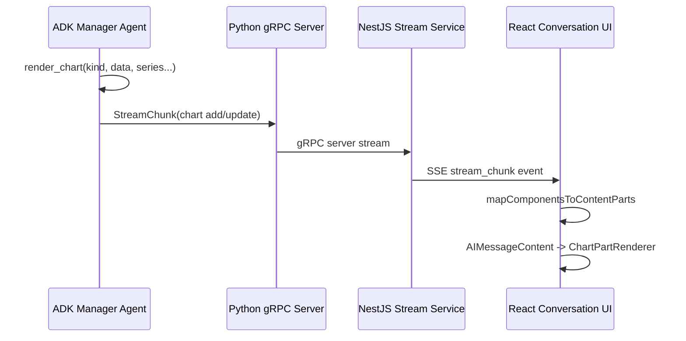

# Conversation Charts

> **Slug:** `conversation-charts` | **Status:** 🚧 draft | **Last Updated:** 2026-04-19 00:00 UTC

## Purpose
Render structured analytical charts inline inside assistant responses while the answer is streaming.

## Scope
- Conversation streaming chart components
- Recharts-based inline rendering in chat
- ADK `render_chart` tool contract
- gRPC/SSE transport of chart payloads

## Architecture

## Requirements
- As a user, I want analytical answers to include charts inline so I can understand trends quickly.
- As a user, I want charts to appear between explanation paragraphs while the model is still responding.
- [ ] Support `line`, `bar`, `area`, `pie`, `scatter`, and `composed` charts.
- [ ] Preserve backward compatibility for legacy bar-only chart payloads.

## API / Interfaces
- `ChartComponent` in `YellowStorm/back/src/modules/conversation/proto/chatbot.proto`
- `render_chart` tool in `yellowstorm-adk/src/smart_rag/tools/utilities/render_chart.py`
- `ChartPart` in `YellowStorm/front/src/components/ai-elements/ai-message-content.tsx`

## Design Decisions
| Decision | Rationale | Alternatives Considered |
|----------|-----------|------------------------|
| Keep typed chart components instead of embedding chart tags in markdown | Preserves ordering, persistence, and transport typing across Python, NestJS, and React | Streamdown custom tags |
| Reuse `recharts` | Already shipped in frontend and wrapped by `ChartContainer` | ECharts, Plotly |
| Default unspecified chart kinds to bar | Maintains compatibility for old producers | Hard fail on missing kind |

## Related Features
- [`connectors`](/docs/connectors/README_2026-04-14_23-00-00.md)
- [`import-to-workspace`](/docs/import-to-workspace/README.md)
