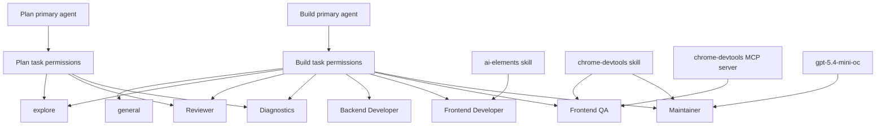

# OpenCode Agent Team

> **Slug:** `opencode-agents` | **Status:** stable | **Last Updated:** 2026-04-22 UTC

## Purpose
Define the project-level OpenCode setup used in this repository, including the primary workflow, the current project-local subagents, and the MCP/skill access used for implementation, review, diagnostics, browser QA, and documentation sync.

## Scope
Included:
- Project `opencode.json` task-permission routing for the built-in `build` and `plan` agents
- Project-local OpenCode subagent definitions under `.opencode/agents/`
- Tight bash permission defaults with explicit allowlists for common safe development commands
- Repo-specific prompts tailored to `YellowStorm/back`, `YellowStorm/front`, and `yellowstorm-adk`
- Explicit skill permissions for repository-approved OpenCode skills
- A dedicated backend implementation subagent for delegated NestJS service work
- A dedicated frontend implementation subagent for delegated React UI work
- A dedicated browser QA subagent for live web application validation
- A project-scoped `chrome-devtools` MCP server entry for browser automation and debugging
- Root `AGENTS.md` guidance aligned with the current OpenCode team and repository workflow
- Dedicated model overrides for documentation and validation tasks where useful

Excluded:
- In-app agent entities or database-seeded agent types
- Global user-level OpenCode configuration outside this repository

## Architecture
The setup uses OpenCode built-in primary agents as entrypoints and delegates focused work to a small project-local subagent team with scoped permissions. Browser-based validation has two layers: the `chrome-devtools` skill for workflow guidance and the `chrome-devtools-mcp` server for live Chrome tooling exposed through `opencode.json`.

## Requirements
- As a developer, I want a small focused OpenCode subagent team so that common engineering tasks can be delegated with the right constraints and low coordination overhead.
- As a developer, I want the default `build` and `plan` agents to have explicit task permissions so that delegation remains predictable.
- As a developer, I want specialist prompts to reflect the actual repo split so that agents do not make stack-level assumptions.
- As a developer, I want backend-heavy implementation work to be delegable to a backend specialist so NestJS changes can stay scoped without overloading the main build agent.
- As a developer, I want frontend-heavy implementation work to be delegable to a frontend specialist so UI changes can stay scoped without overloading the main build agent.
- As a developer, I want OpenCode to validate web UI behavior in a real browser so frontend changes can be checked directly against the running app.
- As a developer, I want OpenCode to expose Chrome DevTools through MCP so browser automation tools are available without manual setup.
- As a developer, I want the repository-wide `AGENTS.md` instructions to describe the same architecture and agent team used by the project-local OpenCode setup.
- As a developer, I want documentation maintenance to use a lighter dedicated model so routine doc synchronization stays fast and targeted.
- [x] Add a project-level `opencode.json` with task-permission rules for `build` and `plan`.
- [x] Add project-local subagent markdown files for planning, review, diagnostics, backend implementation, frontend implementation, browser QA, and documentation/refactoring work.
- [x] Keep destructive shell commands on approval for the main implementation path.
- [x] Tighten bash defaults to `ask` and explicitly allow common safe inspection and test commands.
- [x] Tune prompts to the NestJS backend, React frontend, and Python ADK/gRPC split.
- [x] Expose the `chrome-devtools` and `ai-elements` skills to project agents with explicit skill permissions.
- [x] Add a project-scoped `chrome-devtools` MCP server entry to `opencode.json`.
- [x] Teach web-facing agents to use live browser validation when the task affects UI behavior.
- [x] Update `AGENTS.md` to reflect the current repo architecture, package-specific test commands, and OpenCode specialist roster.
- [x] Pin `maintainer` to `LiteLLM/gpt-5.4-mini-oc`.

## API / Interfaces
- `opencode.json`
  - Overrides permissions for built-in `build` and `plan` agents
  - Restricts `permission.task` to approved built-in task targets and current project subagents, including `backend-developer` and `frontend-developer`
  - Keeps `build` bash access on an `ask` default with explicit allowlists for common repository commands
  - Uses explicit bash allowlists for common repository commands
  - Restricts `permission.skill` to repository-approved skills, currently `chrome-devtools`, `ai-elements`, and `graphify-windows`
  - Declares a local `chrome-devtools` MCP server launched via `npx -y chrome-devtools-mcp@latest`
- `.opencode/agents/*.md`
  - Defines the current subagents: `plan`, `reviewer`, `diagnostics`, `backend-developer`, `frontend-developer`, `frontend-qa`, and `maintainer`
  - Uses frontmatter fields such as `description`, `mode`, `model`, `tools`, and `permission`
  - Encodes repo-specific guidance for the relevant area of ownership
  - Pins `maintainer` to `LiteLLM/gpt-5.4-mini-oc`
- `AGENTS.md`
  - Documents repository-wide coding rules, architecture expectations, testing workflow, and delegation guidance

## Design Decisions
| Decision | Rationale | Alternatives Considered |
|----------|-----------|------------------------|
| Align `AGENTS.md` with the OpenCode setup | Prevents drift between repo instructions and actual local agent capabilities | Leaving `AGENTS.md` inconsistent with the current subagent team |
| Document the monorepo split explicitly | The repository spans three different stacks and agents need to reason about the correct package boundary | Treating the repository as a single Python-first application |
| Document package-specific test commands | Improves correctness and reduces unnecessary or wrong validation commands | Keeping a single generic `poetry run pytest` instruction |
| Keep the project-local subagent team small | Reduces coordination overhead while preserving specialized review, diagnostics, QA, and documentation roles | Reintroducing a larger roster of narrow specialist agents |
| Add a dedicated backend implementation agent instead of overloading `build` | Lets `build` delegate NestJS-only slices while preserving coordinated ownership for cross-service and contract work | Pushing every backend change through `build` directly or broadening a backend specialist to cover all cross-service changes |
| Add a dedicated frontend implementation agent instead of overloading `build` | Lets `build` delegate UI-only slices while preserving a clean separation between implementation and browser QA | Pushing every frontend change through `build` directly or collapsing implementation and QA into one role |
| Document build and plan task permissions separately | Reflects the real `permission.task` configuration instead of implying both primary agents can delegate to the same targets | Describing task access as a single shared pool |
| Assign a dedicated mini model to `maintainer` | Documentation synchronization is bounded, repetitive work that benefits from a cheaper focused model override | Leaving `maintainer` on inherited model selection |

## Related Features
- [`playbook`](../playbook/README_2026-04-11_12-27-13.md)
