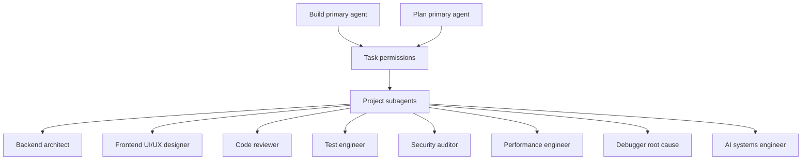

# OpenCode Agent Team

> **Slug:** `opencode-agents` | **Status:** 🚧 draft | **Last Updated:** 2026-04-06 09:56:28

## Purpose
Define a project-level OpenCode agent setup that supports daily development and maintenance with specialized subagents for review, testing, security, performance, frontend UX, backend architecture, debugging, and AI workflow work.

## Scope
Included:
- Project `opencode.json` task-permission routing for built-in primary agents
- Project-local OpenCode subagent definitions under `.opencode/agents/`
- Safe defaults for destructive shell commands and subagent delegation

Excluded:
- In-app agent entities or database-seeded agent types
- Global user-level OpenCode configuration outside this repository

## Architecture
The setup uses OpenCode built-in primary agents as entrypoints and delegates specialist work to project-local subagents.

## Requirements
- As a developer, I want specialist OpenCode subagents so that common engineering tasks can be delegated with the right constraints and focus.
- As a developer, I want the default `build` and `plan` agents to have explicit task permissions so that delegation remains predictable.
- [x] Add a project-level `opencode.json` with task-permission rules for `build` and `plan`.
- [x] Add project-local subagent markdown files for backend, frontend UX, review, testing, security, performance, debugging, and AI systems work.
- [x] Keep destructive shell commands on approval for the main implementation path.

## API / Interfaces
- `opencode.json`
  - Overrides permissions for built-in `build` and `plan` agents
  - Restricts `permission.task` to the approved specialist subagents
- `.opencode/agents/*.md`
  - Defines each subagent with frontmatter fields such as `description`, `mode`, `tools`, and `permission`

## Design Decisions
| Decision | Rationale | Alternatives Considered |
|----------|-----------|------------------------|
| Keep `build` and `plan` as the primary agents | Matches OpenCode built-ins and avoids duplicating the main interaction model | Creating custom primary agents for every workflow |
| Add specialist subagents as markdown files | Project-local agents are easy to version and tune with the codebase | Storing all prompts inline in `opencode.json` |
| Use read-only agents for review and security | These roles are safer and clearer when they cannot silently change files | Letting all specialists edit code |
| Gate dangerous shell commands with `ask` | Preserves autonomy for normal development while reducing accidental destructive actions | Allowing all shell commands without review |

## Related Features
- [`playbook`](/docs/playbook/README_2026-04-06_09-22-02.md)
