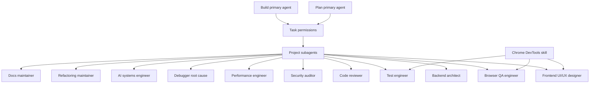

# OpenCode Agent Team

> **Slug:** `opencode-agents` | **Status:** 🚧 draft | **Last Updated:** 2026-04-06 10:02:14

## Purpose
Define a project-level OpenCode agent setup that supports daily development and maintenance with specialist subagents tuned to this repository's NestJS backend, React frontend, and Python ADK/gRPC workflow runtime, including real-browser web application validation.

## Scope
Included:
- Project `opencode.json` task-permission routing for built-in primary agents
- Project-local OpenCode subagent definitions under `.opencode/agents/`
- Tighter bash permission defaults with explicit allowlists for common safe development commands
- Specialist prompts tailored to `YellowStorm/back`, `YellowStorm/front`, and `yellowstorm-adk`
- Explicit skill permissions for repository-approved OpenCode skills
- A dedicated browser QA subagent for live web application validation

Excluded:
- In-app agent entities or database-seeded agent types
- Global user-level OpenCode configuration outside this repository

## Architecture
The setup uses OpenCode built-in primary agents as entrypoints and delegates specialist work to project-local subagents with scoped permissions. Browser-based web validation is handled through the repository's `chrome-devtools` skill, which is exposed to agents through OpenCode skill permissions and a dedicated QA subagent.

## Requirements
- As a developer, I want specialist OpenCode subagents so that common engineering tasks can be delegated with the right constraints and focus.
- As a developer, I want the default `build` and `plan` agents to have explicit task permissions so that delegation remains predictable.
- As a developer, I want specialist prompts to reflect the actual repo split so that agents do not make stack-level assumptions.
- As a developer, I want OpenCode to validate web UI behavior in a real browser so frontend changes can be checked directly against the running app.
- [x] Add a project-level `opencode.json` with task-permission rules for `build` and `plan`.
- [x] Add project-local subagent markdown files for backend, frontend UX, review, testing, security, performance, debugging, AI systems, refactoring, documentation work, and browser QA.
- [x] Keep destructive shell commands on approval for the main implementation path.
- [x] Tighten bash defaults to `ask` and explicitly allow common safe inspection and test commands.
- [x] Tune prompts to the NestJS backend, React frontend, and Python ADK/gRPC split.
- [x] Expose the `chrome-devtools` skill to project agents with explicit skill permissions.
- [x] Teach web-facing agents to use live browser validation when the task affects UI behavior.

## API / Interfaces
- `opencode.json`
  - Overrides permissions for built-in `build` and `plan` agents
  - Restricts `permission.task` to the approved specialist subagents
  - Uses explicit bash allowlists for common repository commands
  - Restricts `permission.skill` to repository-approved skills, including `chrome-devtools`
- `.opencode/agents/*.md`
  - Defines each subagent with frontmatter fields such as `description`, `mode`, `tools`, and `permission`
  - Encodes repo-specific guidance for the relevant area of ownership
  - Adds `browser-qa-engineer.md` for real-browser validation workflows

## Design Decisions
| Decision | Rationale | Alternatives Considered |
|----------|-----------|------------------------|
| Keep `build` and `plan` as the primary agents | Matches OpenCode built-ins and avoids duplicating the main interaction model | Creating custom primary agents for every workflow |
| Add specialist subagents as markdown files | Project-local agents are easy to version and tune with the codebase | Storing all prompts inline in `opencode.json` |
| Default implementation-agent bash permissions to `ask` and allow safe commands explicitly | Tightens safety without blocking common status, diff, test, and build workflows | Leaving `*` on `allow` for implementation agents |
| Add `refactoring-maintainer` and `docs-maintainer` as dedicated roles | These tasks recur often and have distinct quality bars from feature implementation | Folding both responsibilities into the default `build` agent |
| Tune prompts to the repo split | Prevents agents from assuming a single-stack application and improves cross-boundary changes | Using generic software-engineering prompts |
| Add a dedicated browser QA subagent instead of overloading the existing test agent | Keeps real-browser reproduction and evidence gathering explicit while still letting other agents delegate to it | Folding all browser work into `test-engineer` only |
| Explicitly allow only repository skills needed by this project | Keeps agent capability expansion intentional while enabling browser automation for web testing | Leaving skill access implicit or allowing every skill |

## Related Features
- [`playbook`](/docs/playbook/README_2026-04-06_09-22-02.md)
