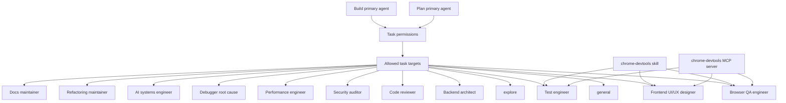

# OpenCode Agent Team

> **Slug:** `opencode-agents` | **Status:** 🚧 draft | **Last Updated:** 2026-04-06 13:17:42

## Purpose
Define a project-level OpenCode setup that supports daily development and maintenance with specialist subagents tuned to this repository's NestJS backend, React frontend, and Python ADK/gRPC workflow runtime, plus direct Chrome DevTools MCP access for live browser validation.

## Scope
Included:
- Project `opencode.json` task-permission routing for built-in primary agents
- Project-local OpenCode subagent definitions under `.opencode/agents/`
- Tight bash permission defaults with explicit allowlists for common safe development commands
- Specialist prompts tailored to `YellowStorm/back`, `YellowStorm/front`, and `yellowstorm-adk`
- Explicit skill permissions for repository-approved OpenCode skills
- A dedicated browser QA subagent for live web application validation
- A project-scoped `chrome-devtools` MCP server entry for browser automation and debugging
- Root `AGENTS.md` guidance aligned with the local OpenCode team and actual repository architecture

Excluded:
- In-app agent entities or database-seeded agent types
- Global user-level OpenCode configuration outside this repository

## Architecture
The setup uses OpenCode built-in primary agents as entrypoints and delegates specialist work to project-local subagents with scoped permissions. Browser-based validation has two layers: the `chrome-devtools` skill for workflow guidance and the `chrome-devtools-mcp` server for live Chrome tooling exposed through `opencode.json`.

## Requirements
- As a developer, I want specialist OpenCode subagents so that common engineering tasks can be delegated with the right constraints and focus.
- As a developer, I want the default `build` and `plan` agents to have explicit task permissions so that delegation remains predictable.
- As a developer, I want specialist prompts to reflect the actual repo split so that agents do not make stack-level assumptions.
- As a developer, I want OpenCode to validate web UI behavior in a real browser so frontend changes can be checked directly against the running app.
- As a developer, I want OpenCode to expose Chrome DevTools through MCP so browser automation tools are available without manual setup.
- As a developer, I want the repository-wide `AGENTS.md` instructions to describe the same architecture and agent team used by the project-local OpenCode setup.
- [x] Add a project-level `opencode.json` with task-permission rules for `build` and `plan`.
- [x] Add project-local subagent markdown files for backend, frontend UX, review, testing, security, performance, debugging, AI systems, refactoring, documentation work, and browser QA.
- [x] Keep destructive shell commands on approval for the main implementation path.
- [x] Tighten bash defaults to `ask` and explicitly allow common safe inspection and test commands.
- [x] Tune prompts to the NestJS backend, React frontend, and Python ADK/gRPC split.
- [x] Expose the `chrome-devtools` and `ai-elements` skills to project agents with explicit skill permissions.
- [x] Add a project-scoped `chrome-devtools` MCP server entry to `opencode.json`.
- [x] Teach web-facing agents to use live browser validation when the task affects UI behavior.
- [x] Update `AGENTS.md` to reflect the current repo architecture, package-specific test commands, and OpenCode specialist roster.

## API / Interfaces
- `opencode.json`
  - Overrides permissions for built-in `build` and `plan` agents
  - Restricts `permission.task` to approved built-in task targets and project specialist subagents
  - Uses explicit bash allowlists for common repository commands
  - Restricts `permission.skill` to repository-approved skills, currently `chrome-devtools` and `ai-elements`
  - Declares a local `chrome-devtools` MCP server launched via `npx -y chrome-devtools-mcp@latest`
- `.opencode/agents/*.md`
  - Defines each subagent with frontmatter fields such as `description`, `mode`, `tools`, and `permission`
  - Encodes repo-specific guidance for the relevant area of ownership
  - Adds `browser-qa-engineer.md` for real-browser validation workflows
- `AGENTS.md`
  - Documents repository-wide coding rules, architecture expectations, testing workflow, and delegation guidance

## Design Decisions
| Decision | Rationale | Alternatives Considered |
|----------|-----------|------------------------|
| Align `AGENTS.md` with the OpenCode setup | Prevents drift between repo instructions and actual local agent capabilities | Leaving `AGENTS.md` Python-centric and implicitly outdated |
| Document the monorepo split explicitly | The repository spans three different stacks and agents need to reason about the correct package boundary | Treating the repository as a single Python-first application |
| Document package-specific test commands | Improves correctness and reduces unnecessary or wrong validation commands | Keeping a single generic `poetry run pytest` instruction |
| Document both built-in and project-local task targets | Reflects the real `permission.task` configuration instead of implying only custom subagents are callable | Describing task access as specialist-only |

## Related Features
- [`playbook`](/docs/playbook/README_2026-04-06_09-22-02.md)
