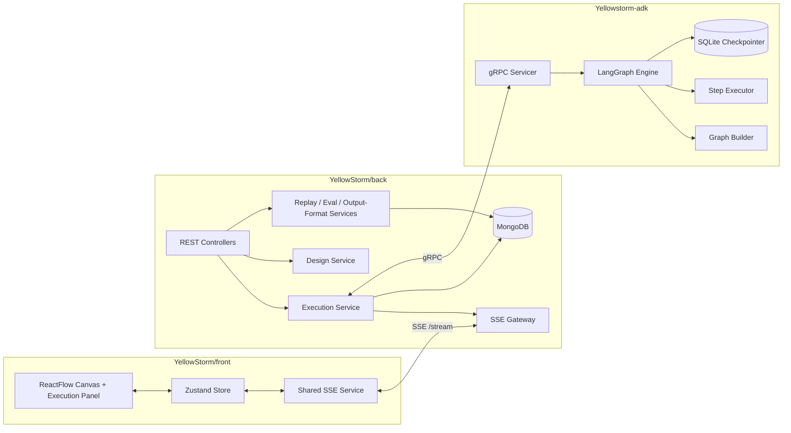

# Playbook

> **Slug:** `playbook` | **Status:** 🚧 draft | **Last Updated:** 2026-03-30 03:58:44

## Purpose

The Playbook feature provides an end-to-end system for designing, executing, and evaluating multi-step AI workflows represented as DAGs (directed acyclic graphs). Users visually construct playbooks in a canvas editor, execute them against AI agents, and inspect results including replay baselines, semantic evaluations, and output-format preservation.

The simplest correct mental model:

- The frontend is a DAG editor plus a live execution and evaluation console.
- The backend is the source of truth for persistence, authorization, SSE fan-out, replay/output-format metadata, and orchestration policy.
- The ADK (`Yellowstorm-adk`) is the execution engine.
- LangGraph handles dependency-aware workflow execution and HITL suspension/resume.
- gRPC is the boundary between the business app and the AI runtime.

One concise summary of a run: the user edits a DAG in ReactFlow, Nest persists it and launches an execution, the ADK turns the enabled graph into a LangGraph, LangGraph emits step updates, interrupts, traces, and replay-aware results through gRPC, Nest converts those into Mongo execution history plus SSE events, and the frontend renders the run, its provenance, and its semantic evaluation in real time.

## Scope

**Included:**

- Visual DAG editor (ReactFlow canvas) with auto-layout
- Snapshot-based undo/redo (Ctrl+Z / Ctrl+Shift+Z) for all canvas mutations
- Playbook CRUD, design generation, design history, and revert
- Single-step and full-workflow execution via gRPC
- LangGraph-based dependency-aware execution with checkpoint/suspend/resume
- Human-in-the-loop (clarification, approval before, review after) handled through the shared Copilot panel during execution, including conversational multi-turn clarification threads
- SSE live streaming with multi-tab leader election
- Replay baselines (strict, flex, adaptive modes) with argument diffs
- Output-format preservation (replay-linked and standalone templates)
- Semantic evaluation against replay reference outputs
- Stop, skip-step, resume-interrupt, rerun-step, and resume-from-step flows
- Execution history with attempt tracking and stale-state management
- Sharing and cloning

**Explicitly excluded:**

- The older REST router at `src/routers/playbook.py` in the ADK (superseded by the gRPC/LangGraph path)
- Agent management (agents are referenced by playbook tasks but managed separately)

## Architecture

The feature spans three repositories in four runtime layers:

### Frontend (`YellowStorm/front/src/modules/playbook`)

- **Routes:** `/playbooks`, `/playbooks/generating`, `/playbooks/:id`, `/playbooks/:id/executions`, `/playbooks/:id/executions/compare`, `/playbooks/:id/executions/:executionId`
- **Store** (`store.ts`): Zustand — owns playbook list, current playbook, dirty/saving state, execution cache, selected step, designer state, replay/output-format/evaluation actions, SSE handlers. Execution history uses lightweight summaries; full executions are cached with eviction. `executionPanelOpen` persists in localStorage. Stale API reads merge with fresher SSE state.
- **Canvas** (`usePlaybookCanvas.ts`): Bridges ReactFlow local state and store. Converts tasks to nodes, prevents cycles, syncs positions on drag-stop, keys server reloads off playbook identity/timestamp. Undo/redo capture points intercept every structural mutation before it reaches the store; a `canvasSyncVersion` counter forces ReactFlow re-sync after undo/redo.
- **Undo/Redo:** Snapshot-based (past/future stacks of `PlaybookUndoSnapshot`, max 50). Tracks all canvas mutations (add/delete/clone nodes, connect/delete edges, edit node properties, move nodes, auto-layout, rename, workspace changes, input-file management, AI design). History is cleared on playbook load, generate, and designer revert. Keyboard shortcuts: `Ctrl+Z` (undo), `Ctrl+Shift+Z` / `Ctrl+Y` (redo). Toolbar buttons use `Undo2`/`Redo2` icons.
- **Autosave:** Most graph edits mark the playbook dirty; debounce persists after a short delay. Workspace updates save immediately. Derived replay/output-format fields are sanitized before persistence.
- **Shared SSE** (`playbookStreamService.ts`): One `EventSource` per browser via `BroadcastChannel` leader election. Followers receive relayed events. Heartbeat and exponential reconnect built in.

### Backend (`YellowStorm/back/src/modules/playbook`)

- **Controllers:** `playbook.controller.ts` (CRUD, design, execution, replay, output-format, skip, rerun, resume-from-step, sharing, clone), `playbook-execution.controller.ts` (history), `playbook-stream.controller.ts` (SSE endpoint)
- **SSE endpoint:** `GET /playbooks/stream?token=<jwt>`. Query-token auth required because `EventSource` cannot send bearer headers. `PlaybookStreamAuthGuard` validates token and session. `PlaybookStreamGatewayService` manages connection registration, per-user limits, heartbeats, and event fan-out.
- **Design service** (`playbook-design.service.ts`): Handles generate-from-scratch (load agents, resolve workspace, call `GeneratePlaybook`, persist playbook + design record) and modify-existing (snapshot current graph, call design path, update playbook, store design message for history/revert).
- **Execution service (`playbook-execution.service.ts`): Ensures one active execution per playbook, loads snapshot, filters enabled tasks/edges, resolves agents and workspace contexts, computes topological order, creates execution document, dispatches SSE events, chooses single-step vs. full-workflow, consumes streamed updates, persists task results, handles interrupt/stop/skip/rerun/resume, tracks token usage and replay provenance, schedules semantic enrichment. On resume, streamed interrupts are deduplicated by interrupt identity rather than task id alone so multi-turn clarification can suspend the same node repeatedly.
- **Execution strategies:**
  - **Single-step:** `singleStepTaskId` present → all other tasks skipped → unary `RunStep` / `ResumeStep`. Also the base primitive for targeted reruns.
  - **Full workflow:** Enabled DAG sent to streaming `RunPlaybookWorkflow`. ADK/LangGraph orchestrates dependencies. Backend consumes stream chunks into in-memory buffers; durable Mongo writes at controlled points.
- **In-memory step buffering:** `activeStepBuffers` holds freshest step state during streaming for near-real-time catch-up and reduced Mongo write amplification.
- **Replay/Evaluation/Output-Format services:** `playbook-replay.service.ts` (validate, list, activate, update format guide), `playbook-evaluation.service.ts` (semantic match via ADK), `playbook-semantic-enrichment.service.ts` (async evaluation with limited concurrency), `playbook-output-format.service.ts` (template capture/generation).

### ADK / LangGraph Runtime (`Yellowstorm-adk`)

- **gRPC servicer** (`src/grpc_server/chatbot_servicer.py`): Exposes `GeneratePlaybook`, `RunPlaybookWorkflow`, `ResumePlaybookWorkflow`, `RunStep`, `ResumeStep`, `StopPlaybookWorkflow`, `EvaluateSemanticMatch`.
- **Workflow service** (`src/langgraph_engine/workflow_service.py`): Initializes/reuses SQLite checkpointer, retrieves/builds compiled graphs from cache, associates graph with `thread_id`, registers the active stream queue per thread, runs workflow and resume through `graph.astream(..., stream_mode=["messages", "updates"], version="v2")`, surfaces interrupts from the live stream, and normalizes final results from persisted state snapshots. The initial run now forces graph compilation with a thread-scoped step-update callback, while resumed executions re-register the live queue for that same `thread_id`; step-update callbacks resolve the current queue lazily so a cached graph can publish resumed completion and follow-up interrupt chunks into the active gRPC stream instead of the dead queue from the original run.
- **Graph cache** (`src/langgraph_engine/graph_cache.py`): Two caches — playbook graph (keyed by content) for topology reuse, thread graph (keyed by `thread_id`) for interrupt resume.
- **Checkpointer** (`src/langgraph_engine/checkpointer.py`): SQLite-based LangGraph checkpoint persistence in a temp-directory database. Enables suspend/resume with state continuity.
- **Graph builder** (`src/langgraph_engine/graph_builder.py`): Dynamically builds LangGraph from playbook DAG. One node per task, edges from playbook edges. Multiple entry tasks handled by synthetic fan-out node. Completion node finalizes status.
- **Execution state** (`src/langgraph_engine/state.py`): Shared state with playbook/thread IDs, tasks, edges, agents, results, completed task IDs, workspace context, execution mode, validated replays, step execution modes, interrupt payload, node timings. All mutable fields that can be written by parallel nodes use `Annotated` reducers: `merge_results`, `merge_timings`, `merge_task_ids`, `merge_task_outputs` for accumulation fields, plus `merge_status` (severity-based: failed > suspended > in_progress > completed > skipped) and `merge_error` (first non-empty wins) for global workflow status fields.
- **Step executor** (`src/langgraph_engine/step_executor.py`): Five execution paths — direct LLM, live tool, replay strict, replay flex, replay adaptive. Foundation for replay diffs, format preservation, and semantic comparison.
- **Task node lifecycle** (`DynamicGraphBuilder._create_task_node`): Push in_progress → optional clarification gating → optional interrupt before → execute-and-review loop → push completed/failed/skipped/suspended → return results. Both clarification and review-after now support multiple conversational rounds within the same node thread by replaying deterministic `interrupt(...)` calls on resume. Single-step execution now uses the same clarification wrapper, and if a clarification-enabled step finishes with a follow-up question, that output is converted into a clarification interrupt instead of silently completing. The single-step run and resume paths now consistently use the step-executor interrupt snapshot helper, which keeps their task-aware fallback payload shape aligned with the workflow path.
- **Queue** (`src/langgraph_engine/playbook_queue.py`): `thread_id → queue` and `thread_id → asyncio.Task` registries. Supports step updates outside persisted state, cancellation by thread ID, clean stream termination, and rebinding the live gRPC stream queue on resume so cached LangGraph nodes emit into the currently active stream.
- **HITL:** Uses LangGraph `interrupt(...)`. Styles: clarification, approval before, review after. Clarification and review interrupts carry conversational metadata (`interrupt_id`, `round`, transcript JSON, resumable actions) so the frontend copilot can render a real thread. Resume requests support action-based replies (`reply`, `approve`, `reject`, `skip`) while preserving the legacy `approved` / `reason` / `feedback` fields for compatibility. `approved=false` with reason `__SKIP_STEP__` or action `skip` → skipped. Rejection without skip → failed. Review `reply` feedback now re-runs the step with the accumulated critique until the user explicitly approves or rejects it. Full-workflow execution now follows LangGraph's streaming HITL pattern, so interrupts are detected from the live `updates` stream instead of only after `ainvoke(...)` returns.
- **Execution Copilot:** When an interrupt arrives, the frontend opens the shared copilot sidebar in `interrupt` mode and anchors it to the interrupted step. Pending HITL prompts are answered there instead of in the step result panel, which keeps the execution detail view read-only while the conversation lives in one place. The copilot thread now deduplicates repeated reply text and renders agent output inline instead of wrapping it in an extra result card.

## Requirements

- As a user, I want to generate a playbook from a natural-language prompt so that I can quickly scaffold a multi-step AI workflow.
- [ ] Auto-builder prompt returns a valid DAG of tasks and edges persisted to the database.
- As a user, I want to modify an existing playbook via natural language so that I can iterate on its design.
- [ ] Modification stores a design history message and supports revert to prior snapshots.
- As a user, I want to execute a full playbook workflow so that all enabled tasks run in dependency order via LangGraph.
- [ ] Execution streams step updates through SSE in real time and persists results to MongoDB.
- As a user, I want to execute a single task step so that I can test individual tasks in isolation.
- [ ] Single-step execution marks all other tasks as skipped and returns a result through the same SSE/store path.
- As a user, I want the workflow to pause for human input (clarification, approval, review) so that I can control execution at critical points.
- [ ] Interrupt payload is stored, rendered in the UI, and resume continues the LangGraph with state continuity.
- As a user, I want to stop, skip, rerun, or resume-from-step during or after execution so that I can recover from failures or refine results.
- [ ] Stop cancels the ADK workflow; skip marks the step skipped; rerun invalidates downstream descendants; resume-from-step re-executes a tail subgraph.
- As a user, I want to save and activate replay baselines so that subsequent runs reuse validated tool-call sequences.
- [ ] Replay supports strict, flex, and adaptive modes with argument diffs visible in the UI.
- As a user, I want to preserve output formatting from a prior execution so that results maintain consistent structure.
- [ ] Replay-linked format guides and standalone output-format templates are generated and injected into task descriptions.
- As a user, I want semantic evaluation of task outputs against replay baselines so that I can assess output quality.
- [ ] Evaluation runs asynchronously, stores scores and evidence on the task result, and updates the UI via SSE.
- As a developer, I want gRPC as the boundary between the NestJS backend and the Python ADK so that the AI runtime is independently deployable.
- [ ] All execution, replay, and evaluation calls use defined protobuf contracts.

## API / Interfaces

### Data Model (conceptual)

**Playbook:** `name`, `description`, `workspaces`, `favorite`, owner, active flag, `tasks[]`, `edges[]`

**UndoSnapshot:** `tasks`, `edges`, `name`, `workspaces` — lightweight deep-clone captured before each mutation. Max 50 entries in the undo stack.

**Task:** `id`, `title`, `description`, `executionOrder`, `inputKeys`, `outputKey`, `assignedAgentId`, `enabled`, HITL fields (`interruptBefore`, `interruptAfter`, `allowClarification`, `clarificationPrompt`, `maxClarifications`), notification fields, replay metadata (`stepReplayMode`, `hasValidatedReplay`, `activeReplayId`, `activeReplayVersion`, `activeReplayPreserveOutputFormat`, etc.), output-format metadata, `inputFiles[]`, UI position.

**Edge:** `sourceId`, `targetId`

**Execution:** status (`pending`|`running`|`completed`|`failed`|`interrupted`|`cancelled`), `taskResults[]`, `threadId`, `interruptPayload`, `singleStepTaskId`, `executionMode`, `replaySourceByTask`, `currentAttemptNumber`, `attemptHistory[]`, usage totals, timestamps, `playbookSnapshot`.

**Copilot state:** `designerOpen`, `copilotMode` (`design`|`interrupt`), `executionPanelOpen`, `selectedStepId`. The same sidebar shell is reused for design chat and execution-time HITL prompts, and interrupt entries accumulate as a per-step conversation thread.

**TaskResult:** `taskId`, `nodeTitle`, `agentName`, `order`, status (`pending`|`running`|`completed`|`failed`|`skipped`|`interrupted`), output/error/timing, `components[]`, `toolTrace[]`, `llmPromptTrace[]`, token usage, `modelName`, `semanticMatch`, `evaluationHistory[]`, stale-state metadata (`attemptNumber`, `isStale`, `staleReason`, `invalidatedByTaskId`). `humanFeedback` components now store action-based replies and optional transcript metadata (`interruptId`, `round`, `payloadJson`, `resumableActions`).

**ReplayBaseline:** Reference execution/version, reference output, recorded tool calls, optional format preservation guide, prompt trace, stale-state indicators.

**OutputFormatTemplate:** Source execution, template version, generation status (`pending`|`ready`|`failed`), `formatGuide`, prompt trace.

### REST Endpoints

**CRUD:**
- `POST /playbooks` — create
- `GET /playbooks` — list
- `GET /playbooks/:id` — get
- `PATCH /playbooks/:id` — update
- `DELETE /playbooks/:id` — delete
- `POST /playbooks/bulk-delete`
- `PATCH /playbooks/:id/favorite`
- `POST /playbooks/:id/clone`
- `POST /playbooks/:id/clone-share`

**Design:**
- `POST /playbooks/generate` — generate from scratch
- `POST /playbooks/:id/design` — modify existing
- `GET /playbooks/:id/design-messages` — history
- `POST /playbooks/:id/design-messages/:msgId/revert` — revert

**Execution:**
- `GET /playbooks/active-executions` — catch-up active executions
- `POST /playbooks/:id/execute` — start execution
- `POST /playbooks/:id/resume` — resume interrupt
- `POST /playbooks/:id/stop` — stop execution
- `POST /playbooks/:id/skip-step` — skip interrupted step
- `POST /playbooks/:id/executions/:executionId/rerun-step` — targeted rerun
- `POST /playbooks/:id/executions/:executionId/resume-from-step` — resume from step

**Replay:**
- `POST /playbooks/:id/tasks/:taskId/validate-replay` — save baseline
- `GET /playbooks/:id/tasks/:taskId/replays` — list replays
- `POST /playbooks/:id/tasks/:taskId/replays/:replayId/activate` — activate
- `PATCH /playbooks/:id/tasks/:taskId/replays/:replayId/format-guide` — update format guide

**Output-Format:**
- `POST /playbooks/:id/tasks/:taskId/output-format-template` — capture template

**History:**
- `GET /playbooks/:id/executions` — list
- `GET /playbooks/:id/executions/:execId` — get

**SSE:**
- `GET /playbooks/stream?token=<jwt>` — SSE stream

### SSE Events

| Event | Description |
|-------|-------------|
| `playbook_connected` | Initial connection payload (may include `activeExecutions`) |
| `playbook_heartbeat` | Keep-alive |
| `playbook_execution_start` | Execution created |
| `playbook_step_start` | Task execution began |
| `playbook_step_complete` | Task finished |
| `playbook_step_evaluation_updated` | Semantic evaluation result available |
| `playbook_replay_format_guide_updated` | Format guide generation status changed |
| `playbook_output_format_template_updated` | Output-format template generation status changed |
| `playbook_execution_complete` | Execution finished |
| `playbook_execution_error` | Execution failed |
| `playbook_interrupt` | HITL interrupt fired and should open the execution copilot |
| `playbook_shared` | Playbook was shared |

### gRPC RPCs

| RPC | Direction | Description |
|-----|-----------|-------------|
| `GeneratePlaybook` | Unary | Generate playbook DAG from prompt |
| `RunStep` | Unary | Execute a single task |
| `ResumeStep` | Unary | Resume a single interrupted task |
| `RunPlaybookWorkflow` | Server-streaming | Execute full enabled DAG |
| `ResumePlaybookWorkflow` | Server-streaming | Resume interrupted workflow |
| `StopPlaybookWorkflow` | Unary | Cancel running workflow |
| `EvaluateSemanticMatch` | Unary | Compare output against replay baseline |

### Key Protobuf Structures

`PlaybookTaskConfig`, `PlaybookEdgeConfig`, `RunPlaybookWorkflowRequest`, `ResumePlaybookWorkflowRequest`, `PlaybookTaskResult`, `PlaybookStepUpdate`, `PlaybookStreamChunk`, `InterruptPayload`, `SemanticMatch`, `EvaluateSemanticMatchRequest`, `EvaluateSemanticMatchResponse`.

Notable fields: `PlaybookTaskConfig.input_files`, `PlaybookTaskResult.tool_trace`, `PlaybookTaskResult.semantic_match`, `PlaybookTaskResult.llm_prompt_trace`.

### Key ADK Files

| File | Responsibility |
|------|---------------|
| `grpc/proto/chatbot.proto` | gRPC service and message definitions |
| `src/grpc_server/chatbot_servicer.py` | gRPC method implementations |
| `src/langgraph_engine/workflow_service.py` | LangGraph orchestration shell |
| `src/langgraph_engine/graph_builder.py` | Dynamic DAG-to-LangGraph construction |
| `src/langgraph_engine/step_executor.py` | Five execution paths (live + 3 replay modes + direct LLM) |
| `src/langgraph_engine/state.py` | Shared execution state with reducers |
| `src/langgraph_engine/playbook_queue.py` | Thread-to-queue and thread-to-task registries |
| `src/langgraph_engine/graph_cache.py` | Playbook and thread graph caches |
| `src/langgraph_engine/checkpointer.py` | SQLite LangGraph checkpoint persistence |
| `src/langgraph_engine/playbook_tool_factory.py` | Tool creation for agent execution |

## Design Decisions

| Decision | Rationale | Alternatives Considered |
|----------|-----------|------------------------|
| LangGraph for workflow execution | Provides native dependency-aware DAG execution, suspend/resume via interrupts, and checkpoint persistence | Custom Python orchestration, Temporal, Airflow — heavier and less integrated with the LLM tool-calling loop |
| gRPC as backend-to-ADK boundary | Strongly-typed contracts, streaming support, language-agnostic — separates NestJS backend from Python AI runtime | REST, WebSocket — weaker typing or less natural streaming |
| SSE with BroadcastChannel leader election | One `EventSource` per browser, not per tab — reduces server connections and keeps state consistent across tabs | Per-tab SSE, WebSocket — more connections or more complex protocol |
| In-memory step buffering (`activeStepBuffers`) | Near-real-time SSE and catch-up without excessive Mongo writes during streaming | Write every chunk to Mongo — too much write amplification |
| SQLite checkpointer in temp directory | LangGraph-native checkpointing enables interrupt resume with state continuity | In-memory checkpoint only — lost on restart; Postgres — heavier for ephemeral state |
| Dual graph cache (playbook + thread) | Playbook cache reuses compiled topology; thread cache retains interrupted workflow state for resume | Single cache — would lose resume capability on topology match |
| Four execution recovery patterns | Stop, skip-step, rerun-step, resume-from-step cover all practical failure and refinement scenarios | Simpler single retry — insufficient for partial DAG recomputation |
| Stale-state tracking on task results | Rerun/resume-from-step invalidates downstream descendants; UI and persistence must track this carefully | Blindly overwrite — loses provenance and confuses users |
| Async semantic enrichment with limited concurrency | Evaluations run after task completion without blocking the workflow | Synchronous evaluation — slows execution; no evaluation — loses quality signal |
| Separate replay and output-format subsystems | Replay captures tool-call sequences; output-format captures formatting guides — different concerns with different lifecycles | Merged into one system — harder to evolve independently |
| Sanitized update payloads before persistence | Derived replay/output-format fields on tasks are stripped before saving to prevent stale metadata overwrites | Save everything — causes field drift and conflicts |
| Action-based conversational HITL contract | Resume requests now carry explicit actions (`reply`, `approve`, `reject`, `skip`) and interrupt payloads expose thread metadata (`interrupt_id`, `round`, transcript JSON, `resumable actions`). This lets the Copilot render conversational HITL threads without overloading a single `approved` boolean. | Boolean-only resume payload — too rigid for multi-turn clarification and iterative review |
| Snapshot-based undo/redo in Zustand store | Call-site `captureSnapshot()` before every mutation keeps undo atomic (e.g. `removeNode` captures once for tasks+edges). `canvasSyncVersion` forces ReactFlow re-sync. | Command pattern — 20+ command types, more complexity. `zundo` middleware — less control over ReactFlow sync |
| Severity-based status reducer + first-error-wins error reducer | Parallel branches can both write `status` and `error`; without reducers the last writer silently wins, masking failures. `merge_status` uses a severity ranking (failed > suspended > in_progress > completed > skipped) so any failure propagates. `merge_error` keeps the first non-empty error to preserve root cause. | No reducers — race conditions in parallel execution; single-string concatenation — hard to parse downstream |

## Related Features

> Future sub-feature split anticipated:
>
> - `playbook-frontend` — Canvas editor, store, SSE service, execution UX
> - `playbook-backend` — REST controllers, execution orchestration, SSE gateway, design service
> - `playbook-langgraph-runtime` — Graph builder, step executor, checkpointer, state, queue
> - `playbook-replay-and-output-format` — Replay baselines, format preservation, semantic evaluation
> - `playbook-execution-recovery` — Stop, skip, rerun-step, resume-from-step, stale-state management
