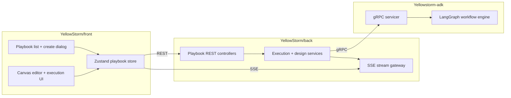

# Playbook

> **Slug:** `playbook` | **Status:** 🚧 draft | **Last Updated:** 2026-04-02 07:24:46

## Purpose

The Playbook feature lets users create, edit, generate, execute, and inspect multi-step AI workflows represented as DAGs. It combines a visual canvas, AI-assisted design flows, real-time execution streaming, and replay/evaluation tooling across the frontend, backend, and ADK runtime.

## Scope

Included in the current feature surface:

- Visual playbook CRUD and DAG editing in the frontend canvas.
- Manual and AI-assisted playbook creation from the list page dialog.
- AI designer updates against an existing playbook.
- Full-workflow and single-step execution with SSE updates.
- Replay, output-format, semantic-evaluation, and HITL copilot flows.

Explicitly excluded:

- Agent lifecycle management outside playbook assignment.
- Legacy ADK REST playbook router paths superseded by the gRPC runtime.

## Architecture

### Current frontend creation flow

- `CreatePlaybookDialog.tsx` still exposes two modes: `manual` and `auto`.
- The manual tab remains a standard form with name, description, and workspace selection.
- The Auto Builder tab is now styled as a prompt-first composer instead of a stacked form.
- Auto Builder now renders a centered hero heading, a dark prompt surface with inline generate action, example prompt chips, and a secondary details section for optional workflow naming plus workspace selection.
- Auto generation now derives a fallback playbook name from the prompt when the explicit auto-name field is left empty, preserving the existing backend contract that requires `GeneratePlaybookData.name`.

## Requirements

- As a user, I want to create a playbook manually so that I can start from a blank workflow shell.
- [ ] Manual mode still supports name, description, and workspace selection before creation.
- As a user, I want Auto Builder to feel like a prompt composer so that natural-language playbook creation is faster and more guided.
- [ ] Auto Builder foregrounds the prompt input, uses an inline submit affordance, and keeps advanced details secondary.
- As a user, I want example prompts in Auto Builder so that I can quickly start from a nearby workflow pattern.
- [ ] Clicking a suggestion chip replaces the Auto Builder prompt content.
- As a user, I want generation to keep working even if I do not manually provide a workflow name.
- [ ] Auto Builder derives a valid fallback name from the prompt before calling `generatePlaybook`.

## API / Interfaces

Key frontend types and interfaces affected by this iteration:

- `GeneratePlaybookData`
- `CreatePlaybookDialog`
- Playbook locale keys under `create.*`

Relevant runtime contract preserved:

- `generatePlaybook(data)` still receives `{ name, prompt, workspaces? }`.
- Auto Builder now resolves `name` with `autoName.trim() || deriveAutoName(autoPrompt)`.

Key files for this iteration:

| File | Responsibility |
|------|---------------|
| `YellowStorm/front/src/modules/playbook/components/CreatePlaybookDialog.tsx` | Prompt-first Auto Builder layout, prompt suggestions, fallback name derivation |
| `YellowStorm/front/src/modules/playbook/locales/en.json` | New Auto Builder hero, hint, and suggestion copy |
| `YellowStorm/front/src/modules/playbook/locales/fr.json` | New Auto Builder hero, hint, and suggestion copy |

## Design Decisions

| Decision | Rationale | Alternatives Considered |
|----------|-----------|------------------------|
| Keep the manual tab unchanged | Limits regression risk to the new Auto Builder experience only | Rework both tabs in one pass, which would widen QA scope unnecessarily |
| Make Auto Builder prompt-first | The target UX is closer to a composer/prompt bar than a traditional modal form | Keep the existing vertical form and only reskin fields |
| Retain optional explicit naming below the prompt area | Users can still override the generated title without crowding the primary composer | Remove naming entirely and rely only on derived titles |
| Derive fallback names from prompt text | Preserves the existing `GeneratePlaybookData` contract without requiring backend changes | Add backend-side fallback naming or make name nullable across layers |
| Add clickable example prompts | Gives users a faster starting point and visually reinforces the prompt-bar pattern | Show static examples as plain text only |

## Related Features

- [`task-toolbar`](../task-toolbar/README_2026-04-01_16-45-00.md)
