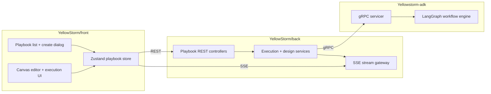

# Playbook

> **Slug:** `playbook` | **Status:** 🚧 draft | **Last Updated:** 2026-04-02 08:37:16

## Purpose

The Playbook feature lets users create, edit, generate, execute, and inspect multi-step AI workflows represented as DAGs. It combines a visual canvas, AI-assisted design flows, real-time execution streaming, and replay/evaluation tooling across the frontend, backend, and ADK runtime.

## Scope

Included in the current feature surface:

- Visual playbook CRUD and DAG editing in the frontend canvas.
- Manual and AI-assisted playbook creation from the list page dialog.
- AI designer updates against an existing playbook.
- Full-workflow and single-step execution with SSE updates.
- Replay, output-format, semantic-evaluation, and HITL copilot flows.

Explicitly excluded:

- Agent lifecycle management outside playbook assignment.
- Legacy ADK REST playbook router paths superseded by the gRPC runtime.

## Architecture

### Current frontend creation flow

- `CreatePlaybookDialog.tsx` still exposes two modes: `manual` and `auto`.
- The dialog defaults to `auto` when opened from the New Playbook entry point.
- The modal shell is now treated as a designed surface rather than a plain form container: layered neutral background, structured header, softer footer, and stronger tab treatment.
- The Auto Builder tab keeps the prompt bar as the primary interaction but now uses a two-column composition on large screens.
- The left column explains the Auto Builder flow through concise guidance cards for workflow design, naming, and workspace context.
- The right column groups the prompt bar, prompt suggestions, and optional workflow metadata into separate, clearer sections.
- Auto generation still derives a fallback playbook name from the prompt when the explicit auto-name field is left empty, preserving the existing backend contract that requires `GeneratePlaybookData.name`.

## Requirements

- As a user, I want to create a playbook manually so that I can start from a blank workflow shell.
- [ ] Manual mode still supports name, description, and workspace selection before creation.
- As a user, I want Auto Builder to feel like a prompt composer so that natural-language playbook creation is faster and more guided.
- [ ] Auto Builder foregrounds the prompt input, uses an inline submit affordance, and keeps advanced details secondary.
- As a user, I want the creation modal to feel designed and understandable at a glance.
- [ ] The modal provides clearer hierarchy, sectioning, and guidance without burying the prompt bar.
- As a user, I want example prompts in Auto Builder so that I can quickly start from a nearby workflow pattern.
- [ ] Clicking a suggestion chip replaces the Auto Builder prompt content.
- As a user, I want generation to keep working even if I do not manually provide a workflow name.
- [ ] Auto Builder derives a valid fallback name from the prompt before calling `generatePlaybook`.

## API / Interfaces

Key frontend types and interfaces affected by this iteration:

- `GeneratePlaybookData`
- `CreatePlaybookDialog`
- Playbook locale keys under `create.*`

Relevant runtime contract preserved:

- `generatePlaybook(data)` still receives `{ name, prompt, workspaces? }`.
- Auto Builder resolves `name` with `autoName.trim() || deriveAutoName(autoPrompt)`.

Key files for this iteration:

| File | Responsibility |
|------|---------------|
| `YellowStorm/front/src/modules/playbook/components/CreatePlaybookDialog.tsx` | Modal redesign around the prompt bar, two-column Auto Builder layout, cleaned footer behavior |
| `YellowStorm/front/src/modules/playbook/locales/en.json` | New modal and Auto Builder supporting copy |
| `YellowStorm/front/src/modules/playbook/locales/fr.json` | New modal and Auto Builder supporting copy |

## Design Decisions

| Decision | Rationale | Alternatives Considered |
|----------|-----------|------------------------|
| Preserve the prompt bar as the core interaction | The user explicitly wants the composer behavior retained | Reverting to a classic stacked form |
| Introduce a designed shell with header/background/footer layers | Makes the modal feel deliberate instead of like a container with one styled card inside it | Only restyling the prompt card |
| Use a left guidance column and right action column | Improves comprehension while keeping the primary prompt action visually dominant | Keeping every element in one vertical column |
| Keep inline generate action inside the prompt bar | Maintains the prompt-bar mental model and reduces duplicated actions | Moving generate back to the footer only |
| Simplify auto-mode footer to cancel only | Avoids duplicate primary CTAs because the composer already owns generation | Keeping both inline and footer generate buttons |
| Add localized supporting copy for structure cards and subtitles | The new layout needs clear, readable context in both English and French | Hardcoding labels in the component |

## Related Features

- [`task-toolbar`](../task-toolbar/README_2026-04-01_16-45-00.md)
