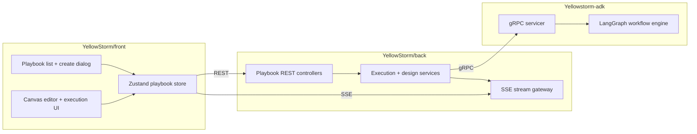

# Playbook

> **Slug:** `playbook` | **Status:** 🚧 draft | **Last Updated:** 2026-04-02 09:20:56

## Purpose

The Playbook feature lets users create, edit, generate, execute, and inspect multi-step AI workflows represented as DAGs. It combines a visual canvas, AI-assisted design flows, real-time execution streaming, and replay/evaluation tooling across the frontend, backend, and ADK runtime.

## Scope

Included in the current feature surface:

- Visual playbook CRUD and DAG editing in the frontend canvas.
- Manual and AI-assisted playbook creation from the list page dialog.
- AI designer updates against an existing playbook.
- Full-workflow and single-step execution with SSE updates.
- Replay, output-format, semantic-evaluation, and HITL copilot flows.

Explicitly excluded:

- Agent lifecycle management outside playbook assignment.
- Legacy ADK REST playbook router paths superseded by the gRPC runtime.

## Architecture

### Current frontend creation flow

- `CreatePlaybookDialog.tsx` still exposes two modes: `manual` and `auto`.
- The dialog defaults to `auto` when opened from the New Playbook entry point.
- The modal is now intentionally more minimal: shorter max height, less vertical stacking, lighter visual treatment, and reduced supporting copy density.
- The Auto Builder tab keeps the prompt bar as the primary interaction and removes the previous left guidance column entirely.
- The layout is now one compact flow: prompt bar first, quick starts second, optional name/workspace inputs last.
- Quick starts are intentionally limited to two example prompts to reduce visual noise.
- Auto generation still derives a fallback playbook name from the prompt when the explicit auto-name field is left empty, preserving the existing backend contract that requires `GeneratePlaybookData.name`.

## Requirements

- As a user, I want to create a playbook manually so that I can start from a blank workflow shell.
- [ ] Manual mode still supports name, description, and workspace selection before creation.
- As a user, I want Auto Builder to feel like a prompt composer so that natural-language playbook creation is faster and more guided.
- [ ] Auto Builder foregrounds the prompt input, uses an inline submit affordance, and keeps advanced details secondary.
- As a user, I want the creation modal to stay visually quiet and compact.
- [ ] The modal avoids large decorative side panels and reduces total height versus the previous redesign.
- As a user, I want quick starts without clutter.
- [ ] Auto Builder shows no more than two quick-start prompts.
- As a user, I want generation to keep working even if I do not manually provide a workflow name.
- [ ] Auto Builder derives a valid fallback name from the prompt before calling `generatePlaybook`.

## API / Interfaces

Key frontend types and interfaces affected by this iteration:

- `GeneratePlaybookData`
- `CreatePlaybookDialog`
- Playbook locale keys under `create.*`

Relevant runtime contract preserved:

- `generatePlaybook(data)` still receives `{ name, prompt, workspaces? }`.
- Auto Builder resolves `name` with `autoName.trim() || deriveAutoName(autoPrompt)`.

Key files for this iteration:

| File | Responsibility |
|------|---------------|
| `YellowStorm/front/src/modules/playbook/components/CreatePlaybookDialog.tsx` | Minimal Auto Builder layout, reduced height, two quick starts, compact prompt composer |
| `YellowStorm/front/src/modules/playbook/locales/en.json` | Compact hint copy for the minimal Auto Builder layout |
| `YellowStorm/front/src/modules/playbook/locales/fr.json` | Compact hint copy for the minimal Auto Builder layout |

## Design Decisions

| Decision | Rationale | Alternatives Considered |
|----------|-----------|------------------------|
| Remove the left guidance column | It consumed too much vertical and horizontal attention for a prompt-first modal | Keep the card-based explanatory sidebar |
| Reduce the modal max height | The user explicitly wants a shorter window | Preserve the previous taller shell with more breathing room |
| Limit quick starts to two | Keeps the surface useful without turning it into a second content block | Keep five suggestions or hide suggestions entirely |
| Keep optional metadata in a narrow secondary section | Name and workspace remain available without competing with the prompt | Move metadata back above the prompt or hide it behind another interaction |
| Preserve inline generate action | The prompt bar still owns the core action and remains the dominant affordance | Restore a duplicate footer generate button |

## Related Features

- [`task-toolbar`](../task-toolbar/README_2026-04-01_16-45-00.md)
