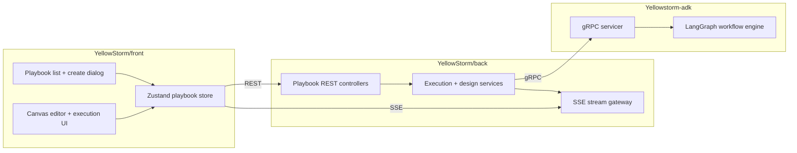

# Playbook

> **Slug:** `playbook` | **Status:** 🚧 draft | **Last Updated:** 2026-04-02 09:37:45

## Purpose

The Playbook feature lets users create, edit, generate, execute, and inspect multi-step AI workflows represented as DAGs. It combines a visual canvas, AI-assisted design flows, real-time execution streaming, and replay/evaluation tooling across the frontend, backend, and ADK runtime.

## Scope

Included in the current feature surface:

- Visual playbook CRUD and DAG editing in the frontend canvas.
- Manual and AI-assisted playbook creation from the list page dialog.
- AI designer updates against an existing playbook.
- Full-workflow and single-step execution with SSE updates.
- Replay, output-format, semantic-evaluation, and HITL copilot flows.

Explicitly excluded:

- Agent lifecycle management outside playbook assignment.
- Legacy ADK REST playbook router paths superseded by the gRPC runtime.

## Architecture

### Current frontend creation and canvas flow

- `CreatePlaybookDialog.tsx` still exposes two modes: `manual` and `auto`.
- The dialog defaults to `auto` when opened from the New Playbook entry point.
- The modal is intentionally cleaner and shorter: reduced max height, tighter spacing, and less decorative framing.
- The Auto Builder view reads as a single clean composition: compact intro, prompt composer, two quick starts, then optional metadata.
- In the canvas, node side connectors are now vertically centered on their anchor position so single-port nodes align visually in the middle of the card edge instead of sitting slightly off-center.
- Auto generation still derives a fallback playbook name from the prompt when the explicit auto-name field is left empty, preserving the existing backend contract that requires `GeneratePlaybookData.name`.

## Requirements

- As a user, I want to create a playbook manually so that I can start from a blank workflow shell.
- [ ] Manual mode still supports name, description, and workspace selection before creation.
- As a user, I want Auto Builder to feel like a prompt composer so that natural-language playbook creation is faster and more guided.
- [ ] Auto Builder foregrounds the prompt input, uses an inline submit affordance, and keeps advanced details secondary.
- As a user, I want the creation modal to stay visually quiet and compact.
- [ ] The modal avoids large decorative side panels, shortens the shell height, and reduces border/shadow competition between sections.
- As a user, I want playbook nodes to connect cleanly.
- [ ] Side connectors render centered on the node edge so links visually originate from the middle anchor location.
- As a user, I want generation to keep working even if I do not manually provide a workflow name.
- [ ] Auto Builder derives a valid fallback name from the prompt before calling `generatePlaybook`.

## API / Interfaces

Key frontend types and interfaces affected by recent iterations:

- `GeneratePlaybookData`
- `CreatePlaybookDialog`
- `PlaybookNode`
- Playbook locale keys under `create.*`

Relevant runtime contract preserved:

- `generatePlaybook(data)` still receives `{ name, prompt, workspaces? }`.
- Auto Builder resolves `name` with `autoName.trim() || deriveAutoName(autoPrompt)`.

Key files for this iteration:

| File | Responsibility |
|------|---------------|
| `YellowStorm/front/src/modules/playbook/components/CreatePlaybookDialog.tsx` | Cleaner Auto Builder layout, flatter tabs, reduced shell height, toned-down section chrome |
| `YellowStorm/front/src/modules/playbook/components/PlaybookNode.tsx` | Vertically centered side connectors on rendered canvas nodes |
| `YellowStorm/front/src/modules/playbook/locales/en.json` | Compact hint copy used by the minimal prompt composer |
| `YellowStorm/front/src/modules/playbook/locales/fr.json` | Compact hint copy used by the minimal prompt composer |

## Design Decisions

| Decision | Rationale | Alternatives Considered |
|----------|-----------|------------------------|
| Keep the tab switcher but reduce its visual weight | The user still needs both modes, but the control should not dominate the modal | Remove tabs entirely or keep the previous heavier segmented control |
| Flatten the Auto Builder sections into lighter white surfaces | Cleaner hierarchy comes from contrast restraint, not more containers | Preserve the stronger gradients and deeper framing |
| Reduce modal max height again | The user explicitly wants a shorter, more minimal shell | Keep the prior compact version unchanged |
| Center side connector dots with CSS transform | React Flow handle `top` should represent the center anchor, not the handle's top edge | Offset individual nodes manually or alter edge routing logic |

## Related Features

- [`task-toolbar`](../task-toolbar/README_2026-04-01_16-45-00.md)
