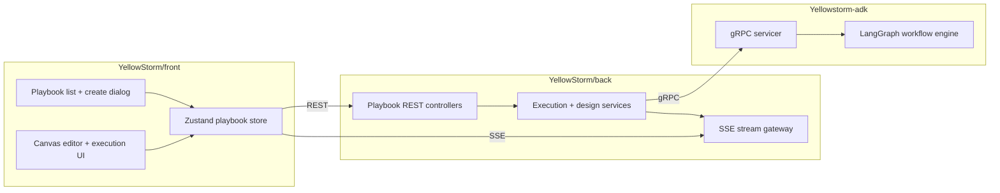

# Playbook

> **Slug:** `playbook` | **Status:** 🚧 draft | **Last Updated:** 2026-04-02 12:47:09

## Purpose

The Playbook feature lets users create, edit, generate, execute, and inspect multi-step AI workflows represented as DAGs. It combines a visual canvas, AI-assisted design flows, real-time execution streaming, and replay/evaluation tooling across the frontend, backend, and ADK runtime.

## Scope

Included in the current feature surface:

- Visual playbook CRUD and DAG editing in the frontend canvas.
- Manual and AI-assisted playbook creation from the list page dialog.
- AI designer updates against an existing playbook.
- Full-workflow and single-step execution with SSE updates.
- Replay, output-format, semantic-evaluation, and HITL copilot flows.
- Defensive backend mapping for gRPC playbook responses that contain non-Mongo agent identifiers.
- Canvas execution viewing that respects an explicitly selected execution instead of snapping back to the most recent live run.
- Client-side sanitization of playbook update payloads so UI-only task flags do not reach the backend validator.
- Compact evaluation details that keep KPI cards at the top of the step evaluation panel.
- Step-level execution comparison inside the evaluation panel so multiple step executions can be contrasted side by side.
- Workflow execution deletion from the execution selector header.
- Results-tab execution selection so a specific workflow execution can be opened directly from the step result view.
- Node context menu actions for saving the baseline replay and saving the output-format template from a completed step.

Explicitly excluded:

- Agent lifecycle management outside playbook assignment.
- Legacy ADK REST playbook router paths superseded by the gRPC runtime.

## Architecture

### Current frontend creation and canvas flow

- `CreatePlaybookDialog.tsx` still exposes two modes: `manual` and `auto`.
- The dialog defaults to `auto` when opened from the New Playbook entry point.
- The modal is intentionally cleaner and shorter: reduced max height, tighter spacing, and less decorative framing.
- The Auto Builder view reads as a single clean composition: compact intro, prompt composer, two quick starts, then optional metadata.
- In the canvas, node side connectors are now vertically centered on their anchor position so single-port nodes align visually in the middle of the card edge instead of sitting slightly off-center.
- Auto generation still derives a fallback playbook name from the prompt when the explicit auto-name field is left empty, preserving the existing backend contract that requires `GeneratePlaybookData.name`.
- gRPC response mapping now tolerates non-ObjectId `assigned_agent_id` values by storing `null` instead of throwing during `Types.ObjectId` construction.
- The canvas polling loop only tracks a live execution when no explicit execution is selected, so manual history selection is no longer overridden by the latest live execution.
- Update payload sanitization now emits only backend-approved task fields, preventing UI-only replay bookkeeping from being sent on `PATCH /api/v1/playbooks/:id`.
- The evaluation tab now shows the semantic KPI cards immediately instead of reserving space for a descriptive intro block.
- The node context menu now includes actions for saving the baseline replay and saving the output-format template from a completed node.

### Execution comparison and deletion flow

- `ExecutionPanel.tsx` now exposes a trash action for the currently selected workflow execution when that execution is not running or interrupted.
- The delete action opens a confirmation dialog before calling the store-level `deleteExecution()` mutation.
- `ExecutionStepDetail.tsx` now supports step-level execution comparison by pairing the selected step execution with a second evaluation-history entry from the same step.
- `ExecutionStepDetail.tsx` now also exposes a results-tab execution selector so the step result view can switch to a different workflow execution directly.
- The comparison view derives deltas for the overall score, embedding similarity, evidence consistency, and judge score.
- The comparison UI keeps the selected execution and compared execution visible together so users can inspect score differences without switching the primary context away from the chosen step execution.

## Requirements

- As a user, I want to create a playbook manually so that I can start from a blank workflow shell.
- [ ] Manual mode still supports name, description, and workspace selection before creation.
- As a user, I want Auto Builder to feel like a prompt composer so that natural-language playbook creation is faster and more guided.
- [ ] Auto Builder foregrounds the prompt input, uses an inline submit affordance, and keeps advanced details secondary.
- As a user, I want the creation modal to stay visually quiet and compact.
- [ ] The modal avoids large decorative side panels, shortens the shell height, and reduces border/shadow competition between sections.
- As a user, I want playbook nodes to connect cleanly.
- [ ] Side connectors render centered on the node edge so links visually originate from the middle anchor location.
- As a user, I want generation to keep working even if I do not manually provide a workflow name.
- [ ] Auto Builder derives a valid fallback name from the prompt before calling `generatePlaybook`.
- As a user, I want playbook generation to survive runtime agent identifiers that are not Mongo ObjectIds.
- [ ] `assigned_agent_id` values that are missing or invalid are mapped to `null` instead of throwing a `BSONError`.
- As a user, I want the execution view to stay on the execution I selected.
- [ ] Selecting a historical execution does not get overwritten by polling for the most recent live execution.
- As a user, I want saving a playbook to only send fields the backend accepts.
- [ ] Client-only replay state is stripped out before sending a task update payload.
- As a user, I want the evaluation tab to prioritize KPI visibility.
- [ ] The semantic match cards appear above the supporting history and description copy.
- As a user, I want to compare two step executions for the same step.
- [ ] The evaluation panel lets me choose a second step execution and displays score deltas between the two runs.
- As a user, I want to remove a workflow execution that I no longer need.
- [ ] The execution header exposes a trash action for deletable workflow executions and asks for confirmation before deletion.
- As a user, I want to inspect a specific workflow execution from the step result view.
- [ ] The results tab exposes an execution selector that switches the current panel to the chosen workflow execution.
- As a user, I want node-level shortcuts for replay metadata.
- [ ] The node context menu exposes `Save baseline` and `Save output format` for completed steps.

## API / Interfaces

Key frontend types and interfaces affected by recent iterations:

- `GeneratePlaybookData`
- `CreatePlaybookDialog`
- `PlaybookNode`
- `ExecutionPanel`
- `ExecutionStepDetail`
- Playbook locale keys under `create.*`, `execution.*`, `detail.*`, and `nodeContextMenu.*`

Relevant runtime contract preserved:

- `generatePlaybook(data)` still receives `{ name, prompt, workspaces? }`.
- Auto Builder resolves `name` with `autoName.trim() || deriveAutoName(autoPrompt)`.

Backend mapping behavior updated in this iteration:

- `mapGrpcResponseToTasksAndEdges(response)` now uses a guarded ObjectId conversion helper for `assigned_agent_id`.
- `toOptionalObjectId(value)` returns `null` for missing, empty, or invalid identifiers.

Canvas execution selection behavior updated in this iteration:

- `PlaybookCanvasPage` only polls a live execution when no explicit execution is selected in the store.

Update payload behavior updated in this iteration:

- `sanitizePlaybookUpdate(data)` now reconstructs each task from a backend-safe allow-list instead of relying on a partial omit list.

Canvas node action behavior updated in this iteration:

- `PlaybookCanvasPage` now routes `onSaveBaseline` to `validateTaskReplay()` and `onSaveOutputFormat` to `grabOutputFormatTemplate()`.
- `PlaybookNode` exposes both actions in the contextual menu only when the selected execution and task result support them.

Results-tab execution selection behavior updated in this iteration:

- `ExecutionStepDetail` now renders a workflow execution selector in the results tab and switches the visible panel execution through `viewExecutionInPanel()`.

Evaluation layout and comparison behavior updated in this iteration:

- `ExecutionStepDetail` now renders the step execution selector and comparison selector above the KPI cards.
- `ExecutionStepDetail` can compare the currently selected step execution against another evaluation-history entry from the same step and display score deltas.

Execution deletion behavior updated in this iteration:

- `ExecutionPanel` exposes `deleteExecution()` behind a confirmation dialog for the selected workflow execution.

Key files for this iteration:

| File | Responsibility |
|------|-----------------|
| `YellowStorm/back/src/modules/playbook/services/playbook-design.service.ts` | Defensive gRPC-to-task mapping for optional assigned agent ids |
| `YellowStorm/front/src/modules/playbook/components/PlaybookCanvasPage.tsx` | Preserve explicit execution selection, expose node baseline/output-format actions |
| `YellowStorm/front/src/modules/playbook/components/PlaybookNode.tsx` | Node contextual menu entries for baseline and output-format actions |
| `YellowStorm/front/src/modules/playbook/components/ExecutionPanel.tsx` | Workflow execution selection header and delete confirmation flow |
| `YellowStorm/front/src/modules/playbook/components/ExecutionStepDetail.tsx` | Compact evaluation layout with step execution comparison and results-tab execution switching |
| `YellowStorm/front/src/modules/playbook/api.ts` | Allow-list sanitization for playbook task update payloads |
| `YellowStorm/front/src/modules/playbook/api.test.ts` | Regression coverage for stripped UI-only task fields |
| `YellowStorm/front/src/modules/playbook/components/ExecutionStepDetail.test.tsx` | Regression coverage for the compact evaluation layout, step comparison, and results-tab execution picker |
| `YellowStorm/front/src/modules/playbook/components/ExecutionPanel.test.tsx` | Regression coverage for workflow execution deletion |
| `YellowStorm/front/src/modules/playbook/locales/en.json` | Labels for workflow execution deletion, step comparison, and results-tab execution selection |
| `YellowStorm/front/src/modules/playbook/locales/fr.json` | Labels for workflow execution deletion, step comparison, and results-tab execution selection |
| `YellowStorm/front/src/modules/playbook/components/CreatePlaybookDialog.tsx` | Cleaner Auto Builder layout, flatter tabs, reduced shell height, toned-down section chrome |
| `YellowStorm/front/src/modules/playbook/components/PlaybookNode.tsx` | Vertically centered side connectors on rendered canvas nodes |

## Design Decisions

| Decision | Rationale | Alternatives Considered |
|----------|-----------|------------------------|
| Keep the tab switcher but reduce its visual weight | The user still needs both modes, but the control should not dominate the modal | Remove tabs entirely or keep the previous heavier segmented control |
| Flatten the Auto Builder sections into lighter white surfaces | Cleaner hierarchy comes from contrast restraint, not more containers | Preserve the stronger gradients and deeper framing |
| Reduce modal max height again | The user explicitly wants a shorter, more minimal shell | Keep the prior compact version unchanged |
| Center side connector dots with CSS transform | React Flow handle `top` should represent the center anchor, not the handle's top edge | Offset individual nodes manually or alter edge routing logic |
| Treat invalid `assigned_agent_id` values as optional rather than fatal | gRPC responses can emit non-database identifiers, and generation should not fail for a missing assignment reference | Reject the whole playbook generation result or coerce the string into an invalid ObjectId wrapper |
| Keep explicit execution selection ahead of background polling | A user-chosen history entry should remain stable even if another execution is live in the same playbook | Always prefer the newest live run or disable polling entirely |
| Use an allow-list for task updates | This prevents future UI-only task fields from leaking into backend validation errors | Keep a growing omit list of transient fields |
| Promote evaluation KPIs above descriptive copy | The evaluation score cards are the primary signal, so they should be the first thing users see | Preserve the previous intro-first layout |
| Compare step executions in-place inside the evaluation panel | Users need a direct side-by-side reference without leaving the current step context | Open a separate comparison modal or move comparison to another screen |
| Expose workflow execution deletion from the header | The selected workflow execution is already the current context for removal | Move deletion into a separate actions menu only |
| Allow results-tab execution switching in the step result view | Users need a direct way to jump between workflow executions without leaving the results tab | Keep execution switching only in the header or evaluation tab |
| Rename output-format capture to `Save output format` | The action is clearer when labeled as a save operation rather than a grab operation | Keep the previous copy or use a more technical verb |
| Reorder the node menu with execute first | Execution is the primary node action and should be easiest to reach | Keep the previous action order |

## Related Features

- [`task-toolbar`](../task-toolbar/README_2026-04-01_16-45-00.md)
