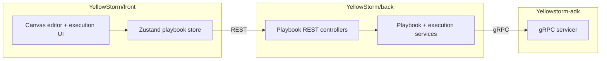

# Playbook

> **Slug:** `playbook` | **Status:** 🚧 draft | **Last Updated:** 2026-04-02 13:10:28

## Purpose

The Playbook feature lets users create, edit, generate, execute, and inspect multi-step AI workflows represented as DAGs. It combines a visual canvas, AI-assisted design flows, real-time execution streaming, and replay/evaluation tooling across the frontend, backend, and ADK runtime.

## Scope

Included in the current feature surface:

- Visual playbook CRUD and DAG editing in the frontend canvas.
- Manual and AI-assisted playbook creation from the list page dialog.
- AI designer updates against an existing playbook.
- Full-workflow and single-step execution with SSE updates.
- Replay, output-format, semantic-evaluation, and HITL copilot flows.
- Defensive backend mapping for gRPC playbook responses that contain non-Mongo agent identifiers.
- Canvas execution viewing that respects an explicitly selected execution instead of snapping back to the most recent live run.
- Client-side sanitization of playbook update payloads so UI-only task flags do not reach the backend validator.
- Compact evaluation details that keep KPI cards at the top of the step evaluation panel.
- Step-level evaluation comparison inside the evaluation panel.
- Workflow execution deletion from the execution selector header.
- Persisted step-execution history per task result so the results tab can inspect older step attempts within the same workflow execution.
- Per-step-execution deletion from the results-tab dropdown for archived step attempts.
- Node context menu actions for saving the baseline replay and saving the output-format template from a completed step.

Explicitly excluded:

- Agent lifecycle management outside playbook assignment.
- Legacy ADK REST playbook router paths superseded by the gRPC runtime.

## Architecture

### Step execution history flow

- `TaskResult` now persists a `stepExecutions` array containing immutable result snapshots for completed or failed step attempts.
- `PlaybookExecutionService.updateTaskResult()` synchronizes the snapshot for the current `attemptNumber` whenever a task result reaches a terminal state.
- `PlaybookService.findExecutionById()` and active execution reads now expose `stepExecutions` to the frontend.
- `ExecutionStepDetail.tsx` uses `step.stepExecutions` for the results-tab picker instead of workflow execution history.
- A dedicated delete route removes an archived step execution from a task's history without deleting the containing workflow execution.

## Requirements

- As a user, I want to compare two step executions for the same step.
- [ ] The evaluation panel lets me choose a second step execution and displays score deltas between the two runs.
- As a user, I want to inspect a specific historical step execution from the results tab.
- [ ] The results tab exposes a step-execution picker backed by step-level history, not workflow executions.
- As a user, I want to remove an archived step execution that I no longer need.
- [ ] The results-tab dropdown exposes a trash action per archived step execution.
- [ ] The current live/latest step result is not deletable through the archived history action.

## API / Interfaces

Key additions in this iteration:

- Backend schema: `TaskResult.stepExecutions`
- Backend route: `DELETE /playbooks/:id/executions/:execId/tasks/:taskId/step-executions/:stepExecutionId`
- Frontend type: `StepExecutionHistoryEntry`
- Frontend store action: `deleteStepExecution(playbookId, executionId, taskId, stepExecutionId)`

Key files for this iteration:

| File | Responsibility |
|------|-----------------|
| `YellowStorm/back/src/modules/playbook/schemas/playbook-execution.schema.ts` | Persist step execution snapshots per task result |
| `YellowStorm/back/src/modules/playbook/services/playbook-execution.service.ts` | Sync step execution history from terminal task results |
| `YellowStorm/back/src/modules/playbook/services/playbook.service.ts` | Expose and delete step execution history entries |
| `YellowStorm/back/src/modules/playbook/controllers/playbook-execution.controller.ts` | Step execution delete endpoint |
| `YellowStorm/front/src/modules/playbook/types.ts` | Step execution history types and store action signature |
| `YellowStorm/front/src/modules/playbook/store.ts` | Client delete action and cache update for step execution removal |
| `YellowStorm/front/src/modules/playbook/components/ExecutionStepDetail.tsx` | Results-tab step execution picker and per-entry trash action |
| `YellowStorm/front/src/modules/playbook/components/ExecutionStepDetail.test.tsx` | Regression coverage for the results-tab step execution picker |

## Design Decisions

| Decision | Rationale | Alternatives Considered |
|----------|-----------|------------------------|
| Persist step executions under each `TaskResult` | Step-level history belongs to the task result, not the workflow execution list | Derive it from workflow executions or evaluation history |
| Keep the current/latest task result outside the delete action | The current result remains the source of truth for the selected execution | Allow deleting the active attempt and infer a fallback current result |
| Use a custom dropdown row instead of `SelectItem` for results-tab history | Each entry needs its own trash action in the same control | Force deletion into a second menu or modal-only flow |

## Related Features

- [`task-toolbar`](../task-toolbar/README_2026-04-01_16-45-00.md)
