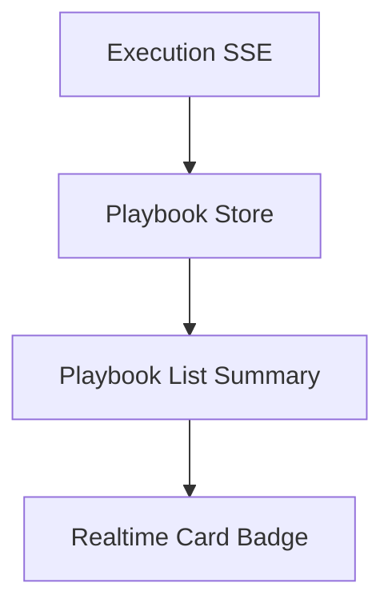

# Playbook Architecture

> **Slug:** `playbook` | **Status:** 🚧 draft | **Last Updated:** 2026-04-05 11:13:39

## Purpose
Document the playbook system and the integration points an AI coding agent needs to extend it safely.

## Scope
Includes frontend playbook list/canvas behavior, backend execution APIs, streaming, replay, evaluation, undo/redo, scheduling, and list summaries.
Excludes unrelated modules outside the playbook domain.

## Architecture (if applicable)
The backend playbook summary now carries the latest execution status so the frontend list can render realtime state badges from SSE-hydrated store data.

## Requirements
- As a user, I want to see the current playbook execution state on the home page so I can tell which workflows are running.
- [ ] The playbook list shows a spinner badge for running executions.
- [ ] The playbook list shows an `Idle` badge when nothing is running.
- [ ] The card exposes a shortcut to open the scheduler.

## API / Interfaces
- `PlaybookSummaryResponse.executionStatus?: ExecutionStatus | null`
- `PlaybookSummary.executionStatus?: ExecutionStatus | null`

## Design Decisions
| Decision | Rationale | Alternatives Considered |
|----------|-----------|------------------------|
| Include latest execution status in list summaries | Lets the home page show realtime badges without extra card-level fetches | Per-card polling or an additional detail lookup |
| Render `Idle` in the card badge | Keeps the state visible even when no execution is active | Hide the badge entirely |
| Open scheduler via query param | Reuses the existing canvas page and sheet state | Dedicated scheduler route |

## Related Features
- [`playbook`](/docs/playbook/README_2026-04-05_11-13-39.md)
