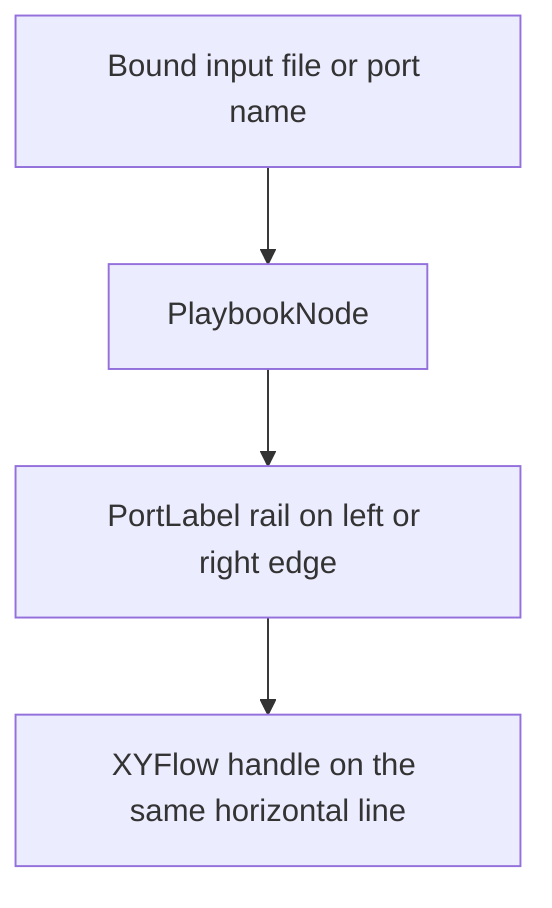

# Playbook Architecture

> **Slug:** `playbook` | **Status:** 🚧 draft | **Last Updated:** 2026-04-05 16:19:16

## Purpose
Document the playbook system and the integration points an AI coding agent needs to extend it safely.

## Scope
Includes frontend playbook list/canvas behavior, backend execution APIs, streaming, replay, evaluation, undo/redo, scheduling, and list summaries.
Excludes unrelated modules outside the playbook domain.

## Architecture (if applicable)
The playbook canvas now renders typed input and output labels in dedicated side rails outside each node card, aligned with the XYFlow connector handles. Input rails prefer the bound file name when a file is attached to a port; output rails keep the port name visible. Labels are width-capped, single-line, and expose the full text through native hover titles so card content remains readable without losing port context.

## Requirements
- As a user, I want port labels to sit outside the node body so I can read the card and understand handle mappings at a glance.
- [ ] Input labels render outside the left edge and align horizontally with their handles.
- [ ] Output labels render outside the right edge, truncate long text, and reveal the full label on hover.

## API / Interfaces
- `PlaybookNode` passes `boundFile?.name || port.name` to left-side labels and keeps output labels on the right rail.
- `PortLabel({ name, kind, position, selected? })` renders a fixed-height, truncated external label with selected-node highlighting.

## Design Decisions
| Decision | Rationale | Alternatives Considered |
|----------|-----------|------------------------|
| Move port labels fully outside the card body | Preserves title, description, and actions while making connector ownership immediate | Floating chips over the card body |
| Truncate labels and use the native `title` attribute for hover reveal | Keeps the canvas compact without hiding the full file or port name | Showing full filenames at all times |
| Reuse the selected-node accent on rail labels | Keeps the node and its ports visually grouped during selection | Highlighting only the card border |

## Related Features
- None currently documented.
