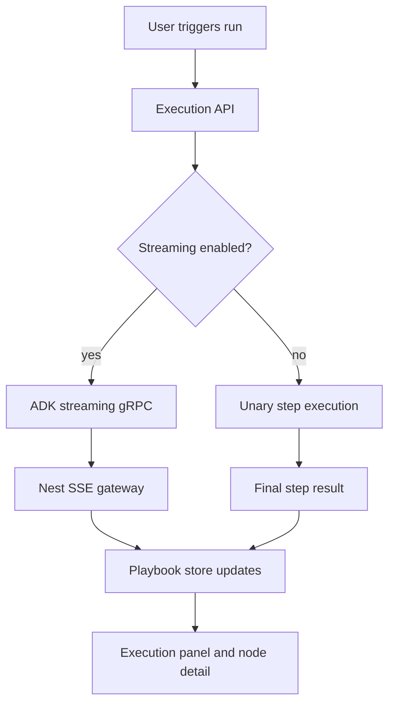

# Playbook Architecture

> **Slug:** `playbook` | **Status:** 🚧 draft | **Last Updated:** 2026-04-05 17:18:43

## Purpose
Document the playbook system and the integration points an AI coding agent needs to extend it safely.

## Scope
Includes frontend playbook list/canvas behavior, backend execution APIs, streaming, replay, evaluation, undo/redo, scheduling, and list summaries.
Excludes unrelated modules outside the playbook domain.

## Architecture (if applicable)
Playbook execution now supports two realtime paths:

- full workflow execution via the existing playbook gRPC stream and SSE bridge
- single-step execution via a dedicated streaming gRPC RPC so node runs can emit live text/tool progress before completion

The frontend keeps a single shared SSE subscription and merges step updates into the playbook store. The execution page can switch between nodes while the underlying execution keeps streaming to the same execution record.

## Requirements
- As a user, I want a playbook node execution to stream text and tool progress so I can watch the step evolve in realtime.
- As an API caller, I want to opt in or out of streaming so I can choose between realtime updates and a simple blocking response.
- As a scheduler, I want playbook runs to stay non-streaming so background jobs do not emit interactive progress.
- [ ] Single-step executions can stream progress before the final step result is persisted.
- [ ] Streaming can be enabled or disabled at the execution request boundary.
- [ ] Scheduled playbook runs default to non-streaming behavior.

## API / Interfaces
- `ExecutePlaybookDto.streaming?: boolean` controls realtime execution updates for manual/API runs.
- `RerunStepDto.streaming?: boolean` and `ResumeFromStepDto.streaming?: boolean` control step-level streaming for reuse flows.
- `RunStepStream(RunStepRequest) returns (stream PlaybookStreamChunk)` provides realtime step updates from the ADK gRPC server.
- `usePlaybookStore().onStepUpdate(...)` merges live progress into the active execution cache.

## Design Decisions
| Decision | Rationale | Alternatives Considered |
|----------|-----------|------------------------|
| Add a dedicated streaming RPC for single-step execution | Keeps the blocking `RunStep` path stable while enabling realtime updates for interactive runs | Reworking the unary RPC to carry partial updates |
| Gate streaming at the execution request boundary | Lets UI, API callers, and scheduled runs choose behavior explicitly | Inferring streaming from connection state |
| Merge live step progress into the execution cache | Allows the user to switch nodes without losing the underlying stream state | Re-subscribing per selected node |

## Related Features
- None currently documented.
