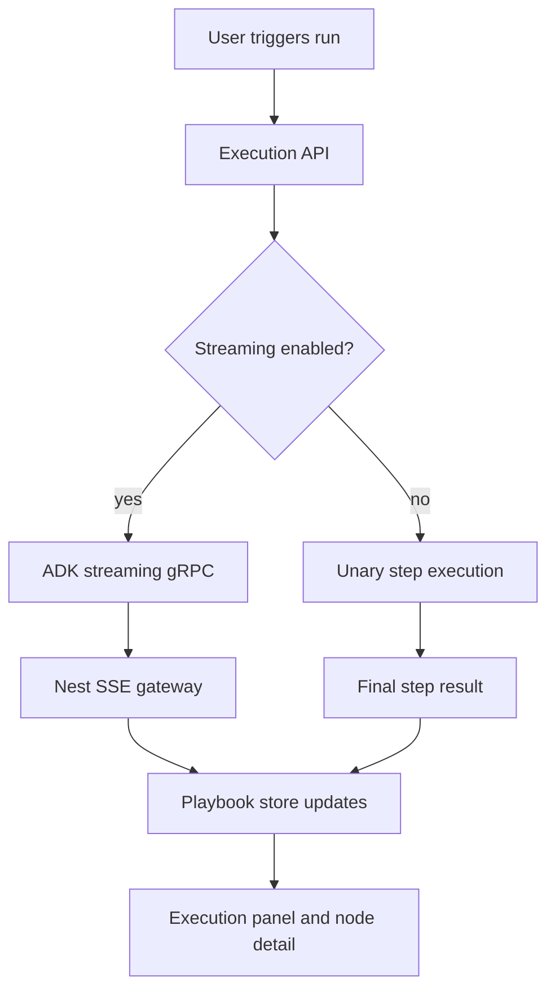

# Playbook Architecture

> **Slug:** `playbook` | **Status:** 🚧 draft | **Last Updated:** 2026-04-05 18:20:42

## Purpose
Document the playbook system and the integration points an AI coding agent needs to extend it safely.

## Scope
Includes frontend playbook list/canvas behavior, backend execution APIs, streaming, replay, evaluation, undo/redo, scheduling, and list summaries.
Excludes unrelated modules outside the playbook domain.

## Architecture (if applicable)
Playbook execution now supports two realtime paths:

- full workflow execution via the existing playbook gRPC stream and SSE bridge
- single-step execution via a dedicated streaming gRPC RPC so node runs can emit live text/tool progress before completion

The frontend keeps a single shared SSE subscription and merges step updates into the playbook store. The execution page can switch between nodes while the underlying execution keeps streaming to the same execution record.

Single-step streaming now has five safety rails:

- the Nest execution service normalizes malformed stream chunks by deriving terminal status from `step_update.result.status` when the top-level `step_update.status` is missing or stale
- the ADK gRPC servicer emits a terminal failed chunk if step-update serialization breaks, instead of ending the stream with an empty chunk
- the ADK gRPC servicer builds `PlaybookStepUpdate` messages via explicit `CopyFrom(...)` assignment rather than protobuf kwargs, so nested result payloads that still contain logical `output` fields are converted through `_build_task_result_proto()` instead of being misparsed as raw `PlaybookTaskResult(...)` constructor kwargs
- the ADK single-step stream includes `result` payloads for non-text progress such as tool traces and tool-generated components, rather than only attaching a result when partial text output exists
- the frontend execution detail view now prefers the live current attempt snapshot over any persisted `stepExecutions` history entry for the same attempt number, so in-memory streaming updates are not masked by an older persisted snapshot until the final refetch

## Requirements
- As a user, I want a playbook node execution to stream text and tool progress so I can watch the step evolve in realtime.
- As an API caller, I want to opt in or out of streaming so I can choose between realtime updates and a simple blocking response.
- As a scheduler, I want playbook runs to stay non-streaming so background jobs do not emit interactive progress.
- [ ] Single-step executions can stream progress before the final step result is persisted.
- [ ] Streaming can be enabled or disabled at the execution request boundary.
- [ ] Scheduled playbook runs default to non-streaming behavior.
- [ ] Terminal step completion is preserved even when the stream chunk status is malformed or terminal chunk serialization partially fails.
- [ ] Streamed step updates never construct `PlaybookTaskResult` directly from raw dict payloads containing logical `output` keys.
- [ ] Tool-driven single-step progress emits realtime `playbook_step_update` events before final completion, even if no partial text tokens have been produced yet.
- [ ] The result tab always displays the live current attempt during an active run, even when persisted history for the same attempt number already exists.

## API / Interfaces
- `ExecutePlaybookDto.streaming?: boolean` controls realtime execution updates for manual/API runs.
- `RerunStepDto.streaming?: boolean` and `ResumeFromStepDto.streaming?: boolean` control step-level streaming for reuse flows.
- `RunStepStream(RunStepRequest) returns (stream PlaybookStreamChunk)` provides realtime step updates from the ADK gRPC server.
- `usePlaybookStore().onStepUpdate(...)` merges live progress into the active execution cache.
- `PlaybookExecutionService.resolveStreamStepStatus()` reconciles top-level stream status with `step_update.result.status` for terminal single-step updates.
- `_safe_build_step_update_chunk()` converts ADK step-update dicts into protobuf chunks with a terminal failure fallback.
- `_build_step_update_chunk()` allocates `PlaybookStepUpdate` first and uses `CopyFrom(...)` for nested `result` and `interrupt` payloads.
- `_build_in_progress_result()` materializes stream payloads for partial text, tool traces, components, prompt traces, and artifacts so in-progress chunks are not limited to text-only updates.
- `ExecutionStepDetail` now replaces any persisted history entry for the same attempt number with the live current step snapshot before rendering the result-tab execution picker.

## Design Decisions
| Decision | Rationale | Alternatives Considered |
|----------|-----------|------------------------|
| Add a dedicated streaming RPC for single-step execution | Keeps the blocking `RunStep` path stable while enabling realtime updates for interactive runs | Reworking the unary RPC to carry partial updates |
| Gate streaming at the execution request boundary | Lets UI, API callers, and scheduled runs choose behavior explicitly | Inferring streaming from connection state |
| Merge live step progress into the execution cache | Allows the user to switch nodes without losing the underlying stream state | Re-subscribing per selected node |
| Normalize terminal stream state in the Nest consumer and emit failed fallback chunks from ADK | Prevents progress-only single-step streams from being misclassified as failed when the final chunk shape is incomplete or serialization fails | Trusting the raw stream status only and letting malformed terminal chunks terminate silently |
| Use explicit protobuf `CopyFrom(...)` for streamed step updates | Avoids protobuf recursively interpreting raw nested dict payloads as `PlaybookTaskResult(...)` kwargs, which breaks on the reserved `output` field | Continuing to build `PlaybookStepUpdate(**kwargs)` with nested message-like dicts |
| Attach in-progress `result` payloads for tool/component progress even without text tokens | Tool-using steps often have meaningful realtime state before any assistant text exists; the frontend can only render these updates when the gRPC chunk carries a result payload | Emitting only text-driven progress and waiting for the final completion block for tool activity |
| Prefer the live current attempt over persisted history in the detail view | Prevents an already-persisted same-attempt snapshot from hiding in-memory streaming updates during the active run | Trusting persisted `stepExecutions` ordering and attempt deduplication to reflect the freshest state |

## Related Features
- None currently documented.
