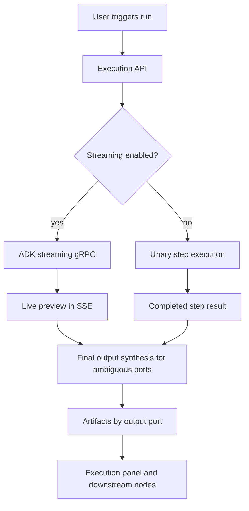

# Playbook Architecture

> **Slug:** `playbook` | **Status:** 🚧 draft | **Last Updated:** 2026-04-06 07:03:14

## Purpose
Document the playbook system and the integration points an AI coding agent needs to extend it safely.

## Scope
Includes frontend playbook list/canvas behavior, backend execution APIs, streaming, replay, evaluation, undo/redo, scheduling, output routing, and list summaries.
Excludes unrelated modules outside the playbook domain.

## Architecture (if applicable)
Playbook execution now supports two realtime paths:

- full workflow execution via the existing playbook gRPC stream and SSE bridge
- single-step execution via a dedicated streaming gRPC RPC so node runs can emit live text/tool progress before completion

The frontend keeps a single shared SSE subscription and merges step updates into the playbook store. The execution page can switch between nodes while the underlying execution keeps streaming to the same execution record.

Realtime playbook execution now has eleven safety rails:

- the Nest execution service normalizes malformed stream chunks by deriving terminal status from `step_update.result.status` when the top-level `step_update.status` is missing or stale
- the ADK gRPC servicer emits a terminal failed chunk if step-update serialization breaks, instead of ending the stream with an empty chunk
- the ADK gRPC servicer builds `PlaybookStepUpdate` messages via explicit `CopyFrom(...)` assignment rather than protobuf kwargs, so nested result payloads that still contain logical `output` fields are converted through `_build_task_result_proto()` instead of being misparsed as raw `PlaybookTaskResult(...)` constructor kwargs
- the ADK single-step stream includes `result` payloads for non-text progress such as tool traces and tool-generated components, rather than only attaching a result when partial text output exists
- the frontend execution detail view prefers the live current attempt snapshot over any persisted `stepExecutions` history entry for the same attempt number, so in-memory streaming updates are not masked by an older persisted snapshot until the final refetch
- the full-workflow graph builder now passes `on_progress` through live tool execution, replay tool execution, and direct LLM calls, converting partial output/tool/component updates into `in_progress` step updates before the final completed chunk
- the execution detail panel auto-scrolls while a run is streaming and exposes a jump-to-bottom button when the user scrolls away from the live tail
- file artifacts generated without an explicit `output_port_id` can still be routed deterministically when their generated filename encodes the target output port id, avoiding a hard failure on valid workflows with multiple document-like output ports
- when output ports are semantically ambiguous, streaming stays a single live preview and a non-streamed final synthesis pass maps the completed result into declared output ports using the port names and descriptions
- the full-workflow node executor now runs the same final structured-output synthesis as single-step execution before updating `artifacts_by_port`, so downstream input-port document bindings see the same routed artifacts in workflow mode and step mode
- the canvas no longer renders the complementary artefact badge on each node, and live execution overlays reuse unchanged node and edge objects so large workflows avoid unnecessary rerenders during streaming

## Requirements
- As a user, I want a playbook node execution to stream text and tool progress so I can watch the step evolve in realtime.
- As an API caller, I want to opt in or out of streaming so I can choose between realtime updates and a simple blocking response.
- As a playbook author, I want multiple same-kind output ports to be distinguished by their semantic meaning rather than by output order.
- As a scheduler, I want playbook runs to stay non-streaming so background jobs do not emit interactive progress.
- [ ] Single-step executions can stream progress before the final step result is persisted.
- [ ] Full workflow executions can stream per-step progress before each step completes.
- [ ] Streaming can be enabled or disabled at the execution request boundary.
- [ ] Scheduled playbook runs default to non-streaming behavior.
- [ ] Terminal step completion is preserved even when the stream chunk status is malformed or terminal chunk serialization partially fails.
- [ ] Streamed step updates never construct `PlaybookTaskResult` directly from raw dict payloads containing logical `output` keys.
- [ ] Tool-driven progress emits realtime `playbook_step_update` events before final completion, even if no partial text tokens have been produced yet.
- [ ] The result tab always displays the live current attempt during an active run, even when persisted history for the same attempt number already exists.
- [ ] The execution detail panel auto-scrolls while streaming and provides a jump-to-bottom affordance when the user has scrolled up.
- [ ] File artifacts without an explicit `output_port_id` can still be routed deterministically when the generated filename encodes the target output port id.
- [ ] When multiple output ports share the same artifact kind, port names and descriptions are exposed to the model as semantic routing targets.
- [ ] Streaming remains a live preview only; authoritative output-port routing is produced from the completed task result.
- [ ] Full-workflow runs and single-step runs produce the same authoritative `artifacts_by_port` state for downstream input-port resolution.
- [x] Complementary artefact badges are not rendered inside node cards.
- [x] Live execution overlays avoid recreating unchanged nodes and edges on every streamed update.

## API / Interfaces
- `ExecutePlaybookDto.streaming?: boolean` controls realtime execution updates for manual/API runs.
- `RerunStepDto.streaming?: boolean` and `ResumeFromStepDto.streaming?: boolean` control step-level streaming for reuse flows.
- `RunPlaybookWorkflow(RunPlaybookWorkflowRequest) returns (stream PlaybookStreamChunk)` provides realtime per-step updates for whole workflows.
- `RunStepStream(RunStepRequest) returns (stream PlaybookStreamChunk)` provides realtime step updates from the ADK gRPC server.
- `usePlaybookStore().onStepUpdate(...)` merges live progress into the active execution cache.
- `PlaybookExecutionService.resolveStreamStepStatus()` reconciles top-level stream status with `step_update.result.status` for terminal single-step updates.
- `_safe_build_step_update_chunk()` converts ADK step-update dicts into protobuf chunks with a terminal failure fallback.
- `_build_step_update_chunk()` allocates `PlaybookStepUpdate` first and uses `CopyFrom(...)` for nested `result` and `interrupt` payloads.
- `_build_in_progress_result()` materializes stream payloads for partial text, tool traces, components, prompt traces, and artifacts so in-progress chunks are not limited to text-only updates.
- `ExecutionStepDetail` replaces any persisted history entry for the same attempt number with the live current step snapshot before rendering the result-tab execution picker.
- `ExecutionStepDetail` keeps a ref to its scroll container and auto-follows streaming updates while showing a jump-to-bottom button when the live tail is not visible.
- `DynamicGraphBuilder._create_task_node()` now emits `in_progress` step updates from partial execution callbacks during whole-workflow runs.
- `_infer_output_port_id_from_filename()` deterministically routes file artifacts by matching generated filenames against declared output port ids or names.
- `build_task_prompt()` includes declared output port ids, names, kinds, and descriptions, and instructs the model to treat names/descriptions as semantic targets when kinds repeat.
- `_task_requires_structured_output_synthesis()` detects semantically ambiguous output-port layouts and enables a final synthesis pass only for those tasks.
- `_synthesize_structured_outputs()` runs after the live response finishes and asks the model to map the completed answer plus generated files into declared output ports using semantic port names.
- `_build_task_artifacts_from_structured_outputs()` converts that final synthesis payload into authoritative `TaskArtifact` entries for downstream port resolution without changing the live streamed preview text.
- The full-workflow graph builder imports and runs the same synthesis helpers as `step_executor.py`, instead of falling back to raw component-based artifact extraction for ambiguous output-port layouts.

## Design Decisions
| Decision | Rationale | Alternatives Considered |
|----------|-----------|------------------------|
| Add a dedicated streaming RPC for single-step execution | Keeps the blocking `RunStep` path stable while enabling realtime updates for interactive runs | Reworking the unary RPC to carry partial updates |
| Gate streaming at the execution request boundary | Lets UI, API callers, and scheduled runs choose behavior explicitly | Inferring streaming from connection state |
| Merge live step progress into the execution cache | Allows the user to switch nodes without losing the underlying stream state | Re-subscribing per selected node |
| Normalize terminal stream state in the Nest consumer and emit failed fallback chunks from ADK | Prevents progress-only single-step streams from being misclassified as failed when the final chunk shape is incomplete or serialization fails | Trusting the raw stream status only and letting malformed terminal chunks terminate silently |
| Use explicit protobuf `CopyFrom(...)` for streamed step updates | Avoids protobuf recursively interpreting raw nested dict payloads as `PlaybookTaskResult(...)` kwargs, which breaks on the reserved `output` field | Continuing to build `PlaybookStepUpdate(**kwargs)` with nested message-like dicts |
| Attach in-progress `result` payloads for tool/component progress even without text tokens | Tool-using steps often have meaningful realtime state before any assistant text exists; the frontend can only render these updates when the gRPC chunk carries a result payload | Emitting only text-driven progress and waiting for the final completion block for tool activity |
| Prefer the live current attempt over persisted history in the detail view | Prevents an already-persisted same-attempt snapshot from hiding in-memory streaming updates during the active run | Trusting persisted `stepExecutions` ordering and attempt deduplication to reflect the freshest state |
| Reuse the same progress-callback mechanism for whole-workflow nodes as single-step execution | Keeps the streaming model consistent across execution modes and avoids duplicating partial-result assembly in the gRPC layer | Streaming only node start/complete for workflows and reserving partial updates for single-step runs |
| Auto-scroll the execution detail panel while streaming and add a jump-to-bottom control | Keeps the live tail visible during long runs but still lets the user inspect earlier content without losing access to the newest updates | Forcing a fixed follow mode with no escape hatch |
| Infer output port ids from generated filenames when explicit routing is absent | Lets valid artifact-producing workflows continue when the producer omits `output_port_id` but the filename already identifies the intended port | Keeping all ambiguous document artifacts as hard failures |
| Keep streaming as a single live preview and synthesize port-specific outputs only after completion | Prevents partial tokens from being semantically misrouted while preserving the realtime UX | Trying to classify and route each streamed chunk into a port as it arrives |
| Use output port names and descriptions as semantic routing targets for same-kind ports | Allows ports like `Summary` and `Specific Context` or two different `document` ports to be distinguished reliably | Relying on artifact kind alone or on port order |
| Use the same final artifact synthesis in full-workflow nodes and single-step execution | Keeps downstream input-port document resolution consistent regardless of execution entrypoint | Maintaining separate workflow and single-step artifact-routing implementations |
| Remove the per-node artefact badge and reuse unchanged node/edge refs during execution | Cuts canvas churn during long streaming runs and avoids extra DOM work that slows large workflows | Keeping the badge visible and letting every update recreate the whole overlay |

## Related Features
- None currently documented.
