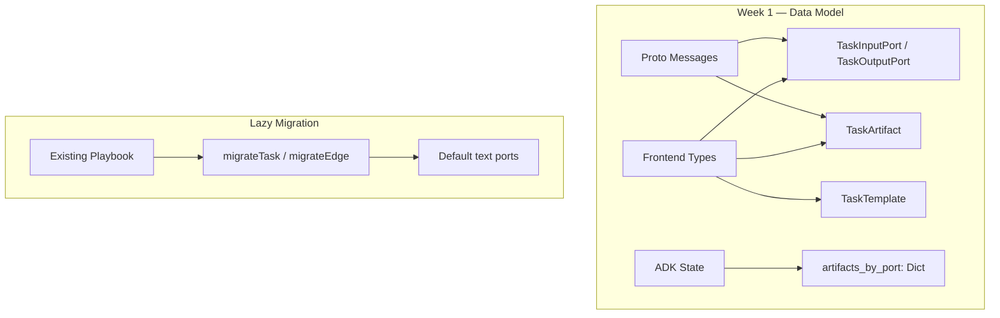

# Playbook Task Toolbar

> **Slug:** `task-toolbar` | **Status:** 🚧 draft | **Last Updated:** 2026-04-01 09:36:39

## Purpose
Introduce a template-driven toolbar in the Playbook canvas that lets users create pre-configured task nodes (Summarizer, SlideGen, DocxGen, CodeTask, etc.) instead of blank steps. This requires evolving the inter-task data flow from text-only prompt injection to a **typed port / artifact model**, so that generated artifacts (documents, dashboards, code, text) are first-class objects that can be visually inspected, downloaded, and linked as inputs to downstream tasks.

## Scope
**Included:**
- Typed port data model (ArtifactKind, TaskInputPort, TaskOutputPort, TaskArtifact, TaskTemplate)
- Proto message extensions for port-aware task configs and artifact-bearing results
- ADK ExecutionState extension with `artifacts_by_port` field
- Lazy migration functions for existing playbooks (backward compatible)
- i18n keys for template, port, and artifact UI labels
- Store barrel re-export (store/index.ts) for future slice extraction

**Excluded (future phases):**
- Template registry UI and toolbar dropdown (Week 3)
- Multi-handle node rendering (Week 2)
- Backend execution service artifact extraction (Week 4)
- ADK graph_builder port-aware context resolution (Week 5)
- Artifact badges on completed nodes (Week 6)

## Architecture

## Requirements
- As a developer, I want typed port interfaces so that the Week 2 canvas can render multi-handle nodes.
- As a developer, I want proto extensions so the ADK can receive port-aware task configs.
- As a developer, I want `artifacts_by_port` in ExecutionState so Week 5 graph_builder can route artifacts.
- As a user, I want existing playbooks to auto-migrate on load with default text ports.

## API / Interfaces

### Frontend Types (`types.ts`)

- `ArtifactKind`: `'text' | 'document' | 'code' | 'image' | 'data' | 'slide_deck' | 'dashboard'`
- `TaskInputPort`: `{ id, name, artifactKind, required, description? }`
- `TaskOutputPort`: `{ id, name, artifactKind, description? }`
- `TaskArtifact`: `{ portId, artifactKind, content?, url?, filename?, mimeType?, size?, metadata? }`
- `TaskTemplate`: `{ id, type, title, description, icon, color, category, inputPorts, outputPorts, promptTemplate, recommendedAgentTypeSlug, requiredToolNames }`
- `PlaybookTask` extended with `taskType?`, `inputPorts?`, `outputPorts?`
- `PlaybookEdge` extended with `sourceOutputPortId?`, `targetInputPortId?`
- `TaskResult` extended with `artifacts?`

### Proto (`chatbot.proto`)

- New messages: `TaskOutputPort`, `TaskInputPort`, `TaskArtifact`
- `PlaybookTaskConfig` extended with fields 14-16 (input_ports, output_ports, task_type)
- `PlaybookEdgeConfig` extended with fields 3-4 (source_output_port_id, target_input_port_id)
- `PlaybookTaskResult` extended with field 11 (artifacts)

### ADK State (`state.py`)

- New reducer: `merge_artifacts(left, right) -> Dict`
- `ExecutionState` extended with `artifacts_by_port: Annotated[Dict[str, Dict[str, Any]], merge_artifacts]`
- `TaskConfig` extended with `task_type`, `input_ports`, `output_ports`
- `EdgeConfig` extended with `source_output_port_id`, `target_input_port_id`

## Design Decisions
| Decision | Rationale | Alternatives Considered |
|----------|-----------|------------------------|
| Optional fields on PlaybookTask/PlaybookEdge | Backward compatible — existing data without ports still works | Required fields — would break existing playbooks |
| Store barrel re-export only (no actual split yet) | Week 1 focuses on data model; actual slice extraction is a separate effort | Full store split now — risky, too much churn for Week 1 |
| Default migration adds `text` ports | Safest default — text is the universal fallback for the existing text-only flow | No ports — Week 2 code would need to handle undefined ports |
| `ArtifactKind` enum instead of open schema | Prevents invalid connections, enables color-coding, simplifies validation | Open schema — too permissive |

## Files Changed
- `YellowStorm/front/src/modules/playbook/types.ts` — Added 5 new types, extended 3 existing
- `yellowstorm-adk/grpc/proto/chatbot.proto` — Added 3 messages, extended 3 existing
- `yellowstorm-adk/src/langgraph_engine/state.py` — Added reducer, extended ExecutionState/TaskConfig/EdgeConfig
- `YellowStorm/front/src/modules/playbook/utils/migrate-ports.ts` — New file: lazy migration functions
- `YellowStorm/front/src/modules/playbook/store/index.ts` — New file: barrel re-export
- `YellowStorm/front/src/modules/playbook/index.ts` — Updated exports
- `YellowStorm/front/src/modules/playbook/locales/en.json` — Added ~40 i18n keys
- `YellowStorm/front/src/modules/playbook/locales/fr.json` — Added ~40 i18n keys

## Related Features
- [`playbook`](/docs/playbook/README_2026-03-30_03-58-44.md)
