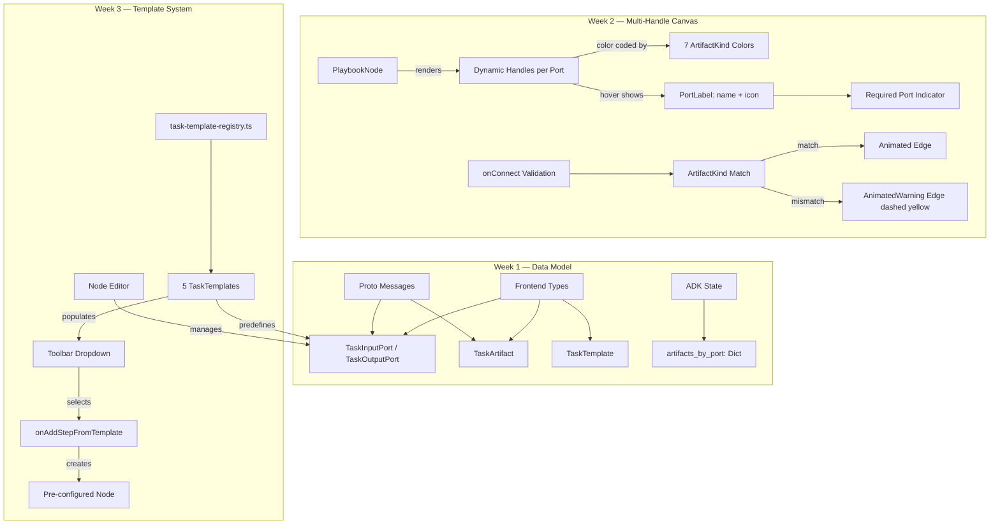

# Playbook Task Toolbar

> **Slug:** `task-toolbar` | **Status:** 🚧 draft | **Last Updated:** 2026-04-01 11:02:00

## Purpose
Introduce a template-driven toolbar in the Playbook canvas that lets users create pre-configured task nodes (Summarizer, SlideGen, DocxGen, CodeTask, etc.) instead of blank steps. This requires evolving the inter-task data flow from text-only prompt injection to a **typed port / artifact model**, so that generated artifacts (documents, dashboards, code, text) are first-class objects that can be visually inspected, downloaded, and linked as inputs to downstream tasks.

## Scope
**Included (Week 1):**
- Typed port data model (ArtifactKind, TaskInputPort, TaskOutputPort, TaskArtifact, TaskTemplate)
- Proto message extensions for port-aware task configs and artifact-bearing results
- ADK ExecutionState extension with `artifacts_by_port` field
- Lazy migration functions for existing playbooks (backward compatible)
- i18n keys for template, port, and artifact UI labels
- Store barrel re-export (store/index.ts) for future slice extraction

**Included (Week 2):**
- Multi-handle nodes with dynamic typed handles per port
- Port color coding by ArtifactKind (7 colors)
- Hover labels on port handles showing name + kind icon
- Port-to-port edge validation with type compatibility checking
- AnimatedWarning edge variant for type-mismatched connections
- Duplicate port-to-port connection prevention
- Required input port indicator (red dot on multi-port nodes)
- Default ports on new blank steps

**Included (Week 3):**
- Task template registry with 5 hardcoded templates (Summarizer, DocxGen, SlideGen, CodeGen, Analyzer)
- Split-button toolbar with "Blank Step" + "From Template" dropdown
- Port management section in node editor (add/remove/edit input and output ports)
- `onAddStepFromTemplate` wiring in canvas page to create pre-configured nodes from templates

**Excluded (future phases):**
- Backend execution service artifact extraction (Week 4)
- ADK graph_builder port-aware context resolution (Week 5)
- Artifact badges on completed nodes (Week 6)

## Architecture

## Requirements
- As a developer, I want typed port interfaces so that the canvas can render multi-handle nodes.
- As a developer, I want proto extensions so the ADK can receive port-aware task configs.
- As a developer, I want `artifacts_by_port` in ExecutionState so graph_builder can route artifacts.
- As a user, I want existing playbooks to auto-migrate on load with default text ports.
- As a user, I want to see multiple colored handles on nodes when tasks have multiple ports.
- As a user, I want to see the port name and type on hover.
- As a user, I want to see a warning edge when connecting incompatible artifact types.
- As a user, I want to add steps from predefined templates via the toolbar dropdown.
- As a user, I want to manage input and output ports (add, remove, rename, change kind, toggle required) in the node editor.

## API / Interfaces

### Frontend Types (`types.ts`)

- `ArtifactKind`: `'text' | 'document' | 'code' | 'image' | 'data' | 'slide_deck' | 'dashboard'`
- `TaskInputPort`: `{ id, name, artifactKind, required, description? }`
- `TaskOutputPort`: `{ id, name, artifactKind, description? }`
- `TaskArtifact`: `{ portId, artifactKind, content?, url?, filename?, mimeType?, size?, metadata? }`
- `TaskTemplate`: `{ id, type, title, description, icon, color, category, inputPorts, outputPorts, promptTemplate, recommendedAgentTypeSlug, requiredToolNames }`
- `PlaybookTask` extended with `taskType?`, `inputPorts?`, `outputPorts?`
- `PlaybookEdge` extended with `sourceOutputPortId?`, `targetInputPortId?`
- `TaskResult` extended with `artifacts?`

### Template Registry (`task-template-registry.ts`)

- `TASK_TEMPLATES: TaskTemplate[]` — 5 hardcoded templates: Summarizer, DocxGen, SlideGen, CodeGen, Analyzer
- `TEMPLATE_CATEGORIES` — `['content', 'generation', 'analysis', 'code']`
- `getTemplateById(id)` — lookup by template ID
- `getTemplatesByCategory(category)` — filter templates by category

### Toolbar Component (`PlaybookToolbar.tsx`)

- Split button: left side = "Blank Step" (calls `onAddStep`), right side = chevron dropdown
- Dropdown shows: "Blank Step" + separator + all 5 templates (icon + i18n label)
- New prop: `onAddStepFromTemplate: (template: TaskTemplate) => void`

### Node Editor (`PlaybookNodeEditor.tsx`)

- Input Ports section: list with color dot, editable name, ArtifactKind select, required toggle, delete button, add button
- Output Ports section: same as input but without required toggle
- Ports are included in auto-save debounce (350ms)
- Port changes trigger `onSave` with updated `inputPorts` and `outputPorts` arrays

### Proto (`chatbot.proto`)

- New messages: `TaskOutputPort`, `TaskInputPort`, `TaskArtifact`
- `PlaybookTaskConfig` extended with fields 14-16 (input_ports, output_ports, task_type)
- `PlaybookEdgeConfig` extended with fields 3-4 (source_output_port_id, target_input_port_id)
- `PlaybookTaskResult` extended with field 11 (artifacts)

### ADK State (`state.py`)

- New reducer: `merge_artifacts(left, right) -> Dict`
- `ExecutionState` extended with `artifacts_by_port: Annotated[Dict[str, Dict[str, Any]], merge_artifacts]`
- `TaskConfig` extended with `task_type`, `input_ports`, `output_ports`
- `EdgeConfig` extended with `source_output_port_id`, `target_input_port_id`

### Canvas Components

- `node.tsx`: `handles` prop accepts `false` to disable built-in handles (for custom multi-handle rendering)
- `edge.tsx`: New `Edge.AnimatedWarning` variant (yellow dashed stroke, no animated circle)
- `PlaybookNode.tsx`: Renders dynamic `<Handle>` per port with color-coded positions and hover labels
- `PortLabel.tsx`: Floating label showing port name + ArtifactKind icon on handle hover
- `port-colors.ts`: `PORT_COLORS` map with 7 color entries + `getPortColor()` helper

## Design Decisions
| Decision | Rationale | Alternatives Considered |
|----------|-----------|------------------------|
| Optional fields on PlaybookTask/PlaybookEdge | Backward compatible — existing data without ports still works | Required fields — would break existing playbooks |
| Store barrel re-export only (no actual split yet) | Week 1 focuses on data model; actual slice extraction is a separate effort | Full store split now — risky, too much churn for Week 1 |
| Default migration adds `text` ports | Safest default — text is the universal fallback for the existing text-only flow | No ports — Week 2 code would need to handle undefined ports |
| `ArtifactKind` enum instead of open schema | Prevents invalid connections, enables color-coding, simplifies validation | Open schema — too permissive |
| `handles={false}` in Node component | Lets PlaybookNode fully control handle rendering | Boolean toggle — doesn't allow complete removal |
| Non-blocking type mismatch warning | User can still connect incompatible types (execution falls back to text) | Block mismatch connections — too restrictive for early adoption |
| Vertical distribution of handles | Evenly spaces handles along the node edge | Clustered at top/bottom — less readable |
| Required port indicator only on multi-port nodes | Single-port default nodes don't need visual clutter | Always show indicator — noisy for simple nodes |
| Split button with inline dropdown instead of separate dialog | Quick access to templates without navigation disruption | Full template picker dialog — more features but slower workflow |
| Port editing inline in node editor sheet | No additional dialogs needed, consistent with existing editor pattern | Separate port editor dialog — more space but disrupts flow |
| Hardcoded templates in static file | Version-controlled, zero backend dependency for Phase 1 | Backend template registry — unnecessary roundtrip for 5 defaults |

## Files Changed

### Week 1
- `YellowStorm/front/src/modules/playbook/types.ts` — Added 5 new types, extended 3 existing
- `yellowstorm-adk/grpc/proto/chatbot.proto` — Added 3 messages, extended 3 existing
- `yellowstorm-adk/src/langgraph_engine/state.py` — Added reducer, extended ExecutionState/TaskConfig/EdgeConfig
- `YellowStorm/front/src/modules/playbook/utils/migrate-ports.ts` — New file: lazy migration functions
- `YellowStorm/front/src/modules/playbook/store/index.ts` — New file: barrel re-export
- `YellowStorm/front/src/modules/playbook/index.ts` — Updated exports
- `YellowStorm/front/src/modules/playbook/locales/en.json` — Added ~40 i18n keys
- `YellowStorm/front/src/modules/playbook/locales/fr.json` — Added ~40 i18n keys

### Week 2
- `YellowStorm/front/src/components/ai-elements/node.tsx` — `handles` prop accepts `false`
- `YellowStorm/front/src/components/ai-elements/edge.tsx` — New `Edge.AnimatedWarning` variant
- `YellowStorm/front/src/modules/playbook/components/PlaybookNode.tsx` — Multi-handle rendering with port colors, hover labels, required indicators
- `YellowStorm/front/src/modules/playbook/components/PortLabel.tsx` — New: floating port label component
- `YellowStorm/front/src/modules/playbook/utils/port-colors.ts` — New: 7-color port palette + icon map
- `YellowStorm/front/src/modules/playbook/hooks/usePlaybookCanvas.ts` — Port-aware edge converters, type-checking onConnect, duplicate prevention
- `YellowStorm/front/src/modules/playbook/components/PlaybookCanvasPage.tsx` — Warning edge type registered, default ports on new steps

### Week 3
- `YellowStorm/front/src/modules/playbook/utils/task-template-registry.ts` — New: 5 hardcoded TaskTemplate definitions + lookup helpers
- `YellowStorm/front/src/modules/playbook/components/PlaybookToolbar.tsx` — Split button with template dropdown (DropdownMenu)
- `YellowStorm/front/src/modules/playbook/components/PlaybookNodeEditor.tsx` — Input/output port management sections (add, remove, edit name/kind/required)
- `YellowStorm/front/src/modules/playbook/components/PlaybookCanvasPage.tsx` — `onAddStepFromTemplate` handler + prop wiring
- `YellowStorm/front/src/modules/playbook/components/PlaybookToolbar.test.tsx` — Updated tests for new props

## Related Features
- [`playbook`](/docs/playbook/README_2026-03-30_03-58-44.md)
