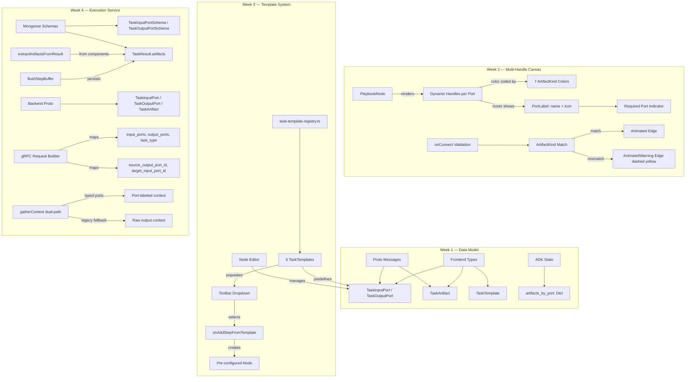

# Playbook Task Toolbar

> **Slug:** `task-toolbar` | **Status:** 🚧 draft | **Last Updated:** 2026-04-01 11:30:00

## Purpose
Introduce a template-driven toolbar in the Playbook canvas that lets users create pre-configured task nodes (Summarizer, SlideGen, DocxGen, CodeTask, etc.) instead of blank steps. This requires evolving the inter-task data flow from text-only prompt injection to a **typed port / artifact model**, so that generated artifacts (documents, dashboards, code, text) are first-class objects that can be visually inspected, downloaded, and linked as inputs to downstream tasks.

## Scope
**Included (Week 1):**
- Typed port data model (ArtifactKind, TaskInputPort, TaskOutputPort, TaskArtifact, TaskTemplate)
- Proto message extensions for port-aware task configs and artifact-bearing results (ADK copy)
- ADK ExecutionState extension with `artifacts_by_port` field
- Lazy migration functions for existing playbooks (backward compatible)
- i18n keys for template, port, and artifact UI labels
- Store barrel re-export (store/index.ts) for future slice extraction

**Included (Week 2):**
- Multi-handle nodes with dynamic typed handles per port
- Port color coding by ArtifactKind (7 colors)
- Hover labels on port handles showing name + kind icon
- Port-to-port edge validation with type compatibility checking
- AnimatedWarning edge variant for type-mismatched connections
- Duplicate port-to-port connection prevention
- Required input port indicator (red dot on multi-port nodes)
- Default ports on new blank steps

**Included (Week 3):**
- Task template registry with 5 hardcoded templates (Summarizer, DocxGen, SlideGen, CodeGen, Analyzer)
- Split-button toolbar with "Blank Step" + "From Template" dropdown
- Port management section in node editor (add/remove/edit input and output ports)
- `onAddStepFromTemplate` wiring in canvas page to create pre-configured nodes from templates

**Included (Week 4):**
- Mongoose schemas: `TaskInputPortSchema`, `TaskOutputPortSchema` sub-documents; `taskType`, `inputPorts`, `outputPorts` on PlaybookTask; `sourceOutputPortId`, `targetInputPortId` on PlaybookEdge; `artifacts` on TaskResult
- Backend proto: `TaskInputPort`, `TaskOutputPort`, `TaskArtifact` messages; extended `PlaybookTaskConfig` (fields 14-16), `PlaybookEdgeConfig` (fields 3-4), `PlaybookTaskResult` (field 11)
- Port-aware gRPC request building in both `runFullWorkflow()` and `executeStep()` — maps `inputPorts`, `outputPorts`, `taskType` on tasks; `sourceOutputPortId`, `targetInputPortId` on edges
- `extractArtifactsFromResult()` utility — extracts typed artifacts from gRPC components matching task output ports by artifactKind, with fallback text artifact from output field
- Artifact persistence in TaskResult via `BufferedStepResult.artifacts` field, flushed to DB in `flushStepBuffer()` and `updateTaskResult()`
- Dual-path context resolution in `gatherContext()` — typed port resolution (primary) with `sourceOutputPortId`/`targetInputPortId` lookup; legacy fallback via `inputKeys` and edge-walking for playbooks without ports

**Excluded (future phases):**
- ADK graph_builder port-aware context resolution (Week 5)
- Artifact badges on completed nodes (Week 6)

## Architecture

## Requirements
- As a developer, I want typed port interfaces so that the canvas can render multi-handle nodes.
- As a developer, I want proto extensions so the ADK can receive port-aware task configs.
- As a developer, I want `artifacts_by_port` in ExecutionState so graph_builder can route artifacts.
- As a user, I want existing playbooks to auto-migrate on load with default text ports.
- As a user, I want to see multiple colored handles on nodes when tasks have multiple ports.
- As a user, I want to see the port name and type on hover.
- As a user, I want to see a warning edge when connecting incompatible artifact types.
- As a user, I want to add steps from predefined templates via the toolbar dropdown.
- As a user, I want to manage input and output ports in the node editor.
- As a developer, I want the backend to pass port metadata to the ADK via gRPC so it can route artifacts by port.
- As a developer, I want step results to carry typed artifacts matched to output ports.
- As a developer, I want context gathering to resolve upstream artifacts via port-to-port edges (with legacy fallback).

## API / Interfaces

### Frontend Types (`types.ts`)

- `ArtifactKind`: `'text' | 'document' | 'code' | 'image' | 'data' | 'slide_deck' | 'dashboard'`
- `TaskInputPort`: `{ id, name, artifactKind, required, description? }`
- `TaskOutputPort`: `{ id, name, artifactKind, description? }`
- `TaskArtifact`: `{ portId, artifactKind, content?, url?, filename?, mimeType?, size?, metadata? }`
- `TaskTemplate`: `{ id, type, title, description, icon, color, category, inputPorts, outputPorts, promptTemplate, recommendedAgentTypeSlug, requiredToolNames }`
- `PlaybookTask` extended with `taskType?`, `inputPorts?`, `outputPorts?`
- `PlaybookEdge` extended with `sourceOutputPortId?`, `targetInputPortId?`
- `TaskResult` extended with `artifacts?`

### Backend Mongoose Schemas

**`playbook.schema.ts`:**
- `TaskInputPortSchema`: `{ id, name, artifactKind (enum), required, description? }`
- `TaskOutputPortSchema`: `{ id, name, artifactKind (enum), description? }`
- `PlaybookTask.inputPorts`: `[TaskInputPortSchema]`
- `PlaybookTask.outputPorts`: `[TaskOutputPortSchema]`
- `PlaybookTask.taskType`: `enum: ['generic', 'summarizer', 'docxgen', 'slidegen', 'codegen', 'analyzer']`
- `PlaybookEdge.sourceOutputPortId`: `String, default 'default'`
- `PlaybookEdge.targetInputPortId`: `String, default 'default'`

**`playbook-execution.schema.ts`:**
- `TaskResult.artifacts`: `Array<{ portId, artifactKind, content?, url?, filename?, mimeType?, size?, metadata? }>`

### Backend Proto (`chatbot.proto`)

- New: `TaskOutputPort`, `TaskInputPort`, `TaskArtifact`
- `PlaybookTaskConfig` extended: `input_ports` (14), `output_ports` (15), `task_type` (16)
- `PlaybookEdgeConfig` extended: `source_output_port_id` (3), `target_input_port_id` (4)
- `PlaybookTaskResult` extended: `artifacts` (11)

### Backend Execution Service

- `extractArtifactsFromResult(task, grpcComponents)`: Maps gRPC components to typed artifacts by matching `component.type` against task `outputPorts[].artifactKind`. Produces fallback text artifact from `output` field.
- `gatherContext(task, taskOutputs, snapshot)`: Dual-path — typed port resolution (primary) using `sourceOutputPortId`/`targetInputPortId` on edges with port-name labels; legacy fallback via `inputKeys` and edge-walking.
- `runFullWorkflow()`: Maps `inputPorts`, `outputPorts`, `taskType` on each task; `sourceOutputPortId`, `targetInputPortId` on edges.
- `executeStep()`: Same port mapping for single-step gRPC request.
- `handleStepUpdate()`: Extracts artifacts from stream results via `extractArtifactsFromResult()`, buffers in `BufferedStepResult.artifacts`.
- `flushStepBuffer()`: Persists `artifacts` field to `TaskResult` in MongoDB.

### Template Registry (`task-template-registry.ts`)

- `TASK_TEMPLATES: TaskTemplate[]` — 5 hardcoded templates
- `getTemplateById(id)`, `getTemplatesByCategory(category)`

## Design Decisions
| Decision | Rationale | Alternatives Considered |
|----------|-----------|------------------------|
| Optional fields on PlaybookTask/PlaybookEdge | Backward compatible — existing data without ports still works | Required fields — would break existing playbooks |
| Store barrel re-export only (no actual split yet) | Week 1 focuses on data model; actual slice extraction is a separate effort | Full store split now — risky |
| Default migration adds `text` ports | Safest default — text is the universal fallback | No ports — Week 2 code would need to handle undefined ports |
| `ArtifactKind` enum instead of open schema | Prevents invalid connections, enables color-coding | Open schema — too permissive |
| `handles={false}` in Node component | Lets PlaybookNode fully control handle rendering | Boolean toggle — doesn't allow complete removal |
| Non-blocking type mismatch warning | User can still connect incompatible types | Block mismatch connections — too restrictive |
| Split button with inline dropdown | Quick access to templates without navigation disruption | Full template picker dialog — slower workflow |
| Port editing inline in node editor | Consistent with existing editor pattern | Separate port editor dialog — more space but disrupts flow |
| Hardcoded templates in static file | Version-controlled, zero backend dependency | Backend template registry — unnecessary roundtrip |
| Dual-path context resolution in gatherContext | Existing playbooks without ports still work; new playbooks get port-labeled context | Port-only resolution — breaks legacy playbooks |
| Artifact extraction from components by kind matching | Works with existing gRPC component format without changes | New component type — requires ADK changes first |
| Default port IDs to `'default'` | Matches legacy migration; zero-config for old playbooks | UUID-only — breaks old data |

## Files Changed

### Week 1
- `YellowStorm/front/src/modules/playbook/types.ts` — Added 5 new types, extended 3 existing
- `yellowstorm-adk/grpc/proto/chatbot.proto` — Added 3 messages, extended 3 existing
- `yellowstorm-adk/src/langgraph_engine/state.py` — Added reducer, extended ExecutionState/TaskConfig/EdgeConfig
- `YellowStorm/front/src/modules/playbook/utils/migrate-ports.ts` — New: lazy migration functions
- `YellowStorm/front/src/modules/playbook/store/index.ts` — New: barrel re-export
- `YellowStorm/front/src/modules/playbook/index.ts` — Updated exports
- `YellowStorm/front/src/modules/playbook/locales/en.json` — Added ~40 i18n keys
- `YellowStorm/front/src/modules/playbook/locales/fr.json` — Added ~40 i18n keys

### Week 2
- `YellowStorm/front/src/components/ai-elements/node.tsx` — `handles` prop accepts `false`
- `YellowStorm/front/src/components/ai-elements/edge.tsx` — New `Edge.AnimatedWarning` variant
- `YellowStorm/front/src/modules/playbook/components/PlaybookNode.tsx` — Multi-handle rendering with port colors, hover labels, required indicators
- `YellowStorm/front/src/modules/playbook/components/PortLabel.tsx` — New: floating port label component
- `YellowStorm/front/src/modules/playbook/utils/port-colors.ts` — New: 7-color port palette + icon map
- `YellowStorm/front/src/modules/playbook/hooks/usePlaybookCanvas.ts` — Port-aware edge converters, type-checking onConnect, duplicate prevention
- `YellowStorm/front/src/modules/playbook/components/PlaybookCanvasPage.tsx` — Warning edge type registered, default ports on new steps

### Week 3
- `YellowStorm/front/src/modules/playbook/utils/task-template-registry.ts` — New: 5 hardcoded TaskTemplate definitions + lookup helpers
- `YellowStorm/front/src/modules/playbook/components/PlaybookToolbar.tsx` — Split button with template dropdown
- `YellowStorm/front/src/modules/playbook/components/PlaybookNodeEditor.tsx` — Input/output port management sections
- `YellowStorm/front/src/modules/playbook/components/PlaybookCanvasPage.tsx` — `onAddStepFromTemplate` handler + prop wiring
- `YellowStorm/front/src/modules/playbook/components/PlaybookToolbar.test.tsx` — Updated tests

### Week 4
- `YellowStorm/back/src/modules/playbook/schemas/playbook.schema.ts` — Added `TaskInputPortSchema`, `TaskOutputPortSchema`; `taskType`, `inputPorts`, `outputPorts` on `PlaybookTask`; `sourceOutputPortId`, `targetInputPortId` on `PlaybookEdge`
- `YellowStorm/back/src/modules/playbook/schemas/playbook-execution.schema.ts` — Added `artifacts` field to `TaskResult`
- `YellowStorm/back/src/modules/conversation/proto/chatbot.proto` — Added `TaskInputPort`, `TaskOutputPort`, `TaskArtifact` messages; extended `PlaybookTaskConfig` (14-16), `PlaybookEdgeConfig` (3-4), `PlaybookTaskResult` (11)
- `YellowStorm/back/src/modules/playbook/utils/execution.utils.ts` — Added `extractArtifactsFromResult()`, `TaskArtifactEntry` interface, `artifacts` field to `BufferedStepResult`
- `YellowStorm/back/src/modules/playbook/services/playbook-execution.service.ts` — Port-aware gRPC request building in `runFullWorkflow()` and `executeStep()`; artifact extraction in `handleStepUpdate()`; artifact persistence in `flushStepBuffer()` and `updateTaskResult()`; dual-path `gatherContext()`

## Related Features
- [`playbook`](/docs/playbook/README_2026-03-30_03-58-44.md)
