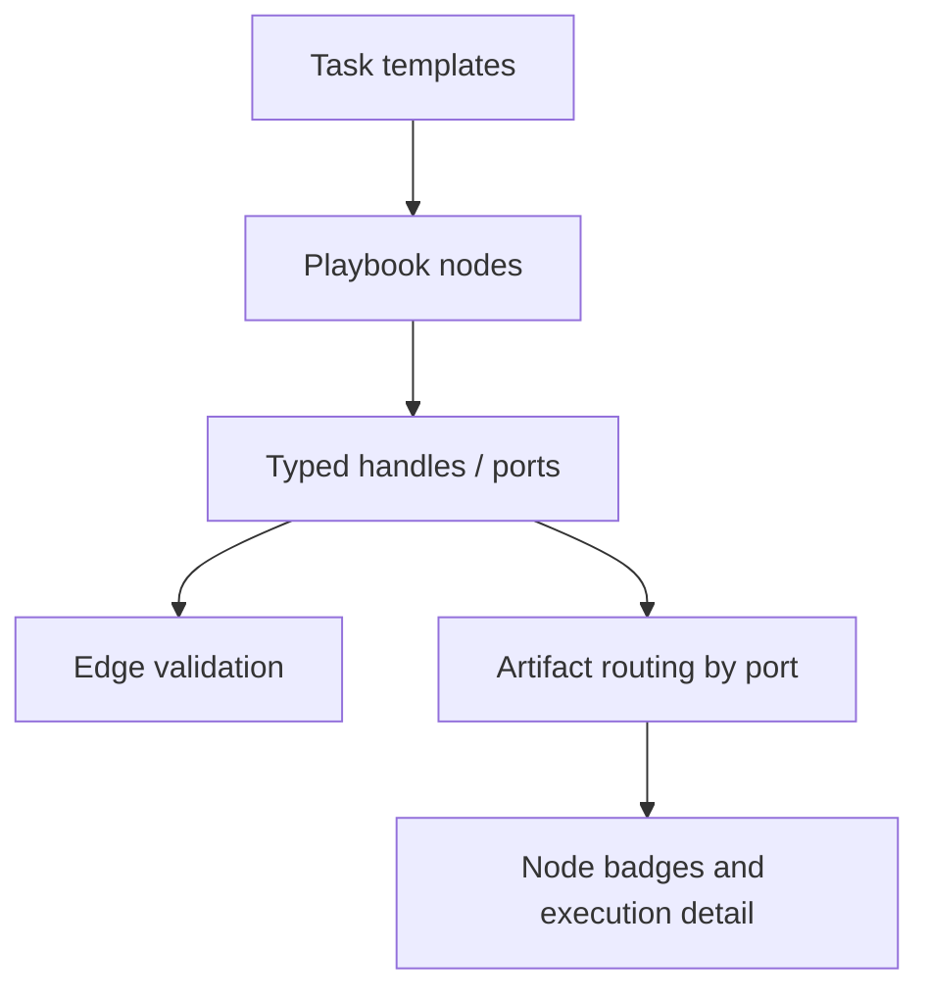

# Playbook Task Toolbar

> **Slug:** `task-toolbar` | **Status:** ✅ stable | **Last Updated:** 2026-04-02 09:37:45

## Purpose

Introduce a template-driven toolbar in the Playbook canvas that lets users create pre-configured task nodes instead of blank steps. The toolbar and node system rely on a typed port and artifact model so generated outputs can be connected, validated, inspected, and routed to downstream tasks.

## Scope

Included in the current feature surface:

- Typed port data model for task inputs, outputs, and artifacts.
- Multi-handle nodes with dynamic typed handles.
- Port color coding, hover labels, type-aware edge validation, and warning edges.
- Template-driven node creation from the toolbar.
- Port management in the node editor.
- Artifact-aware execution routing and frontend artifact display.

Explicitly excluded:

- Dragging artifacts directly onto ports to create edges.
- Full end-to-end integration coverage for every template and port combination.

## Architecture

### Current canvas node behavior

- `PlaybookNode.tsx` renders React Flow `Handle` elements for each input and output port.
- Port colors still derive from `PORT_COLORS` by `artifactKind`.
- The handle `top` value is now treated as the visual anchor center by applying a vertical translate, which keeps single-port connectors centered on the node edge and preserves spacing for multi-port nodes.
- `usePlaybookCanvas.ts` continues mapping `sourceHandle` and `targetHandle` to typed port ids without contract changes.

## Requirements

- As a user, I want typed handles on each node so I can connect outputs to inputs explicitly.
- [ ] Node connectors remain color-coded and port-aware.
- As a user, I want node connectors to appear visually centered on the card edge.
- [ ] The rendered handle dot is centered around its computed vertical anchor position.
- As a developer, I want handle placement changes to avoid breaking edge ids or source/target handle mapping.
- [ ] `sourceHandle` and `targetHandle` names remain unchanged.

## API / Interfaces

Relevant interfaces preserved:

- `TaskInputPort`
- `TaskOutputPort`
- `PlaybookEdge.sourceOutputPortId`
- `PlaybookEdge.targetInputPortId`

Key files for this iteration:

| File | Responsibility |
|------|---------------|
| `YellowStorm/front/src/modules/playbook/components/PlaybookNode.tsx` | Dynamic input/output handle rendering and visual anchor placement |
| `YellowStorm/front/src/modules/playbook/hooks/usePlaybookCanvas.ts` | Port-aware edge mapping and connection validation |
| `YellowStorm/front/src/modules/playbook/utils/port-colors.ts` | Artifact-kind color and icon mapping for handles |

## Design Decisions

| Decision | Rationale | Alternatives Considered |
|----------|-----------|------------------------|
| Fix centering in handle style instead of edge logic | Anchor alignment is a rendering concern, not a graph/data concern | Adjust node dimensions or post-process edge paths |
| Preserve existing handle ids (`in-*`, `out-*`) | Prevents regressions in connection serialization and reconnection behavior | Rename handles or recalculate ids |
| Keep multi-port spacing logic unchanged | The bug was the handle anchor alignment, not the distribution formula | Redesign port spacing entirely |

## Related Features

- [`playbook`](../playbook/README_2026-04-02_09-37-45.md)
