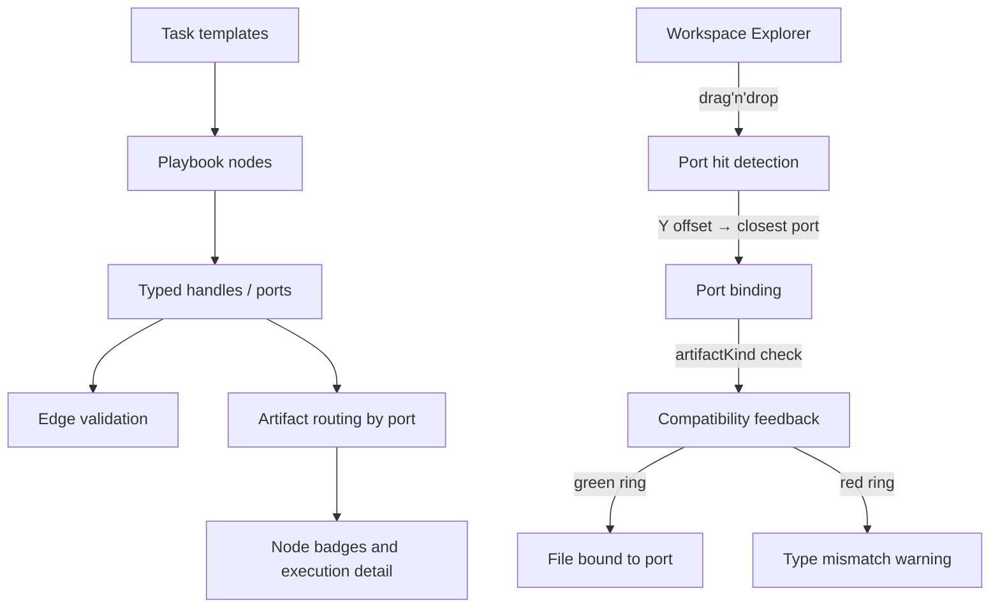

# Playbook Task Toolbar

> **Slug:** `task-toolbar` | **Status:** ✅ stable | **Last Updated:** 2026-04-03 11:45:00

## Purpose

Introduce a template-driven toolbar in the Playbook canvas that lets users create pre-configured task nodes instead of blank steps. The toolbar and node system rely on a typed port and artifact model so generated outputs can be connected, validated, inspected, and routed to downstream tasks.

## Scope

Included in the current feature surface:

- Typed port data model for task inputs, outputs, and artifacts.
- Multi-handle nodes with dynamic typed handles.
- Port color coding, hover labels, type-aware edge validation, and warning edges.
- Template-driven node creation from the toolbar.
- Port management in the node editor.
- Artifact-aware execution routing and frontend artifact display.
- **Port-aware drag-and-drop** from the workspace explorer: files can be dropped onto specific input ports with coordinate-based hit detection, artifact-kind compatibility validation, and per-port visual feedback.

Explicitly excluded:

- Dragging artifacts directly onto ports to create edges (node-to-node wiring remains via ReactFlow handles).
- Full end-to-end integration coverage for every template and port combination.
- Workspace-level drop auto-distribution to matching ports.

## Architecture



### Port-aware drag-and-drop (Approach A: coordinate-based hit detection)

When a user drags a document from the workspace explorer and hovers over a node with multiple input ports:

1. The `handleDragOver` handler computes the cursor's vertical offset relative to the node's bounding rectangle.
2. `detectPortHit()` maps that offset to the closest input port using the same percentage-based formula (`getInputPortTop`) used to position the handles.
3. If the cursor is within 28px of a port's center, the port is highlighted.
4. The file's `artifactKind` (inferred from filename extension and MIME type via `inferArtifactKind()`) is compared against the port's `artifactKind`:
   - Match: green ring glow + port name label
   - Mismatch: red ring glow + expected kind label
   - Unknown: neutral primary ring
5. On drop, `addInputFileToTask()` stores the file with its `portId` for port-specific binding.

### Current canvas node behavior

- `PlaybookNode.tsx` renders React Flow `Handle` elements for each input and output port.
- Port colors derive from `PORT_COLORS` by `artifactKind`.
- The handle `top` value is treated as the visual anchor center by applying a vertical translate.
- `usePlaybookCanvas.ts` maps `sourceHandle` and `targetHandle` to typed port ids.
- During drag-over, each port handle shows a pulsing ring indicator and the node border changes color based on compatibility.

## Requirements

- As a user, I want typed handles on each node so I can connect outputs to inputs explicitly.
- [x] Node connectors remain color-coded and port-aware.
- As a user, I want node connectors to appear visually centered on the card edge.
- [x] The rendered handle dot is centered around its computed vertical anchor position.
- As a developer, I want handle placement changes to avoid breaking edge ids or source/target handle mapping.
- [x] `sourceHandle` and `targetHandle` names remain unchanged.
- As a user, I want to drag documents from the workspace explorer onto specific input ports.
- [x] Dropping near a port highlights it and validates artifact-kind compatibility.
- [x] The file is bound to the targeted port and stored with `portId`.
- As a user, I want visual feedback when dragging files over multi-port nodes.
- [x] Green ring for compatible ports, red ring for incompatible, neutral for unknown kind.
- [x] Port name labels appear during drag-over.

## API / Interfaces

Updated interfaces:

```typescript
interface InputFile {
  type: 'workspace' | 'document';
  id: string;
  name: string;
  workspaceId?: string;
  portId?: string;           // NEW: which input port this file is bound to
  artifactKind?: ArtifactKind; // NEW: inferred from file extension/MIME
  metadata?: { ... };
}
```

New utilities:

| File | Export | Purpose |
|------|--------|---------|
| `infer-artifact-kind.ts` | `inferArtifactKind(filename?, mimeType?)` | Maps file extension/MIME to `ArtifactKind` |
| `port-hit-detection.ts` | `detectPortHit(ports, dropOffsetY, nodeHeight)` | Finds closest input port within 28px hit zone |

Key files for this iteration:

| File | Responsibility |
|------|---------------|
| `PlaybookNode.tsx` | Port-aware drop handling, per-port highlight, compatibility feedback |
| `WorkspaceExplorerSidebar.tsx` | Enriches `DragPayload` with `artifactKind` |
| `InputFilesPopover.tsx` | Shows bound count and per-file artifact-kind dot |
| `store.ts` | Port-aware duplicate detection in `addInputFileToTask` |
| `types.ts` | Extended `InputFile` with `portId` and `artifactKind` |

## Design Decisions

| Decision | Rationale | Alternatives Considered |
|----------|-----------|------------------------|
| Coordinate-based hit detection (Approach A) | No new DOM elements needed; leverages existing port position math; fully compatible with ReactFlow's SVG handles | Invisible HTML drop zones (z-index issues), react-dnd (new dependency) |
| 28px hit zone | Covers typical handle size (12px dot + 8px padding) without overlapping adjacent ports | Fixed percentage (breaks with variable node heights), full half-height (too imprecise) |
| Infer artifactKind on drag source | Enriches payload once at drag start; avoids repeated inference during drag-over | Infer on every `dragOver` (unnecessary CPU), server-side inference (requires API call) |
| Port-aware duplicate check | Same file can be bound to different ports on the same node | Global uniqueness (prevents multi-port binding) |
| Store `portId` on `InputFile` rather than separate map | Backward compatible; existing `inputFiles[]` structure unchanged | Separate `portBindings: Record<portId, InputFile>` (more complex migration) |

## Related Features

- [`playbook`](../playbook/README_2026-04-02_15-30-00.md)
